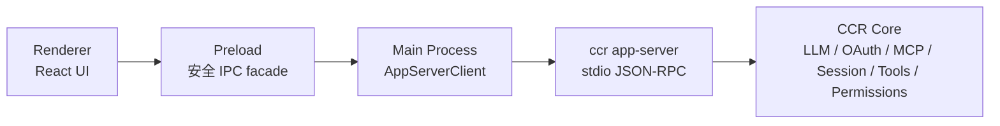
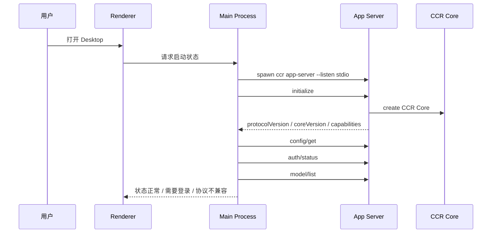
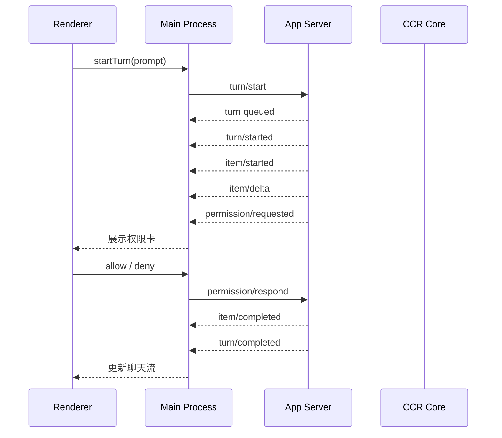

# CCR App Server Client SDK 设计

## 1. 文档目标

本文档用于细化 P9：Desktop 原型接入准备。

现有文档已经回答了三件事：

- [CCR 多入口与 App Server 总体方案](./entrypoints-runtime-app-server-desktop-vscode.md)：为什么 `CLI / TUI / Desktop / VS Code` 都要站在同一个 Core 和 App Server 上。
- [CCR App Server 协议详细设计](./app-server-protocol-design.md)：App Server 对外暴露哪些 JSON-RPC 方法和事件。
- [CCR 客户端产品与交互设计](./desktop-client-product-design.md)：Desktop 第一版界面、状态、权限卡和页面流转应该是什么样。

但 Desktop 真正开工前，还缺一层工程接入设计：

```text
Desktop main process
  -> spawn / connect app-server
  -> 维护 JSON-RPC 请求与通知
  -> 暴露安全 IPC 给 renderer
  -> renderer 只做 UI，不接触 token、Node、文件系统和 Core 内部模块
```

本文档就是补齐这一层：`App Server Client SDK`。

一句话结论：

> P9 不直接开完整 Desktop UI，先做一套可被 Desktop / VS Code / Local Web 复用的 App Server Client SDK 和本地进程管理边界。

## 2. 第一版目标

第一版 Client SDK 的目标是让富客户端稳定接入已经完成的 App Server 能力。

必须做到：

- 启动本地 `ccr app-server --listen stdio`。
- 完成 `initialize` 能力协商。
- 封装 JSON-RPC request / response / notification。
- 能读取 `config/get`、`auth/status`、`model/list`、`mcp/list`。
- 能执行 `workspace/open`。
- 能执行 `thread/start`、`turn/start`、`turn/interrupt`。
- 能接收 `turn/started`、`item/delta`、`item/completed`、`turn/completed`、`turn/failed`。
- 能接收 `permission/requested`，并通过 `permission/respond` 回传用户选择。
- 能把 App Server stderr、退出码、协议错误统一成客户端可展示状态。

第一版暂不做：

- 完整 Desktop UI。
- WebSocket / daemon 模式。
- 多客户端共享同一个 App Server。
- 自动安装 npm 版本的 CCR。
- 独立 Core runtime 热更新。
- 在 renderer 中直接访问 Node API。
- 在 Client SDK 中重新实现 session、permission、tool 或模型调用逻辑。

## 3. 已有能力边界

当前仓库已经有这些能力，可以直接复用：

| 能力 | 当前位置 | 复用方式 |
| --- | --- | --- |
| App Server 协议类型 | `src/app-server/protocol.ts` | Client SDK 直接复用 schema / type，避免手写双份协议 |
| App Server stdio 服务 | `src/app-server/stdioTransport.ts` | SDK 用子进程 stdio 接入，不复用服务端 transport 实现 |
| App Server 路由 | `src/app-server/router.ts` | 只作为协议真实方法来源，不从客户端直接 import router |
| Core 统一能力 | `src/core/` | 只能通过 App Server 间接调用 |
| 权限复用链路 | `CorePermissionService` + `permission/respond` | SDK 只转发请求和响应，不判断安全 |
| smoke 原始客户端 | `scripts/smoke-app-server.mjs` | 作为第一版 SDK 行为参考，但要从脚本内联逻辑沉成正式模块 |

关键边界：

- `src/app-server/` 里已有的是服务端。
- P9 要补的是客户端。
- 客户端不能调用 `router.ts`、`createCcrCore()`、tool runner 或 LLM provider。
- 客户端只能通过 JSON-RPC 协议和 App Server 通信。

## 4. 分层结构

建议新增目录：

```text
src/app-server/client/
  index.ts
  types.ts
  errors.ts
  jsonRpcClient.ts
  stdioAppServerClient.ts
  appServerProcess.ts
```

后续 Desktop 正式目录可以再建：

```text
apps/desktop/
  src/main/
    appServerBridge.ts
    ipcHandlers.ts
  src/preload/
    index.ts
  src/renderer/
    ...
```

P9 第一刀只做 `src/app-server/client/`，不急着建完整 `apps/desktop/`。

## 5. 第三方复用策略

这里不走“全手写”，也不走“为了第三方而第三方”。

原则是：

> 协议边界和 CCR 业务状态自己掌握；通用工程能力优先复用已有成熟依赖。

当前仓库已经有这些相关依赖：

| 依赖 | 是否使用 | 原因 |
| --- | --- | --- |
| `zod` | 使用 | 已经用于 App Server 协议 schema，Client SDK 继续复用，避免请求/响应类型双写 |
| `execa` | 倾向使用 | 已在依赖中，适合程序化启动和管理子进程，比直接手写大量 `child_process` 边界更稳 |
| `vscode-jsonrpc` | 暂不直接使用 | 它的 stream reader/writer 默认走 `Content-Length` header framing，而当前 App Server 已采用 JSON Lines，一行一条 JSON 消息；直接接入会和现有协议不匹配 |
| Node `events` / `AbortController` | 使用 | 用于通知订阅、关闭、超时和取消，不需要额外引入小型事件库 |

为什么不直接用 `vscode-jsonrpc`：

- 当前服务端协议已经稳定为 JSON Lines。
- `vscode-jsonrpc` 的 `StreamMessageReader` / `StreamMessageWriter` 更偏 LSP 风格的 `Content-Length` 消息边界。
- 如果为了使用它而改 App Server framing，会影响已经通过的 smoke、CLI 管道调试方式和现有文档。
- 第一版客户端需要的是很薄的 JSON Lines request / response / notification 匹配层，自己实现成本低、可控、容易审计。

后续可以重新评估 `vscode-jsonrpc` 的场景：

- 如果 App Server 增加 LSP 风格传输。
- 如果 VS Code 插件强依赖标准 JSON-RPC connection 能力。
- 如果我们决定新增 websocket / pipe / socket 多传输，并希望统一 connection 抽象。

第一版明确选择：

```text
JSON Lines RPC 匹配层：自己写薄实现
协议 schema：复用 zod
子进程管理：优先用 execa
事件订阅：用 Node 原生 EventEmitter / AbortController
CCR 业务能力：全部通过 App Server，不在 SDK 内重写
```

这不是闭门造轮子，而是避免把不匹配的第三方 framing 强行塞进当前协议。

## 6. 模块职责

### 6.1 `jsonRpcClient.ts`

职责：

- 维护 JSON-RPC request id。
- 维护 pending request map。
- 将一行 JSON response 匹配回对应 request。
- 将没有 `id` 的消息识别为 notification。
- 支持 request timeout。
- 支持关闭时 reject 所有 pending request。
- 支持 protocol parse error 的本地诊断。

不负责：

- 启动子进程。
- 解释业务方法语义。
- 处理权限 UI。
- 调用 Core。

核心接口草案：

```ts
export type JsonRpcTransport = {
  sendLine(line: string): void
  close(): void
  onLine(listener: (line: string) => void): () => void
  onClose(listener: (event: TransportCloseEvent) => void): () => void
}

export class JsonRpcClient {
  request<T>(method: string, params?: JsonRpcParams, options?: RequestOptions): Promise<T>
  notify(method: string, params?: JsonRpcParams): void
  close(): void
  onNotification(listener: (notification: JsonRpcNotification) => void): () => void
}
```

### 6.2 `stdioAppServerClient.ts`

职责：

- 给上层提供类型化方法。
- 把 `initialize / config/get / auth/status / model/list / mcp/list / workspace/open / thread/start / turn/start / permission/respond` 封装成稳定 API。
- 能力管理提供 `registerCapabilityApps`、`listCapabilities`、`listCapabilityManagement`、`planCapabilityManagementAction` 和 `applyCapabilityManagementAction`，并保持同一 App Server 会话的 App registry 连续。
- 统一订阅 App Server notification。
- 把底层 JSON-RPC 错误转换成上层错误类型。

核心接口草案：

```ts
export type AppServerClient = {
  initialize(params?: InitializeParams): Promise<InitializeResult>
  shutdown(): Promise<{ accepted: boolean }>
  getConfig(): Promise<ConfigGetResult>
  getAuthStatus(): Promise<AuthStatusResult>
  listModels(): Promise<ModelListResult>
  listMcp(): Promise<McpListResult>
  openWorkspace(params: WorkspaceOpenParams): Promise<WorkspaceOpenResult>
  startThread(params?: ThreadStartParams): Promise<ThreadStartResult>
  listThreads(): Promise<ThreadListResult>
  startTurn(params: TurnStartParams): Promise<TurnStartResult>
  interruptTurn(params: TurnInterruptParams): Promise<TurnInterruptResult>
  respondPermission(params: PermissionRespondParams): Promise<PermissionRespondResult>
  onNotification(listener: AppServerNotificationListener): () => void
  close(): Promise<void>
}
```

第一版类型可以直接从 `src/app-server/protocol.ts` 推导；如果某些 result 目前没有集中导出，P9 实现时应补在协议类型层，而不是在 SDK 里另写一份。

### 6.3 `appServerProcess.ts`

职责：

- 负责本地 App Server 子进程生命周期。
- 统一 Windows / macOS / Linux 启动参数。
- 收集 stderr 日志。
- 识别退出码和启动失败原因。
- 支持优雅 shutdown，超时后再 kill。

第一版启动策略：

```text
开发仓库内：
  node cli.js app-server --listen stdio

Desktop 打包后：
  <desktop bundled node/runtime> <bundled cli.js> app-server --listen stdio

VS Code 插件后续：
  优先连接 Desktop 暴露的 app-server
  找不到再按用户配置启动 ccr app-server --listen stdio
```

第一版不默认调用用户全局 `ccr`，避免用户机器上 npm 版本、源码版本、Desktop 内置版本混在一起。

### 6.4 `errors.ts`

职责：

- 区分 transport error、protocol error、server error、timeout、process exit。
- 保留原始错误细节，方便日志页展示。
- 给 renderer 暴露脱敏后的错误摘要。

建议错误类型：

```ts
export type AppServerClientErrorKind =
  | 'spawn_failed'
  | 'process_exited'
  | 'request_timeout'
  | 'parse_error'
  | 'protocol_error'
  | 'server_error'
  | 'not_initialized'
  | 'capability_mismatch'
```

## 7. Desktop 进程关系

Desktop 第一版应采用三层：



约束：

- Renderer 不能直接 spawn 进程。
- Renderer 不能直接读 `~/.ccr`。
- Renderer 不能直接读 OAuth token。
- Renderer 不能直接 import `src/core`。
- Main process 拥有 App Server 子进程和协议连接。
- Preload 只暴露白名单 API。

Preload 暴露建议：

```ts
window.ccr = {
  appServer: {
    getStatus(): Promise<AppServerStatus>
    restart(): Promise<void>
  },
  workspace: {
    open(path: string): Promise<WorkspaceOpenResult>
  },
  session: {
    startThread(input: StartThreadInput): Promise<ThreadStartResult>
    startTurn(input: StartTurnInput): Promise<TurnStartResult>
    interruptTurn(input: InterruptTurnInput): Promise<TurnInterruptResult>
  },
  permission: {
    respond(input: PermissionDecisionInput): Promise<PermissionRespondResult>
  },
  events: {
    subscribe(listener: CcrDesktopEventListener): Unsubscribe
  },
}
```

注意：这不是最终 UI API，只是 P9 用来约束 Desktop 不越过 App Server 的安全边界。

## 8. 启动流程



启动状态建议：

| 状态 | 含义 | UI 展示 |
| --- | --- | --- |
| `idle` | 尚未启动 | 启动页等待 |
| `spawning` | 正在启动子进程 | 正在启动 CCR Core |
| `initializing` | 子进程已启动，正在握手 | 正在初始化 App Server |
| `ready` | 已初始化且协议兼容 | 状态正常 |
| `degraded` | 可用但部分能力不可用 | 状态异常，可展开详情 |
| `failed` | 启动或握手失败 | 显示重试和日志入口 |
| `stopped` | 用户退出或服务关闭 | 已停止 |

## 9. 会话与事件流

客户端发起任务：



客户端只维护 UI cache：

- 当前 thread 列表。
- 当前 turn 状态。
- 当前消息流。
- 当前 pending permission 卡片。
- 当前 App Server 状态。

权威状态仍在 App Server / Core。

重连、刷新、窗口恢复时，客户端必须重新通过协议读取状态，不能把本地 UI cache 当成真相源。

## 10. 权限请求处理

权限请求第一版映射：

| App Server 事件 | Main process 动作 | Renderer 动作 |
| --- | --- | --- |
| `permission/requested` | 写入 pending permission map | 在聊天流展示权限卡 |
| `permission/cancelled` | 移除 pending permission | 标记权限卡已失效 |
| `turn/completed` | 清理该 turn 相关 pending permission | 收起等待状态 |
| `turn/failed` | 清理该 turn 相关 pending permission | 展示失败原因 |

权限响应：

```text
用户点击 允许一次 / 本会话允许 / 拒绝
  -> renderer 调 preload
  -> main process 校验 permissionRequestId 是否仍 pending
  -> AppServerClient.permission.respond(...)
  -> App Server 回到 CorePermissionService
```

不变式：

- Client SDK 不判断命令是否安全。
- Renderer 不直接生成最终 permission policy。
- Core 仍是权限判断大脑。
- App Server 仍是权限请求和响应的唯一通道。

## 11. 进程管理策略

第一版策略：

- Desktop 打开时启动一个 App Server 子进程。
- Desktop 关闭时发送 `shutdown`。
- `shutdown` 超时后 kill 子进程。
- 子进程意外退出时，Main process 标记 `failed`，UI 显示重试。
- 不做后台常驻 daemon。
- 不做多窗口共享同一个 App Server。

重启策略：

```text
process exited unexpectedly
  -> 标记 failed
  -> 清空 pending request
  -> 清空 pending permission
  -> 保留 UI 中已有聊天记录为只读展示
  -> 用户点击重试
  -> 重新 spawn + initialize + workspace/open
```

第一版不自动无限重启，避免错误循环刷屏或重复打开 OAuth / 文件权限。

## 12. 协议兼容与能力协商

`initialize` 返回后，Client SDK 必须检查：

- `protocolVersion`
- `coreVersion`
- `capabilities.workspace`
- `capabilities.threads`
- `capabilities.turns`
- `capabilities.permissions`

第一版 Desktop 最小需要：

```text
workspace = true
threads = true
turns = true
permissions = true
```

如果能力不足：

- SDK 返回 `capability_mismatch`。
- UI 展示“当前 Core 版本过旧或协议不兼容”。
- 不继续进入聊天页。

新增字段兼容规则：

- 客户端忽略不认识的 result 字段。
- 客户端忽略不认识的 notification，但写入诊断日志。
- 破坏性协议变更必须提升 protocol major。

## 13. 安全边界

必须坚持：

- OAuth token 不进入 renderer。
- `CCR_CONFIG_DIR`、`~/.ccr` 只由 Core / App Server 访问。
- Desktop renderer 不传任意 shell 命令给本地执行层。
- 文件选择由 Main process / 系统 dialog 完成，再通过 `workspace/open` 交给 App Server。
- 权限卡中的命令、路径、风险等级必须来自 App Server / Core，不由 renderer 自己推导。
- App Server stderr 可以展示，但要避免泄露环境变量和敏感路径；第一版先展示给诊断页，后续再做脱敏增强。

## 14. 第一刀实施顺序

P9 第一刀不做 UI，先做 SDK 和 smoke。

建议顺序：

1. 新增 `src/app-server/client/jsonRpcClient.ts`。
2. 新增 `src/app-server/client/stdioAppServerClient.ts`。
3. 新增 `src/app-server/client/appServerProcess.ts`。
4. 新增 `src/app-server/client/index.ts`。
5. 从 `src/app-server/protocol.ts` 补齐必要 result 类型导出。
6. 新增 `scripts/smoke-app-server-client.mjs`。
7. 新增 npm 脚本 `smoke:app-server-client`。
8. 将 `ci:smoke` 纳入 `smoke:app-server-client`。
9. 更新 P9 todo 状态。

第一刀验证范围：

- spawn App Server。
- initialize。
- config/get。
- auth/status。
- model/list。
- mcp/list。
- workspace/open。
- thread/start。
- turn/start 在无登录临时配置下返回可解释失败，不能挂死。
- notification 能被 SDK 订阅。
- shutdown 后子进程退出。

第二刀再做：

- 真实 Codex OAuth 文本 turn。
- 真实权限请求 allow / deny。
- Desktop main process IPC adapter。

## 15. 验收标准

P9 最小验收：

- 有正式 `AppServerClient` API。
- 有正式本地 process manager。
- 有 smoke 覆盖 SDK 连接链路。
- SDK 不 import `src/core`。
- SDK 不 import App Server `router.ts`。
- SDK 只依赖协议类型和通用 Node 能力。
- `npm.cmd run typecheck -- --pretty false` 通过。
- `npm.cmd run build -- --pretty false` 通过。
- `npm.cmd run smoke:app-server` 通过。
- `npm.cmd run smoke:app-server-client` 通过。

P9 完成后再进入 Desktop 原型 UI：

```text
AppServerClient 已稳定
  -> Electron main process 接入
  -> preload 暴露安全 API
  -> renderer 做启动页 / 聊天页 / 权限卡
```

## 16. 设计结论

P9 的核心不是“画出 Desktop”，而是把 Desktop 能依赖的协议客户端打牢。

最终结构应该是：

```text
CCR Core
  -> CCR App Server
    -> App Server Client SDK
      -> Desktop main process
        -> Preload IPC
          -> Renderer UI
```

这样后续 Desktop、VS Code 插件、Local Web 都能复用同一套 App Server client，不会走成三套协议客户端，也不会绕过 Core 重写业务逻辑。
