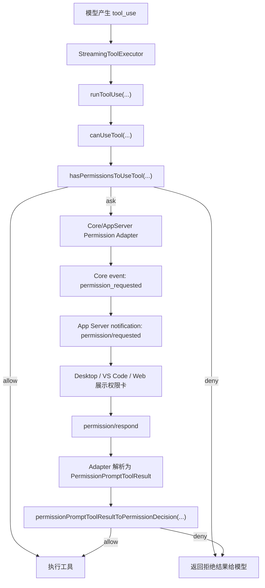

# CCR App Server 权限复用设计

## 1. 目标

P8 的目标不是重新实现一套权限系统，而是把 App Server 接入仓库已经存在的工具权限体系。

最终效果：

1. 工具执行前仍然走原有权限判断。
2. 原有规则、模式、hook、classifier、持久化 permission update 语义不变。
3. App Server 只把“需要用户确认”的权限请求转成 `permission/requested` 通知。
4. 客户端通过 `permission/respond` 回传用户选择。
5. Desktop / VS Code / Web 以后都复用同一条协议，不各写一套权限逻辑。

## 2. 当前结论

原代码中已经存在完整权限体系，不能重复写。

关键链路：

```text
- Tool.checkPermissions(...)
   工具自己的权限判断，例如 Bash / FileEdit / WebFetch。

- hasPermissionsToUseTool(...)
   全局权限规则、permission mode、allow / deny / ask、auto / dontAsk / headless 处理。

- useCanUseTool(...)
   TUI/REPL 的交互式权限入口。

- PermissionContext + handleInteractivePermission(...)
   把 ask 结果推入 TUI 确认队列，并处理 allow / deny / abort / recheck / hook / classifier / bridge / channel。

- StructuredIO.createCanUseTool(...)
   SDK / 非 TUI 场景的权限入口。它会发出 control_request: can_use_tool，并等待 control_response。

- PermissionPromptToolResultSchema
   SDK 宿主返回 allow / deny 后，统一转成 PermissionDecision。
```

所以 App Server 第一版应该复用 `StructuredIO.createCanUseTool(...)` 的协议语义，而不是照着 TUI UI 状态另造一套。

## 3. 现有能力盘点

| 能力 | 文件 | 是否复用 | 说明 |
| --- | --- | --- | --- |
| 权限类型 | `src/types/permissions.ts` | 必须复用 | 已定义 `PermissionDecision`、`PermissionUpdate`、`ToolPermissionContext`。 |
| 权限模式 | `src/utils/permissions/PermissionMode.ts` | 必须复用 | 已有 `default / plan / acceptEdits / bypassPermissions / dontAsk / auto`。 |
| 权限规则判断 | `src/utils/permissions/permissions.ts` | 必须复用 | `hasPermissionsToUseTool(...)` 是规则判断核心。 |
| TUI 权限 UI | `src/components/permissions/PermissionRequest.tsx` | 不直接复用 UI | Desktop 不应嵌入 Ink UI，但可复用其请求字段和语义。 |
| TUI 权限编排 | `src/hooks/useCanUseTool.tsx` | 复用思想，不直接依赖 React hook | 这里绑定 React state，不适合作为 App Server 直接依赖。 |
| 权限上下文 | `src/hooks/toolPermission/PermissionContext.ts` | 谨慎复用 | 里面有日志、持久化、abort、queue adapter，可作为抽象参考。 |
| SDK 控制协议 | `src/cli/structuredIO.ts` | 优先复用语义 | `control_request: can_use_tool` 正好对应 App Server 权限请求。 |
| SDK 权限返回 schema | `src/utils/permissions/PermissionPromptToolResultSchema.ts` | 必须复用 | 已能把 allow / deny 结果转成 `PermissionDecision`。 |
| Bridge 权限回调 | `src/bridge/bridgePermissionCallbacks.ts` | 参考 | 已有 request / response / cancel 模型。 |
| Remote 权限桥 | `src/remote/remotePermissionBridge.ts` | 参考 | 已有远程场景 synthetic message / tool stub 思路。 |

## 4. App Server 当前缺口

当前 `turn/start` 仍是 text-only：

```text
src/core/textOnlyCoreTurnRunner.ts
  -> queryWithLlmRuntime(...)
  -> toolSchemas: []
```

这意味着：

1. 当前模型不会收到工具 schema。
2. 当前 Core 不会产生 tool_use。
3. 当前不会进入 `StreamingToolExecutor -> runToolUse -> canUseTool`。
4. 所以当前 App Server 实际没有机会触发原权限体系。

因此 P8 不能伪装成“完整工具权限已经接入”。P8 应该分两层做：

1. 先做 App Server 权限协议与原 SDK 权限语义的 adapter。
2. 后续当 Core tool runner 接入后，让 tool runner 使用这个 adapter 提供的 `canUseTool`。

## 5. 推荐架构



不变式：

1. `hasPermissionsToUseTool(...)` 仍然是 ask / allow / deny 的核心来源。
2. App Server 不直接判断某个命令是否危险。
3. App Server 不直接修改 permission rules。
4. `permission/respond` 只解决“用户对已发出的 ask 请求做选择”。
5. 权限持久化仍然通过现有 `PermissionUpdate` / `persistPermissionUpdates(...)`。

## 6. App Server 协议映射

### 6.1 `permission/requested`

App Server 对外通知：

```json
{
  "jsonrpc": "2.0",
  "method": "permission/requested",
  "params": {
    "permissionRequestId": "perm_...",
    "threadId": "thread_...",
    "turnId": "turn_...",
    "tool": {
      "name": "Bash",
      "displayName": "Bash",
      "description": "Run npm.cmd test"
    },
    "input": {
      "command": "npm.cmd test"
    },
    "permissionSuggestions": [],
    "blockedPath": null,
    "decisionReason": "Current permission mode requires approval",
    "toolUseId": "toolu_...",
    "agentId": null
  }
}
```

字段来源优先对齐 `SDKControlPermissionRequestSchema`：

```text
subtype: "can_use_tool"
tool_name
input
permission_suggestions
blocked_path
decision_reason
title
display_name
tool_use_id
agent_id
description
```

### 6.2 `permission/respond`

App Server 对外请求：

```json
{
  "jsonrpc": "2.0",
  "id": 30,
  "method": "permission/respond",
  "params": {
    "permissionRequestId": "perm_...",
    "behavior": "allow",
    "updatedInput": {
      "command": "npm.cmd test"
    },
    "updatedPermissions": [],
    "decisionClassification": "user_temporary"
  }
}
```

拒绝：

```json
{
  "jsonrpc": "2.0",
  "id": 31,
  "method": "permission/respond",
  "params": {
    "permissionRequestId": "perm_...",
    "behavior": "deny",
    "message": "用户拒绝执行该命令",
    "interrupt": true,
    "decisionClassification": "user_reject"
  }
}
```

这里不要发明新的 `allow_once / allow_session / cancel_turn` 语义作为底层权限结果。

如果 UI 需要“允许一次 / 本会话允许 / 拒绝”按钮，应映射成现有字段：

| UI 操作 | App Server 入参 | 底层语义 |
| --- | --- | --- |
| 允许一次 | `behavior: "allow"` + `updatedInput` + `decisionClassification: "user_temporary"` | 临时允许，不持久化规则。 |
| 本会话允许 | `behavior: "allow"` + `updatedPermissions` 目标为 `session` | 复用现有 `PermissionUpdate`。 |
| 永久允许 | `behavior: "allow"` + `updatedPermissions` 目标为 `userSettings/localSettings/projectSettings` | 复用现有持久化。 |
| 拒绝 | `behavior: "deny"` + `message` | 返回拒绝结果给模型。 |
| 拒绝并中断 | `behavior: "deny"` + `interrupt: true` | 触发 abort。 |

## 7. Core 侧最小 adapter

建议新增的是“薄适配器”，不是权限判断器：

```ts
type CorePermissionPromptAdapter = {
  createCanUseTool(input: {
    threadId: string
    turnId: string
  }): CanUseToolFn

  respond(input: {
    permissionRequestId: string
    result: PermissionPromptToolOutput
  }): void

  cancelForTurn(input: {
    threadId: string
    turnId: string
    reason: string
  }): void
}
```

adapter 内部职责：

1. 调用 `hasPermissionsToUseTool(...)`。
2. 如果结果是 `allow / deny`，直接返回。
3. 如果结果是 `ask`，生成 pending request。
4. emit Core event `permission_requested`。
5. 等待 `permission/respond`。
6. 用 `permissionPromptToolResultToPermissionDecision(...)` 转回原 `PermissionDecision`。
7. 清理 pending request，处理重复响应、取消、turn abort。

这个 adapter 可以参考 `StructuredIO.createCanUseTool(...)`，但不应该直接依赖 stdio。

## 8. App Server 侧最小 handler

App Server 只做：

```text
permission/respond
  -> schema parse
  -> context.core.permission.respond(...)
  -> JSON-RPC result { accepted: true }
```

错误：

| 错误 | 触发条件 |
| --- | --- |
| `permission_not_found` | request id 不存在。 |
| `permission_not_pending` | 已响应、已取消或已过期。 |
| `turn_not_active` | 所属 turn 已结束或被中断。 |
| `invalid_params` | response 不符合 `PermissionPromptToolResultSchema`。 |

## 9. 实现顺序

第一刀只做协议桥，不做完整工具 runner：

1. 新增 Core permission adapter 的类型和 pending map。
2. 复用 `SDKControlPermissionRequestSchema` 的字段模型。
3. 复用 `PermissionPromptToolResultSchema.outputSchema()` 校验响应。
4. App Server 开启 `permissions: true` capability。
5. 新增 `permission/respond` handler。
6. 新增 smoke：直接构造 adapter 的 pending request，验证 `permission/requested -> permission/respond`。

第二刀再接入真实工具流：

1. 把当前 text-only runner 演进为 tool-capable runner。
2. 让 tool runner 使用 adapter 提供的 `canUseTool`。
3. 验证 Bash / FileEdit / WebFetch 等工具都不绕过权限。

## 10. 明确不做

P8 第一刀不做：

1. 不重写 `hasPermissionsToUseTool(...)`。
2. 不重写 TUI `PermissionRequest`。
3. 不新建独立权限规则格式。
4. 不在 App Server 内判断 bash 是否危险。
5. 不为了 smoke 假装工具执行已经接入。
6. 不让 Desktop / VS Code 直接读 settings 或 token。

## 11. 验证清单

必须验证：

1. pending request 能发出 `permission/requested`。
2. `permission/respond allow` 能解析成原 `PermissionDecision`。
3. `permission/respond deny` 能解析成原 `PermissionDecision`。
4. 重复响应返回明确错误。
5. 不存在 request id 返回明确错误。
6. turn interrupt 会取消 pending request。
7. 响应体不能泄露 token。
8. App Server capability 正确声明 `permissions: true`。

后续真实工具流接入后再补：

1. Bash ask -> allow -> 执行。
2. Bash ask -> deny -> 模型收到拒绝结果。
3. FileEdit ask -> allow with updatedInput。
4. WebFetch ask -> deny。
5. session permission update 生效。
