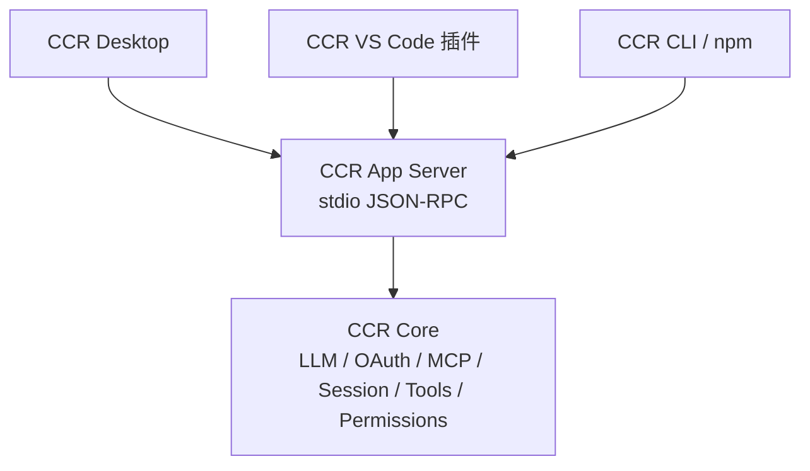

# CCR App Server 协议详细设计

## 1. 文档目标

本文档是 `CCR App Server` 第一版协议的实现依据，对应 todo：

- [App Server Todo P1](../stages/app-server-todo.md)

它把总体方案里的 `ccr app-server --listen stdio` 细化为可实现协议，供后续 `Desktop / VS Code / Local Web` 统一接入。

第一版目标：

```text
提供一个本地 stdio JSON-RPC 服务，
让富客户端可以安全读取 CCR 配置、登录状态、模型列表、MCP 列表和 workspace 状态，
为后续 thread / turn / permission 事件流打基础。
```

第一版非目标：

```text
不做 websocket。
不做 daemon。
不做多客户端共享。
不做完整模型调用。
不做工具执行。
不做权限交互闭环。
不替代 MCP Server。
不复用 bridge / remote 作为主协议。
```

---

## 2. 协议定位

`App Server` 是 CCR Core 的一种运行模式：

```text
ccr app-server --listen stdio
```

它不是 Desktop 私有模块，也不是 VS Code 插件私有模块。



协议层只暴露稳定的产品语义，不暴露内部函数名。

更严格地说，`App Server` 不是一套新的业务实现。它只能作为
[CCR Core 统一对外接口边界](./ccr-core-interface-boundary.md)
的协议适配层存在：

```text
JSON-RPC method
  -> 参数校验
  -> CCR Core API
  -> JSON-RPC response / notification
```

因此 `config / auth / model / mcp / workspace / session / permission / tool`
都不应该在 App Server 下重新实现一套私有逻辑。

---

## 3. 与现有模块的关系

| 现有模块 | 是否直接作为 App Server | 第一版处理 |
| --- | --- | --- |
| `src/entrypoints/mcp.ts` | 否 | 保留为 MCP Server，面向其他 MCP 客户端 |
| `src/cli/structuredIO.ts` | 否 | 复用其 SDK 消息、控制消息和权限请求经验，后续 P7/P8 再对接 |
| `src/bridge/` | 否 | 远程控制旧体系，不作为本地 Desktop/VS Code 主协议 |
| `src/remote/` | 否 | 远程 session/WebSocket 体系，不作为本地第一版协议 |
| `src/server/server.ts` | 否 | 当前是占位，后续可被新 App Server 替代或废弃 |
| `src/services/llm/` | 是，作为能力来源 | 提供 provider/model/config/auth status |
| `src/services/mcp/config.ts` | 是，作为能力来源 | 提供 MCP 只读列表 |

后续实现应逐步通过 `CCR Core API` 间接复用这些能力。App Server handler
不应长期直接依赖散落的底层模块；如果发现某个 handler 需要直接拼接底层行为，
应优先补 Core service，而不是在 App Server 内新增第二套业务规则。

第一版应新增：

```text
src/app-server/
  index.ts
  protocol.ts
  errors.ts
  stdioTransport.ts
  router.ts
  handlers/
```

---

## 4. 传输层

### 4.1 第一版只支持 stdio

启动命令：

```powershell
node .\cli.js app-server --listen stdio
```

后续 npm 安装后：

```powershell
ccr app-server --listen stdio
```

### 4.2 消息边界

每行一条 JSON 消息：

```text
stdin:
  {"jsonrpc":"2.0","id":1,"method":"initialize","params":{...}}\n

stdout:
  {"jsonrpc":"2.0","id":1,"result":{...}}\n
```

规则：

- `stdin` 只接收 UTF-8 文本。
- 每个非空行必须是一个完整 JSON object。
- 空行忽略。
- malformed JSON 返回结构化 parse error。
- 所有正常协议输出写到 `stdout`。
- 调试日志、异常栈、内部日志写到 `stderr`，不得污染 `stdout`。

### 4.3 生命周期

```text
客户端 spawn app-server
  -> 发送 initialize
  -> 调用业务方法
  -> 发送 shutdown 或关闭 stdin
  -> app-server 保存状态并退出
```

如果 `stdin` EOF：

```text
无 active turn：
  正常退出

后续有 active turn 时：
  第一版还没有 turn，因此不处理
```

---

## 5. JSON-RPC 外形

第一版采用 JSON-RPC 2.0 风格，但暂不追求完整 JSON-RPC 生态兼容。

### 5.1 Request

```json
{
  "jsonrpc": "2.0",
  "id": 1,
  "method": "config/get",
  "params": {}
}
```

字段规则：

| 字段 | 必填 | 说明 |
| --- | --- | --- |
| `jsonrpc` | 是 | 固定 `"2.0"` |
| `id` | 是 | string 或 number，response 必须原样返回 |
| `method` | 是 | 方法名 |
| `params` | 否 | object；无参数方法可省略或传 `{}` |

第一版不支持 batch request。

### 5.2 Success Response

```json
{
  "jsonrpc": "2.0",
  "id": 1,
  "result": {
    "provider": "codex-oauth",
    "model": "gpt-5.4"
  }
}
```

### 5.3 Error Response

```json
{
  "jsonrpc": "2.0",
  "id": 1,
  "error": {
    "code": -32001,
    "message": "App Server is not initialized.",
    "data": {
      "kind": "not_initialized"
    }
  }
}
```

错误体规则：

| 字段 | 说明 |
| --- | --- |
| `code` | JSON-RPC 数字错误码 |
| `message` | 面向开发者的稳定错误说明 |
| `data.kind` | 稳定机器可读错误类型 |
| `data.details` | 可选，脱敏细节 |

### 5.4 Notification

服务端通知没有 `id`：

```json
{
  "jsonrpc": "2.0",
  "method": "server/log",
  "params": {
    "level": "info",
    "message": "workspace opened"
  }
}
```

当前 notification 已用于 turn 流、工具事件、权限请求和状态事件；协议原则仍是不在 notification 中泄露 token、refresh token、完整 credential 或未脱敏环境变量。

---

## 6. 初始化门禁

连接建立后，客户端必须先调用 `initialize`。

未 initialize 前只允许：

- `initialize`
- `shutdown`

其他方法必须返回：

```json
{
  "code": -32001,
  "message": "App Server is not initialized.",
  "data": {
    "kind": "not_initialized"
  }
}
```

重复 initialize 返回：

```json
{
  "code": -32002,
  "message": "App Server is already initialized.",
  "data": {
    "kind": "already_initialized"
  }
}
```

这样可以避免 Desktop / VS Code 插件在未完成能力协商前误调危险接口。

---

## 7. 错误码

| code | kind | 场景 |
| --- | --- | --- |
| `-32700` | `parse_error` | JSON 解析失败 |
| `-32600` | `invalid_request` | 消息不是合法 request |
| `-32601` | `method_not_found` | 未知 method |
| `-32602` | `invalid_params` | params schema 校验失败 |
| `-32603` | `internal_error` | 未分类内部错误 |
| `-32001` | `not_initialized` | initialize 前调用业务方法 |
| `-32002` | `already_initialized` | 重复 initialize |
| `-32003` | `unsupported_transport` | 不支持的 `--listen` |
| `-32004` | `unsupported_capability` | 客户端请求不支持能力 |
| `-32005` | `workspace_not_open` | 需要 workspace 但尚未打开 |
| `-32006` | `auth_required` | 需要登录但当前缺凭据 |
| `-32007` | `operation_cancelled` | 操作被取消 |
| `-32008` | `operation_in_progress` | 不允许并发执行的操作正在进行 |
| `-32009` | `permission_required` | 需要权限响应，第一版只预留 |
| `-32010` | `schema_version_unsupported` | 配置或协议 schema 不兼容 |

第一版实现 P2/P4 只需要覆盖：

- `parse_error`
- `invalid_request`
- `method_not_found`
- `invalid_params`
- `internal_error`
- `not_initialized`
- `already_initialized`
- `unsupported_transport`

---

## 8. Schema 策略

第一版建议使用 `zod` 定义协议 schema。

```text
src/app-server/protocol.ts
  JsonRpcRequestSchema
  JsonRpcResponseSchema
  JsonRpcNotificationSchema
  InitializeParamsSchema
  InitializeResultSchema
  ...
```

原则：

- 运行时不信任客户端输入，所有 `params` 必须 schema 校验。
- TypeScript interface 不能替代 runtime schema。
- schema 定义是服务端权威。
- 后续可生成 `docs/architecture/app-server-schema.json` 或 `dist/schema/app-server.json` 给 Desktop / VS Code 使用。

第一版可以先只写 zod schema，不立即生成 JSON Schema 文件。

后续 P5 再评估是否加入：

```text
scripts/generate-app-server-schema.mjs
```

---

## 9. 通用类型

### 9.1 ClientInfo

```json
{
  "name": "ccr-desktop",
  "title": "CCR Desktop",
  "version": "0.1.0"
}
```

字段：

| 字段 | 说明 |
| --- | --- |
| `name` | 稳定机器名，例如 `ccr-desktop`、`ccr-vscode`、`ccr-dev-client` |
| `title` | 面向人的显示名 |
| `version` | 客户端版本 |

### 9.2 Capability

客户端 capability 示例：

```json
{
  "streaming": true,
  "permissionPrompts": true,
  "workspaceTrust": true,
  "mcpManagement": true
}
```

服务端 capability 示例：

```json
{
  "config": true,
  "auth": true,
  "models": true,
  "mcp": true,
  "workspace": true,
  "threads": true,
  "turns": true,
  "permissions": true,
  "context": true,
  "compact": true,
  "memory": true
}
```

当前 `threads / turns / permissions / context / compact / memory` 已返回 `true`，表示 App Server 已具备会话、turn 事件流、权限响应、上下文状态、压缩状态和 SessionMemory 状态协议。具体事件字段仍以 [CCR Desktop 与 App Server 事件字段契约](./desktop-app-server-event-contract.md) 为准。

---

## 10. 方法设计

## 10.1 `initialize`

用途：

```text
建立连接、协商能力、返回 server/core/protocol/home/platform 信息。
```

Request:

```json
{
  "jsonrpc": "2.0",
  "id": 1,
  "method": "initialize",
  "params": {
    "clientInfo": {
      "name": "ccr-desktop",
      "title": "CCR Desktop",
      "version": "0.1.0"
    },
    "capabilities": {
      "streaming": true,
      "permissionPrompts": true
    }
  }
}
```

Result:

```json
{
  "serverInfo": {
    "name": "ccr-app-server",
    "version": "0.1",
    "serverVersion": "0.1",
    "coreVersion": "0.2.0"
  },
  "serverVersion": "0.1",
  "protocolVersion": "0.1",
  "schemaVersions": {
    "config": "0.1"
  },
  "ccrHome": "C:/Users/<user>/.ccr",
  "platform": {
    "os": "win32",
    "arch": "x64",
    "node": "v24.14.0"
  },
  "capabilities": {
    "config": true,
    "auth": true,
    "models": true,
    "mcp": true,
    "workspace": true,
    "threads": true,
    "turns": true,
    "permissions": true
  }
}
```

实现来源：

- `MACRO.VERSION` 作为 `coreVersion`。
- `getClaudeConfigHomeDir()` 作为 `ccrHome`，当前实际已指向 `~/.ccr`。
- `process.platform`、`process.arch`、`process.version` 作为 platform。

安全要求：

- 不返回 token。
- 不返回完整环境变量。
- 不返回 `process.env`。

## 10.2 `shutdown`

用途：

```text
请求 app-server 优雅退出。
```

Request:

```json
{
  "jsonrpc": "2.0",
  "id": 2,
  "method": "shutdown",
  "params": {}
}
```

Result:

```json
{
  "accepted": true
}
```

行为：

- 写出 response 后设置 `process.exitCode = 0`。
- 第一版没有 active turn，因此可直接让事件循环自然结束。
- 不在 handler 内直接 `process.exit(...)`。

## 10.3 `config/get`

用途：

```text
读取当前 LLM 配置和配置来源，供 Desktop/VS Code 设置页展示。
```

Request:

```json
{
  "jsonrpc": "2.0",
  "id": 3,
  "method": "config/get",
  "params": {}
}
```

Result:

```json
{
  "llm": {
    "provider": "codex-oauth",
    "providerDisplayName": "Codex OAuth",
    "model": "gpt-5.4",
    "authStrategy": "oauth_refreshable",
    "apiMode": "openai-responses",
    "capabilities": {
      "streaming": true,
      "tools": true,
      "reasoning": true,
      "usage": true
    },
    "configPath": "C:/Users/<user>/.ccr/data/llm.config.local.json",
    "configSource": "file+env"
  },
  "paths": {
    "ccrHome": "C:/Users/<user>/.ccr",
    "mcpConfig": "C:/Users/<user>/.ccr/mcp.json"
  }
}
```

实现来源：

- `getLlmRuntimeDisplayStatus()`
- `getResolvedLlmConfigPath()`
- `getUserMcpFilePath()`
- `getClaudeConfigHomeDir()`

安全要求：

- 不返回 provider 的 `clientSecret`。
- 不返回 OAuth credential 内容。
- `baseUrl` 可以返回，但后续如果支持带密钥 URL，必须脱敏。

## 10.4 `config/update`

用途：

```text
更新当前 provider / model。
```

第一版可以先设计，P4 视风险决定是否实现。

Request:

```json
{
  "jsonrpc": "2.0",
  "id": 4,
  "method": "config/update",
  "params": {
    "llm": {
      "provider": "codex-oauth",
      "model": "gpt-5.4"
    }
  }
}
```

Result:

```json
{
  "llm": {
    "provider": "codex-oauth",
    "model": "gpt-5.4",
    "configPath": "C:/Users/<user>/.ccr/data/llm.config.local.json"
  }
}
```

实现来源：

- `updatePersistedLlmConfig()`
- `validateLlmConfigForProviders()`
- `getDefaultLlmRuntime().listProviders()` 或等价 provider registry。

规则：

- 只允许更新白名单字段。
- 空 provider / model 拒绝。
- 未注册 provider 拒绝。
- 更新后发送 `config/changed` notification。
- 后续要增加 schemaVersion 和备份策略。

## 10.5 `auth/status`

用途：

```text
读取当前 provider 的登录状态，供 UI 显示。
```

Request:

```json
{
  "jsonrpc": "2.0",
  "id": 5,
  "method": "auth/status",
  "params": {}
}
```

Result:

```json
{
  "provider": "codex-oauth",
  "state": "available",
  "configured": true,
  "available": true,
  "message": "Codex OAuth credential is available.",
  "source": "file",
  "account": {
    "id": "acct_***1234"
  },
  "expiresAt": 1790000000000
}
```

实现来源：

- `getLlmRuntimeAuthStatus()`

脱敏规则：

- `accountId` 必须脱敏，例如只保留尾部 4 位。
- 不返回 access token。
- 不返回 refresh token。
- 不返回 credential JSON。
- 不返回 cookie。

状态值：

| state | 含义 |
| --- | --- |
| `missing` | 未检测到凭据 |
| `configured` | 有凭据但当前不可用，可能过期 |
| `available` | 当前可用 |

## 10.6 `auth/login/start`

用途：

```text
启动当前 provider 的登录流程。
```

第一版建议只设计，不在 P4 强行实现。

Request:

```json
{
  "jsonrpc": "2.0",
  "id": 6,
  "method": "auth/login/start",
  "params": {
    "provider": "codex-oauth",
    "interactive": true
  }
}
```

Result:

```json
{
  "started": true,
  "provider": "codex-oauth",
  "mode": "browser",
  "message": "Login flow started in browser."
}
```

后续事件：

```json
{
  "jsonrpc": "2.0",
  "method": "auth/statusChanged",
  "params": {
    "provider": "codex-oauth",
    "state": "available"
  }
}
```

实现注意：

- OAuth 回调服务由 Core/session 层管理，不由 renderer 管理。
- Desktop 只触发登录，不拿 token。
- 如果已有 `CodexOAuthSession` 可复用其 login/start 流程，但必须避免 `process.exit(...)` 直接结束 app-server。

## 10.7 `model/list`

用途：

```text
列出 provider 和模型能力，供 UI 做 provider/model 选择器。
```

Request:

```json
{
  "jsonrpc": "2.0",
  "id": 7,
  "method": "model/list",
  "params": {
    "provider": "codex-oauth"
  }
}
```

Result:

```json
{
  "current": {
    "provider": "codex-oauth",
    "model": "gpt-5.4"
  },
  "providers": [
    {
      "id": "codex-oauth",
      "displayName": "Codex OAuth",
      "authStrategy": "oauth_refreshable",
      "apiMode": "openai-responses",
      "capabilities": {
        "streaming": true,
        "tools": true,
        "reasoning": true,
        "usage": true
      },
      "models": [
        {
          "provider": "codex-oauth",
          "model": "gpt-5.4",
          "displayName": "GPT-5.4",
          "contextWindow": 200000,
          "maxOutputTokens": 32000,
          "supportsReasoning": true,
          "supportsTools": true,
          "inputModalities": ["text"]
        }
      ]
    }
  ]
}
```

实现来源：

- `listBuiltinLlmProviderDefinitions()`
- `getLlmModelCatalogEntry()`
- `getLlmRuntimeDisplayStatus()`
- 当前已知 `codex-oauth` 模型：`gpt-5.4`、`gpt-5.4-mini`

第一版如果 provider registry 还没有完整 list models API，可以先返回内置 provider 定义和 provider 默认模型。

## 10.8 `mcp/list`

用途：

```text
列出当前可见 MCP server，供 Desktop/VS Code 展示。
```

Request:

```json
{
  "jsonrpc": "2.0",
  "id": 8,
  "method": "mcp/list",
  "params": {
    "includeDisabled": true
  }
}
```

Result:

```json
{
  "configPath": "C:/Users/<user>/.ccr/mcp.json",
  "servers": [
    {
      "name": "playwright",
      "scope": "user",
      "type": "stdio",
      "command": "npx.cmd",
      "args": ["-y", "@playwright/mcp@latest"],
      "enabled": true,
      "source": "user"
    }
  ],
  "errors": []
}
```

实现来源：

- `getClaudeCodeMcpConfigs()` 优先，避免第一版引入慢速网络 connector。
- `getUserMcpFilePath()`

第一版建议：

- 默认只读本地 CCR MCP 配置和 plugin cache。
- 不调用慢速远程 connector。
- 不主动连接 MCP server。
- 不返回 headers 中的敏感值。

脱敏规则：

- `env` 中疑似 token/key/password 的值必须显示为 `***`。
- `headers.Authorization` 必须脱敏。
- OAuth client secret 不返回。

## 10.9 `workspace/open`

用途：

```text
设置当前工作区，供后续 thread/turn 使用。
```

Request:

```json
{
  "jsonrpc": "2.0",
  "id": 9,
  "method": "workspace/open",
  "params": {
    "path": "D:/agent_project/claude-code-reforged",
    "trust": "trusted"
  }
}
```

Result:

```json
{
  "workspace": {
    "path": "D:/agent_project/claude-code-reforged",
    "trusted": true,
    "git": {
      "isGit": true,
      "branch": "feature/builtin-llm-runtime"
    }
  }
}
```

第一版行为：

- 校验 path 是绝对路径。
- 校验路径存在且是目录。
- 设置 `cwd` 状态，但不启动模型调用。
- 如果 `trust` 不是 `trusted`，返回需要客户端确认的错误或状态。

第一版可以简化：

```text
只接受 trust = "trusted"
不实现交互式 trust dialog
```

安全要求：

- 不自动信任任意路径。
- 不执行项目内脚本。
- 不加载项目未确认 hooks。

---

## 11. 第一版通知事件

### 11.1 `server/log`

```json
{
  "jsonrpc": "2.0",
  "method": "server/log",
  "params": {
    "level": "info",
    "message": "App Server initialized.",
    "timestamp": "2026-04-29T00:00:00.000Z"
  }
}
```

规则：

- 不发送 token。
- 不发送完整 request body 中的敏感字段。
- 客户端可展示到日志页。

### 11.2 `config/changed`

```json
{
  "jsonrpc": "2.0",
  "method": "config/changed",
  "params": {
    "scope": "llm",
    "provider": "codex-oauth",
    "model": "gpt-5.4"
  }
}
```

### 11.3 `auth/statusChanged`

```json
{
  "jsonrpc": "2.0",
  "method": "auth/statusChanged",
  "params": {
    "provider": "codex-oauth",
    "state": "available"
  }
}
```

### 11.4 `workspace/opened`

```json
{
  "jsonrpc": "2.0",
  "method": "workspace/opened",
  "params": {
    "path": "D:/agent_project/claude-code-reforged",
    "trusted": true
  }
}
```

---

## 12. 会话协议摘要

详细设计见 [CCR App Server 会话 API 设计](./app-server-session-api-design.md)。这里保留协议级摘要，方便客户端先判断能力边界。

未来核心对象：

```text
Thread
  一段对话或任务会话

Turn
  用户发起的一轮请求

Item
  turn 内的消息、工具、权限、delta、结果
```

当前核心方法：

- `thread/start`
- `thread/resume`
- `thread/list`
- `turn/start`
- `turn/interrupt`
- `permission/respond`
- `context/status`
- `context/analyze`
- `compact/status`
- `compact/run`
- `memory/session/status`

当前核心通知：

- `thread/started`
- `turn/started`
- `item/started`
- `item/delta`
- `item/completed`
- `permission/requested`
- `permission/cancelled`
- `turn/completed`
- `turn/failed`
- `context/compacted`

当前 `initialize` 中声明：

```json
{
  "threads": true,
  "turns": true,
  "permissions": true,
  "context": true,
  "compact": true,
  "memory": true
}
```

注意：这代表会话、turn 和权限协议可用，不代表已经支持 websocket、多客户端共享、active turn 跨进程恢复或完整历史会话管理。

## 12.1 上下文、压缩与记忆方法

P26 开始，App Server 将 Claude Code 原生上下文治理能力桥接给 Desktop。这里的原则是“只暴露安全状态和控制入口，不复制原生实现”：

- `context/status`：读取当前 thread 的消息数量、最近消息类型、`readFileState` 大小、compact boundary 数量、当前模型、粗略 token 估算、sessionStorage 状态、memory attachment 计数和 tool result replacement 计数。
- `context/analyze`：复用原生 `/context` 背后的分析链路，但只返回聚合 token、分类、计数和用量，不返回 memory 文件正文、系统提示正文、完整路径或大段 prompt。
- `compact/status`：读取 auto compact 开关、有效上下文窗口、自动压缩阈值、距离自动压缩的 token 差值、context collapse 状态和最近 compact boundary。
- `compact/run`：由 Core 将当前 thread 的 `Message[]`、`ToolUseContext`、`readFileState` 映射到原生 `compact.ts` 的 `call` 流程；Desktop 点击按钮或输入 `/compact` 都必须走这个同一接口。
- `memory/session/status`：读取 SessionMemory hook、gate、初始化、抽取状态、summary 文件脱敏路径、内容长度和 sessionStorage 状态；Desktop 不直接读正文。

P26 新增通知：

```json
{
  "jsonrpc": "2.0",
  "method": "context/compacted",
  "params": {
    "threadId": "thread_xxx",
    "compactedAt": "2026-05-04T00:00:00.000Z",
    "metadata": {
      "messageCount": 3,
      "compactBoundaryCount": 1,
      "readFileStateSize": 1
    },
    "result": {
      "trigger": "auto",
      "preTokens": 120000,
      "messagesSummarized": 42
    }
  }
}
```

安全要求：

- `context/analyze` 默认只返回聚合字段，不能返回 `memoryFiles[].path`、系统提示正文、memory 正文或 tool result 原文。
- `memory/session/status.memoryPath` 和 `sessionStoragePath` 必须返回 `projects/...` 这类状态目录相对路径；如果路径不在 CCR project state 下，只能返回占位而不是绝对路径。
- `compact/run` 不能绕过 active turn 锁；有运行中 turn 时必须返回结构化 `operation_in_progress`。
- 自动 compact 仍由原生 `query()` 触发；Desktop 不主动判断是否该自动压缩，只消费 `context/compacted` 轻量事件。

---

## 13. 安全不变式

### 13.1 凭据

禁止返回：

- access token
- refresh token
- cookie
- API key
- OAuth client secret
- 完整 credential JSON
- 环境变量全集

允许返回：

- 是否配置。
- 是否可用。
- 凭据来源，如 `env` / `file`。
- 脱敏账号 ID。
- 过期时间。
- 脱敏 baseUrl。

### 13.2 文件系统

第一版只读为主。

`config/update` 是唯一可能写入配置的第一版方法，且只写：

```text
~/.ccr/data/llm.config.local.json
```

`workspace/open` 不执行脚本、不加载 hooks、不运行模型。

### 13.3 进程

第一版不执行工具命令。

后续 P7/P8 支持 turn 后，工具执行必须继续走现有权限系统，不得因为来自 Desktop / VS Code 而默认放行。

### 13.4 Renderer 边界

Desktop renderer 不直接访问：

- `~/.ccr/data/codex-oauth.json`
- `~/.ccr/data/llm.config.local.json`
- `process.env`
- Node `child_process`
- 内部 `src/` 模块

renderer 只通过 Electron main/preload 调 App Server 协议。

---

## 14. P2 实现建议

P2 最小骨架只实现：

```text
initialize
shutdown
unknown method
initialize gate
malformed JSON error
```

建议类型：

```ts
type JsonRpcId = string | number

type JsonRpcRequest = {
  jsonrpc: '2.0'
  id: JsonRpcId
  method: string
  params?: Record<string, unknown>
}

type AppServerContext = {
  initialized: boolean
  clientInfo?: ClientInfo
  startedAt: number
  ccrHome: string
}
```

P2 不需要接入所有 handler，只要 router 可扩展即可。

P3 再把入口挂到 `src/entrypoints/cli.tsx`。

P4 再补 `config/get`、`auth/status`、`model/list`、`mcp/list`、`workspace/open`。

---

## 15. P5 Smoke 设计

建议 smoke 用 Node 子进程 spawn `cli.js app-server --listen stdio`。

验证步骤：

```text
1. 启动 app-server。
2. 发送 config/get，确认返回 not_initialized。
3. 发送 malformed JSON，确认返回 parse_error。
4. 发送 initialize，确认返回 protocolVersion/serverVersion/coreVersion/schemaVersions/ccrHome。
5. 发送 unknown method，确认返回 method_not_found。
6. 发送 shutdown，确认进程退出。
```

P4 后追加：

```text
7. config/get 不泄露 token。
8. auth/status 不泄露 token。
9. model/list 返回 codex-oauth / gpt-5.4。
10. mcp/list 可以读取 ~/.ccr/mcp.json 或空列表。
```

---

## 16. 第一版完成判断

P1 完成后，P2 可以直接开始实现。

P1 完成标准：

- 已明确 stdio JSON-RPC 消息格式。
- 已明确 initialize gate。
- 已明确错误码。
- 已明确第一批方法入参/出参。
- 已明确通知占位。
- 已明确 schema 策略。
- 已明确安全不变式。
- 已明确 P2/P3/P4/P5 的实现边界。
