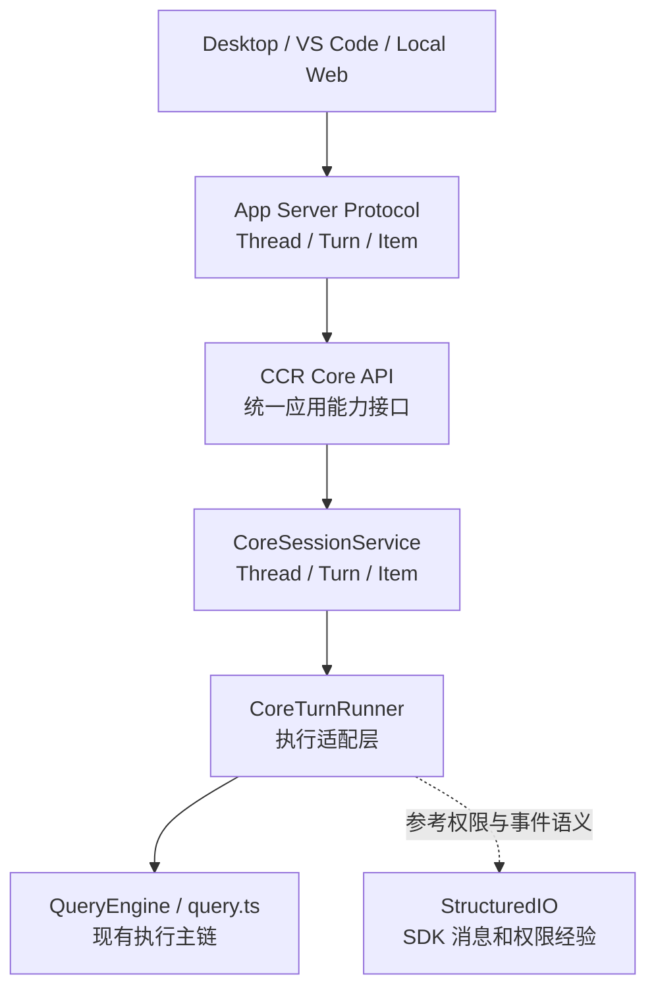
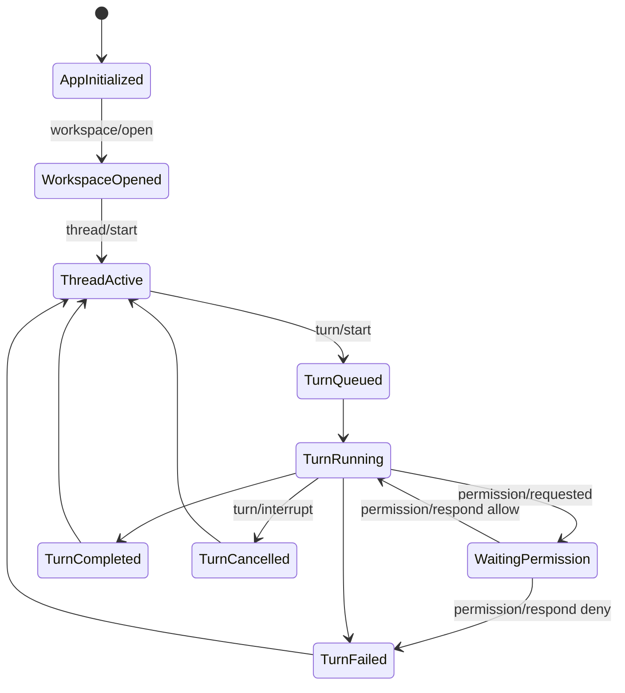

# CCR App Server 会话 API 设计

## 1. 文档目标

本文档对应 [CCR App Server 实施 Todo](../stages/app-server-todo.md) 的 P6。

目标是把后续真实对话能力拆成三个稳定对象：

```text
Thread：一段会话容器
Turn：用户发起的一轮请求
Item：Turn 内产生的消息、增量、工具、权限、结果
```

第一版不是把现有 CLI/TUI 的内部对象直接暴露给 Desktop / VS Code，也不是在 App Server 内部重写一套会话执行系统。
它应该通过 [CCR Core 统一对外接口边界](./ccr-core-interface-boundary.md) 接入统一 Core 能力，再由 App Server 做协议适配：



这样做的原因：

- `Thread / Turn / Item` 是产品协议，后续 Desktop / VS Code / Web 都能复用。
- `QueryEngine / query.ts / StructuredIO` 是内部实现，后续可以替换或分阶段接入。
- `App Server` 只是协议入口，不应成为第二套 session / LLM / permission / tool runtime。
- 第一版先做单会话、单 active turn，避免一上来处理多并发、恢复、权限等待和中断竞态。

---

## 2. 与现有源码的边界

| 模块 | 当前职责 | App Server 复用方式 |
| --- | --- | --- |
| `src/QueryEngine.ts` | 管理一次查询执行中的消息、工具、重试、usage、压缩、持久化等复杂状态 | 后续通过 `TurnRunner` 适配，不由 router 直接调用 |
| `src/query.ts` | 更底层的模型/工具循环和 stream event 生成 | 后续作为执行引擎候选，不直接暴露协议字段 |
| `src/cli/structuredIO.ts` | SDK stdio 消息、control_request、权限请求/响应、outbound 队列 | 复用设计经验，P8 再把权限桥接到 App Server |
| `src/utils/sessionStorage.ts` | transcript/session 存储相关能力 | P7 后评估接入，第一版可先内存态 |
| `src/history.ts` | 命令历史和 pasted content 处理 | 不作为第一版 Thread 持久化来源 |

关键不变式：

```text
App Server 对外只说 Thread / Turn / Item。
内部必须通过 CCR Core API 使用 QueryEngine、query.ts、StructuredIO。
但不能把 SDKMessage、Anthropic block、内部 Message 类型直接作为公开协议。
也不能让 App Server 自己私有实现模型调用、工具执行、权限判断或会话持久化。
```

---

## 3. 第一版范围

第一版只支持：

- 单 App Server 进程。
- 单 workspace。
- 单 active thread。
- 单 active turn。
- 纯文本用户输入。
- 流式或非流式文本输出事件。
- 权限事件先设计占位，P8 再完整实现。

第一版不支持：

- 多 workspace 并发。
- 多 thread 并发。
- 一个 thread 内多 turn 并发。
- 跨进程恢复 active turn。
- 后台 daemon。
- 完整工具权限闭环。
- 附件、图片、paste store。
- 复杂 compact / resume / fork。

---

## 4. 核心对象

## 4.1 Thread

`Thread` 表示一个对话或任务容器。

第一版字段：

```json
{
  "threadId": "thread_01H...",
  "workspacePath": "D:/agent_project/claude-code-reforged",
  "title": "New thread",
  "status": "active",
  "createdAt": "2026-04-29T00:00:00.000Z",
  "updatedAt": "2026-04-29T00:00:00.000Z",
  "activeTurnId": null,
  "metadata": {}
}
```

状态：

| status | 含义 |
| --- | --- |
| `active` | 当前可继续对话 |
| `archived` | 已归档，第一版只设计 |
| `closed` | 已关闭，第一版只设计 |

第一版 Thread 保存在内存中。后续再决定是否映射到现有 session id / transcript。

## 4.2 Turn

`Turn` 表示用户发起的一轮请求。

第一版字段：

```json
{
  "turnId": "turn_01H...",
  "threadId": "thread_01H...",
  "status": "running",
  "input": {
    "type": "text",
    "text": "帮我总结这个仓库"
  },
  "provider": "codex-oauth",
  "model": "gpt-5.4",
  "createdAt": "2026-04-29T00:00:00.000Z",
  "startedAt": "2026-04-29T00:00:00.100Z",
  "completedAt": null,
  "error": null
}
```

状态：

| status | 含义 |
| --- | --- |
| `queued` | 已创建，尚未执行 |
| `running` | 正在模型/工具执行 |
| `waiting_permission` | 等待用户授权工具或危险操作 |
| `completed` | 正常完成 |
| `failed` | 执行失败 |
| `cancelled` | 用户取消 |
| `interrupted` | 被新 turn 或 interrupt 打断 |

第一版只实现 `queued -> running -> completed/failed/cancelled`。

P8 再实现 `waiting_permission`。

## 4.3 Item

`Item` 是 Turn 内的事件和内容单元。它是 UI 渲染和回放的最小协议单位。

通用字段：

```json
{
  "itemId": "item_01H...",
  "threadId": "thread_01H...",
  "turnId": "turn_01H...",
  "kind": "assistant_message",
  "status": "streaming",
  "createdAt": "2026-04-29T00:00:00.000Z"
}
```

第一批 `kind`：

| kind | 用途 |
| --- | --- |
| `user_message` | 用户输入 |
| `assistant_message` | 助手输出 |
| `tool_call` | 工具调用，占位 |
| `tool_result` | 工具结果，占位 |
| `permission_request` | 权限请求，占位 |
| `system_event` | 系统状态，例如 compact、retry、model switch |
| `error` | 可展示错误 |

`assistant_message` 示例：

```json
{
  "itemId": "item_assistant_1",
  "threadId": "thread_1",
  "turnId": "turn_1",
  "kind": "assistant_message",
  "status": "streaming",
  "content": [
    {
      "type": "text",
      "text": "这个仓库的核心入口是..."
    }
  ]
}
```

---

## 5. 方法设计

## 5.1 `thread/start`

用途：

```text
在当前 workspace 下创建一个 thread。
```

前置条件：

- 已 `initialize`。
- 已 `workspace/open`。
- 第一版当前没有 active thread，或允许客户端显式创建新 thread 并替换当前 active thread。

Request:

```json
{
  "jsonrpc": "2.0",
  "id": 10,
  "method": "thread/start",
  "params": {
    "title": "Repository review",
    "metadata": {
      "source": "desktop"
    }
  }
}
```

Result:

```json
{
  "thread": {
    "threadId": "thread_01H...",
    "workspacePath": "D:/agent_project/claude-code-reforged",
    "title": "Repository review",
    "status": "active",
    "activeTurnId": null
  }
}
```

Notification:

```json
{
  "jsonrpc": "2.0",
  "method": "thread/started",
  "params": {
    "thread": {
      "threadId": "thread_01H..."
    }
  }
}
```

## 5.2 `thread/list`

第一版只返回当前进程内 thread。

Request:

```json
{
  "jsonrpc": "2.0",
  "id": 11,
  "method": "thread/list",
  "params": {}
}
```

Result:

```json
{
  "threads": []
}
```

后续接入持久化后再返回历史会话。

## 5.3 `thread/resume`

第一版只设计，不实现。

原因：

- 现有 session/transcript 持久化结构需要单独梳理。
- active turn 跨进程恢复会牵涉工具状态、权限状态、AbortController 和 pending request。

第一版如果客户端调用，返回：

```json
{
  "code": -32601,
  "data": {
    "kind": "method_not_found"
  }
}
```

或在 P7 后改成：

```json
{
  "code": -32004,
  "data": {
    "kind": "unsupported_capability"
  }
}
```

## 5.4 `turn/start`

用途：

```text
在一个 thread 内启动一轮用户请求。
```

Request:

```json
{
  "jsonrpc": "2.0",
  "id": 20,
  "method": "turn/start",
  "params": {
    "threadId": "thread_01H...",
    "input": {
      "type": "text",
      "text": "解释一下当前项目结构"
    },
    "options": {
      "stream": true
    }
  }
}
```

Result:

```json
{
  "turn": {
    "turnId": "turn_01H...",
    "threadId": "thread_01H...",
    "status": "queued"
  }
}
```

规则：

- `turn/start` 的 response 只表示 turn 已创建。
- 真正输出通过 notification 推送。
- 第一版如果已有 active turn，返回 `operation_in_progress`。
- 第一版只支持 `input.type = "text"`。

## 5.5 `turn/interrupt`

用途：

```text
取消或打断当前 turn。
```

Request:

```json
{
  "jsonrpc": "2.0",
  "id": 21,
  "method": "turn/interrupt",
  "params": {
    "threadId": "thread_01H...",
    "turnId": "turn_01H...",
    "reason": "user_cancelled"
  }
}
```

Result:

```json
{
  "accepted": true
}
```

实现边界：

- P7 可先用 `AbortController` 中断纯文本 LLM runtime。
- 接入 `QueryEngine` 后，要映射到现有 abort/cancel 机制。

## 5.6 `permission/respond`

P8 实现，不在 P7 强行做。

Request:

```json
{
  "jsonrpc": "2.0",
  "id": 30,
  "method": "permission/respond",
  "params": {
    "permissionRequestId": "perm_01H...",
    "decision": "allow",
    "scope": "once"
  }
}
```

Result:

```json
{
  "accepted": true
}
```

---

## 6. 通知事件设计

## 6.1 标准顺序

一次最小 turn 的事件顺序：

```text
thread/start response
thread/started notification
turn/start response
turn/started notification
item/started user_message
item/completed user_message
item/started assistant_message
item/delta assistant_message text
item/delta assistant_message text
item/completed assistant_message
turn/completed notification
```

## 6.2 `turn/started`

```json
{
  "jsonrpc": "2.0",
  "method": "turn/started",
  "params": {
    "threadId": "thread_1",
    "turnId": "turn_1",
    "provider": "codex-oauth",
    "model": "gpt-5.4"
  }
}
```

## 6.3 `item/started`

```json
{
  "jsonrpc": "2.0",
  "method": "item/started",
  "params": {
    "item": {
      "itemId": "item_assistant_1",
      "threadId": "thread_1",
      "turnId": "turn_1",
      "kind": "assistant_message",
      "status": "streaming"
    }
  }
}
```

## 6.4 `item/delta`

```json
{
  "jsonrpc": "2.0",
  "method": "item/delta",
  "params": {
    "threadId": "thread_1",
    "turnId": "turn_1",
    "itemId": "item_assistant_1",
    "delta": {
      "type": "text",
      "text": "这个仓库"
    }
  }
}
```

## 6.5 `item/completed`

```json
{
  "jsonrpc": "2.0",
  "method": "item/completed",
  "params": {
    "itemId": "item_assistant_1",
    "status": "completed"
  }
}
```

## 6.6 `permission/requested`

P8 使用。

```json
{
  "jsonrpc": "2.0",
  "method": "permission/requested",
  "params": {
    "permissionRequestId": "perm_1",
    "threadId": "thread_1",
    "turnId": "turn_1",
    "tool": {
      "name": "Bash",
      "description": "Run npm.cmd test"
    },
    "risk": {
      "level": "medium",
      "reason": "Command execution requires user approval."
    }
  }
}
```

## 6.7 `turn/completed`

```json
{
  "jsonrpc": "2.0",
  "method": "turn/completed",
  "params": {
    "threadId": "thread_1",
    "turnId": "turn_1",
    "usage": {
      "inputTokens": 1200,
      "outputTokens": 320
    }
  }
}
```

## 6.8 `turn/failed`

```json
{
  "jsonrpc": "2.0",
  "method": "turn/failed",
  "params": {
    "threadId": "thread_1",
    "turnId": "turn_1",
    "error": {
      "kind": "model_error",
      "message": "Provider request failed."
    }
  }
}
```

---

## 7. 状态机



第一版 P7 只实现：

```text
ThreadActive -> TurnQueued -> TurnRunning -> TurnCompleted/TurnFailed/TurnCancelled
```

---

## 8. P7 建议实现路径

P7 不建议直接在 router 里调用模型，也不建议直接把 `QueryEngine` 暴露出来。
更重要的是：P7 不应把 `AppServerSessionManager` 或 `textOnlyTurnRunner`
发展成 App Server 私有业务运行时。它们如果存在，只能是第一版薄适配，
真实能力要收敛到 Core session / turn service。

建议先新增 Core 侧会话接口，再让 App Server 调用它：

```text
src/core/ 或 src/services/core/
  sessionCore.ts
  turnCore.ts
```

App Server 侧只保留协议适配：

```text
src/app-server/session/
  sessionTypes.ts
  sessionManager.ts
  appServerEventMapper.ts
```

第一版 Core 接口：

```ts
type CoreSessionService = {
  startThread(input: CoreThreadStartInput): Promise<CoreThread>
  listThreads(): Promise<CoreThread[]>
  startTurn(input: {
    threadId: string
    text: string
    signal: AbortSignal
  }): AsyncIterable<CoreTurnEvent>
  interruptTurn(input: CoreTurnInterruptInput): Promise<CoreInterruptResult>
}
```

第一版可以先让 Core 内部用现有内置 LLM runtime 做纯文本闭环：

```text
App Server turn/start
  -> CoreSessionService.startTurn
  -> LLM runtime stream/generate
  -> CoreTurnEvent
  -> item/delta
  -> turn/completed
```

后续再增加 `queryEngineTurnRunner`：

```text
turn/start
  -> QueryEngine / query.ts
  -> 内部 stream event
  -> App Server item event
  -> permission/requested
  -> permission/respond
```

这样既能快速证明 Desktop/App Server 协议，又不会把后续完整工具链锁死在第一版临时实现里。

---

## 9. P7 完成标准

P7 完成时至少要证明：

- `thread/start` 能创建内存 thread。
- `turn/start` 能返回 turn。
- 服务器能发出 `turn/started`、`item/started`、`item/delta`、`item/completed`、`turn/completed`。
- 第一版只允许单 active turn。
- `turn/interrupt` 能取消当前 turn。
- 不破坏 P2-P5 smoke。
- 不绕过后续 P8 权限边界。

P7 暂不要求：

- 工具调用。
- 权限请求。
- 历史恢复。
- 附件处理。
- 多 thread 并发。
