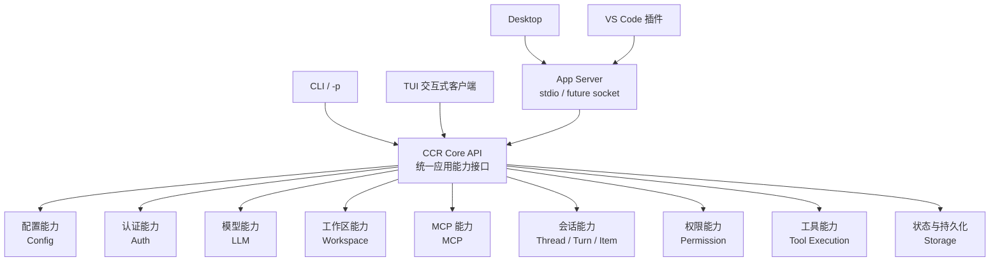

# CCR Core 统一对外接口边界

## 1. 文档目标

本文档用于修正 App Server / Desktop / VS Code 接入过程中的一个关键架构边界：

```text
CCR 只能有一套 Core 能力接口。
CLI / TUI / App Server / Desktop / VS Code 都只是不同入口。
入口层不能各自重新实现模型、会话、权限、MCP、文件和工具执行。
```

这不是单纯的 LLM 调用统一，而是所有产品能力都要统一到 `CCR Core` 的应用能力层。

## 2. 核心结论

CCR 的长期形态应该是：



关键点：

- `CCR Core API` 是唯一应用能力入口。
- `App Server` 只是把 Core API 映射成 JSON-RPC 协议。
- `Desktop / VS Code` 不直接读 token、不直接执行命令、不直接访问内部源码模块。
- `CLI / TUI` 也不应该长期绕过 Core API 调一套旧链路。
- 如果暂时存在旧链路，必须把它标成“迁移中的实现细节”，不能继续扩大。

## 3. 入口层与 Core 层边界

## 3.1 入口层职责

入口层只负责：

- 参数解析。
- UI 渲染。
- 协议收发。
- 用户交互。
- 进程生命周期。
- 把用户操作转换成 Core API 请求。
- 把 Core API 事件转换成当前入口可展示的事件。

入口层不得负责：

- 自己判断 provider 请求格式。
- 自己读写 OAuth token。
- 自己拼模型请求 body。
- 自己决定工具权限是否放行。
- 自己管理 MCP server 连接生命周期。
- 自己实现 workspace trust 规则。
- 自己绕过 Core 的 session / turn 状态机。

## 3.2 Core 层职责

Core 层负责：

- 统一配置读取与写入。
- 统一认证与凭据状态。
- 统一 provider / model 选择。
- 统一 LLM 请求、流式输出、重试、错误归一。
- 统一 workspace 打开、信任、安全边界。
- 统一 MCP 配置读取、连接、工具注册。
- 统一 Thread / Turn / Item 会话状态。
- 统一工具执行与权限请求。
- 统一中断、恢复、持久化和回放。

## 4. 建议的 Core API 分层

第一版可以先不用一次性重构完整 Core，但要先固定边界。

```text
src/core/
  index.ts
  coreContext.ts
  services/
    configCore.ts
    authCore.ts
    modelCore.ts
    workspaceCore.ts
    mcpCore.ts
    sessionCore.ts
    turnCore.ts
    permissionCore.ts
```

如果短期不想新增 `src/core/`，也可以先放在：

```text
src/services/core/
```

但不管目录叫什么，原则必须一致：入口层只依赖 Core API，不直接调用底层散模块。

## 5. 第一批统一能力接口

## 5.1 配置能力

职责：

- 读取当前 LLM provider / model。
- 更新 provider / model。
- 返回配置路径和来源。
- 校验 provider 是否注册。

建议接口：

```ts
type CoreConfigService = {
  getConfig(): CoreConfigSnapshot
  updateConfig(update: CoreConfigUpdate): Promise<CoreConfigSnapshot>
}
```

已有可复用来源：

- `src/services/llm/llmConfig.ts`
- `src/services/llm/runtimeStatus.ts`

入口映射：

- CLI/TUI 的模型显示。
- App Server 的 `config/get`、后续 `config/update`。
- Desktop / VS Code 的设置页。

## 5.2 认证能力

职责：

- 返回当前 provider 的认证状态。
- 启动登录。
- 刷新凭据。
- 清理凭据。
- 禁止向入口返回 token 明文。

建议接口：

```ts
type CoreAuthService = {
  getStatus(provider?: string): Promise<CoreAuthStatus>
  startLogin(provider: string): Promise<CoreLoginStartResult>
  clearCredential(provider: string): Promise<void>
}
```

已有可复用来源：

- `src/services/llm/sessions/CodexOAuthSession.ts`
- `src/services/llm/runtimeStatus.ts`
- `src/cli/handlers/auth.ts`

入口映射：

- TUI 登录页。
- CLI `login`。
- App Server `auth/status`、后续 `auth/login/start`。
- Desktop / VS Code 登录入口。

## 5.3 模型能力

职责：

- 列出 provider。
- 列出模型。
- 返回上下文窗口、输出上限、工具能力、reasoning 能力。
- 统一模型别名和默认模型。

建议接口：

```ts
type CoreModelService = {
  listModels(filter?: CoreModelFilter): CoreModelListResult
  resolveModel(input: CoreModelResolveInput): CoreResolvedModel
}
```

已有可复用来源：

- `src/services/llm/modelCatalog.ts`
- `src/services/llm/providerDefinitions.ts`
- `src/services/llm/defaultRuntime.ts`

## 5.4 工作区能力

职责：

- 打开 workspace。
- 校验路径。
- 维护 trust 状态。
- 返回 git / cwd / 项目状态。
- 禁止打开 workspace 时自动执行项目脚本。

建议接口：

```ts
type CoreWorkspaceService = {
  openWorkspace(input: CoreWorkspaceOpenInput): Promise<CoreWorkspaceSnapshot>
  getWorkspace(): CoreWorkspaceSnapshot | null
}
```

入口映射：

- TUI workspace trust。
- App Server `workspace/open`。
- Desktop / VS Code 的打开目录流程。

## 5.5 MCP 能力

职责：

- 读取 MCP 配置。
- 管理 MCP server 生命周期。
- 汇总 MCP tools/resources/prompts。
- 做敏感字段脱敏。
- 后续支持安装、本地 `.ccr/mcp/`、npm/npx、禁用和启用。

建议接口：

```ts
type CoreMcpService = {
  listServers(options?: CoreMcpListOptions): Promise<CoreMcpListResult>
  connectServers(options?: CoreMcpConnectOptions): Promise<CoreMcpRuntimeSnapshot>
}
```

已有可复用来源：

- `src/services/mcp/config.ts`
- `src/services/mcp/`
- `src/entrypoints/mcp.ts`

## 5.6 会话能力

职责：

- 创建 thread。
- 列出 thread。
- 恢复 thread。
- 启动 turn。
- 中断 turn。
- 将模型、工具、权限、系统事件统一转成 Core 事件流。

建议接口：

```ts
type CoreSessionService = {
  startThread(input: CoreThreadStartInput): Promise<CoreThread>
  listThreads(): Promise<CoreThread[]>
  startTurn(input: CoreTurnStartInput): AsyncIterable<CoreTurnEvent>
  interruptTurn(input: CoreTurnInterruptInput): Promise<CoreInterruptResult>
}
```

入口映射：

- TUI 主会话。
- CLI `-p`。
- App Server `thread/start`、`turn/start`、`turn/interrupt`。
- Desktop / VS Code 聊天面板。

## 5.7 权限能力

职责：

- 统一工具权限请求。
- 统一 allow / deny / always / session 这类决策。
- 统一危险命令策略。
- 不允许 App Server 或 Desktop 绕过权限系统。

建议接口：

```ts
type CorePermissionService = {
  requestPermission(input: CorePermissionRequest): Promise<CorePermissionDecision>
  respondPermission(input: CorePermissionResponse): Promise<void>
}
```

已有可复用来源：

- `src/cli/structuredIO.ts`
- `src/hooks/useCanUseTool.ts`
- `src/utils/permissions/`

## 5.8 工具执行能力

职责：

- 统一工具注册。
- 统一工具调用。
- 统一工具结果。
- 统一工具错误。
- 统一 tool permission。

建议接口：

```ts
type CoreToolService = {
  listTools(context: CoreToolContext): Promise<CoreToolDefinition[]>
  executeTool(input: CoreToolExecuteInput): AsyncIterable<CoreToolEvent>
}
```

已有可复用来源：

- `src/Tool.ts`
- `src/services/tools/`
- `src/tools/`
- `src/services/mcp/`

## 6. App Server 的正确位置

App Server 不是 Core。

App Server 应该只做：

```text
JSON-RPC request
  -> 参数 schema 校验
  -> 调用 Core API
  -> 把 Core result / Core event 翻译成 JSON-RPC response / notification
```

示例：

```text
App Server config/get
  -> core.config.getConfig()
  -> JSON-RPC result

App Server turn/start
  -> core.session.startTurn()
  -> turn/started、item/delta、permission/requested、turn/completed
```

App Server 不应该：

- 直接构造 provider 请求。
- 直接读 `CodexOAuthSession` token。
- 直接调用底层 `LlmRuntime.stream` 并绕过主链路策略。
- 直接做工具执行。
- 自己发明权限状态机。

## 7. 迁移策略

因为当前项目是从 sourcemap 恢复并逐步重构，不建议一次性大爆炸重写。

推荐顺序：

1. 先新增 Core API 门面，第一批只是包住现有实现。
2. App Server handler 改为只调用 Core API。
3. CLI/TUI 中已经稳定的调用链先不强拆，但新增代码不得绕过 Core API。
4. 每迁移一个能力，就把旧入口逻辑改成调用 Core API。
5. 最终 CLI/TUI/App Server/Desktop/VS Code 全部落到同一套 Core use-case。

第一批最小迁移：

- `config/get` -> `core.config.getConfig()`
- `auth/status` -> `core.auth.getStatus()`
- `model/list` -> `core.model.listModels()`
- `mcp/list` -> `core.mcp.listServers()`
- `workspace/open` -> `core.workspace.openWorkspace()`
- `thread/start` / `turn/start` -> `core.session.*`

## 8. P7 纠偏要求

P7 继续前必须满足：

- 不再把 `AppServerSessionManager` 当成真正 Core session。
- 不再让 `textOnlyTurnRunner` 成为第二条长期模型调用链。
- App Server 的 session manager 最多是协议态缓存，不是 Core 状态权威。
- 真正的 turn 执行应由 Core session/turn service 提供。
- 如果第一版仍使用 text-only runner，它也必须挂在 Core service 后面，而不是 App Server 自己私有实现。

换句话说：

```text
错误方向：
App Server -> AppServerSessionManager -> textOnlyTurnRunner -> LLM Runtime

正确方向：
App Server -> CoreSessionService -> CoreTurnRunner -> 现有 query / LLM / tool / permission 主链路
```

## 9. 完成判断

本架构边界落地后，后续每新增一个入口或能力，都要回答：

- 这个能力是否已经存在 Core API？
- 如果存在，入口是否只是在调用 Core API？
- 如果不存在，是不是应该先补 Core API，而不是入口私有实现？
- 这个能力是否会读写 token、执行命令、访问文件、连接 MCP、调用模型？
- 如果会，它是否走了统一权限和状态机？

只要答案不清楚，就先停下来补 Core 边界，不能继续在入口层堆逻辑。
