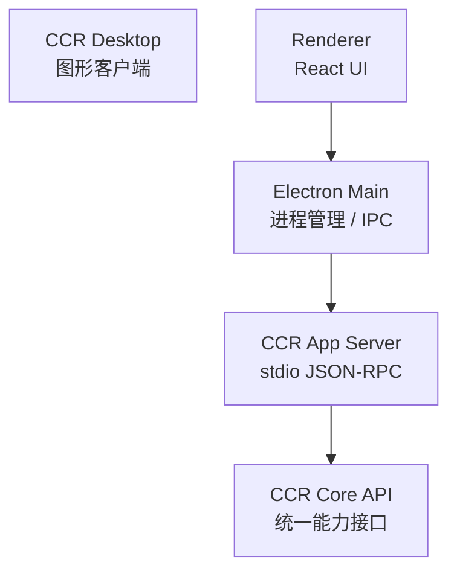
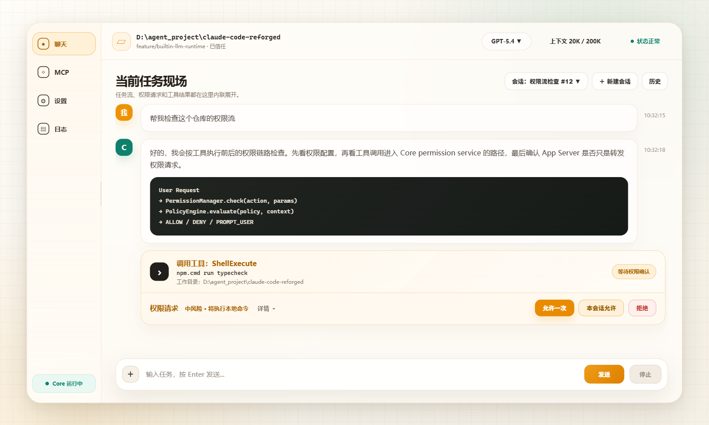
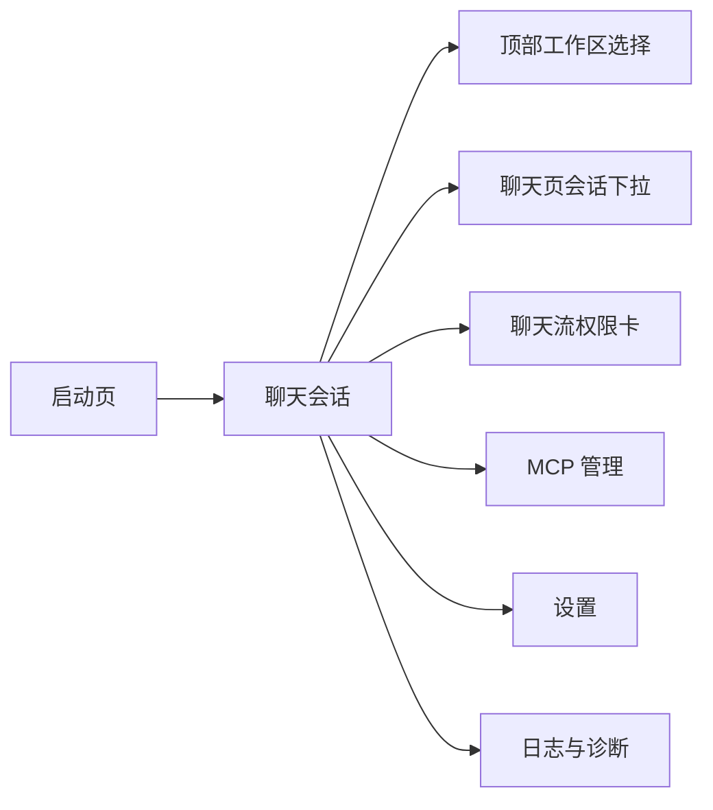
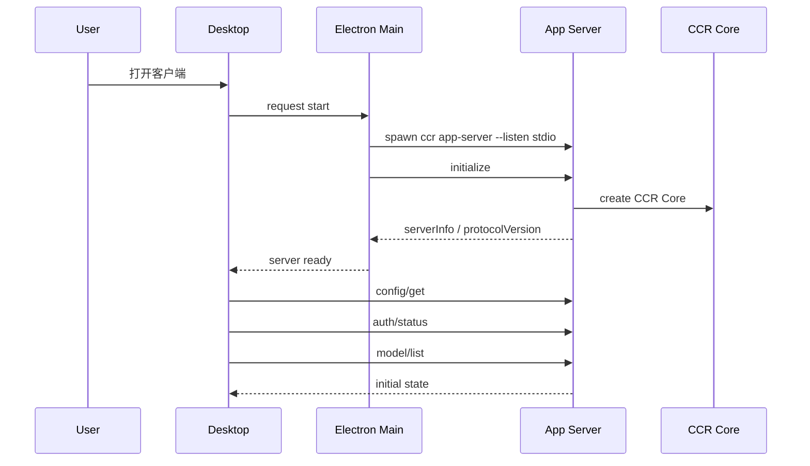
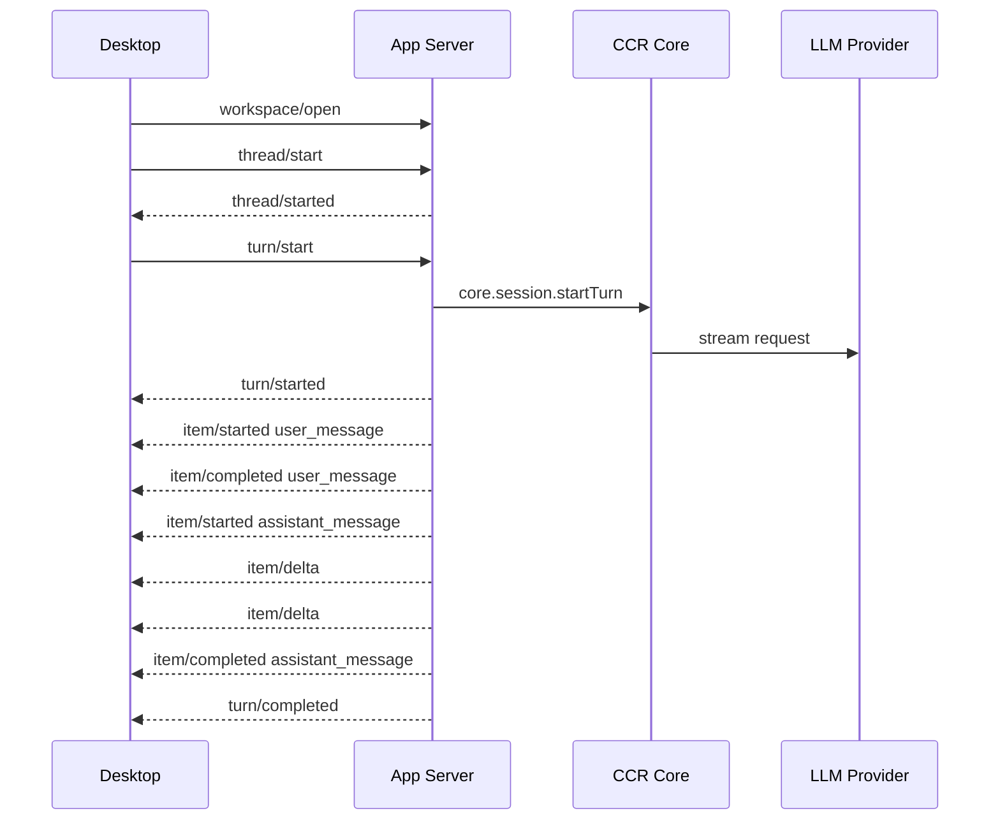
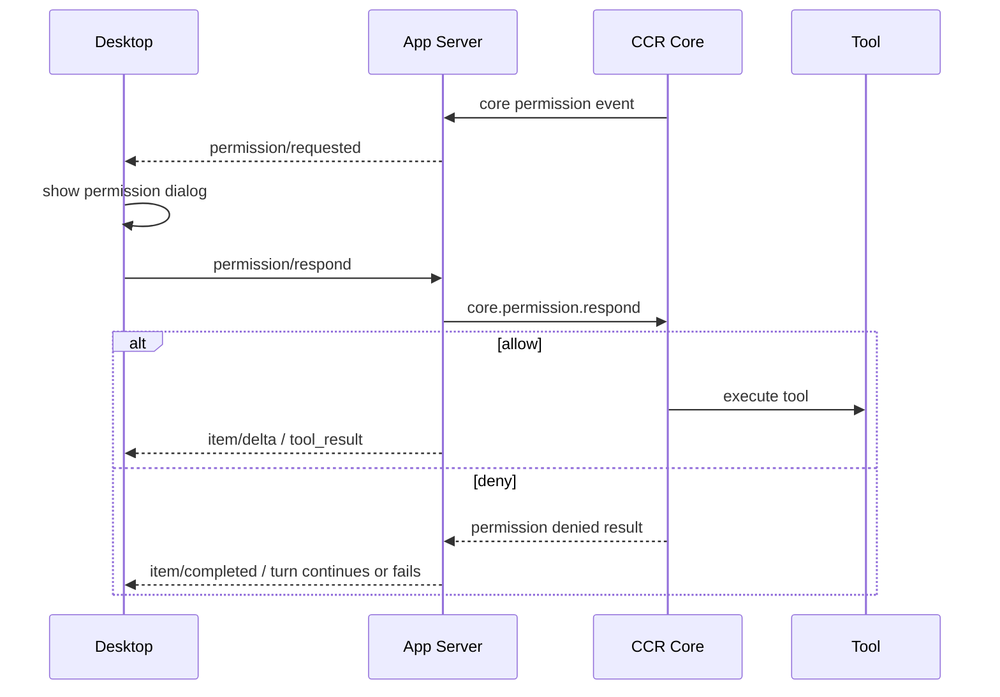

# CCR 客户端产品与交互设计

## 1. 文档目标

本文档用于先行设计 `CCR Desktop` 客户端的产品形态和交互流程，再反推 `App Server` 需要补齐的协议能力。

核心原则：

```text
客户端不是另一套 Agent。
客户端只是 CCR Core 的图形入口。
所有业务能力必须通过 App Server 协议进入 CCR Core。
```

这里说的客户端第一版主要指 `Desktop`，但设计时要兼顾后续 `VS Code 插件` 和 `Local Web` 复用同一套协议。

---

## 2. 客户端定位

CCR 客户端的定位是：

```text
面向人的图形控制台。
```

它负责：

- 管理工作区。
- 展示登录状态。
- 选择 provider 和 model。
- 发起会话和一轮请求。
- 展示模型流式输出。
- 展示工具调用过程。
- 弹出权限确认。
- 管理 MCP。
- 查看日志和诊断信息。

它不负责：

- 直接读写 OAuth token。
- 直接拼模型请求。
- 直接执行命令。
- 直接连接 MCP server。
- 直接调用 `src/services/*` 内部模块。
- 自己实现 Thread / Turn / Item 状态机。
- 自己实现权限判断。

正确关系：



---

## 3. 第一版产品目标

第一版目标不是做完整 IDE，也不是一次性追平终端 TUI。

第一版目标是：

```text
让用户能在图形界面里完成一次真实的 CCR 会话。
```

最小闭环：

1. 打开客户端。
2. 客户端启动内置 `ccr app-server --listen stdio`。
3. 客户端完成 `initialize`。
4. 客户端读取配置和登录状态。
5. 用户选择或确认 workspace。
6. 用户进入聊天页面。
7. 用户发送一条消息。
8. 客户端展示 `item/delta` 流式输出。
9. 如果工具需要权限，客户端弹窗确认。
10. Turn 完成后展示最终状态。

---

## 4. 第一版非目标

第一版暂不做：

- 多窗口共享同一个后台 daemon。
- 多 workspace 同时运行。
- 多 thread 并发运行。
- 完整 IDE 级 diff 编辑器。
- 插件市场 UI。
- 远程云端会话同步。
- 账号体系和云同步。
- App Server websocket 模式。
- Core runtime 独立热更新。

这些能力后续可以做，但不能压到第一版里。

---

## 5. 客户端信息架构

第一版信息架构先保持克制，不把同一条任务流拆成多个一级入口。

```text
左侧一级入口：
  聊天
  MCP
  设置
  日志

顶部状态条：
  当前工作区
  模型选择
  上下文用量
  认证状态
  App Server 状态

聊天页内部：
  当前任务现场
  会话下拉
  新建会话
  历史会话
  工具调用卡
  权限请求卡
  输入框
```

第一版不做常驻右侧面板。模型详情、工具详情、权限详情、错误详情优先在主任务流卡片内展开；后续如果需要右侧区域，再单独用于文件树、diff 预览、任务计划或上下文文件。

最终主界面如下：



对应的可维护视觉稿源文件是：

- [CCR Desktop 主工作台最终版 HTML 视觉稿](./assets/ccr-desktop-main-workbench-clean.html)

最终版方向：浅色主工作台、自适应侧栏、顶部只保留工作区、模型、上下文用量和一个合并后的 `状态正常` 入口。`Codex OAuth`、`App Server`、`Core` 等系统细节只在状态详情里展示，避免占据主界面。

侧栏交互规则：

- 默认展开宽度建议 `160px - 180px`，显示图标和文字。
- 折叠宽度建议 `72px - 88px`，只显示图标，悬停显示 tooltip。
- 侧栏右边缘支持拖动调整宽度，拖动范围建议 `72px - 240px`。
- 用户手动折叠、展开或拖动后的宽度应写入本地 UI 配置，下一次启动恢复。
- 侧栏不是工作区入口，工作区始终在顶部状态条展示和切换。

导航关系：



---

## 6. 页面设计

## 6.1 启动页

启动页目标：

- 展示 CCR Desktop 正在启动。
- 展示 App Server 连接状态。
- 如果启动失败，给出可操作错误。

页面状态：

| 状态 | 说明 |
| --- | --- |
| `starting` | 正在启动 app-server |
| `initializing` | 已连接，正在 initialize |
| `ready` | 初始化完成 |
| `failed` | 启动失败 |

关键 UI：

```text
CCR Desktop
正在启动 CCR Core...

状态：
  App Server: starting
  Core: unknown
  Protocol: unknown
```

需要的 App Server 协议：

- `initialize`
- `shutdown`

失败时要展示：

- app-server 退出码。
- stderr 脱敏尾部。
- 当前使用的 core 路径。
- 建议操作，例如重试、打开日志、切换外部 runtime。

## 6.2 工作区选择页

目标：

- 选择项目目录。
- 明确 workspace trust。
- 不在用户确认前执行项目脚本。

关键 UI：

```text
选择工作区

[选择文件夹]

安全确认：
  这个目录是否是你信任的项目？

[信任并打开] [取消]
```

需要的 App Server 协议：

- `workspace/open`

后续增强：

- 最近打开列表。
- Git 分支显示。
- 项目类型识别。
- workspace 风险提示。

## 6.3 聊天会话页

这是第一版核心页面。

推荐布局：

```text
┌─────────────────────────────────────────────────────────────┐
│ 顶栏：workspace / model / context usage / auth / app server  │
├───────────────┬─────────────────────────────────────────────┤
│ 左侧导航      │ 主聊天区                                     │
│ 聊天          │ 当前任务现场                                 │
│ MCP           │ 会话：权限流检查 #12 ▼ / 新建会话 / 历史     │
│ 设置          │ user message                                 │
│ 日志          │ assistant delta                              │
│               │ tool call card                               │
│               │ permission request card                      │
├───────────────┴─────────────────────────────────────────────┤
│ 输入框：[+] / 输入任务 / 发送 / 停止                         │
└─────────────────────────────────────────────────────────────┘
```

顶部状态条建议：

```text
D:\agent_project\xxx    GPT-5.4 ▼    上下文 20K / 200K    Codex OAuth 已连接    App Server 就绪
```

底部输入框只保留一个简单 `+`，不要写成 `+ 上下文`。`+` 的含义是添加内容，点击后再展开具体菜单：

```text
引用工作区文件
选择本地文件
粘贴文本
添加图片
```

主聊天区显示对象：

| 对象 | UI 表现 |
| --- | --- |
| `user_message` | 用户气泡 |
| `assistant_message` | 助手流式文本 |
| `tool_call` | 工具调用卡片 |
| `tool_result` | 工具结果折叠卡片 |
| `permission_request` | 权限提示卡片 |
| `system_event` | 灰色系统提示 |
| `error` | 红色错误块 |

需要的 App Server 协议：

- `thread/start`
- `thread/list`
- `thread/resume`
- `turn/start`
- `turn/interrupt`
- `item/delta` notification
- `item/completed` notification
- `turn/completed` notification
- `turn/failed` notification

第一版输入框只做文本：

```text
+ button + textarea + send button + stop button
```

第一版可以只让 `+` 支持引用工作区文件和选择文本文件；图片、目录批量选择、paste store 后续再加。

## 6.4 权限弹窗

目标：

- 所有危险工具执行都必须经过用户确认。
- 客户端只展示和回传决定，不自己判断安全。

权限弹窗内容：

```text
工具请求权限

工具：Bash
命令：npm.cmd run test
风险：将执行本地命令
工作区：D:\agent_project\claude-code-reforged

[允许一次] [本会话允许] [拒绝]
```

权限决策：

| 决策 | 含义 |
| --- | --- |
| `allow_once` | 只允许当前这次调用 |
| `allow_session` | 当前 thread/session 内允许 |
| `deny` | 拒绝 |
| `cancel_turn` | 拒绝并中断当前 turn |

需要的 App Server 协议：

- `permission/requested` notification
- `permission/respond`
- `permission/cancelled` notification

安全不变式：

```text
权限判断属于 Core。
权限展示属于客户端。
权限结果通过 App Server 回到 Core。
```

## 6.5 模型与认证设置页

目标：

- 展示当前 provider / model。
- 展示登录状态。
- 支持切换模型。
- 支持触发登录。

关键 UI：

```text
模型设置

Provider: Codex OAuth
Model: GPT-5.4
状态：已登录
账号：acct_****9ddd

[切换模型]
[重新登录]
[清除凭据]
```

需要的 App Server 协议：

- `config/get`
- `config/update`
- `auth/status`
- `auth/login/start`
- `auth/logout` 或 `auth/clear`
- `model/list`

注意：

- 不展示 token。
- 不展示 refresh token。
- 账号只展示脱敏信息。
- 登录流程由 Core 管理，客户端只触发。

## 6.6 MCP 管理页

目标：

- 展示当前 MCP 配置。
- 支持启用或禁用 MCP。
- 支持添加 Playwright MCP 预设。
- 后续支持 `.ccr/mcp/` 管理式安装。

第一版 UI：

```text
MCP 管理

已配置：
  playwright
    类型：stdio
    命令：npx.cmd -y @playwright/mcp@latest
    状态：未连接

[添加 Playwright MCP]
[刷新]
```

需要的 App Server 协议：

- `mcp/list`
- `mcp/addPreset`
- `mcp/update`
- `mcp/remove`
- `mcp/testConnection`

第一版可以只做 `mcp/list` 和 `mcp/addPreset`。

## 6.7 日志与诊断页

目标：

- 帮用户和开发者快速定位问题。
- 不泄露凭据。

显示内容：

- App Server 启动参数。
- Core version。
- protocol version。
- 当前 provider / model。
- 当前 workspace。
- 最近错误。
- 网络诊断摘要。

需要的 App Server 协议：

- `server/log` notification
- `diagnostics/get`
- `diagnostics/network/check`

第一版可以先只显示本地收集到的 stdout/stderr 和 App Server event。

---

## 7. 客户端状态模型

客户端本地可以维护 UI 状态，但业务权威状态仍在 Core。

建议状态模型：

```ts
type ClientState = {
  server: ServerState
  workspace: WorkspaceState
  llm: LlmState
  session: SessionState
  permissions: PermissionState
  mcp: McpState
  ui: UiState
}
```

## 7.1 ServerState

```ts
type ServerState = {
  status: 'starting' | 'initializing' | 'ready' | 'failed' | 'stopped'
  protocolVersion?: string
  coreVersion?: string
  ccrHome?: string
  error?: ClientError
}
```

## 7.2 WorkspaceState

```ts
type WorkspaceState = {
  path: string | null
  trusted: boolean
  git?: {
    isGit: boolean
    branch?: string
  }
}
```

## 7.3 LlmState

```ts
type LlmState = {
  provider: string
  model: string
  authState: 'missing' | 'configured' | 'available'
  availableModels: ModelDescriptor[]
}
```

## 7.4 SessionState

```ts
type SessionState = {
  threads: ThreadView[]
  activeThreadId: string | null
  activeTurnId: string | null
  itemsByTurnId: Record<string, ItemView[]>
}
```

## 7.5 PermissionState

```ts
type PermissionState = {
  pending: PermissionRequestView[]
}
```

注意：

```text
这些状态只是 UI cache。
重新连接、刷新、恢复时必须以 App Server / Core 返回为准。
```

---

## 8. 客户端启动流程

Desktop 第一版启动流程：



启动失败处理：

| 失败点 | 客户端动作 |
| --- | --- |
| 找不到 core | 提示重新安装或选择 runtime 路径 |
| app-server 启动失败 | 展示 stderr 脱敏尾部 |
| initialize 超时 | 提供重试和查看日志 |
| protocol 不兼容 | 提示升级 Desktop 或 Core |
| config 读取失败 | 进入修复配置页 |

---

## 9. 会话流程



客户端处理规则：

- `turn/start` response 只代表 turn 已创建，不代表完成。
- UI 输出只根据 notification 更新。
- `item/delta` 要按 `itemId` 拼接。
- `turn/failed` 要展示错误块，并保留用户输入。
- `turn/interrupt` 后输入框恢复可编辑。

---

## 10. 权限流程

P8 需要优先支持这条流程。



P8 最小协议需求：

```ts
type PermissionRequestedNotification = {
  method: 'permission/requested'
  params: {
    permissionRequestId: string
    threadId: string
    turnId: string
    tool: {
      name: string
      description?: string
    }
    risk: {
      level: 'low' | 'medium' | 'high'
      reason: string
    }
    preview?: {
      command?: string
      path?: string
      diff?: string
    }
  }
}
```

```ts
type PermissionRespondRequest = {
  method: 'permission/respond'
  params: {
    permissionRequestId: string
    decision: 'allow_once' | 'allow_session' | 'deny' | 'cancel_turn'
  }
}
```

---

## 11. App Server 反推需求

根据客户端设计，App Server 需要按优先级补齐这些能力。

## 11.1 已具备

| 能力 | 状态 |
| --- | --- |
| `initialize` | 已有 |
| `shutdown` | 已有 |
| `config/get` | 已有 |
| `auth/status` | 已有 |
| `model/list` | 已有 |
| `mcp/list` | 已有 |
| `workspace/open` | 已有 |
| `thread/start` | 已有 |
| `thread/list` | 已有 |
| `turn/start` | 已有，P7 已跑通真实 Codex OAuth |
| `turn/interrupt` | 已有第一版 |

## 11.2 P8 必须补

| 能力 | 用途 |
| --- | --- |
| `permission/requested` | Core 请求用户授权工具 |
| `permission/respond` | 客户端回传用户选择 |
| `permission/cancelled` | Turn 结束或中断导致权限请求失效 |
| `waiting_permission` turn 状态 | UI 展示当前卡住原因 |

## 11.3 P9 前建议补

| 能力 | 用途 |
| --- | --- |
| `config/update` | 客户端设置 provider / model |
| `auth/login/start` | 客户端触发 Codex OAuth 登录 |
| `auth/clear` | 清理凭据 |
| `mcp/addPreset` | 添加 Playwright MCP |
| `diagnostics/get` | 日志页和报错排查 |
| `runtime/status` | 展示 core 路径、版本、启动方式 |

---

## 12. Desktop 进程架构

推荐 Electron 第一版：

```text
apps/desktop/
  main/
    main.ts
    appServerProcess.ts
    appServerClient.ts
    ipc.ts
  preload/
    index.ts
  renderer/
    App.tsx
    pages/
      StartupPage.tsx
      WorkspacePage.tsx
      ChatPage.tsx
      SettingsPage.tsx
      McpPage.tsx
      LogsPage.tsx
    components/
      ChatTimeline.tsx
      PermissionDialog.tsx
      ModelPicker.tsx
```

职责：

| 层 | 职责 |
| --- | --- |
| Main | spawn app-server、stdio JSON-RPC、文件选择、系统通知 |
| Preload | 暴露安全 IPC API |
| Renderer | React UI、状态展示、用户交互 |
| App Server | 协议入口 |
| Core | 真实业务能力 |

Renderer 禁止：

- 使用 Node `fs`。
- 使用 Node `child_process`。
- 直接读 `~/.ccr/data/codex-oauth.json`。
- 直接请求 LLM。

---

## 13. 客户端 API 封装

Desktop main 进程里建议封装一个 `AppServerClient`。

```ts
type AppServerClient = {
  initialize(): Promise<InitializeResult>
  shutdown(): Promise<void>
  getConfig(): Promise<ConfigSnapshot>
  getAuthStatus(): Promise<AuthStatus>
  listModels(): Promise<ModelListResult>
  openWorkspace(input: WorkspaceOpenInput): Promise<WorkspaceSnapshot>
  startThread(input: ThreadStartInput): Promise<Thread>
  startTurn(input: TurnStartInput): Promise<Turn>
  interruptTurn(input: TurnInterruptInput): Promise<void>
  respondPermission(input: PermissionRespondInput): Promise<void>
  onNotification(listener: (event: AppServerNotification) => void): () => void
}
```

Renderer 不直接接触 JSON-RPC 行协议，只调用 preload 暴露的高层方法。

---

## 14. 错误展示设计

客户端需要把错误分成几类，避免所有错误都弹一个红框。

| 错误类型 | UI 处理 |
| --- | --- |
| App Server 启动失败 | 启动页错误，提供重试和日志 |
| 协议错误 | 弹开发者错误，建议升级 |
| 未登录 | 设置页提示登录 |
| 网络失败 | 聊天页错误块，日志页显示诊断 |
| 权限拒绝 | 工具卡片显示已拒绝 |
| 工具执行失败 | 工具结果卡片显示 stderr 摘要 |
| 模型失败 | assistant 错误消息 |

错误展示必须脱敏：

- 不展示 access token。
- 不展示 refresh token。
- 不展示完整 headers。
- 不展示完整环境变量。

---

## 15. 第一版 UI 骨架建议

第一版可以先做朴素但完整的骨架。

页面顺序：

1. `StartupPage`
2. `WorkspacePage`
3. `ChatPage`
4. `SettingsPage`
5. `McpPage`
6. `LogsPage`

第一版 ChatPage 必须有：

- 当前 workspace。
- 当前 provider / model。
- 当前上下文用量，例如 `上下文 20K / 200K`。
- 登录状态。
- 会话下拉和历史入口。
- 消息时间线。
- 输入框。
- 输入框左侧简单 `+` 添加入口。
- 停止按钮。
- 聊天流内嵌权限请求卡。

可以后置：

- 精美主题。
- 多 Tab。
- 复杂 diff。
- 拖拽附件。
- 消息搜索。
- 常驻右侧面板。

---

## 16. 与 P8/P9 的关系

当前 `App Server Todo` 已完成 P7，下一步是 P8。

客户端设计对 P8 的要求：

```text
没有权限闭环，Desktop 只能聊天，不能安全执行工具。
所以 P8 是 Desktop 前的必要条件。
```

P8 完成后再进入 P9：

```text
P9 不一定马上做完整 Desktop。
P9 先做 app-server client SDK + 极薄测试客户端。
```

推荐 P9 最小验证方式：

- 先写 Node 版 `app-server-client`。
- 用它跑 `initialize -> workspace/open -> thread/start -> turn/start`。
- 再接 Electron main。
- 最后接 React renderer。

---

## 17. 第一版验收标准

客户端第一版可以按下面标准验收：

- 能启动内置 App Server。
- 能显示 coreVersion 和 protocolVersion。
- 能读取当前登录状态。
- 能读取当前 provider / model。
- 能打开 workspace。
- 能创建 thread。
- 能发送一条消息。
- 能展示流式输出。
- 能中断 turn。
- 能展示 permission/requested 并回传 permission/respond。
- 能展示 turn/failed 错误。
- 不泄露 token。
- 退出时能关闭 app-server 子进程。

---

## 18. 设计结论

当前最合理顺序是：

```text
1. 先用本文档固定客户端交互和协议需求。
2. 继续完成 P8 权限闭环。
3. P9 做 App Server Client SDK 和极薄 Desktop 原型。
4. Desktop 原型跑通后，再做正式 UI。
```

这样客户端不会凭空设计，App Server 也不会闭门造一堆用不上的接口。
