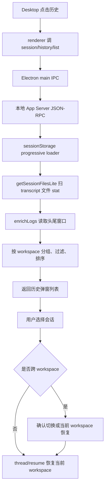

# CCR Desktop 历史会话设计

## 目标

Desktop 的“历史会话”要做成一个可恢复、可搜索、按工作空间分组的历史入口，而不是把当前运行中的 thread 列表简单展示出来。

第一版目标：

- 历史入口放在弹窗里，不再把列表塞进聊天时间线。
- 默认展示当前 workspace 或同仓库 worktree 的历史。
- 支持切到“全部项目”，按 workspace 折叠展示历史会话。
- 每个会话必须有可读标题，优先级为用户自定义标题、AI 标题、最近用户问题、首个用户问题、session 短号。
- 恢复历史会话时，使用 transcript 对应的 `sessionId` 和路径信息恢复，而不是新建越来越多的空会话。

这里的“后端”特指 Desktop 启动的本地 App Server，也就是：

```text
Desktop renderer
-> Electron main IPC
-> 本地 App Server JSON-RPC
-> CCR Core / sessionStorage / transcript 文件
```

它不是远端服务，也不是 ChatGPT 后端。

## 当前问题

当前 Desktop 历史会话的问题本质上是数据源和语义边界混了：

- `thread/list` 原本更像“当前 App Server 运行态 thread 列表”，适合展示正在运行、已加载、可订阅状态的 thread。
- 原生 `/resume` 的历史不是运行态 thread，而是磁盘 transcript 文件索引。
- 之前把 `loadMessageLogs(50)` fake 成 `CoreThread` 合并进 `thread/list`，只能让界面看起来有历史，但没有 workspace 分组、跨项目范围、分页、搜索、恢复路径这些关键语义。
- 新建会话后历史里看不到，说明不能只依赖当前进程内存或临时合并结果，必须回到 transcript 持久化索引。

因此，后续应该把 `thread/list` 收回运行态语义，新增一个专门的历史查询 API。

## 原生 Resume 链路

原生 TUI 的 `/resume` 已经有可复用的历史读取链路：

1. `src/main.tsx`
   - 当用户传 `--resume` 但没有指定明确 session 时，进入 `launchResumeChooser(...)`。
   - 它传入 `getWorktreePaths(getOriginalCwd())`，所以默认范围是当前仓库和同仓库 worktree。

2. `src/screens/ResumeConversation.tsx`
   - 初始加载调用 `loadSameRepoMessageLogsProgressive(worktreePaths)`。
   - 用户切换全部项目时调用 `loadAllProjectsMessageLogsProgressive()`。
   - 选择某条历史后调用 `loadConversationForResume(log, undefined)`。
   - 跨项目恢复时会走 `checkCrossProjectResume(...)`，不是静默切错 workspace。

3. `src/utils/sessionStorage.ts`
   - `getSessionFilesLite(projectDir, ...)` 先按文件 stat 生成轻量 `LogOption`，不读完整会话。
   - `enrichLogs(...)` 再对可见条目做渐进增强。
   - `readLiteMetadata(...)` 只读 JSONL 文件头尾窗口，提取 `firstPrompt`、`lastPrompt`、`customTitle`、`aiTitle`、`projectPath`、`gitBranch` 等字段。
   - `customTitle` 优先于 `aiTitle`，标题不需要 Desktop 重新发明一套。

结论：Desktop 历史会话应该复用 `LogOption` 和 sessionStorage 的 progressive loading 思路，而不是从 `CoreThread` 反推历史。

## 对照项目

### Codex

Codex 的 App Server `thread/list` 对接的是持久化 thread store：

- `codex-rs/app-server/src/codex_message_processor.rs`
- `thread_list_response(...)` 接收 `cursor`、`limit`、排序、`cwd`、`archived`、`search_term` 等参数。
- `list_threads_common(...)` 调用 `thread_store.list_threads(...)` 做分页和过滤。
- 运行态 status 只是后来用 `thread_watch_manager.loaded_statuses_for_threads(...)` 叠加到持久化结果上。

这说明历史列表应该有自己的持久化查询模型；运行态只是补状态，不应该成为历史的唯一来源。

### OpenClaw

OpenClaw 有两类路径：

- Anthropic CLI backend 通过 `resumeArgs: ["--resume", "{sessionId}"]` 把恢复交给 Claude CLI 自己处理。
- ACPX runtime 使用 `createFileSessionStore({ stateDir })` 维护自己的文件会话存储。

这说明 OpenClaw 没有把所有 agent 的历史都塞进某个当前内存列表；它要么尊重外部 CLI 的 resume 协议，要么维护自己的 session store。

## 产品形态

历史会话弹窗按“项目 / 会话”两级组织：

```text
历史会话
├─ 当前项目 D:\agent_project\claude-code-reforged
│  ├─ 帮我分析上下文压缩为什么这么困难    6 小时前
│  ├─ CCR Desktop 交互卡片补齐专项        1 天前
│  └─ App Server 会话 API 设计            3 天前
├─ D:\agent_project\java_workspace
│  └─ 设计 Kafka 0.11 转发方案            1 周前
└─ D:\learn_code\harness-agent-lab
   └─ long-running-runtime todo 推进       2 周前
```

交互规则：

- 弹窗顶部提供搜索框。
- 提供范围切换：`当前项目`、`全部项目`。
- 默认展开当前 workspace，其他 workspace 折叠。
- 搜索命中时自动展开对应 workspace。
- 列表项显示标题、更新时间、消息数、workspace 名称、sessionId 短号。
- 当前会话可以显示但要标记“当前”，默认不能重复恢复成新 thread。
- 跨 workspace 恢复时必须提示：继续在当前 workspace 恢复，还是切换到原 workspace 后恢复。

## API 方案

新增本地 App Server JSON-RPC 方法，建议命名为 `session/history/list`，不要继续污染 `thread/list`。

请求：

```ts
type SessionHistoryListParams = {
  scope?: 'sameRepo' | 'allProjects'
  query?: string
  limit?: number
  cursor?: string
  includeCurrent?: boolean
}
```

响应：

```ts
type SessionHistoryListResponse = {
  groups: SessionHistoryWorkspaceGroup[]
  nextCursor?: string
}

type SessionHistoryWorkspaceGroup = {
  workspacePath: string
  workspaceName: string
  isCurrentWorkspace: boolean
  updatedAt: string
  sessionCount: number
  sessions: SessionHistoryItem[]
}

type SessionHistoryItem = {
  sessionId: string
  title: string
  titleSource: 'customTitle' | 'aiTitle' | 'lastPrompt' | 'firstPrompt' | 'fallback'
  firstPrompt?: string
  lastPrompt?: string
  summary?: string
  createdAt: string
  updatedAt: string
  messageCount: number
  projectPath?: string
  transcriptPath?: string
  isCurrentSession: boolean
}
```

恢复接口需要跟着补强。当前 `thread/resume` 只有 `sessionId/title/metadata`，跨 workspace 或同名 session 场景不够稳。建议新增或扩展为：

```ts
type ThreadResumeParams = {
  sessionId: string
  transcriptPath?: string
  projectPath?: string
  title?: string
  metadata?: Record<string, unknown>
}
```

App Server 内部可以把 `transcriptPath/projectPath` 转回 `LogOption`，再调用 `loadConversationForResume(log, undefined)`，这样与原生 TUI 选择历史的行为一致。

## 状态边界

必须固定三条边界：

- Core 运行态 thread：当前 App Server 进程里已 start/resume 的 thread，用于实时 turn、interrupt、status、事件订阅。
- Transcript 历史态：磁盘 JSONL 会话文件，用 `LogOption` 表示，用于历史列表、搜索、恢复入口。
- Desktop UI 状态：只展示 App Server 返回的数据，不直接扫描磁盘，也不自己推断 transcript 路径。

`thread/list` 保留运行态语义；`session/history/list` 负责历史态语义。

## 数据流



## 第一版实现顺序

1. 清理旧的 `thread/list` 临时补丁，恢复运行态列表边界。
2. 定义 `session/history/list` 协议类型和返回结构。
3. App Server handler 复用 `loadSameRepoMessageLogsProgressive(...)` 和 `loadAllProjectsMessageLogsProgressive()`。
4. 把 `LogOption` 映射成 `SessionHistoryItem`，按 workspace 分组。
5. Electron main/preload 暴露新 API 给 renderer。
6. Desktop 弹窗改成 workspace 折叠树，接入搜索和范围切换。
7. 恢复链路支持 `transcriptPath/projectPath`，避免只靠 sessionId 猜路径。
8. 补 smoke 测试和手工验收脚本。

## 验收标准

- 新建会话后，结束或刷新历史弹窗能在当前 workspace 分组下看到该会话。
- 历史弹窗不再往聊天区追加消息。
- 连续点击同一历史项不会让会话列表越来越多。
- 默认只显示当前 workspace 或同 repo worktree 历史。
- 切换到全部项目后，可以看到其他 workspace 分组。
- 搜索能命中标题、首个用户问题、最近用户问题、sessionId 和 workspace path。
- 恢复历史会话后，时间线能看到原会话消息，而不是空 thread。
- CLI/TUI 原生 `/resume` 行为不受影响。

## 风险与边界

- 超大 JSONL 不能首屏全文读取，只能沿用头尾窗口和渐进增强。
- 全部项目范围可能有很多 workspace，第一版需要 limit/cursor，不能一次性全部塞给前端。
- 跨 workspace 恢复不能静默切目录，否则用户会误以为当前项目丢历史。
- `customTitle/aiTitle/lastPrompt` 的读取口径以 `sessionStorage.ts` 为准，Desktop 不应再维护第二套标题规则。
