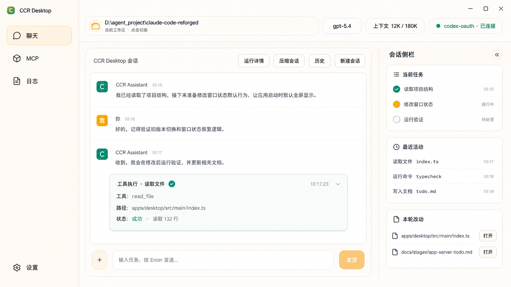
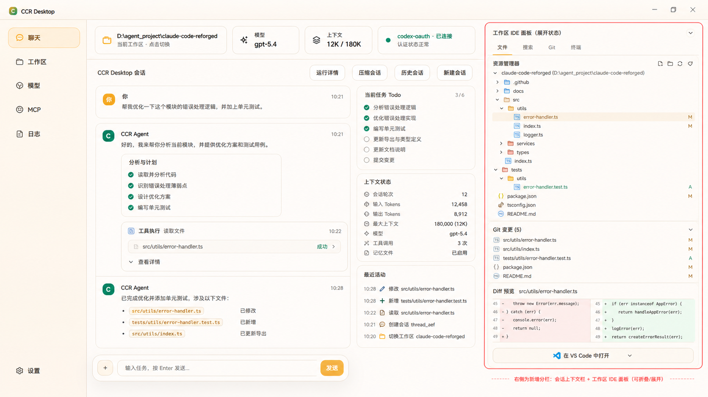

# CCR Desktop 轻量会话侧栏设计

## 目标

在聊天页右侧增加一个可折叠的“会话侧栏”，用于展示当前会话的辅助信息，让用户更容易看清楚 CCR 正在做什么、刚刚做了什么、这一轮改了哪些文件。

第一版目标不是把 CCR Desktop 做成完整 IDE，而是在保持聊天区为主的前提下，补一个轻量的 Agent 协作观察面板。

## 方案图

### 主方案：轻量右侧会话侧栏

这张图作为第一版实现参考：左侧导航和聊天区保持克制，右侧只增加“当前任务 / 最近活动 / 本轮改动”三块轻量信息。

### 扩展参考：Agent IDE 驾驶舱

这张图只作为后续方向参考，不进入第一版范围。它表达的是更完整的工作区、模型、文件变更和 IDE 辅助能力，后续如果要做，需要单独拆成“工作区 / Agent IDE”专项。

## 为什么先做轻量侧栏

当前 Desktop 的主体验仍然是 Agent 聊天。用户在使用时最常遇到的问题不是“缺少完整编辑器”，而是：

- 不知道当前任务推进到哪一步。
- 不知道模型刚刚调用了哪些工具。
- 不知道本轮到底改了哪些文件。
- 工具卡、权限卡、Todo 浮层都堆在聊天区时，主线容易被打散。

所以第一版右侧栏只解决“会话观察”和“本轮变更可见性”，暂时不做完整文件树、Git 面板、Diff 编辑器和代码编辑器。

## 布局

页面保留当前三段结构：

1. 左侧主导航：聊天、MCP、日志、设置。
2. 中间主聊天区：消息、工具卡、输入框仍然是主角。
3. 右侧会话侧栏：宽度约 `300px`，可折叠。

侧栏默认策略：

- 大屏默认展开。
- 窄屏默认折叠。
- 用户手动折叠或展开后，后续启动应恢复用户偏好。
- 侧栏只使用淡分割线，不做强烈边框，避免抢聊天区视觉重心。

## 第一版内容

### 1. 当前任务

展示当前会话的任务推进状态。

输入来源：

- `TodoWrite` 工具调用结果。
- 当前 turn 的运行状态。
- App Server 后续可能提供的任务快照。

第一版显示：

- Todo 标题。
- 已完成 / 进行中 / 待处理状态。
- 当前进行中的一项高亮。

不做：

- Todo 编辑。
- 拖拽排序。
- 跨会话任务管理。

### 2. 最近活动

展示最近发生的工具和运行事件，让用户不用翻聊天流也能看出 agent 在干什么。

输入来源：

- 工具调用事件。
- 权限请求事件。
- 命令执行状态。
- 文件读写事件。

第一版显示：

- 最近 5 到 8 条活动。
- 活动类型，例如读取文件、写入文件、运行命令、请求权限。
- 简短目标，例如文件名或命令名。

不做：

- 完整日志查看。
- JSON 原始事件树。
- 复杂过滤器。

### 3. 本轮改动

展示当前 turn 或当前会话最近一次 agent 改动的文件。

输入来源：

- 文件类工具卡。
- App Server 文件事件。
- 后续可补 Git diff 扫描。

第一版显示：

- 文件路径。
- 文件动作，例如新增、修改、删除。
- 操作按钮：打开、复制路径、在外部编辑器打开。

不做：

- 内置 Diff 编辑器。
- 文件内容编辑。
- 批量撤销。

## 状态变化

第 1 轮：用户发送任务。

- 聊天区出现用户消息。
- 侧栏“当前任务”进入处理中。
- “最近活动”开始追加工具调用。

第 2 轮：模型写入 Todo。

- 聊天区可以继续按现有规则展示 Todo 浮层或简化卡。
- 侧栏“当前任务”刷新为结构化 Todo 列表。

第 3 轮：模型读取或写入文件。

- 聊天区展示必要工具卡。
- 侧栏“最近活动”追加文件事件。
- 侧栏“本轮改动”追加改动文件。

第 4 轮：任务完成。

- 当前任务状态更新为完成。
- 最近活动保留短列表。
- 本轮改动保留本轮文件清单，便于用户复盘。

## 边界和不变式

- 聊天区仍然是主体验，侧栏只做辅助观察。
- 侧栏不能成为第二套聊天历史。
- 侧栏不能替代历史会话弹窗。
- 侧栏不能默认展示 raw JSON、完整日志或大段工具输出。
- 第一版不引入完整 IDE 能力。
- 第一版不影响 CLI / TUI / Core 链路。
- 侧栏数据应来自现有 Desktop renderer 状态或 App Server 事件归一化结果，避免重复造业务链路。

## 后续阶段

### P0 视觉骨架

- 在聊天页右侧增加可折叠侧栏区域。
- 保证大屏布局稳定，小屏自动折叠。
- 增加侧栏展开状态本地持久化。

### P1 当前任务

- 从现有 TodoWrite / Todo overlay 数据中提取侧栏任务列表。
- 保留当前聊天区已有展示，不急着删除旧入口。
- 真机验证执行中、完成、空 Todo 三种状态。

### P2 最近活动

- 从现有工具事件、权限事件、文件事件生成轻量活动流。
- 活动流只显示短摘要。
- 避免和聊天区工具卡重复展示大段内容。

### P3 本轮改动

- 聚合当前 turn 内的文件读写和编辑事件。
- 展示文件路径、动作和打开入口。
- 后续再考虑接 Git diff。

### P4 体验收敛

- 根据真机使用反馈决定是否弱化聊天区里的部分辅助卡。
- 评估是否需要增加“工作区”一级页面。
- 如果继续做 IDE 能力，另起专项，不把它混进会话侧栏第一版。

## 验收标准

- 大屏下侧栏展开后，聊天区仍然有足够阅读宽度。
- 侧栏折叠后，聊天区恢复完整宽度。
- 当前任务、最近活动、本轮改动三块都能在真实执行过程中刷新。
- 空状态有清晰文案，不显示假数据。
- 不影响现有历史会话、压缩会话、运行详情、新建会话按钮。
- 不影响 Core、CLI、TUI。
