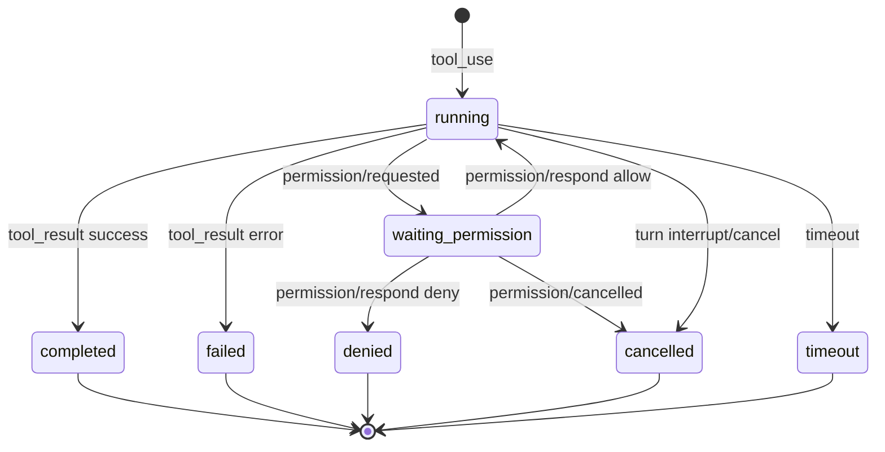

# CCR Desktop 工具事件卡片契约

> 当前实现边界：工具生命周期合并已经收敛到 App Server ThreadDisplay reducer / `threadDisplayToolProjector`。本文仍作为 Desktop 工具卡视觉和交互契约；涉及 `toolUseId`、`parentToolUseId`、`progress`、`tool_result` 合并顺序时，以 [CCR ThreadDisplay Reducer 契约](./thread-display-reducer-contract.md) 为准。

本文档定义 Desktop 侧如何把模型工具调用展示成可理解、可回归的一张工具卡。当前目标不是重写 Core 工具运行时，而是保证 App Server 已经归一化出的工具展示项在 Desktop 中有稳定视觉、状态和交互。

## 目标

- 同一次工具调用只出现一张主工具卡。
- 工具卡能表达准备、等待权限、执行中、成功、失败、拒绝、取消、超时。
- 用户不再看到大量 raw JSON 和孤立的“工具执行成功”消息。
- 权限请求能和对应工具卡通过 `toolUseId` / `permissionRequestId` 关联。
- Windows shell 不匹配、路径不存在、MCP 离线等问题能给出可行动提示。

## 身份不变式

工具生命周期合并优先依赖稳定字段：

- `toolUseId` / `tool_use_id`：工具调用、工具结果和权限请求的主关联字段。
- `itemId`：App Server item 的展示事件 ID。
- `turnId`：用于限定同一轮任务内的展示归属。
- `contentIndex`：同一个 item 内多内容块的顺序。
- `permissionRequestId`：权限请求卡和工具卡之间的交互关联。

如果工具事件缺少 `toolUseId`，Desktop 只能把它作为协议缺口展示或记录，不能退回到“按工具名/标题字符串硬匹配”。

### 工具生命周期合并边界

当前权威实现位于 App Server ThreadDisplay reducer。Desktop 只消费 reducer 输出的展示项和 patch，不再自行从 raw `tool_use` / `tool_result` 推断生命周期。

Reducer 必须遵守的合并顺序：

1. 先用 `toolUseId` / `tool_use_id` / `toolCallId` / `sourceToolAssistantUUID` 识别同一次工具调用。
2. `tool_use` 创建或更新主工具卡。
3. `tool_result` 回填同一张主工具卡，成功 / 失败 / 拒绝 / 超时都更新原卡状态。
4. `progress` 只允许更新已存在的工具卡；找不到父工具卡时不得残留为独立“工具进度 · 正在执行”卡。
5. 控制型工具结果，例如 TodoWrite 或内部 reminder，不进入普通工具主时间线。

Desktop Renderer 必须遵守的消费顺序：

1. 标准 `thread/display` 协议项按 `itemId` 更新已有展示项。
2. 不按 raw `toolUseId` 在 Renderer 侧重新合并工具生命周期。
3. 不把缺失父工具的 `progress` 或控制型结果展示成独立卡。
4. 协议缺口显示诊断或错误卡，不走静默 legacy fallback。

注意：`isThreadDisplayProtocolContext` 只能说明事件来自标准展示协议，不能说明该事件应该独立展示。独立展示与否由 reducer 输出的 projection 决定。

## 状态机

UI 不变式：

- 状态永远显示在原工具卡右下角。
- 执行中、等待权限使用动态转圈状态。
- 结束态使用成功、失败、已拒绝、已取消、已超时角标。
- stdout、stderr、结构化结果和错误详情都进入原卡片详情区。

## 工具分类

第一版分类只服务展示，不改变 Core 调用逻辑。

| 分类 | 典型工具 | 主摘要 |
| --- | --- | --- |
| Shell / 命令 | `Bash`、`ShellExecute`、`PowerShell` | `运行命令：<command>` |
| 文件 | `Read`、`Write`、`Edit`、`MultiEdit`、`LS`、`Glob`、`Grep` | 读取/写入/编辑/搜索目标路径 |
| MCP | `mcp__*`、包含 `mcp` 的工具名 | 调用 MCP 工具 |
| 浏览器 | Browser / Playwright 工具 | 操作浏览器或页面 |
| 搜索 | `WebSearch`、`WebFetch` | 搜索 query 或读取 URL |
| 控制 | `TodoWrite`、`AskUserQuestion` | 使用专用展示，不进普通工具流 |
| 未知 | 其他工具 | 保底展示工具名和参数 |

## 错误分类

第一版 Desktop 先做展示级错误分类：

| 错误类型 | 识别线索 | 可行动提示 |
| --- | --- | --- |
| `shell_unavailable` | `No suitable shell found`、`Posix shell environment` | Windows 下优先 PowerShell / CMD / Node 原生文件能力 / 高层文件工具 |
| `command_not_found` | `command not found`、`not recognized` | 换平台可用命令或高层工具 |
| `path_not_found` | `Cannot find path`、`ENOENT`、`No such file or directory` | 确认工作区和目标路径 |
| `permission_denied` | `permission denied`、`access is denied`、用户拒绝 | 检查用户授权或文件系统权限 |
| `mcp_unavailable` | MCP 离线、连接拒绝 | 检查 MCP 配置和进程状态 |
| `browser_unavailable` | 浏览器 / Playwright 运行时不可用 | 检查浏览器运行时安装 |
| `timeout` | `timeout`、`timed out` | 拆小任务或增加超时 |
| `unknown_failure` | 其他错误 | 展开详情看原始错误 |

## 跨平台 Shell 策略边界

P20 第一版只解决展示和错误解释，不直接重写 Core 工具池。后续 Core/App Server 应继续推进：

- Windows 下不要默认把目录探测引向 `ls`、`bash`、`zsh`。
- 优先暴露 PowerShell / CMD / Node 原生文件能力 / 高层文件工具。
- 逐步把 `Bash(command)` 抽象成 `ShellExecute(shell, command, cwd)` 或更高层文件工具。
- 工具卡长期应展示 `shell`、`provider`、命令方言和显式兼容路径原因。

## 验证清单

- `typecheck:desktop`：前端类型正确。
- `desktop:build`：Desktop 构建正确。
- `smoke:desktop-display-events`：fixture 中工具成功、shell 失败、AskUserQuestion 隐藏、TodoWrite 浮层、权限关联可回归。
- 后续真实链路需要继续补 allow、deny、cancel、timeout 的 App Server 工具流 smoke。
