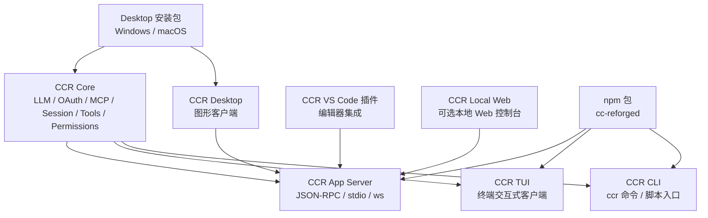
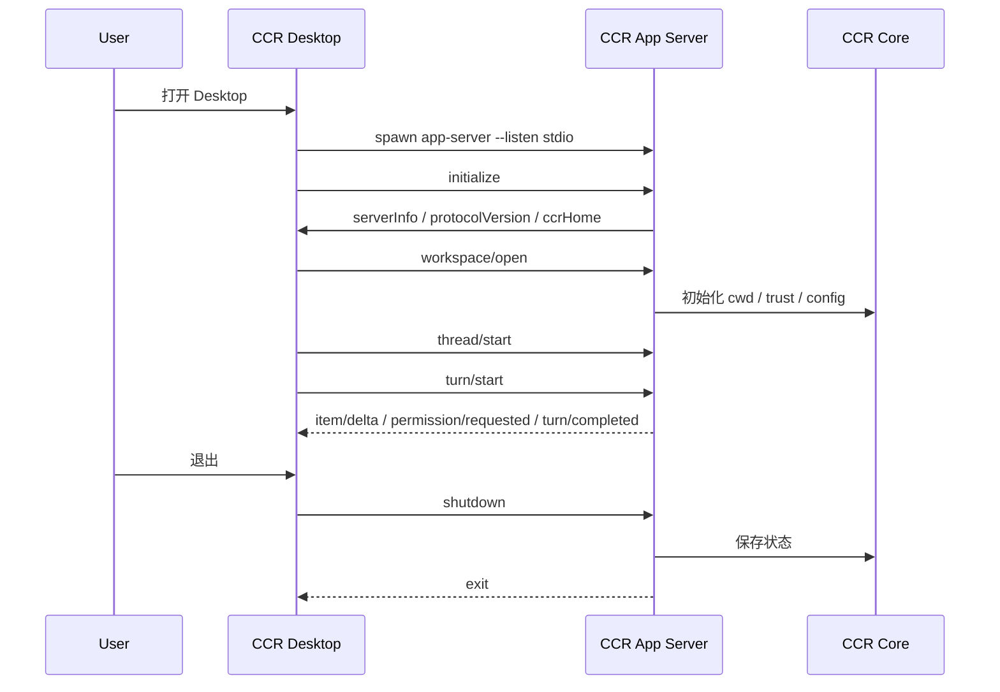
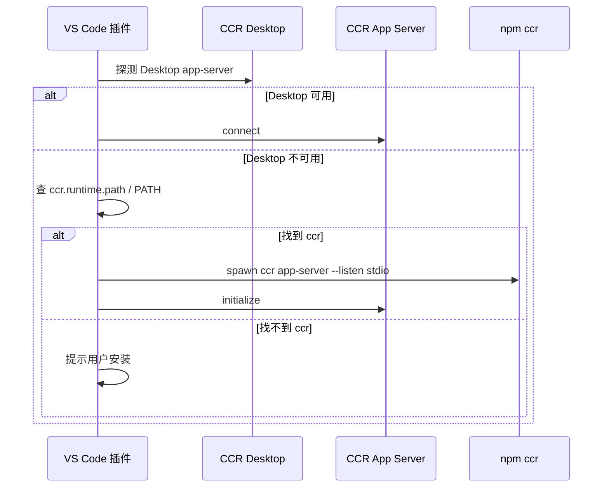

# CCR 多入口与 App Server 总体方案

## 1. 文档目标

本文档用于确定 CCR 后续从 `CLI / TUI` 扩展到 `Desktop / VS Code / Local Web` 时的整体架构边界。

它回答以下问题：

- CCR Core 到底放在 npm 包里，还是放在 Desktop 客户端里。
- npm 安装的核心和 Desktop 内置核心会不会冲突。
- VS Code 插件应该连接哪一个核心。
- `app-server` 是独立后台服务，还是放进 Desktop / VS Code 插件。
- Desktop 升级时如何更新核心。
- 如果 VS Code 机器上没有 CCR，是否允许自动安装。
- 当前仓库已有能力和缺失能力分别是什么。
- 第一阶段应该先实现什么，避免 Desktop / VS Code 直接乱接内部实现。

结论先行：

```text
CCR Core 只维护一套源码。

npm CLI / TUI 带一份同源 core。
Desktop 安装包也带一份同源 core。
VS Code 插件默认不带完整 core，而是连接或启动 CCR App Server。

App Server 属于 CCR Core 的一种运行模式，
不是 Desktop 私有服务，也不是 VS Code 插件私有服务。
```

---

## 2. 总体架构



这套结构的核心思想是：

- `Core` 是唯一业务核心。
- `CLI / TUI / Desktop / VS Code / Web` 都只是入口和壳。
- `App Server` 是 Core 暴露给富客户端的稳定协议层。
- 不让 Desktop 复制业务逻辑。
- 不让 VS Code 插件直接调用一堆内部模块。
- 不让外部客户端依赖不稳定的 TUI UI 状态。

---

## 3. 和 Codex / Claude Code 的参考关系

### 3.1 Codex 的方向

Codex 更接近 `core-first / protocol-first`：

```text
codex-core
  真实业务核心

codex-cli / codex-tui
  终端入口

codex app-server
  给 VS Code / 富客户端使用的本地协议入口

npm @openai/codex
  主要负责分发和启动平台 native binary
```

值得 CCR 学习的点：

- 核心能力和外壳分离。
- 富客户端不要直接嵌业务逻辑，而是通过 `app-server` 协议连接。
- npm 可以是分发壳，不一定代表所有业务都在 JS npm 包里。
- `app-server` 的协议需要版本化和 schema 化，客户端按协议接入。

### 3.2 Claude Code 的方向

Claude Code 更偏 `terminal-first`：

```text
claude CLI / TUI
  主入口和核心能力

IDE 插件
  启动或连接本地 claude
  共享 selection / diagnostics
  展示 diff
```

值得 CCR 学习的点：

- 命令行主入口简单直接。
- IDE 插件不要重新实现 Agent 核心。
- IDE 插件更适合做编辑器上下文、diff、诊断和快捷入口。

CCR 后续更适合吸收 Codex 的 `app-server` 思路，同时保留 Claude Code 的 terminal-first 可用性。

---

## 4. 当前 CCR 代码现状

当前仓库已经具备：

| 能力 | 现状 | 说明 |
| --- | --- | --- |
| CLI | 已有 | `ccr` 命令入口已发布到 npm |
| TUI | 已有 | 终端交互式主界面已可运行 |
| 通用 LLM Runtime | 已有第一版 | 已支持 `codex-oauth` provider |
| Codex OAuth | 已有第一版 | 登录态放在 `~/.ccr/data/codex-oauth.json` |
| MCP 配置 | 已有 | 用户级配置放 `~/.ccr/mcp.json` |
| Playwright MCP 预设 | 已有 | 支持 `npx` 和 `.ccr` 管理式安装 |
| MCP Server | 已有 | `src/entrypoints/mcp.ts`，用于把 CCR 工具暴露给 MCP 客户端 |
| Structured IO | 已有 | `src/cli/structuredIO.ts`，可复用权限请求和 SDK 消息协议 |
| Bridge / Remote | 有旧体系 | 偏远程控制和云端会话，不适合作为 Desktop / VS Code 主协议 |
| Direct Connect | 部分占位 | `src/server/server.ts` 仍是禁止启动的占位 |

当前缺失：

| 缺失项 | 说明 |
| --- | --- |
| `ccr app-server` 命令 | 还没有面向 Desktop / VS Code 的统一本地服务入口 |
| 本地 JSON-RPC 协议 | 还没有稳定的 `initialize / thread / turn / item / config / model / mcp` API |
| App Server schema | 还没有生成给客户端使用的 TypeScript 类型或 JSON Schema |
| 多客户端协调 | 还没有 Desktop 与 VS Code 同时连接时的 session / permission 协调 |
| Desktop 外壳 | 还没有 Electron / Tauri 应用 |
| VS Code 插件 | 还没有扩展包和 runtime discovery 机制 |

因此下一步不应直接开 Desktop，而应先补 `CCR App Server`。

---

## 5. Core 与分发关系

### 5.1 源码关系

推荐后续逐步整理为：

```text
packages/core/
  真实 CCR 核心
  LLM provider
  OAuth
  MCP
  session
  tools
  permissions
  app-server runtime

packages/cli/
  ccr 命令入口
  CLI / TUI / exec / app-server 子命令

apps/desktop/
  Desktop 图形客户端

extensions/vscode/
  VS Code 插件
```

当前仓库不需要立刻 monorepo 化。第一阶段可以先在现有结构中新增 `src/app-server/`，等协议稳定后再考虑目录重排。

### 5.2 发布关系

正确关系不是：

```text
npm core 一套
Desktop core 一套
VS Code core 又一套
```

而是：

```text
同一份 CCR Core 源码
  构建成同一版本 core runtime

npm 包 cc-reforged@x.y.z
  内含 core runtime x.y.z
  暴露 ccr CLI / TUI / app-server

Desktop 安装包 CCR Desktop vA.B.C
  内置 core runtime x.y.z
  通过本地协议调用 core
```

也就是说：

- Core 源码只维护一套。
- 分发产物可以有多份。
- 每个入口使用自己的内置/绑定 core，避免依赖用户全局环境。

---

## 6. npm 核心与 Desktop 内置核心会不会冲突

不会天然冲突，但需要明确边界。

### 6.1 不共享的内容

```text
npm global cc-reforged
  安装目录由 npm 管理
  提供 PATH 里的 ccr 命令

Desktop 内置 core
  安装目录由 Desktop 安装包管理
  Desktop 自己 spawn
  不抢 PATH 里的 ccr
```

Desktop 第一版不应该默认调用用户全局 `ccr`。

原因：

- 用户可能没有安装 npm 版。
- 用户可能安装旧版。
- PATH 可能冲突。
- npm 权限或缓存可能损坏。
- Desktop 更新无法控制 npm core 版本。

### 6.2 共享的内容

推荐共享用户数据目录：

```text
~/.ccr/
  settings.json
  mcp.json
  data/
    llm.config.local.json
    codex-oauth.json
  sessions/
  logs/
  cache/
  runtimes/
```

共享目录带来的核心风险是配置兼容。

必须遵守三条规则：

```text
1. 所有长期配置都带 schema version。
2. 老版本遇到未知字段必须忽略，不得崩溃。
3. 新版本负责迁移旧配置，迁移前要备份或可回滚。
```

配置文件建议示例：

```json
{
  "schemaVersion": 1,
  "provider": "codex-oauth",
  "model": "gpt-5.4",
  "updatedBy": "ccr-desktop",
  "updatedAt": "2026-04-28T00:00:00.000Z"
}
```

---

## 7. App Server 定位

### 7.1 它是什么

`App Server` 是 CCR Core 的一种运行模式：

```text
ccr app-server --listen stdio
ccr app-server --listen ws://127.0.0.1:xxxxx
```

它负责把 Core 能力暴露成稳定协议，供 Desktop / VS Code / Local Web 调用。

### 7.2 它不是什么

它不是：

- Desktop 私有服务。
- VS Code 插件私有服务。
- 必须常驻系统后台的 daemon。
- MCP Server 的替代品。
- 直接暴露所有内部函数的 RPC 网关。

### 7.3 与 MCP Server 的区别

| 维度 | MCP Server | CCR App Server |
| --- | --- | --- |
| 面向对象 | 其他 Agent / MCP 客户端 | CCR Desktop / VS Code / Web |
| 核心职责 | 把 CCR 工具暴露出去 | 驱动完整会话和控制面 |
| 协议重心 | tool list / tool call | thread / turn / item / config / model / permission |
| 是否管理会话 | 不作为主职责 | 是主职责 |
| 是否负责 UI 状态 | 否 | 为客户端提供可观测状态 |

### 7.4 与 Bridge / Remote 的区别

`bridge / remote` 更偏远程控制、云端 session、WebSocket 订阅和外部服务连接。

`app-server` 第一版应该是本地优先：

```text
Desktop / VS Code
  -> 本地 app-server
  -> 本地 CCR Core
  -> LLM provider / MCP / tools
```

不要把旧 bridge 直接当 app-server 用，否则会把远程控制、云端 session、Claude 旧认证和本地桌面协议混在一起。

---

## 8. App Server 协议设计

第一版建议采用：

```text
传输层：
  stdio 优先
  websocket 第二阶段

消息格式：
  JSON-RPC 2.0 风格
  每行一个 JSON 消息

schema：
  zod 定义
  生成 TypeScript 类型和 JSON Schema
```

### 8.1 为什么第一版优先 stdio

```text
stdio 优点：
  不占端口
  不需要本地鉴权
  生命周期跟父进程绑定
  Desktop / VS Code spawn 后容易管理
  Windows 防火墙和安全软件干扰少

stdio 缺点：
  多客户端共享不方便
  一个客户端通常对应一个 server 进程
```

第一版先用 stdio，等 Desktop / VS Code 都跑通后，再扩展 websocket / daemon。

### 8.2 初始化协议

客户端连接后必须先发：

```json
{
  "id": 1,
  "method": "initialize",
  "params": {
    "clientInfo": {
      "name": "ccr-desktop",
      "title": "CCR Desktop",
      "version": "0.1.0"
    },
    "capabilities": {
      "streaming": true,
      "permissionPrompts": true
    }
  }
}
```

服务端返回：

```json
{
  "id": 1,
  "result": {
    "serverInfo": {
      "name": "ccr-app-server",
      "version": "0.1.0",
      "coreVersion": "0.2.0"
    },
    "ccrHome": "C:/Users/<user>/.ccr",
    "platform": {
      "os": "win32",
      "arch": "x64"
    },
    "protocolVersion": "0.1"
  }
}
```

### 8.3 核心对象

协议层建议采用三个核心对象：

```text
Thread
  一段对话或任务会话

Turn
  用户发起的一轮请求和模型/工具执行结果

Item
  Turn 里的具体事件或内容块
  例如 user message、assistant delta、tool call、tool result、permission request
```

这和 Codex 的方向一致，也适合 Desktop / VS Code 做 UI。

### 8.4 第一版 API 列表

最小可用 API：

| 方法 | 用途 |
| --- | --- |
| `initialize` | 握手，返回 server / core / home / platform 信息 |
| `shutdown` | 客户端请求服务端退出 |
| `config/get` | 读取当前 CCR 配置 |
| `config/update` | 更新 provider / model 等配置 |
| `auth/status` | 查询 Codex OAuth / API key 登录状态 |
| `auth/login/start` | 启动登录流程 |
| `model/list` | 列出当前 provider 可用模型 |
| `mcp/list` | 列出 MCP server |
| `mcp/addPreset` | 添加内置预设，例如 Playwright |
| `workspace/open` | 打开工作区，完成 trust / cwd 初始化 |
| `thread/start` | 创建新会话 |
| `thread/resume` | 恢复已有会话 |
| `thread/list` | 列出会话 |
| `turn/start` | 发送用户输入并启动一轮执行 |
| `turn/interrupt` | 中断当前 turn |
| `permission/respond` | 响应工具权限请求 |

通知事件：

| 事件 | 用途 |
| --- | --- |
| `thread/started` | 新会话已创建 |
| `turn/started` | 一轮请求开始 |
| `item/started` | 内容项开始 |
| `item/delta` | 流式内容增量 |
| `item/completed` | 内容项完成 |
| `permission/requested` | 请求用户确认工具调用 |
| `permission/cancelled` | 权限请求取消 |
| `turn/completed` | 一轮请求完成 |
| `turn/failed` | 一轮请求失败 |
| `server/log` | 服务端日志 |

---

## 9. Desktop 客户端方案

### 9.1 Desktop 的定位

Desktop 是 CCR 的图形控制面，不是另一个 Agent。

第一版职责：

- 选择 workspace。
- 显示登录状态。
- 配置 provider / model。
- 发起聊天。
- 展示工具调用和权限确认。
- 管理 MCP。
- 查看 session 历史。
- 查看 runtime 日志。

### 9.2 Desktop 如何使用 App Server

第一版：

```text
Desktop 启动
  -> spawn 内置 ccr app-server --listen stdio
  -> initialize
  -> workspace/open
  -> thread/start 或 thread/resume
```

Desktop 退出：

```text
Desktop 发送 shutdown
  -> app-server 收尾
  -> 子进程退出
```

### 9.3 Desktop 是否调用全局 npm ccr

默认不调用。

默认使用：

```text
Desktop 安装包内置 core
```

只有开发者模式或用户显式配置时，才允许：

```text
使用外部 ccr 路径
使用 npm global ccr
使用源码仓库 dist 入口
```

### 9.4 技术选型建议

第一版推荐：

```text
Electron + React
```

原因：

- 当前 CCR 已经是 Node / React / Ink 生态。
- OAuth、本地文件、子进程、stdio IPC 都更顺。
- Windows 端开发成本低。
- 第一版目标是可用，不是包体极致小。

Tauri 可以作为后续瘦身方向，但第一版不建议同时攻 Rust shell、Node runtime、OAuth 回调和 app-server。

更详细的框架对比和安全边界见：

- [CCR Desktop 客户端框架选型](./desktop-framework-selection.md)

---

## 10. VS Code 插件方案

### 10.1 VS Code 插件定位

VS Code 插件不内置完整 Core。

它负责：

- 命令面板入口。
- 当前文件、选区、diagnostics 注入。
- diff 展示。
- 聊天侧边栏。
- 权限确认 UI。
- App Server 发现和连接。

### 10.2 VS Code 连接顺序

推荐发现顺序：

```text
1. 尝试连接 CCR Desktop 正在运行的 app-server。
2. 如果 Desktop 不存在，读取用户配置的 ccr.runtime.path。
3. 如果配置路径不存在，查找 PATH 中的 ccr。
4. 如果找到 ccr，启动 ccr app-server --listen stdio。
5. 如果没有 ccr，提示用户安装。
```

### 10.3 是否允许自动 npm 安装

允许，但不能静默安装。

推荐流程：

```text
VS Code 插件检测不到 CCR Core
  -> 弹窗提示
  -> 用户选择安装方式
  -> 用户确认 npm 安装
  -> 插件执行 npm.cmd install -g cc-reforged
  -> 安装完成后启动 ccr app-server
```

Windows 上优先使用：

```bat
npm.cmd install -g cc-reforged
```

不要静默执行安装，原因：

- 会修改用户全局环境。
- 可能触发 npm 权限问题。
- 可能触发公司代理或安全策略。
- 可能改变 PATH 下命令行为。

### 10.4 VS Code 配置项

建议第一版配置：

```json
{
  "ccr.runtime.mode": "auto",
  "ccr.runtime.path": "",
  "ccr.runtime.installStrategy": "prompt",
  "ccr.runtime.preferDesktop": true
}
```

含义：

| 配置 | 说明 |
| --- | --- |
| `auto` | 自动找 Desktop / 指定路径 / PATH / npm |
| `desktop` | 只连接 Desktop app-server |
| `external` | 只使用用户指定 ccr 路径 |
| `npm` | 使用 npm 安装或 PATH 中的 ccr |
| `prompt` | 检测不到时询问用户 |

---

## 11. Local Web 方案

Local Web 不是第一优先级，但可以自然接入 App Server。

两种模式：

```text
模式一：Desktop 内嵌 WebView
  Electron renderer 本身就是 Web UI

模式二：本地浏览器访问
  ccr app-server --listen ws://127.0.0.1:port
  ccr web 打开 http://127.0.0.1:port
```

第一版不建议单独做 Local Web，先让 Desktop renderer 跑通。

---

## 12. 核心升级策略

### 12.1 第一版推荐策略

第一版采用最稳策略：

```text
Desktop 升级 = Core 升级
```

也就是：

```text
CCR Desktop v0.1.0
  内置 CCR Core v0.2.0

CCR Desktop v0.2.0
  内置 CCR Core v0.3.0
```

用户更新 Desktop，Core 跟着更新。

### 12.2 后续可更新 runtime

稳定后可以加：

```text
~/.ccr/runtimes/
  ccr-core/
    0.2.0/
    0.3.0/
    current.json
```

`current.json` 示例：

```json
{
  "activeVersion": "0.3.0",
  "fallbackVersion": "0.2.0",
  "source": "desktop-updater",
  "verifiedAt": "2026-04-28T00:00:00.000Z"
}
```

升级流程：

```text
下载 core 包
  -> 校验 hash / 签名
  -> 解压到版本目录
  -> 运行 health check
  -> 通过后更新 current.json
  -> 下次启动切换
```

失败回滚：

```text
新版 core 启动失败
  -> 标记 failed
  -> 回退 fallbackVersion
  -> fallback 也失败则使用 Desktop 内置 core
```

第一版不要直接做热更新 runtime，先保持发布链路简单。

完整升级管理方案见：

- [CCR 升级管理策略](./upgrade-management-strategy.md)

---

## 13. 生命周期设计

### 13.1 Desktop 生命周期



### 13.2 VS Code 生命周期



---

## 14. 安全边界

### 14.1 stdio 模式

stdio 模式默认只允许父进程通信，不需要额外端口鉴权。

但仍要做：

- initialize 前拒绝其他请求。
- 所有请求做 schema 校验。
- 工作区路径必须明确。
- 权限请求必须显式回传给客户端。
- 不打印 token。
- 不把 OAuth 文件内容发给客户端，只返回脱敏状态。

### 14.2 websocket 模式

websocket 模式后续再开，必须有：

- 仅绑定 `127.0.0.1` 默认。
- capability token。
- Origin 校验。
- token 文件或握手 secret。
- `/healthz` 和 `/readyz`。
- 非 loopback 默认拒绝，除非用户显式打开。

### 14.3 权限控制

工具执行不能因为来自 Desktop / VS Code 就默认放行。

统一原则：

```text
Core 负责权限判断。
App Server 负责把权限请求转成客户端可展示事件。
客户端负责把用户选择回传给 App Server。
```

---

## 15. 版本与兼容策略

需要区分四种版本：

| 版本 | 说明 |
| --- | --- |
| `coreVersion` | CCR Core 版本 |
| `cliVersion` | npm CLI 包版本，当前与 package version 一致 |
| `desktopVersion` | Desktop 安装包版本 |
| `protocolVersion` | App Server 协议版本 |

兼容原则：

```text
1. protocolVersion 小版本新增字段必须向后兼容。
2. 客户端遇到未知字段必须忽略。
3. 服务端遇到未知 capability 可以忽略，但不能误认为已支持。
4. 破坏性协议变更必须升级 protocol major。
5. Desktop 内置 core 和 app-server 协议必须在打包时锁定。
```

---

## 16. 第一阶段实施方案

第一阶段目标不是完整 Desktop，而是把未来富客户端的地基打出来。

### 16.1 阶段目标

```text
新增 ccr app-server --listen stdio

支持：
  initialize
  shutdown
  config/get
  auth/status
  model/list
  workspace/open
```

先不做完整 `turn/start`。

原因：

- 先验证协议层、启动入口、schema、stdio 生命周期。
- 先让 Desktop / VS Code 未来能拿到配置和登录状态。
- 避免一上来把 query 主循环、权限、流式输出全塞进去导致难定位。

### 16.2 第一阶段文件建议

```text
src/app-server/
  index.ts
  protocol.ts
  stdioTransport.ts
  handlers/
    initialize.ts
    config.ts
    auth.ts
    model.ts
    workspace.ts

src/entrypoints/cli.tsx
  增加 app-server fast path

docs/architecture/
  app-server-protocol.md
```

### 16.3 第一阶段验证

命令：

```powershell
node --no-warnings --experimental-loader ./bun-bundle-loader.mjs ./dist/src/entrypoints/cli.js app-server --listen stdio
```

smoke 脚本建议：

```text
scripts/smoke-app-server-initialize.mjs
scripts/smoke-app-server-config.mjs
scripts/smoke-app-server-auth-status.mjs
```

验证点：

- `initialize` 返回 `protocolVersion`、`coreVersion`、`ccrHome`。
- 未 initialize 前调用其他方法会返回错误。
- `config/get` 不泄露 token。
- `auth/status` 只返回是否登录、provider、脱敏账号信息。
- Windows 下 stdio 退出不挂进程。

---

## 17. 第二阶段实施方案

第二阶段开始打通真实会话。

目标：

```text
thread/start
turn/start
item/delta
permission/requested
permission/respond
turn/completed
turn/interrupt
```

复用方向：

- 优先复用 `StructuredIO` 中的控制消息、权限请求、流式输出经验。
- 不直接复用 TUI 组件状态。
- 不直接复用 bridge 的远程会话模型。
- 查询主循环仍然归 Core，App Server 只是把输入输出协议化。

关键难点：

- 如何把现有 `query` 结果稳定转成 `item` 事件。
- 如何把工具权限请求暂停并回传给客户端。
- 如何处理中断和并发 turn。
- 如何持久化 thread / turn / item。

第二阶段完成后，Desktop 才能做真正聊天。

---

## 18. 第三阶段 Desktop 原型

Desktop 第一版页面：

```text
1. 启动页 / workspace 选择
2. 设置页 / provider + model
3. 登录状态页 / Codex OAuth
4. 聊天页 / thread + turn
5. 工具权限弹窗
6. MCP 管理页 / Playwright 一键添加
7. 日志页
```

Desktop 不直接读写所有内部文件。

推荐调用：

```text
config/get
config/update
auth/status
auth/login/start
model/list
mcp/list
mcp/addPreset
workspace/open
thread/start
turn/start
```

如果某些设置需要直接读 `~/.ccr`，也应该先评估是否补 App Server API，而不是让 Desktop renderer 直接操作文件。

---

## 19. 第四阶段 VS Code 插件

VS Code 第一版功能：

```text
1. 自动发现 CCR App Server
2. 连接 Desktop app-server 或启动 npm ccr app-server
3. 显示聊天侧边栏
4. 注入当前 workspace / file / selection
5. 展示 diff
6. 处理权限确认
7. 未安装时提示 npm 安装
```

VS Code 插件的关键边界：

- 不内置完整 Agent Core。
- 不静默安装 npm 包。
- 不直接读 token 文件。
- 不直接调用内部 `src/` 模块。
- 只通过 App Server 协议接入。

---

## 20. 决策记录

当前已确认的架构决策：

| 决策 | 结论 |
| --- | --- |
| Core 是否只放 npm | 否。Core 源码一套，npm 和 Desktop 各自打包一份同源产物 |
| Desktop 是否依赖全局 npm ccr | 默认不依赖 |
| VS Code 是否内置 Core | 第一版不内置 |
| VS Code 能否 npm 安装 CCR | 可以，但必须用户确认 |
| App Server 属于谁 | 属于 CCR Core 的运行模式 |
| App Server 第一版传输 | stdio |
| App Server 是否常驻 | 第一版随客户端生命周期启动，后续再支持 daemon |
| Desktop 技术栈 | 第一版推荐 Electron + React |
| 配置目录 | `~/.ccr` |
| 共享配置风险 | 通过 schema version 和未知字段忽略解决 |

---

## 21. 当前最推荐的下一步

下一步不要直接做 Desktop。

推荐顺序：

```text
1. 写 App Server 协议详细设计
2. 实现 ccr app-server --listen stdio 最小入口
3. 补 initialize / config/get / auth/status / model/list / workspace/open
4. 加 smoke 测试
5. 再做 thread / turn / permission 流
6. 最后开 Desktop 原型
```

这样 Desktop / VS Code / Web 都会站在同一个地基上，不会走成三套核心。
