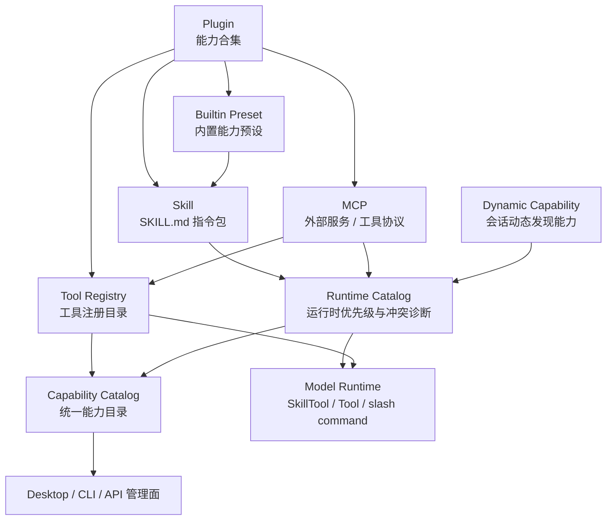

# CCR 扩展能力体系总览

本文是 CCR 外部能力体系的总入口，用来统一解释 Skill、MCP、Plugin、工具 registry、内置 preset 和动态能力之间的关系。后续讨论“插件到底是什么”“某个 Skill / MCP 是否应该出现在管理页”“能力目录如何展示来源”时，先读本文，再跳转到专题文档。

## 1. 总体定义

CCR 的扩展能力不是单一概念，而是一组不同层次的能力载体。

```text
Plugin
  -> 能力合集，可以携带 Skill / MCP / 命令 / Hook / 资源 / 配置

Skill
  -> 指令包和工作流知识，核心入口是 SKILL.md

MCP
  -> 外部工具协议和服务连接，运行后提供工具 / 资源 / prompts

Tool
  -> 模型可调用的具体工具入口，来自内置工具、MCP、provider 或后续插件

Command
  -> 用户显式入口，包括 slash command、Skill command、legacy command

Capability Catalog
  -> 管理面看到的统一能力目录，列所有能力及来源
```

一句话口径：

```text
Plugin 是能力合集；Skill / MCP / Tool / Command 是能力类型；Capability Catalog 是统一展示和诊断入口。
```

## 2. 总体关系图



## 3. 各概念边界

### 3.1 Plugin

Plugin 是能力合集，不是某一种单独能力。

一个 Plugin 可以包含：

- Skill：例如某个 GitHub 插件内含 review、CI debug、publish changes 等 Skill。
- MCP：例如浏览器、GitHub、Figma、Sentry 这类外部服务连接。
- Tool：插件直接贡献的模型工具。
- Command：插件贡献的用户命令入口。
- Hook / 配置 / 资源：运行时辅助能力。

Plugin 的核心职责：

- 打包一组相关能力。
- 声明能力来源、版本、风险和启用状态。
- 让用户可以按“领域能力包”安装和管理。

Plugin 不应该承担：

- 不直接替代 Skill 标准。
- 不直接替代 MCP 协议。
- 不绕过 Tool Registry 和 Capability Catalog。
- 不绕过用户确认安装高风险能力。

### 3.2 Skill

Skill 是指令包和工作流知识。它的核心入口是 `SKILL.md`，可以附带：

- `scripts/`
- `references/`
- `assets/`
- hooks / shell / version / paths 等 frontmatter 扩展

Skill 的主要用途：

- 给模型提供某类任务的专门方法。
- 给用户提供 slash command 或显式调用入口。
- 把项目工作流固化成可复用包。

Skill 的状态事实由 Skill 专项架构负责，详见 [CCR Skill 系统整体架构](./skill-system-architecture.md)。

### 3.3 MCP

MCP 是外部工具协议和服务连接。它解决的是“CCR 如何连接外部服务并把工具暴露给模型”。

MCP 可以提供：

- tools
- resources
- prompts
- OAuth / remote service / stdio local server

MCP 的主要用途：

- 浏览器自动化。
- 文档检索。
- Issue / Sentry / GitHub / Figma 等外部系统操作。
- 将外部服务能力变成模型工具。

MCP 的安装、配置和运行边界详见 [MCP 文档入口](../mcp/README.md)。

### 3.4 Tool

Tool 是模型最终可调用的具体工具入口。

Tool 来源包括：

- CCR 内置工具。
- provider 能力工具，例如生图。
- MCP 动态工具。
- 后续 plugin-provided tool。

Tool 的治理重点是：

- registry identity。
- availability。
- ToolSearch 暴露策略。
- Desktop 工具卡展示。
- 失败原因和来源诊断。

工具治理详见 [CCR 工具注册目录](./tool-registry-catalog.md)。

### 3.5 Command

Command 是用户显式入口。

常见来源：

- slash command。
- Skill 转成的 prompt command。
- legacy `.claude/commands/*.md`。
- plugin command。

Command 不等于 Skill。Skill 可以暴露成 Command，但 Skill 也可以只允许模型通过 SkillTool 按需加载。

### 3.6 Capability Catalog

Capability Catalog 是统一能力目录，不代表某一种来源。当前第一版已落地到 `src/services/capabilities/`，Core / App Server / CLI 可通过统一只读入口查询能力事实。

当前已接入：

- managed installed Skill
- project / user Skill
- plugin Skill
- bundled Skill
- dynamic Skill
- MCP Skill / MCP Tool
- provider capability tool
- builtin Tool
- plugin capability 关系预留

每个能力统一表达为 `ExtensionCapability`：

```text
id
name
displayName
description
kind
source
state
invocation
relations
diagnostics
metadata
```

Capability Catalog 的职责是“统一看见”，不是“统一执行”。执行仍分别由 Skill runtime、MCP runtime、Tool runtime 和 Command runtime 负责。

当前查询入口：

```powershell
node .\cli.js capabilities list
```

App Server 对应方法为 `capabilities/list`。

## 4. 来源到运行时的映射

| 来源 | 管理对象 | 运行时对象 | 是否进入 Capability Catalog | 专项文档 |
| --- | --- | --- | --- | --- |
| CCR installed Skill | `installed.json` / `lock.json` / package | prompt `Command` / SkillTool 可见项 | 是 | [Skill 系统整体架构](./skill-system-architecture.md) |
| 用户 / 项目 Skill | `.claude/skills` / `~/.claude/skills` | prompt `Command` | 是 | [Skill 文档入口](../skills/README.md) |
| Plugin Skill | plugin manifest / plugin cache | prompt `Command` | 是 | 本文 |
| Bundled Skill | 内置包 | prompt `Command` | 是 | [Skill 文档入口](../skills/README.md) |
| Dynamic Skill | 会话内文件发现 | prompt `Command` | 是 | [Skill 系统整体架构](./skill-system-architecture.md) |
| MCP Server | `mcp.json` / `.mcp.json` / installed record | `mcp__server__tool` | 是 | [MCP 文档入口](../mcp/README.md) |
| Provider capability | provider runtime capability | 内置或 provider 工具 | 是 | [Provider 能力工具化后续方向](./provider-capability-tools-future.md) |
| Builtin Tool | `src/tools.ts` | Tool | 是 | [工具注册目录](./tool-registry-catalog.md) |
| Legacy Command | `.claude/commands` | prompt `Command` | 是，但低优先级 | [Skill 系统整体架构](./skill-system-architecture.md) |

## 5. 管理页关系

管理页不应只按“安装记录”展示。

推荐长期结构：

```text
能力总览
  -> 列所有 capability，显示来源、启用状态、风险、运行时可见性

Skill 管理
  -> 重点管理 Skill 安装包、导入、修复、启用、卸载

MCP 管理
  -> 重点管理 MCP server、连接、检测、重启、安装、卸载

Plugin 管理
  -> 重点管理能力合集，展开显示其贡献的 Skill / MCP / Tool / Command
```

如果用户安装了一个 Plugin，而这个 Plugin 携带 Skill 和 MCP：

- Plugin 管理页应显示这个合集已安装。
- Skill 管理页或能力总览应显示该 Plugin 贡献的 Skill，来源标为 plugin。
- MCP 管理页或能力总览应显示该 Plugin 贡献的 MCP server，来源标为 plugin。
- Tool Registry / 能力总览应显示该 MCP 或插件贡献的工具，来源链路不能丢。

## 6. 安装与归属

不同能力的安装记录不能混在一起，但展示时可以统一。

建议归属：

```text
~/.ccr/skills/
  -> Skill 安装记录、lock、package

~/.ccr/mcp/
  -> MCP 安装记录、lock、package/cache、manifest

~/.ccr/plugins/
  -> Plugin 安装记录、lock、plugin bundle/cache
```

共同规则：

- installer-owned 目录必须有 owner marker。
- uninstall / repair 只能操作确认归属的目录。
- 高风险能力安装必须用户确认。
- 模型可以建议安装，但真实写配置、下载、启动服务必须由宿主执行。
- lock 应记录 checksum、来源、版本和 data boundary。

## 7. 运行时优先级

运行时同名能力需要稳定优先级和诊断。

Skill prompt command 建议优先级：

```text
policy
project
user
managed installed
plugin
bundled
dynamic
mcp
legacy command
```

Tool 侧优先级不能只按名字判断，还要看：

- tool source。
- MCP server。
- provider。
- availability。
- exposure：direct / deferred / internal。

同名或同能力冲突不能静默吞掉，必须进入 diagnostics。

## 8. 统一状态模型

所有能力都应能表达下面几类状态：

```text
installed
enabled
disabled
available
unavailable
needs-auth
failed
drifted
missing
invalid
hidden-by-conflict
```

不同能力可以有自己的细分状态，但管理面和能力目录至少要能归一到这些上层状态。

## 9. 文档入口

总入口：

- 本文：[CCR 扩展能力体系总览](./extension-capability-system.md)

专题入口：

- Skill：[CCR Skill 系统整体架构](./skill-system-architecture.md)
- Skill 标准与管理：[Skill 文档入口](../skills/README.md)
- MCP：[MCP 文档入口](../mcp/README.md)
- MCP 示例：[MCP 示例配置](../examples/mcp/README.md)
- 工具治理：[CCR 工具注册目录](./tool-registry-catalog.md)
- Provider 能力工具：[Provider 能力工具化后续方向](./provider-capability-tools-future.md)
- 用户目录与安装布局：[CCR 用户目录与安装布局](./ccr-home-layout.md)

阶段 goal：

- Skill / MCP 发布前收口：[Skill / MCP S-10 发布前收口](../goals/2026-06-03-skill-mcp-s10-closeout-plan.md)
- Skill P1 安装与修复可靠性：[Skill P1 Goal](../goals/2026-06-05-skill-p1-install-repair-reliability-plan.md)
- Skill P2 能力目录、诊断与完整性：[Skill P2 Goal](../goals/2026-06-05-skill-p2-capability-catalog-diagnostics-integrity-plan.md)
- Skill P3 检查模型收敛：[Skill P3 Goal](../goals/2026-06-05-skill-p3-inspection-value-object-refactor-plan.md)

## 10. 后续设计判定

后续讨论一个新能力时，先回答：

- 它是 Plugin、Skill、MCP、Tool、Command，还是组合？
- 它的安装记录应该落在哪个目录？
- 它是否需要 owner marker 和 lock？
- 它的运行时对象是什么？
- 它是否进入 Capability Catalog？
- 它的启用 / 禁用 / 不可用 / 鉴权状态怎么表达？
- 它是否需要用户确认安装或启动外部进程？

如果这些问题没有回答清楚，不应直接写 UI 或安装逻辑。
