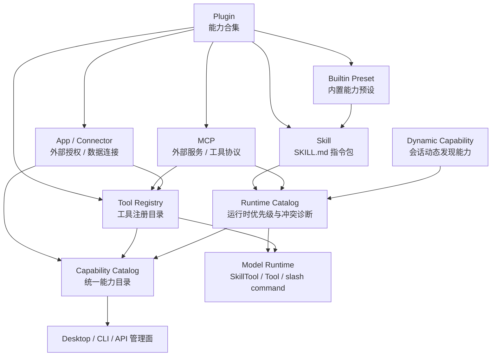

# CCR 扩展能力体系总览

本文是 CCR 外部能力体系的总入口，用来统一解释 Skill、MCP、Plugin、工具 registry、内置 preset 和动态能力之间的关系。后续讨论“插件到底是什么”“某个 Skill / MCP 是否应该出现在管理页”“能力目录如何展示来源”时，先读本文，再跳转到专题文档。

## 1. 总体定义

CCR 的扩展能力不是单一概念，而是一组不同层次的能力载体。

```text
Plugin
  -> 能力合集，可以携带 Skill / MCP / 命令 / Hook / 资源 / 配置

Skill
  -> 指令包和工作流知识，核心入口是 SKILL.md

MCP
  -> 外部工具协议和服务连接，运行后提供工具 / 资源 / prompts

Tool
  -> 模型可调用的具体工具入口，来自内置工具、MCP、provider 或后续插件

App / Connector
  -> 外部授权和数据连接能力，可能由 Plugin 携带，也可能由宿主提供

Command
  -> 用户显式入口，包括 slash command、Skill command、legacy command

Capability Catalog
  -> 管理面看到的统一能力目录，列所有能力及来源
```

一句话口径：

```text
Plugin 是能力合集；Skill / MCP / Tool / App / Command 是能力类型；Capability Catalog 是统一展示和诊断入口。
```

## 2. 总体关系图



## 3. 各概念边界

### 3.1 Plugin

Plugin 是能力合集，不是某一种单独能力。

一个 Plugin 可以包含：

- Skill：例如某个 GitHub 插件内含 review、CI debug、publish changes 等 Skill。
- MCP：例如浏览器、GitHub、Figma、Sentry 这类外部服务连接。
- Tool：插件直接贡献的模型工具。
- Command：插件贡献的用户命令入口。
- Hook / 配置 / 资源：运行时辅助能力。

Plugin 的核心职责：

- 打包一组相关能力。
- 声明能力来源、版本、风险和启用状态。
- 让用户可以按“领域能力包”安装和管理。

Plugin 不应该承担：

- 不直接替代 Skill 标准。
- 不直接替代 MCP 协议。
- 不绕过 Tool Registry 和 Capability Catalog。
- 不绕过用户确认安装高风险能力。

### 3.2 Skill

Skill 是指令包和工作流知识。它的核心入口是 `SKILL.md`，可以附带：

- `scripts/`
- `references/`
- `assets/`
- hooks / shell / version / paths 等 frontmatter 扩展

Skill 的主要用途：

- 给模型提供某类任务的专门方法。
- 给用户提供 slash command 或显式调用入口。
- 把项目工作流固化成可复用包。

Skill 的状态事实由 Skill 专项架构负责，详见 [CCR Skill 系统整体架构](./skill-system-architecture.md)。

### 3.3 MCP

MCP 是外部工具协议和服务连接。它解决的是“CCR 如何连接外部服务并把工具暴露给模型”。

MCP 可以提供：

- tools
- resources
- prompts
- 实验性 Skill resources
- OAuth / remote service / stdio local server

当前 MCP 正式 Server feature 仍以 Tool、Resource、Prompt 为主。CCR 的 MCP
Skill 使用 Draft SEP-2640 的实验性资源约定：

```text
skill://index.json
skill:///.../SKILL.md
```

该适配不把普通 MCP Prompt 当作 Skill，也不虚构 `skills/list` RPC。Skill
资源读取失败只影响 MCP Skill 子能力，不影响同一 server 的其他能力。

参考：

- [MCP Server Features](https://modelcontextprotocol.io/specification/2025-11-25/server)
- [SEP-2640 proposal](https://github.com/modelcontextprotocol/modelcontextprotocol/issues/1547)
- [SEP-2640 draft PR](https://github.com/modelcontextprotocol/modelcontextprotocol/pull/1896)
- [Experimental MCP Skills](https://github.com/modelcontextprotocol/experimental-ext-skills)

MCP 的主要用途：

- 浏览器自动化。
- 文档检索。
- Issue / Sentry / GitHub / Figma 等外部系统操作。
- 将外部服务能力变成模型工具。

MCP 的安装、配置和运行边界详见 [MCP 文档入口](../mcp/README.md)。

### 3.4 App / Connector

App / Connector 是外部授权和数据连接能力。它解决的是“CCR 是否已经连接某个外部服务，以及该服务是否能进一步提供工具、资源或数据”。

App / Connector 可以来自：

- Codex / OpenAI 风格插件中的应用连接。
- Plugin 携带的外部服务配置。
- 宿主预置的外部服务连接。

App / Connector 不直接等于 Tool。它可以让 Tool、MCP server 或资源读取变得可用，但自身主要表达连接、鉴权和来源关系。

当前 CCR 已提供 Core 实例级 `AppCapabilityRegistry`。宿主可以通过 App Server `capabilities/apps/register` 使用 `replace` 或 `upsert` 注册连接快照；`capabilities/list` 与 `capabilities/management/list` 中的 `apps` 参数保留为兼容写入口。注册后，同一 Core / App Server 会话中的 list、management list、plan 和 apply 都读取同一 registry snapshot，新会话不会继承旧会话状态。

边界仍然明确：CCR 当前没有内置通用 Connector OAuth 实现，也不会在没有宿主注册来源时伪造 App。App capability 是否出现，取决于宿主是否提供真实连接快照。

### 3.5 Tool

Tool 是模型最终可调用的具体工具入口。

Tool 来源包括：

- CCR 内置工具。
- provider 能力工具，例如生图。
- MCP 动态工具。
- 后续 plugin-provided tool。

Tool 的治理重点是：

- registry identity。
- availability。
- ToolSearch 暴露策略。
- Desktop 工具卡展示。
- 失败原因和来源诊断。

工具治理详见 [CCR 工具注册目录](./tool-registry-catalog.md)。

### 3.6 Command

Command 是用户显式入口。

常见来源：

- slash command。
- Skill 转成的 prompt command。
- legacy `.claude/commands/*.md`。
- plugin command。

Command 不等于 Skill。Skill 可以暴露成 Command，但 Skill 也可以只允许模型通过 SkillTool 按需加载。

### 3.7 Capability Catalog

Capability Catalog 是统一能力目录，不代表某一种来源。当前第一版已落地到 `src/services/capabilities/`，Core / App Server / CLI 可通过统一只读入口查询能力事实。

当前已接入基础：

- managed installed Skill
- project / user Skill
- plugin Skill
- bundled Skill
- dynamic Skill
- MCP Server 和部分 MCP 子能力事实
- provider capability tool
- builtin Tool
- Plugin capability bundle
- App / Connector registry 与 provider projection（由宿主注册真实连接快照）

R9-R12 已完成：

- MCP Tool / MCP Resource / MCP Prompt / MCP Skill 已从真实 MCP runtime snapshot 稳定进入 `capabilities/list` / `capabilities/management/list`。
- MCP Skill 已由 Skill provider 接管，普通 MCP Prompt 仍不能伪装成 Skill。
- Skill installed inspection 已通过稳定安装身份关联，不再用 `name` 猜测。
- Desktop Skill 页已展示 Skill capability，installed record 只作为详情 enrichment。

R13-R16 已完成：

- `allowedActions` / `actionRef` 已从展示字段升级为统一管理动作 plan / apply 的预检依据；执行仍分发到 Skill / MCP 领域 runtime。
- App / Connector 在该阶段仅定型 `AppConnectorSnapshot` 预留 DTO；G3 已进一步补齐会话级 registry，未注册时仍不会默认进入用户可见能力列表。
- ToolSearch、Tool Registry、Capability Catalog 已通过 `ToolCapabilitySnapshot` 对工具来源、availability、exposure 和 searchable 使用同一套快照。
- `smoke:extension-capability-management-e2e` 已覆盖真实 workspace / configHome / App Server 能力管理动作、App 预留、Plugin relation 和工具搜索对齐路径。

R17-R24 已于 2026-06-07 完成审查问题修复：

- Skill 管理目录、静态 listing、动态 discovery 和日志已使用统一 canonical capability id。
- MCP 管理动作所有权已收口：runtime-only / plugin-owned MCP 不再被当成本地安装项写配置。
- Skill runtime catalog、管理页和上下文注入已消费同一个 cwd / configHome 视图。
- Tool 能力目录已复用真实 app-server tool pool，不再另行猜测工具集合。
- App / Plugin 外部扩展关系协议已补齐，parent missing 与 parent disabled 分开表达。
- R17-R24 关键边界已进入 smoke 和 release gate，避免审查发现的问题回归。

R25-R27 已于 2026-06-07 完成 R17-R24 复审缺口收口：

- Skill listing、dynamic discovery、`DiscoverSkills` 和 `SkillTool` 通过 `SkillRuntimeRequestContext` 消费同一份当前请求 `cwd/configHomeDir`。
- Skill 的 `visible`、`discovered`、`loaded` 状态由 `SkillVisibilityLedger` 统一记录 name 和 canonical capability id；任务 discovery 优先按 capability id 去重，catalog 查询仍返回完整清单。
- 能力管理危险动作 plan 生成 `planId`、`issuedAt`、`expiresAt`、`stateDigest` 和短期 opaque token；apply 阶段重新计算当前投影并校验 token 未过期、状态摘要一致且未复用。
- `smoke:skill-request-context-e2e`、`smoke:skill-visibility-ledger`、`smoke:capability-management-confirmation-token` 已纳入 release smoke group。

G1-G4 已于 2026-06-07 完成根因重构与发布收口：

- Core 在每次能力查询边界构建一份 `CapabilityRuntimeEnvironment`，统一携带请求 `cwd`、`configHomeDir`、MCP config/runtime、Plugin cache-only、App 和真实 Tool pool 快照；Provider 只读投影，不再自行读取进程全局或触发 loader。
- Skill、MCP server/tool/resource/prompt、Tool、Plugin 和 App 使用来源感知 canonical capability id；`runtimeRef` 继续保留真实调用名。
- Catalog 统一解析 Plugin、App、MCP server 父子关系。父节点禁用、needs-auth、缺失或多方认领时，子能力通过结构化 hidden reason 与 diagnostic fail closed。
- `AppCapabilityRegistry` 由 `createCcrCore()` 实例持有，注册、查询、管理计划和管理执行共享同一 snapshot。
- `smoke:capability-runtime-environment`、`smoke:capability-identity-relations`、`smoke:app-capability-registry-lifecycle` 和 85 项外部扩展矩阵守住跨 home、同名来源、父状态传播与生命周期连续性。
- MCP、Skill、Skill internal 和 Desktop release smoke group 全部通过，并补齐真实 `ccr -p` 与 Windows TTY 启动回归。

### 3.7.1 当前完成度与下一层

当前代码层已经达标的是“统一能力事实层”：

- 请求边界内的 `cwd`、`configHomeDir`、MCP、Plugin、App 和 Tool pool 来自同一份 `CapabilityRuntimeEnvironment`。
- Skill、MCP、Tool、Plugin 和 App 使用来源感知 canonical id；真实调用入口保留在 `runtimeRef`。
- Plugin、App、MCP server 与子能力关系进入可遍历关系图，父节点缺失、禁用、鉴权缺失或多方认领会显式诊断。
- `capabilities/list`、`capabilities/management/list`、管理动作 plan / apply 和 `capabilities/apps/register` 使用同一会话级 App registry。
- 85 项外部扩展矩阵、G1-G3 专项 smoke 和 release group 已覆盖跨 home、同名来源、父状态传播和生命周期连续性。

当前还不能宣称完成的是“完整 Plugin 产品形态”：

- Plugin manifest 声明 App / Skill / MCP / Tool 的真实安装和注册入口。
- 一个可随包安装、启用、禁用、卸载并能驱动 App registry 的样例 Plugin。
- Desktop Plugin / App 管理页的完整产品化交互。
- 对外发布包、release note 和安装升级链路。

每个能力统一表达为 `ExtensionCapability`：

```text
id
name
displayName
description
kind
source
state
invocation
relations
diagnostics
metadata
```

Capability Catalog 的职责是“统一看见”，不是“统一执行”。执行仍分别由 Skill runtime、MCP runtime、Tool runtime、Command runtime 和 App / connector 授权层负责。R13 已提供统一管理动作入口，但它仍只是 action router / adapter，不替代各领域 runtime。

当前查询入口：

```powershell
node .\cli.js capabilities list
```

App Server 原始目录方法为 `capabilities/list`，面向 Desktop 管理页的 typed
只读投影为 `capabilities/management/list`。宿主注册或更新 App / Connector
快照使用 `capabilities/apps/register`；`mode=replace` 替换完整快照，
`mode=upsert` 按 App ID 更新。

### 3.8 统一术语与责任层

后续所有 Skill / MCP / Plugin / Tool 相关实现必须区分四类事实，不要把字段混用。

| 中文主称呼 | 英文字段 / 概念 | 语义 | 责任层 | 典型消费者 |
| --- | --- | --- | --- | --- |
| 安装事实 | installation fact | 用户是否安装、配置或引入了某个能力包或记录 | 安装管理层 | Desktop 管理页、CLI 管理命令 |
| 启用事实 | `enabled` | 用户是否允许该能力进入运行时候选 | 管理状态层 | Skill / MCP 管理服务 |
| 运行时可见性 | `runtimeVisible` | 该能力当前是否能成为运行时候选；会受 enabled、完整性、冲突、鉴权等影响 | Runtime Catalog / Capability Catalog | SkillTool、Tool Registry、管理诊断 |
| 模型可调用 | `modelInvocable` | 模型是否允许主动调用该能力 | 运行时策略层 | SkillTool、ToolSearch、MCP Tool exposure |
| 用户可调用 | `userInvocable` | 用户是否能通过 slash command、按钮或显式命令调用 | 用户入口层 | slash command、Desktop 操作 |
| 工具可调用 | `toolInvocable` | 能力是否最终暴露为模型工具入口 | Tool Registry / MCP runtime | 模型工具列表 |
| 上下文注入 | context injection | 本轮是否把能力名称、描述或候选提示放进模型上下文 | Context Injection Policy | `skill_listing`、`skill_discovery`、系统提示 |
| 动态发现 | discovery | 根据当前任务检索候选能力，不等于已经注入或已经调用 | Discovery Index / DiscoverSkills | turn-zero discovery、DiscoverSkills Tool |
| 隐藏原因 | `hiddenReasons` / diagnostics | 能力存在但未进入运行时或上下文的原因 | Runtime / Injection / Catalog 诊断层 | 管理页、debug、smoke |

不变式：

- 安装事实不等于运行时可见。
- 运行时可见不等于本轮已注入上下文。
- 模型可调用不等于用户可调用。
- Plugin 是能力合集，不是 Skill、Tool 或 MCP server 的别名。
- 动态发现只能作为检索策略，不能替代用户明确安装并启用的 managed Skill 的基础可见性。

## 4. 来源到运行时的映射

| 来源 | 管理对象 | 运行时对象 | 是否进入 Capability Catalog | 专项文档 |
| --- | --- | --- | --- | --- |
| CCR installed Skill | `installed.json` / `lock.json` / package | prompt `Command` / SkillTool 可见项 | 是 | [Skill 系统整体架构](./skill-system-architecture.md) |
| 用户 / 项目 Skill | `.claude/skills` / `~/.claude/skills` | prompt `Command` | 是 | [Skill 文档入口](../skills/README.md) |
| Plugin Skill | plugin manifest / plugin cache | prompt `Command` | 是 | 本文 |
| Bundled Skill | 内置包 | prompt `Command` | 是 | [Skill 文档入口](../skills/README.md) |
| Dynamic Skill | 会话内文件发现 | prompt `Command` | 是 | [Skill 系统整体架构](./skill-system-architecture.md) |
| MCP Server | `mcp.json` / `.mcp.json` / installed record | `mcp__server__tool` | 是 | [MCP 文档入口](../mcp/README.md) |
| Provider capability | provider runtime capability | 内置或 provider 工具 | 是 | [Provider 能力工具化后续方向](./provider-capability-tools-future.md) |
| Builtin Tool | `src/tools.ts` | Tool | 是 | [工具注册目录](./tool-registry-catalog.md) |
| Legacy Command | `.claude/commands` | prompt `Command` | 是，但低优先级 | [Skill 系统整体架构](./skill-system-architecture.md) |

## 5. 管理页关系

管理页不应只按“安装记录”展示。

当前结构：

```text
统一管理投影
  -> 列所有 capability，显示来源、归属、诊断、运行时可见性和允许动作
  -> 通过统一 action plan / apply 分发到领域服务

Skill 管理
  -> 重点管理 Skill 安装包、导入、修复、启用、卸载

MCP 管理
  -> 重点管理 MCP server、连接、检测、重启、安装、卸载

Plugin 管理
  -> 展示能力合集，展开其贡献的 Skill / MCP / Tool / Command / App 和影响面
```

如果用户安装了一个 Plugin，而这个 Plugin 携带 Skill 和 MCP：

- Plugin 管理页显示这个合集及 child capability。
- Skill 管理页显示该 Plugin 贡献的 Skill，来源标为 plugin。
- MCP 管理页显示该 Plugin 贡献的 MCP server 和子能力，来源标为 plugin。
- Tool Registry / 能力总览应显示该 MCP 或插件贡献的工具，来源链路不能丢。
- App / connector 能力应显示连接或鉴权状态，并通过 `parentAppId` / `parentPluginId` 关联到来源合集。

## 6. 安装与归属

不同能力的安装记录不能混在一起，但展示时可以统一。

建议归属：

```text
~/.ccr/skills/
  -> Skill 安装记录、lock、package

~/.ccr/mcp/
  -> MCP 安装记录、lock、package/cache、manifest

~/.ccr/plugins/
  -> Plugin 安装记录、lock、plugin bundle/cache
```

共同规则：

- installer-owned 目录必须有 owner marker。
- uninstall / repair 只能操作确认归属的目录。
- 高风险能力安装必须用户确认。
- 模型可以建议安装，但真实写配置、下载、启动服务必须由宿主执行。
- lock 应记录 checksum、来源、版本和 data boundary。

## 7. 运行时优先级

运行时同名能力需要稳定优先级和诊断。

Skill prompt command 建议优先级：

```text
policy
project
user
managed installed
plugin
bundled
dynamic
mcp
legacy command
```

Tool 侧优先级不能只按名字判断，还要看：

- tool source。
- MCP server。
- provider。
- availability。
- exposure：direct / deferred / internal。

同名或同能力冲突不能静默吞掉，必须进入 diagnostics。

## 8. 统一状态模型

所有能力都应能表达下面几类状态：

```text
installed
enabled
disabled
available
unavailable
needs-auth
failed
drifted
missing
invalid
hidden-by-conflict
```

不同能力可以有自己的细分状态，但管理面和能力目录至少要能归一到这些上层状态。

## 9. 文档入口

总入口：

- 本文：[CCR 扩展能力体系总览](./extension-capability-system.md)

专题入口：

- Skill：[CCR Skill 系统整体架构](./skill-system-architecture.md)
- 运行时与上下文重构：[CCR 扩展能力运行时与上下文重构路线](./extension-runtime-context-refactor-roadmap.md)
- 运行时与上下文源码证据：[扩展能力运行时与上下文源码证据索引](../references/extension-runtime-context-source-evidence.md)
- Skill 标准与管理：[Skill 文档入口](../skills/README.md)
- MCP：[MCP 文档入口](../mcp/README.md)
- MCP 示例：[MCP 示例配置](../examples/mcp/README.md)
- 工具治理：[CCR 工具注册目录](./tool-registry-catalog.md)
- Provider 能力工具：[Provider 能力工具化后续方向](./provider-capability-tools-future.md)
- 用户目录与安装布局：[CCR 用户目录与安装布局](./ccr-home-layout.md)

阶段 goal：

- Skill / MCP 发布前收口：[Skill / MCP S-10 发布前收口](../goals/2026-06-03-skill-mcp-s10-closeout-plan.md)
- Skill P1 安装与修复可靠性：[Skill P1 Goal](../goals/2026-06-05-skill-p1-install-repair-reliability-plan.md)
- Skill P2 能力目录、诊断与完整性：[Skill P2 Goal](../goals/2026-06-05-skill-p2-capability-catalog-diagnostics-integrity-plan.md)
- Skill P3 检查模型收敛：[Skill P3 Goal](../goals/2026-06-05-skill-p3-inspection-value-object-refactor-plan.md)
- 扩展能力 R9-R12 一致性修复：[R9-R12 Goal Series](../goals/2026-06-06-extension-runtime-r9-r12-consistency-repair-series.md)
- 扩展能力 R13-R16 动作、连接器、工具搜索与验收闭环：[R13-R16 Goal Series](../goals/2026-06-06-extension-runtime-r13-r16-management-action-connector-toolsearch-closeout-series.md)
- 扩展能力 R17-R24 审查问题修复与统一能力目录深化：[R17-R24 Goal Series](../goals/2026-06-07-extension-runtime-r17-r24-audit-followup-refactor-series.md)
- 扩展能力 R25-R27 上下文同源、发现去重与确认令牌收口：[R25-R27 Goal Series](../goals/2026-06-07-extension-runtime-r25-r27-context-discovery-confirmation-closeout-series.md)

## 10. 后续设计判定

后续讨论一个新能力时，先回答：

- 它是 Plugin、Skill、MCP、Tool、Command，还是组合？
- 它的安装记录应该落在哪个目录？
- 它是否需要 owner marker 和 lock？
- 它的运行时对象是什么？
- 它是否进入 Capability Catalog？
- 它的启用 / 禁用 / 不可用 / 鉴权状态怎么表达？
- 它是否需要用户确认安装或启动外部进程？

如果这些问题没有回答清楚，不应直接写 UI 或安装逻辑。
