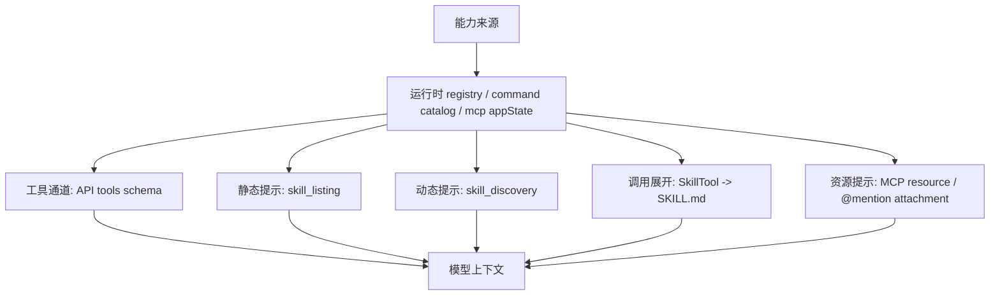

# CCR 扩展能力运行时与上下文重构路线

本文定义 Skill、MCP、Plugin、Tool、Command 等扩展能力从“能力事实”到“模型上下文”和“实际调用”的长期重构路线。

本文不是单轮 goal，也不是完成记录。后续实现应从这里拆出阶段 goal，再按阶段验收。

当前状态：

- R0-R8 已于 2026-06-06 完成主链路拆分，详见 [扩展能力运行时与上下文重构序列](../goals/2026-06-06-extension-runtime-context-refactor-series.md)。
- R0-R8 审核后的一致性缺口已拆为 R9-R12；R9-R12 已于 2026-06-06 完成，详见 [R9-R12 能力目录一致性修复](../goals/2026-06-06-extension-runtime-r9-r12-consistency-repair-series.md)。
- R9-R12 之后的动作、连接器、工具搜索和端到端验收闭环已于 2026-06-06 完成，详见 [R13-R16 能力管理动作、连接器与工具搜索闭环](../goals/2026-06-06-extension-runtime-r13-r16-management-action-connector-toolsearch-closeout-series.md)。
- R13-R16 后两轮代码审查发现的剩余边界问题已于 2026-06-07 通过 R17-R24 收口，详见 [R17-R24 审查问题修复与统一能力目录深化](../goals/2026-06-07-extension-runtime-r17-r24-audit-followup-refactor-series.md)。
- R17-R24 完成后复审发现的 request context、canonical discovery 去重和确认 token 缺口已于 2026-06-07 通过 R25-R27 收口，详见 [R25-R27 上下文同源、发现去重与确认令牌收口](../goals/2026-06-07-extension-runtime-r25-r27-context-discovery-confirmation-closeout-series.md)。
- R25-R27 后再次复审发现的静态 Skill listing 旁路、确认 token 消费语义和外部扩展矩阵未进发布闸门问题已于 2026-06-07 通过 R28-R30 收口，详见 [R28-R30 外部扩展复审收口](../goals/2026-06-07-extension-runtime-r28-r30-audit-followup-closeout-series.md)。

## 1. 目标

当前扩展能力链路已经能工作，但它不是一条统一链路，而是多套 registry 和过滤逻辑并行：

```text
管理页
  -> 关注安装记录、启用状态、来源和诊断

Capability Catalog
  -> 关注统一能力事实和来源关系

Skill listing / Skill discovery
  -> 关注本轮哪些 Skill 名称和描述进入模型上下文

SkillTool / slash command
  -> 关注模型或用户最终能否调用某个 prompt command

MCP tool pool
  -> 关注哪些 MCP / builtin / provider tool 作为 tool schema 暴露给模型
```

本次重构的目标不是一次性重写所有模块，而是把这些链路逐步收敛到同一组能力事实和可见性决策：

```text
统一能力事实
  -> 统一可见性判断
  -> 统一上下文注入计划
  -> 统一动态发现索引
  -> 统一调用适配
  -> 统一管理展示
```

最终口径：

```text
用户看到的是能力事实和状态。
模型看到的是本轮上下文注入结果和工具 schema。
模型调用的是经过运行时可见性校验的能力入口。
三者共享同一能力事实，不再各自发明过滤规则。
```

## 2. 当前流程事实

### 2.1 能力来源

能力来源包括：

| 来源 | 当前主要对象 | 进入运行时的形态 |
| --- | --- | --- |
| managed Skill | installed record / package | prompt `Command` |
| user / project Skill | skills directory | prompt `Command` |
| bundled Skill | bundled package | prompt `Command` |
| dynamic Skill | session dynamic registry | prompt `Command` |
| plugin Skill | plugin cache / manifest | prompt `Command` |
| MCP Skill | Draft SEP-2640 Skill resource | `loadedFrom=mcp` 的 prompt `Command` |
| MCP tool | MCP server `tools/list` | API tool schema |
| builtin Tool | `src/tools.ts` | API tool schema |
| provider capability tool | provider runtime | API tool schema |
| Plugin | plugin manifest / bundle | 能力合集，贡献 Skill / MCP / Tool / Command / Hook / App |

### 2.2 上下文与工具通道

当前进入模型的通道至少有四条：



关键区别：

- MCP tool、builtin tool、provider tool 走 tool schema。
- `skill_listing` 只塞 Skill 名称和描述。
- `skill_discovery` 根据用户输入检索候选 Skill，再塞名称和描述。
- Skill 被模型调用后，`SkillTool` 才展开完整 `SKILL.md`。
- 管理页和 Capability Catalog 不直接把能力塞进模型上下文。

### 2.3 Skill 唤醒流程

Skill 不是被系统直接自动执行，而是二段式：

```text
第 1 轮
  用户输入任务
  -> 系统注入 skill_listing / skill_discovery
  -> 模型看到候选 Skill 名称和描述

第 2 步
  模型判断某个 Skill 匹配当前任务
  -> 调用 Skill("<name>")
  -> SkillTool 校验 command 是否存在、是否 prompt、是否允许模型调用

第 3 步
  processPromptSlashCommand 展开 Skill 内容
  -> SKILL.md 作为 meta user message 进入上下文
  -> 模型按完整 Skill 指令继续执行任务
```

不变式：

- 出现在 `skill_listing` 或 `skill_discovery` 里，不代表已经调用。
- 被发现不代表可执行，执行时仍必须通过 `SkillTool` 校验。
- `modelInvocable=false` 的 Skill 不能进入模型候选，也不能被 `SkillTool` 调用。
- Skill 展开后的内容是上下文材料，不应该再次触发 Skill discovery。

### 2.4 与既有会话上下文链路的边界

CCR 已经有一条独立的会话上下文和展示链路，详见 [CCR 会话上下文与展示链路权威契约](./session-context-and-display-contract.md)。

已有链路负责：

```text
transcript JSONL
  -> currentContextMessages
  -> Core 下一轮模型上下文
```

以及：

```text
transcript JSONL / Core realtime event
  -> ThreadDisplayReducer
  -> ThreadDisplaySnapshot / ThreadDisplayPatch
  -> Desktop Renderer 可见历史
```

本路线只处理扩展能力如何在 turn 内进入模型可见范围：

```text
RuntimeCapability[]
  -> ContextInjectionPlan
  -> skill_listing / skill_discovery / tool schema / SkillTool 展开
  -> 本轮模型请求或后续 meta message
```

边界：

- 本路线不替代 `currentContextMessages` 物化链路。
- 本路线不改变 `ThreadDisplaySnapshot` / `ThreadDisplayPatch` 展示权威。
- 能力注入生成的 attachment / meta message 一旦进入会话，应继续由既有 transcript / materialization / display reducer 链路处理。
- Context Injection Planner 只能决定“本轮注入什么”，不能回放历史、补 UI 项或修改 compact 语义。
- 上下文预算必须消费统一预算 resolver，不能重新按模型名或默认窗口自行估算。

### 2.5 Skill 与 MCP / Tool 的本质差异

Skill、MCP 和 Tool 都可以出现在统一能力目录里，但它们不是同一种运行时对象。

```text
Skill
  -> 指令包 / 工作流知识 / 上下文材料
  -> 调用结果是把 SKILL.md 或 prompt 内容加载进模型上下文
  -> 让模型知道“怎么做”

Tool
  -> 模型可调用的具体操作接口
  -> 调用结果是执行动作并返回结构化或文本结果
  -> 让模型能够“做某个动作”

MCP
  -> 外部工具协议和服务连接
  -> 通常贡献 Tool / Resource / Prompt / 后续可能的 MCP Skill
  -> 让外部系统能力进入 CCR
```

不变式：

- Skill 不是 Tool 的别名。
- MCP server 不是 Skill 的别名。
- Plugin 可以同时携带 Skill 和 MCP，但 Plugin 自身也不是 Skill 或 Tool。
- Skill 的模型调用语义是“加载指令和上下文”，不是直接执行外部操作。
- Tool 的模型调用语义是“执行操作并返回结果”，不是注入一段长期工作流说明。
- MCP tool 应进入 tool schema；Skill 应先进入 `skill_listing` / `skill_discovery`，再由 `SkillTool` 展开。
- 统一能力目录可以统一展示它们，但不能抹平调用语义和安全边界。

## 3. 重构前问题与完成落点

本节保留启动本序列时的问题背景；对应问题已在 R1-R8 分阶段收口，
完成事实以第 5 节和各 Goal 的完成记录为准。

### 3.1 权威来源分散

当前至少存在几组权威：

| 关注点 | 当前入口 |
| --- | --- |
| 管理页安装记录 | Skill / MCP management service |
| 统一能力目录 | Capability Catalog providers |
| Skill 静态列表 | `getSkillToolCommands()` + `getMcpSkillCommands()` + context injection policy |
| Skill 动态发现 | Skill discovery index |
| Skill 执行 | `SkillTool.getAllCommands()` |
| MCP tool 暴露 | `appState.mcp.tools` + `assembleToolPool()` |
| Plugin 来源关系 | plugin loader / capability provider / command metadata |

这些入口经常共享名字和部分字段，但没有共享同一个决策对象。

后果：

- 管理页看到、模型看到、模型能调用可能不一致。
- 同一个字段在不同层有不同语义。
- 过滤条件散落在不同模块，修一个入口容易漏另一个入口。

### 3.2 上下文注入策略和发现策略混在一起

`skill_listing` 是静态注入策略。

`skill_discovery` 是检索策略。

当前二者都从 command 体系旁路取数，又各自过滤。长期看应该改成：

```text
RuntimeCapability[]
  -> ContextInjectionPlanner
     -> staticListing[]
     -> discoveryIndex[]
     -> hidden[]
     -> diagnostics[]
```

也就是说，先统一候选，再决定本轮如何注入。

### 3.3 MCP Skill 实验性契约边界

MCP tool 作为 tool schema 是通的。

MCP Skill 作为 Skill 候选需要满足：

```text
MCP server
  -> skill resource / prompt
  -> loadedFrom=mcp 的 prompt Command
  -> Skill listing / discovery / SkillTool
```

当前 CCR 按 Draft SEP-2640 的资源约定读取 `skill://index.json` 和
`skill:///.../SKILL.md`。该约定仍处于实验阶段，不是当前 MCP 正式
Server feature；读取失败只让 MCP Skill 子能力显式不可用，不影响同一
server 的 Tool、Resource 和 Prompt。

### 3.4 Plugin 关系没有贯穿

Plugin 是能力合集。它贡献出来的 Skill、MCP、Tool、Command、App 必须保留 `parentPluginId` 或等价来源链。

如果来源链丢失，就无法稳定回答：

- 这个 Skill 来自哪个 Plugin？
- 禁用 Plugin 后哪些能力应该消失？
- 管理页为什么某个能力显示在 Skill / MCP / Tool 页面？
- 插件升级后哪些 child capability 需要重新检查？

### 3.5 Command 与 Skill 边界模糊

当前 SkillTool 实际消费 prompt command，其中包含 Skill、plugin command、legacy command 等。

兼容旧 command 可以保留，但必须在模型中分清：

```text
PromptCommand
  -> 技术承载对象

SkillCapability
  -> 面向能力体系的 Skill

LegacyCommand
  -> 兼容入口，不应成为新架构的主称呼
```

这个问题不能通过“把 Skill 当 Tool”解决。长期方向应该是保留 prompt command 作为技术承载对象，但在能力模型里明确区分：

- Skill capability：上下文和工作流能力。
- Tool capability：可执行操作能力。
- MCP capability：外部连接和工具协议能力。
- Plugin capability：能力合集和来源关系。

## 4. 目标分层

### 4.1 能力事实层

职责：

- 枚举所有能力。
- 保留稳定 identity。
- 保留来源、父子关系和安装归属。
- 不判断本轮是否注入上下文。
- 不执行能力。

输入：

- Skill runtime source。
- MCP server / tool / prompt / resource。
- Plugin manifest / cache。
- builtin tool registry。
- provider capability。
- App / connector 状态。

输出：

```text
CapabilityFact
  id
  kind
  name
  displayName
  source
  parentPluginId
  parentAppId
  owner
  installState
  rawMetadata
```

### 4.2 运行时可见性层

职责：

- 判断能力当前是否可用。
- 判断模型能否调用、用户能否调用、工具能否暴露。
- 输出 hidden reason 和 diagnostics。

输入：

- `CapabilityFact[]`
- 用户配置。
- installed package 检查结果。
- MCP 连接状态。
- permission / policy。
- feature flags。

输出：

```text
RuntimeCapability
  fact
  state
  runtimeVisible
  modelInvocable
  userInvocable
  toolInvocable
  hiddenReasons[]
  diagnostics[]
```

不变式：

- `enabled=false` 表示能力被用户禁用。
- `modelInvocable=false` 只表示模型调用面关闭，不能显示成能力禁用。
- `runtimeVisible=false` 的能力不能进入模型候选。
- 运行时不可见必须有原因。

### 4.3 上下文注入计划层

职责：

- 针对当前 turn 决定哪些能力进入模型上下文。
- 统一生成 `skill_listing`、`skill_discovery`、后续可能的 capability hints。
- 处理上下文预算、已发送集合、agent 维度、重复注入。

输入：

```text
RuntimeCapability[]
TurnContext
ContextBudget
AgentContext
PreviouslyInjectedState
```

输出：

```text
ContextInjectionPlan
  staticSkillListing[]
  discoveryCandidates[]
  toolHints[]
  hidden[]
  diagnostics[]
  budgetUsage
```

不变式：

- 管理页展示不等于上下文注入。
- 运行时可见不等于本轮注入。
- 同一 agent 已注入过的静态列表项不重复注入。
- 上下文预算裁剪必须保留 managed Skill 和明确启用的关键能力。

### 4.4 动态发现层

职责：

- 为当前用户任务检索相关能力。
- 第一阶段以 Skill 为主，后续可以扩展到 MCP / Tool / Plugin 子能力。
- 输出可解释匹配结果。

输入：

```text
discoveryCandidates[]
userInput
recentMessages
workspaceSignals
```

输出：

```text
DiscoveryResult[]
  capabilityId
  name
  description
  score
  matchedFields
  reason
```

不变式：

- 动态发现是检索策略，不是安装记录。
- 没有命中不代表能力不存在。
- 命中不代表已调用。
- 动态发现结果必须再次通过运行时可见性约束。

### 4.5 调用适配层

职责：

- 把运行时能力转成实际调用入口。
- Skill 走 `SkillTool` / prompt command expansion。
- MCP tool 走 tool schema。
- MCP resource 走 attachment。
- Plugin 自身不直接调用，调用它贡献的 child capability。

输出：

```text
InvocationAdapter
  capabilityId
  invocationKind
  commandName?
  toolName?
  mcpServerName?
  mcpToolName?
  resourceUri?
```

不变式：

- 能力事实不能直接绕过调用适配。
- `SkillTool` 执行前必须重新校验运行时可见性。
- MCP tool 名称冲突不能静默覆盖。

### 4.6 管理展示层

职责：

- 展示能力事实、状态、来源关系和可操作项。
- 不重新判断 runtimeVisible。
- 不把 installed record 当成唯一能力目录。

输入：

```text
RuntimeCapability[]
ManagementProjectionOptions
```

输出：

```text
SkillManagementDto
McpManagementDto
PluginManagementDto
CapabilityManagementDto
```

不变式：

- Skill 页面可以过滤 Skill，但来源仍来自统一能力目录。
- MCP 页面可以过滤 MCP server / MCP tool，但来源仍来自统一能力目录。
- Plugin 页面展示 bundle，同时展开 child capabilities。

### 4.7 与现有上下文和预算接口

上下文注入层应作为现有 query / attachment 链路的上游计划器，而不是新建第二条模型上下文管线。

输入应来自：

```text
RuntimeCapability[]
TurnContext
current messages
queued commands
agent id
appState.mcp
context budget resolver
```

输出应交给既有入口消费：

```text
skill_listing attachment
skill_discovery attachment
tool schema exposure
SkillTool invocation adapter
diagnostics
```

不变式：

- 不直接写 transcript。
- 不直接生成 `currentContextMessages`。
- 不直接生成 `ThreadDisplaySnapshot`。
- 不直接估算模型上下文窗口。
- 只输出计划和诊断，由现有 query / attachment / tool pool / SkillTool 链路执行。

## 5. 分阶段重构路线

### R0 流程冻结与证据文档

状态：已完成（2026-06-06）。

目标：

- 冻结当前流程事实。
- 补齐“能力如何到上下文”的源码证据索引。
- 为后续每个阶段提供回归基线。

产物：

- 本文。
- [扩展能力运行时与上下文源码证据索引](../references/extension-runtime-context-source-evidence.md)。
- 当前 `skill_listing`、`skill_discovery`、`SkillTool`、MCP tool schema、Plugin child capability 的源码证据表。
- 与既有 `currentContextMessages`、`ThreadDisplaySnapshot`、上下文预算 resolver 的边界清单。
- smoke 清单。

验收：

- 能说清每条能力从来源到模型上下文或工具 schema 的路径。
- 能列出每条路径的当前过滤条件。
- 能说清本路线不改会话物化、不改展示 reducer、不改自动 compact。
- 不改运行时代码。

### R1 能力事实模型收敛

状态：已完成（2026-06-06）。

目标：

- 让 Capability Catalog 成为能力事实入口。
- 补齐 stable id、kind、source、parent relation、owner。

范围：

- Skill / MCP / Plugin / Tool / App provider 输出字段对齐。
- 不改变上下文注入和执行逻辑。

验收：

- 同一个 Plugin 贡献的 Skill / MCP / Tool 能通过 parent relation 追溯。
- 同名不同来源能力能同时诊断，不静默合并。
- `capabilities/list` 能表达完整来源链。
- 已落地：plugin Skill 保留 `parentPluginId`，MCP resource / prompt 有独立 capability kind，Capability Catalog 同类冲突键为 `kind + name`。

### R2 运行时可见性 Resolver

状态：已完成（2026-06-06）。

目标：

- 把 enabled、runtimeVisible、modelInvocable、userInvocable、toolInvocable 的判断集中起来。

范围：

- Skill 先接入。
- MCP tool / Plugin child capability 输出只读状态。
- 旧入口保留适配，但不再新增过滤判断。

验收：

- `modelInvocable=false` 不再被显示成 Skill 禁用。
- installed package 缺失、漂移、无 lock、无 owner marker 都有统一 hidden reason。
- SkillTool、slash command、管理页拿到同一组运行时状态。
- 已落地：`capabilityRuntimeVisibility` 统一输出 `hiddenReasons` 和运行时 diagnostics；SkillTool validate 通过 `skillCommandRuntimeVisibility` adapter 消费同一 resolver 语义。

### R3 上下文注入计划抽出

状态：已完成（2026-06-06）。

目标：

- 把 `skill_listing` 和 `skill_discovery` 的候选选择统一到 `ContextInjectionPlanner`。

范围：

- `attachments.ts` 只消费注入计划。
- 静态列表、动态发现候选、预算裁剪、已发送集合都进入同一策略模块。
- 上下文预算只消费统一预算 resolver。
- 不改变 SkillTool 展开协议。

验收：

- 每个未注入的 Skill 都能解释原因。
- managed Skill 不因动态发现开关被静默丢失。
- project / plugin / dynamic Skill 是否进静态列表由策略显式决定，而不是散落在 attachment 里。
- 已落地：`skillContextInjectionPlanner` 输出静态列表、发现候选、隐藏原因、诊断和预算统计；`attachments.ts` 与 turn-zero discovery 均消费该 planner。

### R4 动态发现闭环

状态：已完成（2026-06-06）。

目标：

- 让动态发现从“共用索引函数”收敛为消费注入计划的单一发现服务。

范围：

- `discoveryCandidates[]` 增加 stable identity 和来源投影。
- turn-zero、inter-turn 和 `DiscoverSkills` 共用同一发现服务。
- 删除当前 inter-turn `null` 查询；只有真实信号存在时才检索。
- session 发现状态从名称升级为 capability identity，名称只保留兼容用途。

验收：

- 用户问“有哪些 Skill”或描述任务时返回带来源和解释的候选。
- 无输入或无命中时不注入空提示。
- 动态发现结果只包含 runtimeVisible 且 modelInvocable 的候选。
- 同名不同来源候选不会在建索引前静默丢失。

### R5 MCP Skill 与 MCP Tool 边界闭环

状态：已完成（2026-06-06）。

目标：

- 冻结 MCP Skill 来源契约。
- 明确 MCP tool、MCP prompt、MCP Skill、MCP resource 的四种路径。
- 按契约补齐 MCP Skill 获取，或保持显式 unavailable，禁止伪装成功。

范围：

- MCP tool 继续走 tool schema。
- MCP resource 继续走 attachment。
- MCP prompt 不自动伪装成 Skill。
- MCP Skill 必须有明确来源、loadedFrom、调用适配和失败诊断。
- MCP server 状态必须传播到 child capability。

验收：

- 能力目录能区分 server、tool、resource、prompt、Skill。
- MCP Skill 不可用时给出显式诊断，不影响普通 MCP tool。
- MCP prompt 无法经由 SkillTool 猜名调用。
- MCP tool 和 MCP Skill 冲突分别诊断。

### R6 Plugin 能力合集关系贯穿

状态：已完成（2026-06-06）。

目标：

- Plugin 作为 bundle，child capability 全链路使用统一 identity 和 parent relation。

范围：

- 抽出统一 Plugin identity resolver。
- 贯穿 Plugin Skill、MCP、Tool、Command、Hook 和 App relation。
- 支持 Plugin -> MCP server -> MCP child 两级关系。
- Plugin disabled / failed / unloaded 状态传播到 child capability。

验收：

- 禁用或卸载 Plugin 时能推导受影响 child capability。
- 能力目录中 Plugin 和 child capability 不互相替代。
- Plugin MCP 不再通过 `installKind` 猜 parent relation。
- reload / upgrade 后不残留 stale child capability。

### R7 管理页切到统一读模型

状态：已完成（2026-06-06）。

目标：

- 新增服务端 Management Projection。
- Skill / MCP / Plugin / Capability 页面不再各自拼安装记录和运行状态。
- 写操作继续走现有领域服务。

范围：

- 保留 `capabilities/list` 作为原始目录接口。
- 新增 typed management endpoint 或等价协议。
- Skill 页面显示所有 Skill capability，并区分 management ownership。
- MCP 页面显示 server、tool、resource、prompt 和 Skill。
- Plugin 页面显示 bundle、child capability 和影响面。

验收：

- 用户安装 Plugin 后，其 Skill 和 MCP 能在对应页面看到，并显示来源。
- 管理页展示状态和模型运行时状态一致。
- 不再出现“页面显示启用，但模型完全不知道”的无诊断状态。
- runtime-only 能力可见但不伪造修复、卸载等动作。

### R8 旧过滤逻辑收口

状态：已完成（2026-06-06）。

目标：

- 删除或隔离剩余重复过滤和来源判断。
- 保留 legacy 兼容入口，但必须显式命名和测试。

范围：

- `getSkillToolCommands()` 逐步退化为 adapter。
- `localSearch`、planner、policy 不重复判断同一运行时状态。
- SkillTool、listing、discovery 使用统一 runtime catalog 或 projection。
- Capability Catalog 不做执行判断。
- 清理与真实行为不一致的注释、系统提示和文档。

验收：

- 关键路径都有 smoke。
- 旧入口没有静默 fallback。
- 文档、代码注释和系统提示不再暗示未实现能力。
- enabled、runtimeVisible、modelInvocable、来源策略和父子状态各有唯一 owner。

### R9-R12 能力目录一致性修复

状态：已完成（2026-06-06）。

目标：

- 补齐 MCP runtime 子能力进入 Capability Catalog 和管理投影的事实来源。
- 修复 Skill installed inspection 与 runtime command 的稳定身份关联。
- 收口 slash command、SDK/system-init、REPL bridge 和 SkillTool 统计的旧过滤逻辑。
- 让 Desktop Skill 页从安装记录列表切到 Skill capability 管理投影。

设计：

- [R9-R12 能力目录一致性修复](../goals/2026-06-06-extension-runtime-r9-r12-consistency-repair-series.md)。

验收：

- `capabilities/list` / `capabilities/management/list` 能解释 MCP Server、MCP Tool、MCP Resource、MCP Prompt、MCP Skill 的来源、状态和诊断。
- 同名不同来源 Skill 不再因 `name` 误挂 installed inspection。
- slash command、SDK/system-init、REPL bridge、SkillTool 统计和实际 SkillTool validate 对 runtime visibility 的判断一致。
- Desktop Skill 页按 Skill capability 展示，并通过 `allowedActions` / `actionRef` 控制可见操作；真正的统一动作执行入口留给 R13 收口。

### R13-R16 能力管理动作、连接器与工具搜索闭环

状态：已完成（2026-06-06）。

目标：

- 把 `allowedActions` / `actionRef` 从管理投影展示字段收口为能力管理动作 plan / apply 的预检依据。
- 明确 App / Connector 是真实来源接入还是设计预留，避免把 synthetic input 写成用户可用能力。
- 让 Tool Registry、ToolSearch 和 Capability Catalog 对同一个工具使用同一套来源、可用性和暴露策略。
- 增加真实 App Server / workspace / configHome 路径的端到端 smoke 和 release gate。

设计：

- [R13-R16 能力管理动作、连接器与工具搜索闭环](../goals/2026-06-06-extension-runtime-r13-r16-management-action-connector-toolsearch-closeout-series.md)。

验收：

- Desktop 通过统一能力动作入口执行已支持的 Skill / MCP 管理动作；旧 IPC 只能作为薄 adapter 或显式 legacy。
- App / Connector 有真实来源和鉴权状态，或者在文档、CLI、Desktop 中被明确标为预留。
- ToolSearch、Tool Registry、Capability Catalog 对 MCP tool、provider tool、deferred tool 和 internal tool 的解释一致。
- release smoke 覆盖真实能力管理链路，不只依赖手写 capability fixture。

完成记录：

- `managementActionService.ts`、App Server `capabilities/management/action/plan|apply`、Desktop Skill / MCP 管理动作已形成统一动作入口。
- `AppConnectorSnapshot` 已作为预留 DTO 定型；当前无真实 connector registry 时不会生成用户可见 App capability。
- `toolCapabilitySnapshot.ts` 成为 ToolSearch policy 与 Tool Capability Provider 的共享工具快照。
- `smoke:extension-capability-management-e2e` 已纳入 release smoke group。

### R17-R24 审查问题修复与统一能力目录深化

状态：已完成（2026-06-07），复审发现的剩余缺口已拆入 R25-R27。

目标：

- 把 R13-R16 后两轮审查发现的问题拆成可执行 goal。
- 继续收口 canonical capability id、MCP action ownership、Skill install transaction、Skill runtime catalog、Skill discovery、Tool pool、App / Plugin 关系和 release gate。

设计：

- [R17-R24 审查问题修复与统一能力目录深化](../goals/2026-06-07-extension-runtime-r17-r24-audit-followup-refactor-series.md)。

阶段拆分：

- R17：统一能力模型与 ID 契约，解决 Skill 管理目录和 discovery ID 不一致、parent Plugin missing 误判等问题。
- R18：MCP 管理动作边界收口，解决 runtime-only / plugin-owned MCP 错误写配置和安装态误判。
- R19：Tool 能力目录接真实工具池，解决 Capability Catalog 和真实 app-server tool pool 不同源。
- R20：Skill 安装事务与 repair 收口，解决 force / repair / packageTree drift 和检查重复。
- R21：Skill 运行时目录同源，解决 configHome、diagnostics 和管理页运行时视图不一致。
- R22：Skill 上下文注入与动态发现收口，解决 discovery 去重、feature gate 和上下文解释断层。
- R23：App / Plugin 外部扩展关系契约，解决 App schema、parentPluginId 和缺失父 Plugin 语义。
- R24：测试、文档与发布闸门，把 R17-R23 的边界纳入 smoke 和 release gate。

验收：

- 两轮审查列出的 P1 / P2 / P3 问题都有对应代码修复、smoke 或明确后续记录。
- 管理目录、上下文注入、动态发现和工具池使用同一套能力事实和来源语义。
- runtime-only / plugin-owned / manual-config / installer-owned 的管理动作边界清晰。
- 文档、goal README、专题文档和 CHANGELOG 不再把计划项写成已实现能力。

完成后复审新增后续：

- Skill 的 request-scoped `configHomeDir` 已通过 R25 贯穿到 `skill_listing`、`skill_discovery` 和 `SkillTool`。
- Skill discovery 的 visible / loaded / discovered 去重已通过 R26 从 name-based 补齐为 canonical capability id based。
- 能力管理动作确认 token 已通过 R27 增加状态摘要、过期时间和 nonce 约束。

### R25-R27 上下文同源、发现去重与确认令牌收口

状态：已完成（2026-06-07）。

目标：

- 让 Skill 管理目录、上下文注入、动态发现和 SkillTool 调用全部消费当前请求的 `cwd/configHomeDir`。
- 让 visible / discovered / loaded 三类上下文可见性记录使用 canonical capability id，避免同名不同来源 Skill 被 name-only 误过滤。
- 让危险管理动作确认 token 绑定当前 plan 状态，并具备过期和复用约束。

设计：

- [R25-R27 上下文同源、发现去重与确认令牌收口](../goals/2026-06-07-extension-runtime-r25-r27-context-discovery-confirmation-closeout-series.md)。

阶段拆分：

- R25：Skill request context 贯穿到注入与 SkillTool，解决真实上下文仍可能读默认 home 的问题。
- R26：Skill visibility ledger 与 canonical 去重，解决 listing / discovery / SkillTool loaded 状态记录不完整的问题。
- R27：能力管理确认 token 状态绑定，解决静态 token 可预测和过期确认复用风险。

验收：

- 指定 `configHomeDir` 后，Capability Catalog、`skill_listing`、`DiscoverSkills` 和 SkillTool validate/call 同源。
- discovery 任务查询按 canonical capability id 去重；catalog 查询仍返回完整清单。
- 管理动作 apply 阶段重新计算当前投影，并校验 token 未过期、状态摘要一致；apply attempt 被 guard 接受后 token 不可重复使用。
- R25-R27 smoke 纳入 release gate。

已落地：

- `SkillRuntimeRequestContext` 统一携带当前请求 `cwd/configHomeDir/mcpCommands`；QueryEngine 和 Core turn runner 都写入 `ToolUseContext.options.configHomeDir`。
- `getSkillToolCommands(cwd, { configHomeDir })`、`attachments.ts`、`skillSearch/prefetch.ts` 和 `SkillTool` 均消费同一 request context。
- `SkillVisibilityLedger` 统一记录 visible / discovered / loaded 的 name 与 capability id；有 canonical id 时 discovery 不再用 name-only 过滤不同来源 Skill。
- 能力管理动作 plan 绑定 state digest 和短期 opaque token；apply 阶段用当前投影重算 plan 后验证 token。
- 新增 `smoke:skill-request-context-e2e`、`smoke:skill-visibility-ledger`、`smoke:capability-management-confirmation-token`，并加入 `smoke:skill-release` / `smoke:skill-internal-refactor`。

完成后复审新增后续：

- 静态 `skill_listing` 已通过 R28 改为消费共享 model-invocable Skill runtime catalog，不再在 `attachments.ts` 中 name-only 合并 local / MCP Skill。
- 确认 token 已通过 R29 定型为一次性 apply-attempt token：apply guard 接受后即消费，底层动作失败也要重新 plan。
- `smoke:external-extension-matrix` 已通过 R30 纳入 `mcp`、`skill` 和 `skill-internal` release smoke group。

### R28-R30 外部扩展复审收口

状态：已完成（2026-06-07）。

目标：

- 让 `skill_listing`、`skill_discovery` 和 SkillTool 对同名 Skill 使用同一套 runtime catalog priority。
- 消除 `attachments.ts` 中 local / MCP Skill 的 name-only merge 旁路。
- 把能力管理确认 token 的消费时机定型为 apply attempt accepted 后消费，并同步代码注释、goal 文档和 smoke。
- 把外部扩展矩阵 smoke 纳入发布闸门，避免跨域回归只停留在手动自测。

设计：

- [R28-R30 外部扩展复审收口](../goals/2026-06-07-extension-runtime-r28-r30-audit-followup-closeout-series.md)。

阶段拆分：

- R28：Skill 静态 listing 接 SkillRuntimeCatalog，解决模型首轮看到的 Skill 和 SkillTool 实际调用的 Skill 可能不一致的问题。
- R29：管理动作确认 token 消费语义定型，解决 token 生命周期文档和实现口径不一致的问题。
- R30：外部扩展矩阵纳入发布闸门，解决 `smoke:external-extension-matrix` 只可手动运行、未自动守住 release gate 的问题。

验收：

- 静态 listing、动态 discovery 和 SkillTool 不再各自决定同名 Skill 优先级。
- local / MCP / legacy 同名冲突能通过 runtime catalog diagnostic 解释。
- 确认 token 的消费时机在代码、文档、smoke 中一致。
- 失败后的危险动作重试策略明确为重新 plan、重新确认。
- `smoke:external-extension-matrix` 进入至少一个 release smoke group，并保持不少于 50 个用例通过。

完成记录：

- 新增 `SkillRuntimeCatalogLoader`，`skill_listing`、`skill_discovery` 和 `SkillTool` 共用 request-scoped model-invocable Skill runtime catalog。
- 新增 `smoke:skill-listing-runtime-catalog-alignment`，覆盖 legacy command 与 MCP Skill 同名时 listing / discovery 与 runtime priority 对齐。
- `smoke:capability-management-confirmation-token` 覆盖 guard 通过后底层动作失败时旧 token 不可复用。
- `smoke:external-extension-matrix` 已进入 `mcp`、`skill`、`skill-internal` release group，并保持 77 cases 通过。
- 已验证 `npm.cmd run smoke:mcp-release` 与 `npm.cmd run smoke:skill-release` 均可跑到外部扩展矩阵并通过。

## 6. 推荐验证矩阵

每个阶段至少覆盖：

| 验证项 | 目的 |
| --- | --- |
| build | 确认源码和 dist 可构建 |
| typecheck | 确认类型边界 |
| skill listing smoke | 确认静态注入候选 |
| skill discovery smoke | 确认动态发现候选 |
| SkillTool smoke | 确认发现后可调用 |
| MCP tool smoke | 确认普通 MCP tool 不受影响 |
| capability catalog smoke | 确认统一目录来源关系 |
| desktop/manual smoke | 确认管理页显示和 runtime 状态一致 |
| git diff --check | 确认文档和代码无格式问题 |

## 7. 非目标

本路线暂不做：

- 不一次性重写 Skill、MCP、Plugin 全部管理页。
- 不把 Plugin 变成 Skill。
- 不把 MCP prompt 自动当成 Skill。
- 不重构 `currentContextMessages` 会话物化链路。
- 不重构 `ThreadDisplaySnapshot` / `ThreadDisplayPatch` 展示链路。
- 不重新设计自动 compact 和上下文预算 resolver。
- 不引入远端 Skill registry。
- 不引入 embedding 或 LLM rerank 作为基础依赖。
- 不改变模型工具调用协议。
- 不改变 MCP tool 的既有命名规则。

## 8. 后续拆 goal 原则

后续每个 goal 必须回答：

- 本阶段只改哪一层。
- 输入是什么。
- 输出是什么。
- 哪些旧入口保留为 adapter。
- 哪些旧入口必须删除或显式隔离。
- 本阶段不会改变哪些用户可见行为。
- 本阶段新增哪些 smoke。

如果一个 goal 同时修改能力事实、上下文注入、动态发现、管理页和执行入口，说明它太大，应继续拆分。

## 9. G1-G4 根因重构

R0-R30 完成后再次复审发现，剩余问题已不适合继续按单个 Provider 或页面补丁处理。后续以 [G1-G4 外部扩展根因重构](../goals/2026-06-07-extension-capability-g1-g4-root-refactor-series.md) 为权威执行计划：

状态：G1-G4 已完成（2026-06-07）。

- G1：Core 一次性构建请求级能力运行环境，Provider 只读投影。
- G2：所有能力使用来源感知 canonical id，并建立 Plugin / App / MCP 父子关系图。
- G3：App / Connector 使用会话级 registry，闭合 list、plan、apply 生命周期。
- G4：用跨 home、同名来源、父状态传播和生命周期连续性反例守住 release gate。

这四个阶段不会把 Skill、MCP 和 Tool 合并成同一种运行时；统一的是请求事实、身份、关系和管理生命周期。

当前落点：

- `CapabilityRuntimeEnvironment` 已成为能力 Provider 的统一请求事实。
- canonical capability id 与 Plugin / App / MCP 父子关系图已落地，缺失和歧义关系显式诊断。
- `AppCapabilityRegistry` 已闭合 `register -> list -> management -> plan -> apply` 生命周期，并按 Core / App Server 会话隔离。
- 外部扩展矩阵已扩展到 85 项，G1-G3 专项 smoke 已接入 release smoke group。
- G4 发布门禁已通过 MCP 19/19、Skill 50/50、Skill internal 33/33、Desktop 15/15；真实 `ccr -p` 和 Windows TTY 启动回归也已通过。

阶段结论：G1-G4 已经把外部扩展的底层 capability model 收到可维护边界，后续不应继续把所有问题塞进“根因重构”。深度复审现有 Plugin 源码后，产品化路线修正为“复用现有 Plugin 领域，补请求级适配、管理读模型、事务、运行时激活和 Desktop”，不再新建 `.ccr-plugin`、第二套安装数据库或平行 Marketplace。

后续 Goal：

- P0：冻结设计权威和兼容基线，清理错误的第二套 Plugin 系统表述。
- P1：建立请求级 `PluginDomainSession`、路径端口与缓存隔离。
- P2：建立无副作用 Inspector，以及合并候选、作用域 intent、安装实例、缓存、加载和 runtime activation 的多实例读模型。
- P3：建立 Plugin 独立 plan / apply 协议；Capability 管理层只引用领域计划。
- P4：将 settings-first 安装改为全量 stage、journal commit、revision 冲突检测和幂等 reconciliation。
- P5：抽出 `PluginRuntimeActivator`，显式建模 installed version、active version、部分激活和 pending activation。
- P6：收口依赖、更新、回滚、旧版本引用和 GC。
- P7：收口普通配置、敏感配置和持久数据治理。
- P8：先冻结 App 的 provides/requires/suggests/configures 关系和注册 ownership，再在现有 manifest 上增加最小关系桥接；真实状态仍来自 registry。
- P9：产品化 Desktop 已安装 Plugin 工作台。
- P10：补本地 Plugin 文件夹 / zip 导入、安装确认和目录刷新；远程 Marketplace 浏览继续作为后续来源扩展。
- P11：建立样例 Plugin 和故障维度矩阵；用例不少于 50，但以不变式和反例覆盖率为完成标准。
- P12：完成兼容迁移、发布门禁和旧入口收口。

P0-P12 的权威设计入口见 [CCR Plugin 接入与产品化设计](./plugin-system-product-design.md)，执行记录见 [Plugin 产品化 P0-P12 Goal Series](../goals/2026-06-08-plugin-productization-p0-p12-series.md)，源码依据见 [Plugin 系统源码证据索引](../references/plugin-system-source-evidence.md)。后续应按顺序执行单个 Goal，不允许 UI、事务和运行时刷新一次性混改。
