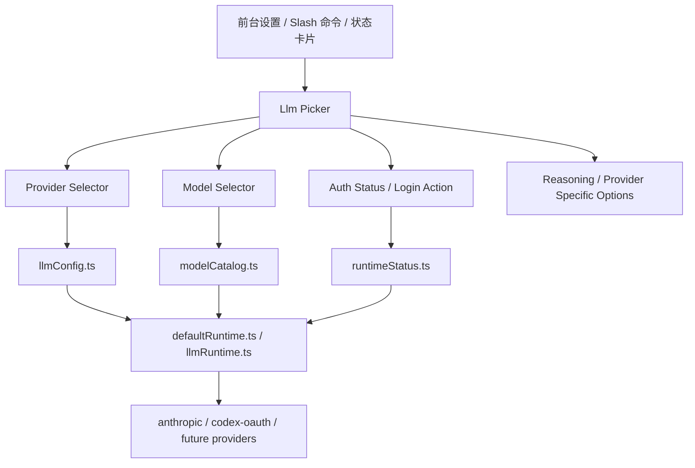

# 前台 Provider / Model 切换设计方案

## 1. 文档目标

本文档用于回答一个非常具体的问题：

**以后 `ccr` 如果要做前台模型选择，如何既支持 `Codex OAuth`，又能在同一个 provider 下切换多个 ChatGPT / Codex 模型，而不是继续停留在 Claude 专用模型选择器上。**

本文档只讨论这一条前台主线：

- 如何展示 provider
- 如何展示 model
- 如何保存当前选择
- 如何区分“仅本次会话”与“设为默认”
- 如何支持 `codex-oauth` 下多个模型
- 如何与当前 `builtin LLM runtime` 对齐

不讨论的内容：

- 不展开新的 OAuth 协议设计
- 不展开新的工具调用协议设计
- 不展开新的 query 主循环重写
- 不把所有 Anthropic 旧逻辑一次性重构掉

---

## 2. 结论先行

前台不应该继续做成“单一模型下拉框”，也不应该把所有 provider 的模型混成一个列表。

正确的形态应该是：

```text
第一层：Provider 选择
第二层：Model 选择
第三层：Provider 专属能力参数（如 reasoning、auth、baseUrl、capabilities）
```

也就是：

```text
Provider = Anthropic / Codex OAuth / 后续其他
Model = 当前 Provider 下可选模型
```

如果用户选择：

```text
Provider = codex-oauth
```

那么下方 `Model` 列表只显示：

- `gpt-5.4`
- `gpt-5.4-mini`
- 后续新增的 `gpt-5.5`
- 后续灰度/套餐开放的其他 Codex/ChatGPT 模型

而不是继续显示：

- `sonnet`
- `opus`
- `haiku`

这套设计的核心价值是：

- 前台展示真实 provider
- 前台展示真实 model
- 允许同一 provider 下有多个模型
- 不再依赖 Anthropic 专用模型槽位
- 与当前内置通用 LLM Runtime 一致

---

## 3. 当前现状

当前仓库里，和这件事直接相关的基础层已经有了，但前台入口还没有真正通用化。

### 3.1 已有基础

#### 3.1.1 Provider 定义

当前内置 provider 定义在：

- [providerDefinitions.ts](D:/agent_project/claude-code-reforged/src/services/llm/providerDefinitions.ts)

当前已经有：

- `anthropic`
- `codex-oauth`

并且已经能表达：

- `displayName`
- `apiMode`
- `authStrategy`
- `capabilities`

这说明：

**前台要做 provider 选择器，并不需要重新发明 provider 层。**

#### 3.1.2 模型目录

当前模型目录在：

- [modelCatalog.ts](D:/agent_project/claude-code-reforged/src/services/llm/modelCatalog.ts)

现在 `codex-oauth` 已经有最小目录：

- `gpt-5.4`
- `gpt-5.4-mini`

并且已经能表达：

- `displayName`
- `contextWindow`
- `maxOutputTokens`
- `supportsReasoning`
- `supportsTools`
- `inputModalities`

这说明：

**前台需要的不是从零开始建模型表，而是把现有模型目录从“内部函数”提升成“前台可读模型列表”。**

#### 3.1.3 配置持久化

当前配置读取和写回在：

- [llmConfig.ts](D:/agent_project/claude-code-reforged/src/services/llm/llmConfig.ts)

当前已经支持：

- `provider`
- `model`
- `providers.<providerId>.defaultModel`
- provider 级别覆盖项

配置文件默认路径：

- [llm.config.local.json](C:/Users/luoji/.ccr/data/llm.config.local.json)

这说明：

**前台切换 provider/model 的持久化入口已经存在，不需要另起一套配置系统。**

#### 3.1.4 状态展示

当前运行时展示状态在：

- [runtimeStatus.ts](D:/agent_project/claude-code-reforged/src/services/llm/runtimeStatus.ts)

当前已经能生成：

- provider 名称
- apiMode
- authStrategy
- modelCatalogEntry
- auth status

这说明：

**前台状态卡片也不是从零开始，已经有可读数据源。**

### 3.2 当前真正的问题

当前前台和 CLI 入口的模型切换仍然是 Anthropic 视角。

代表文件：

- [model.tsx](D:/agent_project/claude-code-reforged/src/commands/model/model.tsx)

当前的问题有 4 个：

1. `/model` 仍然主要围绕 Anthropic / Claude 模型组织
2. 当前选择器不是“provider + model”两级结构
3. `codex-oauth` 虽然已接入运行时，但前台没有完整切换入口
4. 同一 provider 下多个模型的能力没有前台化

---

## 4. 为什么不能直接做“多个 ChatGPT 模型按钮”

看起来最省事的做法是：

```text
在前台直接加几个按钮：
GPT-5.4 / GPT-5.4-mini / GPT-5.5
```

但这条路长期一定会乱，原因是：

### 4.1 模型是 provider 维度的，不是全局共享维度

`gpt-5.4` 属于 `codex-oauth`  
`claude-sonnet-4-6` 属于 `anthropic`

它们不是同一套命名空间。

### 4.2 同一个模型名未必对所有 provider 都可用

未来如果有：

- `openai-api`
- `openai-compatible`
- `codex-oauth`

它们即使都叫 `gpt-5.4`，也未必：

- transport 相同
- 权限相同
- usage 计费相同
- 支持工具相同
- 支持 reasoning 相同

### 4.3 可见模型可能受账号与灰度影响

尤其是 ChatGPT / Codex 这类 provider，模型列表可能受：

- 套餐
- 灰度
- 可用性策略
- 产品端开关

影响。

所以前台不应该把模型写死成“永远显示的全局按钮”，而应该：

```text
先选 provider
再读取该 provider 的模型目录
最后渲染模型列表
```

---

## 5. 目标形态

## 5.1 总体结构



## 5.2 前台最小可见形态

第一版前台建议至少有这 4 个区块：

1. 当前 Provider
2. 当前 Model
3. 当前登录状态
4. Provider 专属参数

示例：

```text
LLM Provider: Codex OAuth
Model: GPT-5.4
Auth: 已登录
Reasoning: high
```

如果切到未登录的 `codex-oauth`：

```text
LLM Provider: Codex OAuth
Model: GPT-5.4
Auth: 未登录
[登录 Codex OAuth]
```

如果切到 `anthropic`：

```text
LLM Provider: Anthropic
Model: Sonnet 4.6
Auth: 已登录 / API Key
```

---

## 6. 用户交互设计

## 6.1 入口设计

建议未来统一 3 个入口：

1. 设置面板（推荐）
2. `/model` 命令（CLI/TUI 快捷入口）
3. 状态页只读展示

### 6.1.1 设置面板

这是主入口，建议包含：

- Provider 下拉框
- Model 下拉框
- Auth 状态与登录按钮
- “仅本次会话” / “设为默认” 两种保存方式

### 6.1.2 `/model`

`/model` 不再只是 Anthropic 模型切换，而是升级成：

```text
/model
  -> 选择 provider
  -> 选择 model
  -> 可选设置 reasoning
```

### 6.1.3 状态页

状态页主要只读，不承担复杂编辑，但要能明确展示：

- 当前 provider
- 当前 model
- model 能力信息
- auth 状态

---

## 6.2 交互规则

### 6.2.1 两层选择

交互顺序固定为：

1. 先选 `Provider`
2. 再选 `Model`

切换 provider 后：

- model 列表立即刷新
- 若旧模型不属于新 provider，则自动回落到该 provider 默认模型

### 6.2.2 两种作用域

前台必须明确区分：

1. `仅本次会话`
2. `设为默认`

原因：

- 有些时候用户只是临时从 `gpt-5.4` 切到 `gpt-5.4-mini`
- 有些时候用户希望之后全部默认都走 `codex-oauth / gpt-5.4`

这两个不能混。

### 6.2.3 登录与选择分离

选择 provider 不等于已经登录。

例如：

```text
用户切到 codex-oauth
-> Provider 切换成功
-> 如果未登录，前台显示“需要登录”
-> 登录完成后再允许真实调用
```

前台不要把“切 provider”和“完成 auth”混成一个动作。

---

## 7. 数据模型设计

## 7.1 Provider 层

现有 `LlmProviderDefinition` 可以继续保留，但建议前台读取时补一层更适合展示的视图模型：

```ts
interface LlmProviderViewModel {
  id: string
  displayName: string
  apiMode: string
  authStrategy: string
  capabilities: {
    streaming: boolean
    tools: boolean
    reasoning: boolean
    usage: boolean
  }
  defaultModel?: string
  authState: 'available' | 'configured' | 'missing'
}
```

目的：

- 前台不直接拼多个服务函数
- 前台只消费一个“可渲染 provider 状态对象”

## 7.2 Model 层

当前 `modelCatalog.ts` 是“按 provider + model 取单个条目”，但前台更需要：

```ts
listModelsForProvider(providerId): LlmModelCatalogEntry[]
```

建议新增统一模型列表接口：

```ts
interface LlmModelOption {
  provider: string
  model: string
  displayName: string
  contextWindow: number
  maxOutputTokens: number
  supportsReasoning: boolean
  supportsTools: boolean
  inputModalities: string[]
  source: 'builtin' | 'config' | 'dynamic'
}
```

这个 `source` 很重要，因为未来模型来源会分成三层。

---

## 8. 模型来源的三层结构

为了支持未来多个 ChatGPT / Codex 模型，不建议把模型列表只写死在 [modelCatalog.ts](D:/agent_project/claude-code-reforged/src/services/llm/modelCatalog.ts)。

建议模型来源分为三层：

### 8.1 第一层：内置目录（builtin）

这是第一版默认来源。

例如 `codex-oauth` 内置：

- `gpt-5.4`
- `gpt-5.4-mini`

优点：

- 稳
- 可控
- 不依赖远端接口

### 8.2 第二层：本地覆盖（config）

用户可以在本地配置文件里补更多模型。

建议未来支持：

```json
{
  "provider": "codex-oauth",
  "model": "gpt-5.4",
  "providers": {
    "codex-oauth": {
      "defaultModel": "gpt-5.4",
      "availableModels": ["gpt-5.4", "gpt-5.4-mini", "gpt-5.5"],
      "modelCatalog": {
        "gpt-5.5": {
          "displayName": "GPT-5.5",
          "contextWindow": 200000,
          "maxOutputTokens": 32000,
          "supportsReasoning": true,
          "supportsTools": true,
          "inputModalities": ["text"]
        }
      }
    }
  }
}
```

这样即使前台还没升级，后端也能先扩更多模型。

### 8.3 第三层：动态发现（dynamic）

这是后续增强版，不要求第一版做。

如果未来 `codex-oauth` 真能稳定拿到“当前账号可用模型列表”，再加：

```ts
provider.listModels()
```

前台展示时可以：

- 优先显示动态发现模型
- 对动态模型标记来源为 `dynamic`
- 找不到元数据时回落到本地目录

这一层必须是增强项，不能作为第一版依赖。

---

## 9. 配置设计

## 9.1 当前配置

当前配置文件已经支持：

```json
{
  "provider": "codex-oauth",
  "model": "gpt-5.4"
}
```

但还不够表达：

- provider 模型列表
- model 元数据覆盖
- 会话级覆盖

## 9.2 建议扩展

建议把 `providers.<providerId>` 扩成：

```json
{
  "provider": "codex-oauth",
  "model": "gpt-5.4",
  "providers": {
    "codex-oauth": {
      "defaultModel": "gpt-5.4",
      "availableModels": ["gpt-5.4", "gpt-5.4-mini"],
      "modelCatalog": {
        "gpt-5.4": {
          "displayName": "GPT-5.4",
          "contextWindow": 200000,
          "maxOutputTokens": 32000,
          "supportsReasoning": true,
          "supportsTools": true,
          "inputModalities": ["text"]
        }
      },
      "reasoningEffort": "high"
    }
  }
}
```

### 9.2.1 持久化不变式

必须保证：

1. 顶层 `provider + model` 始终代表默认选择
2. `providers.<providerId>.defaultModel` 代表该 provider 的默认模型
3. `availableModels` 只约束 UI 候选，不直接代表凭据有效
4. `auth` 和 `model` 不混写到同一个 credential 文件里

---

## 10. 会话态与默认态

这一块是前台体验里最容易写歪的地方。

必须分清：

### 10.1 默认态

写入：

- [llm.config.local.json](C:/Users/luoji/.ccr/data/llm.config.local.json)

作用：

- 之后所有新会话默认都走这个 provider/model

### 10.2 会话态

保存在前台运行时状态里，不写入全局配置。

建议未来加到 AppState：

```ts
sessionLlmProviderId?: string | null
sessionLlmModelId?: string | null
sessionLlmReasoningEffort?: 'low' | 'medium' | 'high' | null
```

作用：

- 当前窗口临时切换 provider/model
- 关闭当前会话后失效

### 10.3 解析规则

最终生效顺序建议固定为：

```text
会话态 > 环境变量 > 本地默认配置 > provider 默认值
```

这里要注意：

- 只有“用户显式切会话态”时才覆盖默认配置
- 不要因为打开一次选择器就隐式写回默认配置

---

## 11. 前台状态流

这里用具体轮次讲。

### 11.1 第 1 轮：首次进入设置页

状态：

```text
provider = anthropic
model = claude-sonnet-4-6
codex-oauth 已登录，但不是当前激活 provider
```

前台展示：

```text
Provider: Anthropic
Model: Sonnet 4.6
```

### 11.2 第 2 轮：用户切到 `codex-oauth`

动作：

```text
切换 Provider = codex-oauth
```

系统行为：

1. 刷新 `codex-oauth` 模型列表
2. 如果之前 model 不属于 `codex-oauth`，自动回落到 `defaultModel`
3. 读取 `runtimeStatus` 显示 auth 状态

前台展示：

```text
Provider: Codex OAuth
Model: GPT-5.4
Auth: 已登录
```

### 11.3 第 3 轮：用户切到 `gpt-5.4-mini`

动作：

```text
Provider = codex-oauth
Model = gpt-5.4-mini
作用域 = 仅本次会话
```

系统行为：

1. 更新 AppState 会话态
2. 不写全局配置
3. 当前会话立刻使用 `gpt-5.4-mini`

### 11.4 第 4 轮：用户点击“设为默认”

动作：

```text
Provider = codex-oauth
Model = gpt-5.4-mini
作用域 = 设为默认
```

系统行为：

1. 写回 `llm.config.local.json`
2. reset runtime
3. reset codex session cache（如需要）
4. 后续新会话默认走 `gpt-5.4-mini`

### 11.5 第 5 轮：用户未登录时切到 `codex-oauth`

状态：

```text
provider = codex-oauth
authState = missing
```

前台行为：

- 允许切换 provider
- 允许看到模型列表
- 但明确提示“需要登录”
- 主调用前阻止真正模型请求

这样用户的心理模型会更清楚：

**选择 provider 是配置动作，登录是认证动作。**

---

## 12. 前台组件设计

建议新增一个真正通用的选择组件，而不是继续硬扩当前 Anthropic 专用 `ModelPicker`。

建议新增：

```text
src/components/LlmPicker.tsx
src/components/LlmProviderPicker.tsx
src/components/LlmModelPicker.tsx
src/components/LlmAuthPanel.tsx
```

## 12.1 `LlmPicker`

职责：

- 统一组装 provider/model/auth/reasoning 四块
- 承接“仅本次会话 / 设为默认”

## 12.2 `LlmProviderPicker`

职责：

- 展示 provider 列表
- 切 provider
- 刷新 model 列表

## 12.3 `LlmModelPicker`

职责：

- 只显示当前 provider 下的模型
- 展示模型能力摘要

建议展示：

- 模型名
- 上下文窗口
- 输出上限
- 是否支持 reasoning
- 是否支持 tools

## 12.4 `LlmAuthPanel`

职责：

- 展示 auth 状态
- 提供登录入口
- 展示 credential 来源

---

## 13. 服务层设计

为了让前台不直接依赖多个文件拼装，建议新增一层专用 façade：

```text
src/services/llm/selectorService.ts
```

建议提供这几个接口：

```ts
interface LlmSelectorService {
  getProviderOptions(): Promise<LlmProviderViewModel[]>
  getModelOptions(providerId: string): Promise<LlmModelOption[]>
  getCurrentSelection(): Promise<LlmSelectionViewModel>
  setSessionSelection(input: { provider?: string; model?: string }): Promise<void>
  setDefaultSelection(input: { provider?: string; model?: string }): Promise<void>
}
```

这样前台组件就不需要自己组合：

- `providerDefinitions.ts`
- `runtimeStatus.ts`
- `modelCatalog.ts`
- `llmConfig.ts`

---

## 14. 需要改动的文件建议

第一版建议优先改这些：

### 14.1 服务层

- [modelCatalog.ts](D:/agent_project/claude-code-reforged/src/services/llm/modelCatalog.ts)
  - 从“按单模型查询”扩到“可枚举 provider 模型列表”

- [llmConfig.ts](D:/agent_project/claude-code-reforged/src/services/llm/llmConfig.ts)
  - 支持 `availableModels`
  - 支持 `modelCatalog`

- [runtimeStatus.ts](D:/agent_project/claude-code-reforged/src/services/llm/runtimeStatus.ts)
  - 增加 selector 需要的 provider/model 组合状态输出

- 新增 `selectorService.ts`

### 14.2 命令层

- [model.tsx](D:/agent_project/claude-code-reforged/src/commands/model/model.tsx)
  - 从 Anthropic 模型切换器升级成通用 Provider/Model 切换器

### 14.3 组件层

- 新增 `LlmPicker`
- 新增 provider/model/auth 子组件

### 14.4 状态层

- AppState 增加会话级 provider/model 覆盖字段

---

## 15. 第一版实施范围

第一版不要做太重，只做下面这些：

### 15.1 第一版必须完成

1. 前台显示真实 provider
2. 前台显示当前 provider 下的模型列表
3. 支持切换 `anthropic / codex-oauth`
4. 支持切换 `gpt-5.4 / gpt-5.4-mini`
5. 支持“仅本次会话 / 设为默认”
6. 支持显示 `codex-oauth` 登录状态

### 15.2 第一版先不做

1. 不做远端动态发现模型
2. 不做 provider 插件化
3. 不做太复杂的模型能力标签系统
4. 不做多账号并存
5. 不做“自动根据套餐刷新模型目录”

---

## 16. 风险与边界

### 16.1 风险一：继续复用旧 Anthropic 模型状态

如果前台继续复用 `mainLoopModel` 那套 Anthropic 专属语义，会出现：

- provider 是 `codex-oauth`
- 但 session 里还挂着旧 `claude-*` model

所以第一版就要把“通用 LLM 选择”和“Anthropic legacy model 选择”边界拉开。

### 16.2 风险二：把 auth 和 model 混成一个动作

如果用户一切到 `codex-oauth` 就被强迫立即登录，体验会很糟。

正确做法是：

- 允许先切 provider
- 再提示 auth 状态
- 在真正调用前再做 auth gate

### 16.3 风险三：模型列表完全写死

第一版可以静态内置，但结构上必须允许：

- config 覆盖
- 动态发现

否则后面一旦 ChatGPT/Codex 模型扩容，前台又要返工。

### 16.4 风险四：会话态与默认态混淆

如果用户只是临时切换，却被偷偷写到全局配置，会非常难排查。

所以前台必须明确区分：

- `Session Override`
- `Persisted Default`

---

## 17. 验收标准

做到下面这些，就算这份设计落地成功：

1. 前台能明确显示 `Provider + Model`
2. 切到 `codex-oauth` 后，模型列表只显示 Codex 模型
3. 可以在 `gpt-5.4` 和 `gpt-5.4-mini` 之间切换
4. 可以区分“仅本次会话”和“设为默认”
5. 未登录时能明确显示 `codex-oauth` 认证状态
6. 当前 provider/model 切换不会再依赖 Anthropic 槽位别名

---

## 18. 最终建议

这条前台主线不要再沿着“Claude 模型选择器扩容”去做，而要直接转成：

```text
通用 LLM 选择器
  = Provider Selector
  + Model Selector
  + Auth Status
  + Session / Default Scope
```

对当前仓库来说，这不是推倒重来，而是在已经存在的：

- `providerDefinitions`
- `modelCatalog`
- `llmConfig`
- `runtimeStatus`

之上，把前台入口补齐。

一句话收口：

**以后前台要支持多个 ChatGPT / Codex 模型，关键不是多加几个按钮，而是把模型选择正式升级成“provider + model”两级体系。**

---

## 19. 后期 App 界面操作方案

本章节先记录未来 App 形态下的产品设计口径，后续可以继续扩成正式 UI 原型、组件拆分和接口契约。

核心结论：

**App 不应该把“登录”做成产品主入口，而应该把“登录 / API Key / 本地凭据”收进“模型配置”里。**

也就是说，用户打开 App 看到的第一层不应该是：

```text
请选择登录方式
```

而应该是：

```text
进入工作台
查看当前模型状态
必要时再去配置模型
```

### 19.1 为什么 App 不建议先登录

CCR 后续会接多个模型厂家，每个厂家的认证方式都不一样。

例如：

- `codex-oauth` 需要 ChatGPT / Codex OAuth 登录
- `openai-api` 需要 API Key
- `anthropic` 需要 Anthropic OAuth 或 API Key
- `gemini` 需要 Google 侧凭据
- `openai-compatible` 可能只需要 `baseUrl + apiKey`
- `local` 可能完全不需要登录

如果 App 一打开就做“登录页”，会天然把产品心智锁死成“先登录某一家厂商”。这不适合通用 LLM Runtime。

正确心智应该是：

```text
CCR 是工作台
模型厂家是可配置资源
登录只是某个模型厂家的一种凭据获取方式
```

### 19.2 App 首次打开

推荐流程：

```text
打开 App
  -> 读取默认 provider/model
  -> 检查当前 provider 是否可用
  -> 可用：直接进入工作台
  -> 不可用：仍进入工作台，但显示“配置模型后开始使用”的引导卡片
```

首次打开不强制跳转登录页。

如果当前已经有可用配置，例如：

```text
Provider: Codex OAuth
Model: GPT-5.4
Auth: 已登录
```

则直接进入主界面。

如果没有可用模型，则主界面中间显示轻量引导：

```text
还没有可用模型

配置一个模型后，CCR 就可以开始工作。

[去配置模型]
```

### 19.3 主工作台模型状态

App 主工作台顶部或输入框附近应始终展示当前模型状态。

示例：

```text
Codex OAuth · GPT-5.4 · 已登录
```

或者：

```text
OpenAI API · GPT-5.4-mini · API Key
```

点击这个区域后，可以展开快速切换面板。

快速切换面板只做轻量操作：

- 切换 provider
- 切换当前 provider 下的 model
- 查看当前认证状态
- 跳转到完整设置页

它不承担所有复杂配置。

### 19.4 设置页：模型与登录

App 设置里建议单独做一个页面：

```text
设置
  -> 模型与登录
```

这个页面按 provider 分卡片展示，而不是按“登录方式”展示。

建议卡片结构：

```text
Codex / ChatGPT
  状态：已登录
  当前模型：GPT-5.4
  默认模型：GPT-5.4
  [切换模型]
  [重新登录]
  [测试连接]

OpenAI API
  状态：未配置
  [配置 API Key]
  [配置 Base URL]
  [测试连接]

Anthropic
  状态：未配置
  [登录 Anthropic]
  [配置 API Key]
  [测试连接]

本地模型
  状态：未连接
  [配置本地服务地址]
  [测试连接]
```

这里的关键是：

**用户看到的是“我要使用哪个模型厂家”，不是“我要走哪种登录方式”。**

### 19.5 Provider 卡片数据结构

未来 App 的 Provider 卡片建议复用运行时状态，而不是自己维护一套 UI 状态。

建议视图模型：

```ts
interface AppProviderCardViewModel {
  providerId: string
  providerDisplayName: string
  apiMode: string
  authStrategy: string
  authState: 'available' | 'configured' | 'missing'
  authMessage: string
  currentModel?: string
  defaultModel?: string
  modelOptions: AppModelOption[]
  credentialSource?: string
  canLogin: boolean
  canConfigureApiKey: boolean
  canConfigureBaseUrl: boolean
  canTestConnection: boolean
}

interface AppModelOption {
  model: string
  displayName: string
  contextWindow?: number
  maxOutputTokens?: number
  supportsTools: boolean
  supportsReasoning: boolean
  source: 'builtin' | 'config' | 'dynamic'
}
```

这些字段可以从现有层组合出来：

- `providerDefinitions.ts`
- `modelCatalog.ts`
- `llmConfig.ts`
- `runtimeStatus.ts`

后续如果要做 App，应该新增一个 App 友好的 façade，而不是让页面直接拼这些底层文件。

建议名称：

```text
src/services/llm/appModelSettingsService.ts
```

### 19.6 App 中的登录动作

登录动作必须挂在 provider 上。

例如：

```text
Provider = codex-oauth
Auth Strategy = oauth_refreshable
Action = 使用 ChatGPT 登录
```

```text
Provider = openai-api
Auth Strategy = api_key
Action = 填写 API Key
```

```text
Provider = local
Auth Strategy = none / external_process
Action = 配置本地服务地址
```

不要做一个全局的“登录 CCR”按钮。

CCR 本身不是模型账号系统；CCR 只负责管理不同模型 provider 的凭据与选择。

### 19.7 切换厂家和模型

App 操作页面可以支持快速切换。

交互建议：

```text
点击当前模型状态
  -> 打开模型切换浮层
  -> 选择 Provider
  -> 刷新 Model 列表
  -> 选择 Model
  -> 选择作用域：仅本会话 / 设为默认
```

如果切到未登录 provider：

```text
Provider 切换成功
Model 可选择
状态显示：需要登录
主调用前阻止发送
提示：请先完成该 Provider 的登录或凭据配置
```

也就是说：

**切 provider/model 是配置动作；真正调用模型前才做可用性 gate。**

### 19.8 App 状态流示例

#### 第 1 轮：已有 Codex OAuth 登录态

状态：

```text
provider = codex-oauth
model = gpt-5.4
authState = available
```

App 行为：

```text
直接进入工作台
顶部显示 Codex OAuth · GPT-5.4 · 已登录
```

#### 第 2 轮：用户想临时切到 mini

动作：

```text
打开模型切换浮层
选择 GPT-5.4 mini
作用域选择：仅本次会话
```

App 行为：

```text
当前窗口使用 GPT-5.4 mini
不写入全局默认配置
```

#### 第 3 轮：用户想长期使用 mini

动作：

```text
选择 GPT-5.4 mini
点击设为默认
```

App 行为：

```text
写回 llm.config.local.json
后续新窗口默认使用 GPT-5.4 mini
```

#### 第 4 轮：用户切到 OpenAI API

状态：

```text
provider = openai-api
authState = missing
```

App 行为：

```text
允许切换到 OpenAI API 卡片
显示 API Key 未配置
提供配置 API Key 按钮
测试连接通过后才允许真实调用
```

#### 第 5 轮：用户切到本地模型

状态：

```text
provider = local
authStrategy = none
baseUrl = http://localhost:11434
```

App 行为：

```text
不显示登录
显示本地服务连接状态
提供测试连接
```

### 19.9 App 页面建议

未来 App 可以按下面结构拆：

```text
主工作台
  顶部模型状态条
  模型快速切换浮层
  当前会话模型 override 提示

设置页
  模型与登录
    Provider 卡片列表
    Provider 详情抽屉
    API Key / OAuth / Base URL 配置表单
    模型目录管理
    测试连接

诊断页
  当前 provider/model/auth 状态
  credential 来源
  最近一次请求错误
  usage / quota 提示
```

第一版 App 不需要一开始就做完整诊断页，但设计上要给它留位置。

### 19.10 关键不变式

后续实现时必须守住这些不变式：

1. App 默认入口是工作台，不是登录页。
2. 登录属于 provider，不属于 CCR 全局入口。
3. Provider 选择、Model 选择、Auth 状态必须拆开表达。
4. 未登录 provider 可以被选择，但真实调用前必须被 auth gate 拦住。
5. 会话级切换不能偷偷写入默认配置。
6. “设为默认”必须明确写回本地配置。
7. App 不直接读取 token 内容，只显示脱敏状态和来源。
8. 本地模型或外部进程 provider 不应被强迫进入 OAuth 流程。

### 19.11 第一版 App 范围建议

第一版只做：

- 工作台顶部模型状态条
- 设置页的“模型与登录”
- Provider 卡片
- 当前 provider 下模型选择
- `codex-oauth` 登录 / 重新登录
- API Key provider 的最小配置入口
- 测试连接

第一版不做：

- 多账号并存
- 在线动态模型发现
- 复杂 quota 面板
- 模型市场
- provider 插件商店
- 自动根据套餐隐藏/展示模型

### 19.12 当前 TUI 与未来 App 的关系

当前 TUI 要先遵循同一套产品口径：

```text
默认 provider 可用 -> 直接进入主界面
默认 provider 不可用 -> 显示 provider-aware 配置/登录引导
不再默认展示 Claude 三选一登录
```

未来 App 只是把这套口径图形化，而不是另起一套逻辑。

所以当前 TUI 修复不应该写成：

```text
如果 codex-oauth 已登录，就跳过 Claude 登录
```

更准确的设计应该是：

```text
如果当前默认 provider 的 auth 可用，就跳过登录引导
如果不可用，就显示当前 provider 对应的配置/登录入口
```

这能保证未来接 `openai-api`、`gemini`、`local` 时不用再改入口心智。
