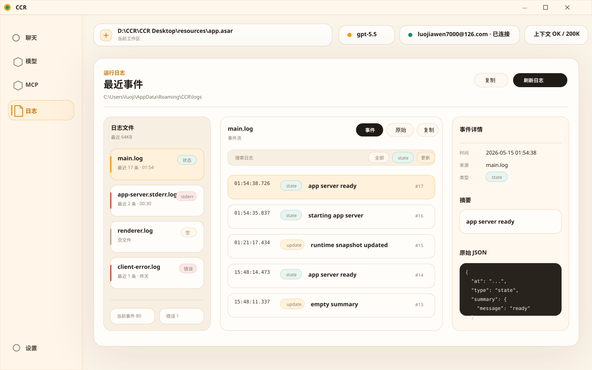

# CCR Desktop 日志页重设计方案

## 目标

把日志页从“多个日志文件纵向展开”改成“日志来源切换 + 事件流 + 事件详情”的诊断工作台。

目标效果图：



## 当前问题

当前日志页把每个日志文件都渲染成一个展开块：

- 页面会变成长滚动。
- 不同日志文件混在一个阅读流里。
- JSONL 原始文本难扫读。
- `notification` 内存事件和文件日志混在视觉上没有边界。

## 当前真实数据结构

main 进程现在返回：

```ts
type LogSnapshot = {
  logDir: string
  files: Array<{
    name: string
    path: string
    content: string
  }>
}
```

固定读取四个文件：

```text
main.log
app-server.stderr.log
client-error.log
renderer.log
```

读取逻辑只返回最近 `64KB`：

```ts
content.slice(-64_000)
```

renderer 另外持有当前会话内存事件：

```ts
events: CcrDesktopEvent[]
```

这部分是当前进程内最近事件，重启后不会保留。

## 日志文件形状

不同文件的 JSONL 字段不一致，不能假设有统一 `type`。

| 文件 | 常见字段 | 展示重点 |
| --- | --- | --- |
| `main.log` | `at`, `type`, `summary` | 状态变化、runtime snapshot |
| `app-server.stderr.log` | `at`, `pid`, `chunk` / `event` | stderr、进程关闭 |
| `client-error.log` | `at`, `kind`, `message`, `details` | 客户端错误 |
| `renderer.log` | `at`, `event`, `message`, `snapshot` | 窗口加载、renderer 诊断 |
| 当前事件 | `type`, `payload`, `status`, `at` | 本次运行中的 notification |

## 第一版界面

采用三栏布局：

1. 左侧：日志来源
   - `main.log`
   - `app-server.stderr.log`
   - `renderer.log`
   - `client-error.log`
   - 当前事件

2. 中间：事件流
   - 时间
   - 类型
   - 摘要
   - 序号
   - 搜索
   - `事件 / 原始` 切换

3. 右侧：事件详情
   - 时间
   - 来源
   - 类型
   - 摘要
   - 原始 JSON

## 解析模型

第一版在 renderer 侧解析，不改 main 进程返回结构。

建议新增本地类型：

```ts
type ParsedLogEntry = {
  id: string
  fileName: string
  at?: string
  level: 'info' | 'warn' | 'error' | 'raw'
  kind: string
  summary: string
  raw: string
  parsed?: Record<string, unknown>
}
```

解析规则：

- 按行拆分 `content`。
- 空行跳过。
- 能 `JSON.parse` 的行进入结构化事件。
- 解析失败的行进入 `raw` 事件。
- 只把第一行解析失败且看起来像半截 JSON 的情况标为截断行。
- 文件切换时保持搜索词，清空选中行或选中第一条。

## 摘要规则

不同文件使用不同摘要优先级：

```text
main.log:
summary.message -> message -> error -> type

app-server.stderr.log:
chunk -> event.stderr -> event.error -> event.code/signal

client-error.log:
message -> kind -> details

renderer.log:
event + message -> event -> message

当前事件:
payload.method -> type
```

类型规则：

```text
type -> event -> kind -> method -> raw
```

级别规则：

```text
client-error.log => error
app-server.stderr.log => error
kind/message 包含 error/failed => error
type/event 包含 update => warn
其它 => info
解析失败 => raw
```

## 文案收敛

界面只保留必要文案。

保留：

- `运行日志`
- `最近事件`
- `日志文件`
- `事件`
- `原始`
- `事件详情`
- `搜索日志`
- `原始 JSON`
- `最近 17 条`

避免：

- 解释“为什么这样展示”
- 重复说明 JSONL 解析规则
- 在卡片里写长帮助文案
- 把“64KB”写成显眼主信息

## 边界

- 不做后端 metadata 扩展。
- 不做全量文件行数统计。
- 不做告警、统计图、导出和多文件对比；日志页保持排查入口，不扩成监控台。

## 实时刷新

- 支持用户手动开启实时刷新。
- 第一版采用 renderer 侧 3 秒轮询现有 `getLogs()`，只在日志页开关打开时工作。
- 关闭页面或关闭开关后停止刷新。
- 这不是后台监控能力，不做 watcher、告警、统计聚合或导出。

## 第二版可扩展

如果第一版体验稳定，再扩 main 进程返回结构：

```ts
type DesktopLogFileSnapshot = {
  name: string
  path: string
  content: string
  sizeBytes: number
  modifiedAt?: string
  truncated: boolean
}
```

第二版可以补：

- 文件大小。
- 修改时间。
- 是否截断。
- 后端统一解析最近行。
- 打开日志目录。
- 复制当前原始行。

## 实现落点

主要改动文件：

- `apps/desktop/src/renderer/src/components/pages/LogsPage.tsx`
- `apps/desktop/src/renderer/src/domain/displayTypes.ts`
- `apps/desktop/src/renderer/src/styles.css`

第一版尽量不改：

- `apps/desktop/src/main/index.ts`
- `apps/desktop/src/preload/index.ts`

## 验证

建议验证：

```powershell
npm.cmd run typecheck:desktop -- --pretty false
npm.cmd run desktop:build
```

如新增解析 helper，可补一个小 smoke 或单元级脚本，覆盖：

- 空文件。
- 正常 JSONL。
- 第一行被截断。
- 非 JSON 原始行。
- 四种日志文件摘要规则。
