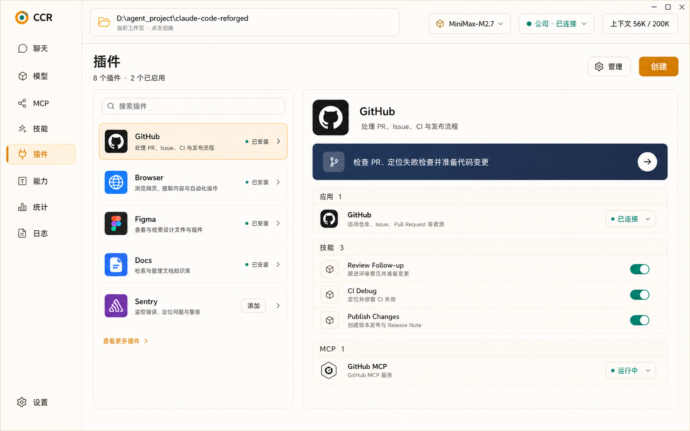

# CCR Plugin 接入与产品化设计

本文定义 CCR Plugin 的领域边界、现有实现复用策略、请求级读写上下文、生命周期状态、统一能力投影、Desktop 产品结构和后续实现路线。

它承接：

- [CCR 扩展能力体系总览](./extension-capability-system.md)
- [CCR 扩展能力运行时与上下文重构路线](./extension-runtime-context-refactor-roadmap.md)
- [Plugin 系统源码证据索引](../references/plugin-system-source-evidence.md)
- [Plugin 兼容迁移、回滚与发布收口](./plugin-system-compatibility-and-release.md)

本文是后续 Plugin 产品化的权威设计入口。实现前应先核对源码证据索引，不再从零设计第二套 Plugin 系统。

> 状态：设计已收敛，P0-P12 已完成。请求级 Plugin 会话、无副作用多实例读模型、独立 plan/apply 协议、可恢复安装与生命周期事务、组件级运行时激活、依赖/更新/回滚/GC 生命周期、分层配置/密钥/数据治理、Plugin-App 关系注册边界、Desktop 本地 Plugin 包管理、本地导入边界、CLI / Ink 薄适配、安装记录兼容迁移和发布门禁均已落地；最终专项矩阵包含 76 项用例、42 个异常场景、14 条最终不变式和 18 条真实证据脚本，并补充本地 archive 导入、Plugin MCP 相对路径和 runtime activator 专项 smoke。

## 0. 当前结论

### 0.1 已经存在的能力

仓库已经具备完整的 Plugin 领域基础：

- `.claude-plugin/plugin.json` manifest 与运行时校验。
- 本地包导入支持根目录 `plugin.json` 和内部 `.claude-plugin/plugin.json`，导入后统一规范化到内部结构。
- 本地包导入支持文件夹和 zip archive，默认用户全局作用域；导入成功后必须重新读取 catalog/detail，并清理运行时安装记录缓存。
- Marketplace 来源解析和本地缓存仍作为底层兼容能力存在，但不作为 Desktop 当前主产品入口。
- `managed`、`user`、`project`、`local` 四种持久化作用域。
- `plugin@marketplace` 稳定身份。
- 多作用域安装记录和版本化缓存。
- 安装、启用、禁用、卸载、更新操作。
- 依赖闭包、循环依赖检测、跨 Marketplace 信任边界和反向依赖提示。
- managed policy、来源限制、同形名称防护和路径穿越校验。
- 普通配置与敏感配置分离存储。
- Plugin Command、Agent、Skill、Hook、MCP、LSP、Output Style、Channel 和 Settings 加载。
- 设置意图、磁盘物化、当前会话激活三层刷新模型。
- 本地导入包没有可物化 marketplace candidate 时，不展示 repair 动作；更新应通过重新导入或后续显式本地更新入口完成。

因此后续不是“新建 Plugin 系统”，而是：

```text
复用现有 Plugin 领域
  -> 补请求级 PluginDomainSession 与缓存隔离
  -> 补无副作用 Inspector 和多实例管理读模型
  -> 接 Plugin 独立 plan / apply 协议
  -> 补 journal 事务和 PluginRuntimeActivator
  -> 产品化 Desktop
```

### 0.2 当前设计纠正

以下方案不再采用：

- 不新增 `.ccr-plugin/plugin.json`。
- 不新增与 `installed_plugins.json` 平行的第二套 Plugin 安装数据库。
- 不复制一套新的 Marketplace、依赖解析器、版本缓存或启停逻辑。
- 不把 Skill / MCP 的 owner marker、lock 方案原样套到 Plugin。
- 不允许 manifest 声明任意安装脚本或卸载脚本。
- 不把所有 Plugin 组件都伪装成模型可调用 Capability。
- 不把远程 Marketplace 浏览页作为当前 Desktop Plugin 主入口；当前产品只做已落地的本地 Plugin 包管理。

现有 Plugin 领域是唯一写侧权威。Capability Catalog 是统一发现和关系投影入口，不替代 Plugin 领域，也不执行 Plugin 生命周期动作。

### 0.3 当前完成边界

P0-P12 已完成领域、Desktop、CLI / Ink 兼容收口和专项发布门禁：

1. CLI / Ink、推荐和启动检查通过薄 adapter 复用同一 Plugin plan/apply，旧 settings/cache/registry 直接写路径已退出生产入口。
2. 安装记录支持 V1/V2 读取，并在首次事务写入时原子迁移到 V2；旧 V2 文件可显式合并，未知版本直接拒绝。
3. CCR 应用回滚、Plugin 包回滚和 runtime activation 已分开定义。
4. Desktop Plugin 页面当前管理本地 Plugin 包：已安装、内置、文件夹导入、压缩包导入、运行时可见和启用意图；导入默认用户全局。
5. Plugin 贡献的 Skill / MCP 必须保留组件语义、真实包路径、父 Plugin 可见性和运行时隐藏原因；不能把 MCP 启动命令名当作 server 名，也不能在父 Plugin 禁用后继续当成可运行能力。
6. 远端 registry 新协议、签名与供应链策略、更细粒度权限 enforcement 属于后续独立设计，不在兼容层内预埋 fallback。

## 1. Plugin 的定义与边界

Plugin 是能力合集，也是一个可安装、可配置、可启停、可更新的领域包。

一个 Plugin 当前可以贡献：

- Command
- Agent
- Skill
- Hook
- MCP Server
- LSP Server
- Output Style
- Channel
- Settings
- User Config

CCR 还可以通过适配层关联：

- App / Connector
- Plugin 子 Tool
- 统一 Capability 关系

Plugin 不是：

- Skill 的别名。
- MCP Server 的别名。
- 模型可直接调用的 Tool。
- 通用代码执行容器。
- Capability Catalog 的替代品。
- 能绕过领域运行时、权限、policy 或用户确认的安装入口。

统一口径：

```text
Plugin 负责打包、安装和管理一组运行时贡献；
Skill、MCP、Tool、Command、App 等负责各自真实运行和调用。
```

## 2. 权威事实与责任层

Plugin 不能再用一个 `enabled` 字段概括全部状态。需要明确六层事实。

| 事实层 | 当前权威来源 | 说明 |
| --- | --- | --- |
| 候选目录 | Marketplace manifest | 有什么 Plugin 可安装 |
| 用户意图 | 各作用域 `enabledPlugins` | 用户在哪个作用域启用或禁用 |
| 安装记录 | `installed_plugins.json` V2 | 哪个版本安装在什么作用域和路径 |
| 包物化 | Plugin versioned cache | 包是否真实存在、可读、可校验 |
| 加载快照 | `LoadedPlugin[]` / loader errors | 本次加载是否成功、哪些组件被识别 |
| 会话激活 | AppState、MCP/LSP/Hook/Command 等运行时 | 当前会话是否已经使用新状态 |
| 统一读模型 | Capability Catalog / Management Projection | 给 Desktop、CLI、API 查询和诊断 |

不变式：

- Marketplace 有候选不等于已安装。
- settings 声明启用不等于包已物化。
- 包已物化不等于 loader 已成功加载。
- loader 已加载不等于当前会话所有组件已刷新。
- Plugin enabled 不等于每个子能力都可用。
- Capability Catalog 只能投影事实，不能自行修复领域状态。
- 管理查询必须无副作用；读取目录和诊断时不得写 settings、刷新缓存或改变运行时。
- 安装成功只表示包和安装记录已提交，不等于已经启用，更不等于当前运行时已经激活。
- 同一 Plugin 的不同作用域安装实例必须独立表达，不能压成一个全局布尔状态。

## 3. 身份、作用域与安装目标

### 3.1 Plugin 身份

稳定 Plugin ID 沿用：

```text
plugin-name@marketplace-name
```

显示名、版本、安装路径都不能替代 Plugin ID。

Capability canonical ID 继续由来源感知 identity resolver 生成。Plugin 子能力必须保留：

```text
parentPluginId
```

### 3.2 安装实例身份

同一个 Plugin 可以同时安装在多个作用域、多个项目和不同版本。真实安装目标必须是结构化身份：

```ts
type PluginInstallationTarget = {
  pluginId: string
  scope: 'managed' | 'user' | 'project' | 'local'
  projectPath?: string
}
```

统一管理动作不能再用单个路径或裸 `pluginId` 猜作用域。

### 3.3 作用域语义

| 作用域 | 语义 | Desktop 操作 |
| --- | --- | --- |
| `managed` | 企业或系统托管 | 只读或受 policy 控制 |
| `user` | 当前用户全局 | 可安装、启停、更新、卸载 |
| `project` | 项目共享 | 修改前明确提示会影响项目成员 |
| `local` | 当前项目个人覆盖 | 可作为更高优先级本地覆盖 |

Desktop 列表默认按“当前 workspace 的有效 Plugin”聚合展示；详情页必须列出全部相关安装实例，不能隐藏多作用域事实。

### 3.4 有效状态

有效状态由作用域优先级、policy、安装记录、物化状态和 loader 结果共同派生。任何页面都不得仅根据某一份 settings 或 `LoadedPlugin.enabled` 自行判断。

## 4. Manifest 与兼容策略

### 4.1 Manifest 入口

面向用户导入和分发的本地 Plugin 包，推荐把清单放在包根目录：

```text
plugin.json
```

导入事务会把根目录 `plugin.json` 规范化到内部缓存结构：

```text
.claude-plugin/plugin.json
```

这两种路径使用同一个 `PluginManifestSchema`。区别只在边界：

- `plugin.json` 是本地包作者、压缩包和文件夹导入的产品入口。
- `.claude-plugin/plugin.json` 是内部物化、缓存和运行时加载的兼容入口。
- 导入兼容只发生在本地导入边界；运行时加载器不扩散两套查找规则。

现有 `PluginManifestSchema` 是 Plugin 包结构的权威运行时 schema。后续必须复用现有字段：

- metadata：name、version、description、author、homepage、repository、license、keywords、dependencies。
- commands
- agents
- skills
- hooks
- outputStyles
- channels
- mcpServers
- lspServers
- settings
- userConfig

### 4.2 CCR 扩展字段

只有现有 manifest 无法表达、且 CCR 运行时已经有真实消费者时，才允许增加可选命名空间：

```json
{
  "name": "github-collaboration",
  "version": "1.0.0",
  "description": "审查 PR、排查 CI、发布变更。",
  "skills": ["./skills"],
  "mcpServers": ["./mcp.json"],
  "ccr": {
    "apps": [
      {
        "id": "github",
        "displayName": "GitHub",
        "relation": "requires",
        "skillIds": ["review-follow-up", "ci-debug"],
        "mcpServerNames": ["github"]
      }
    ],
    "ui": {
      "icon": "./assets/icon.png",
      "category": "developer-tools"
    }
  }
}
```

约束：

- `ccr` 必须进入 `PluginManifestSchema`，否则当前 Zod 解析会静默剥离未知顶层字段。
- `ccr.apps` 的关系必须显式区分 `provides`、`requires`、`suggests`、`configures`，不能把“关联”统一解释为所有权。
- `ccr.apps` 只声明关系和展示元数据，不能直接注册真实 App，也不能伪造连接与鉴权状态。
- 真实 App 必须由宿主或 App adapter 注册到 `AppCapabilityRegistry`，Plugin 只引用稳定 App identity。
- `ccr.ui` 不参与安全决策。
- 不新增 manifest lifecycle shell。
- 不提前预留没有运行时消费者的字段。

### 4.3 权限与风险

当前 Plugin manifest 没有可强制执行的统一 permissions 模型。产品层第一步应根据真实组件推导风险摘要：

- Hook、MCP、LSP 是否启动外部进程。
- 是否需要网络。
- 是否读取用户配置或敏感字段。
- 是否包含 Channel。
- 是否写入 Plugin data directory。
- 来源是否为官方、受信 Marketplace、本地目录或未知远端。

在 enforcement 落地前，不应展示“已限制文件/网络权限”这种虚假安全承诺。

## 5. 组件与 Capability 的映射

Plugin 组件分为两类。

### 5.1 进入统一能力目录

| 组件 | Capability 表达 | 真实执行层 |
| --- | --- | --- |
| Skill | `skill` | Skill runtime / SkillTool |
| MCP Server | `mcp-server` | MCP runtime |
| MCP Tool / Resource / Prompt | MCP 子能力 | MCP runtime |
| Command | `command` | Command runtime |
| App / Connector | `app` | App registry / 宿主连接层 |
| 真实 Plugin Tool | `tool` | Tool Registry |

### 5.2 作为运行时贡献清单

以下组件第一步不强制扩展 `ExtensionCapabilityKind`：

- Agent
- Hook
- LSP Server
- Output Style
- Channel
- Settings

它们应进入 Plugin 详情的“运行时贡献”区域，展示数量、名称、状态和诊断。只有当某类组件出现独立管理、独立调用或独立授权需求时，再升级成正式 Capability。

这样可以避免把“可管理组件”“可调用能力”“运行时配置”混为一谈。

## 6. Plugin 状态模型

### 6.1 原子事实与多实例状态

Plugin 的权威读模型不能以一组全局布尔值为核心。候选、安装、意图和运行时激活必须按各自身份保存：

```ts
type PluginCandidate = {
  pluginId: string
  sourceId: string
  version?: string
  manifestDigest?: string
}

type PluginInstallationInstance = {
  target: PluginInstallationTarget
  installedVersion: string
  packagePath: string
  materialization: 'present' | 'missing' | 'drifted' | 'invalid'
  installationRevision: string
}

type PluginIntentByScope = {
  target: PluginInstallationTarget
  intent: 'enabled' | 'disabled' | 'unset' | 'blocked'
  source: 'managed' | 'user' | 'project' | 'local'
}

type PluginRuntimeActivation = {
  runtimeInstanceId: string
  pluginId: string
  activeVersion?: string
  activationRevision: string
  state: 'inactive' | 'activating' | 'active' | 'partial' | 'failed'
  components: PluginComponentActivation[]
}

type PluginManagementRecord = {
  pluginId: string
  candidates: PluginCandidate[]
  installations: PluginInstallationInstance[]
  intents: PluginIntentByScope[]
  effectiveSelection?: PluginEffectiveSelection
  runtimeActivations: PluginRuntimeActivation[]
  derivedState: PluginDerivedManagementState
}
```

`PluginDerivedManagementState` 可以提供页面需要的 `installed`、`enabled`、`active`、`updateAvailable` 等摘要，但它只能由上述事实派生，不能反过来成为写侧权威。

### 6.2 面向用户的派生状态

| 状态 | 判定 |
| --- | --- |
| 可安装 | 本地导入候选或兼容来源候选存在，当前目标作用域无安装实例 |
| 安装中 | operation 正在 materialize / commit |
| 已安装未启用 | 安装记录和包存在，但有效 intent 为 disabled |
| 已启用待刷新 | intent 已启用，但当前会话尚未激活 |
| 运行中 | 当前会话组件已激活 |
| 需要配置 | 必填 userConfig / channel config 缺失 |
| 需要鉴权 | App 或 MCP 连接需要认证 |
| 待重启或刷新 | 磁盘版本和当前会话版本不同 |
| 被策略阻止 | managed policy 不允许启用或安装 |
| 安装不完整 | settings、安装记录、缓存三者不一致 |
| 加载失败 | manifest 或组件加载失败 |
| 依赖缺失 | 依赖不存在或未启用 |
| 有更新 | 候选来源版本或 commit 与安装版本不同 |

### 6.3 版本状态

详情页至少区分：

```text
installedVersion
activeVersion
candidateVersion
previousVersion
```

`previousVersion` 不能只是显示字段。进入回滚窗口的版本必须有持久化保留引用和过期策略，孤儿缓存清理器不得删除仍属于回滚候选或其他安装实例正在使用的版本。

当更新已写盘但当前会话仍运行旧版本时，必须显示：

```text
新版本已安装，刷新插件或重启后生效
```

不能直接显示“更新完成”后又继续使用旧版本而不解释。

## 7. 请求级 Plugin 领域上下文

### 7.1 目标

所有 Plugin 查询和动作必须绑定同一请求上下文：

```ts
type PluginDomainContext = {
  workspaceRoot: string
  currentCwd: string
  configHomeDir: string
  platform: NodeJS.Platform
  runtimeInstanceId: string
  requestId: string
  environment: {
    pluginCacheDirOverride?: string
    coworkMode: boolean
  }
}
```

### 7.2 当前问题

现有 Plugin 工具函数广泛读取：

- `getClaudeConfigHomeDir()`
- `getOriginalCwd()`
- `getCwd()`
- 进程级 settings cache
- 进程级 installed plugin memory snapshot
- 未按 `configHomeDir/workspace/runtimeInstanceId` 分区的 loader 与 options 缓存
- 环境变量覆盖的 Plugin cache 目录
- Cowork / seed / inline Plugin 目录

因此 `CapabilityRuntimeEnvironment` 虽然携带请求级 `configHomeDir`，Plugin snapshot 对非当前 home 仍只能返回 unavailable。

### 7.3 设计

新增请求级领域会话和端口：

```ts
interface PluginDomainSession {
  context: PluginDomainContext
  paths: PluginPathResolver
  settings: PluginSettingsRepository
  installations: PluginInstallationRepository
  marketplaces: PluginMarketplaceRepository
  packages: PluginPackageRepository
  options: PluginOptionsRepository
  secrets: PluginSecretRepository
  runtime: PluginRuntimeSnapshotReader
}

interface PluginDomainReader {
  listCatalog(session: PluginDomainSession): Promise<PluginCatalogSnapshot>
  inspect(target: PluginInstallationTarget, session: PluginDomainSession):
    Promise<PluginInspection>
}

interface PluginDomainActions {
  plan(request: PluginActionRequest, session: PluginDomainSession):
    Promise<PluginActionPlan>
  apply(plan: PluginActionPlan, confirmation: PluginConfirmation, session: PluginDomainSession):
    Promise<PluginActionResult>
}
```

适配原则：

- 核心读写函数显式接收 context 或 path resolver。
- repository 和缓存必须至少按 `configHomeDir + workspaceRoot + runtimeInstanceId` 分区；禁止未分区的模块级快照。
- `listCatalog`、`inspect` 和 diagnostics 必须无副作用，不能通过读取动作写 settings、刷新 runtime 或改变 cache 内容。
- Marketplace refresh、cache repair 和 runtime refresh 是显式动作，不得伪装成查询的附带行为。
- 现有 CLI / Ink 入口可以通过 adapter 注入当前进程 context。
- App Server 和 Desktop 必须传请求级 context。
- 不允许新代码重新读取进程级 home 作为静默 fallback。
- 兼容入口必须显式命名，并有淘汰计划。

## 8. 生命周期与事务

### 8.1 安装计划

```text
选择候选和目标作用域
  -> 解析 Marketplace 与 manifest
  -> 解析依赖闭包
  -> policy / 来源 / 路径 / 配置预检
  -> 生成组件影响面和风险摘要
  -> 生成 immutable plan
  -> 用户确认
```

计划至少包含：

- `pluginId`
- 目标 `scope/projectPath`
- 候选来源和版本
- 依赖闭包
- 将新增或覆盖的 settings intent
- 将创建的缓存和安装记录
- userConfig / secret 需求
- child capability preview
- 运行时刷新要求
- `activateAfterInstall`，Desktop 默认 `false`
- 依赖是否随主 Plugin 一起启用
- 风险和阻塞原因
- `stateDigest`、过期时间和确认 token

### 8.2 安装执行

新 App Server 路径采用“全量预备、日志驱动提交”：

```text
获取目标作用域 revision / 操作锁
  -> 创建 operation journal
  -> stage 主 Plugin 和全部依赖
  -> 校验所有 manifest、来源、policy 和包完整性
  -> 校验全部包可加载
  -> 将版本缓存移动到最终位置
  -> 按 journal 提交安装记录
  -> 根据明确选择提交 enabled/disabled intent
  -> 写入 commit revision
  -> 默认保持未激活，或进入显式 activation 阶段
  -> 完成 journal 并返回操作结果
```

如果提交前失败：

- settings 不得宣称已安装。
- 安装记录不得出现半条目。
- staged cache 可安全回收。

如果提交阶段部分失败：

- 进入显式 reconciliation 状态。
- journal 保留已完成步骤、预期 revision 和补偿动作。
- 返回 operation ID、失败阶段和可恢复动作。
- 不静默回退旧安装逻辑。

事务不变式：

- 单个文件的 atomic write 不等于 Plugin 事务原子性。
- 所有依赖必须先完成 stage 和校验，再开始修改权威记录。
- 同一 config home 和目标作用域的并发写必须通过锁或 optimistic revision 检测冲突。
- apply 必须校验 plan 使用的 installation/settings/marketplace revision，陈旧计划 fail closed。
- reconciliation 必须幂等；重复执行不能重复安装、重复启用或误删已有版本。

现有 settings-first 安装路径作为明确兼容入口保留，直到新事务覆盖 CLI / Ink / App Server；不能作为新路径失败后的 fallback。

### 8.3 启用与禁用

安装、启用和激活是三个独立动作：

```text
install
  -> 包和安装记录存在

enable
  -> 目标作用域 intent 允许加载

activate
  -> 当前 runtimeInstance 已刷新并实际使用目标版本
```

Desktop 安装默认不自动启用；只有用户在计划确认中明确选择 `activateAfterInstall` 时，事务完成后才继续执行启用和激活。CLI 为保持旧行为而自动启用时，也必须通过显式兼容参数表达，不能藏在安装函数内部。

启用和禁用是作用域级 intent 修改，不等于立即激活：

```text
plan scope override
  -> 检查 policy / 依赖 / 配置
  -> 写入 intent
  -> 清理 loader cache
  -> 标记 pendingActivation
  -> 用户选择刷新插件或稍后重启
```

禁用前必须展示反向依赖影响。禁用后子能力 fail closed，但当前会话是否已完成停用必须由 active snapshot 确认。

Desktop 展示必须把这个关系讲清楚：Plugin 禁用后，左侧 Plugin 列表显示停用状态；Skill、MCP 和能力目录里的子能力保留诊断可见性，但标记为“隐藏：插件已禁用”，不能继续展示成运行时可用或模型可调用。

### 8.4 运行时激活

运行时激活由独立 `PluginRuntimeActivator` 负责，PluginDomainActions 不直接操作 Ink AppState：

```ts
interface PluginRuntimeActivator {
  planActivation(
    target: PluginInstallationTarget,
    session: PluginDomainSession
  ): Promise<PluginActivationPlan>

  applyActivation(
    plan: PluginActivationPlan,
    session: PluginDomainSession
  ): Promise<PluginActivationResult>
}
```

每类贡献必须独立报告结果：

| 贡献 | 激活方式 | 失败策略 |
| --- | --- | --- |
| Command / Agent / Skill | 重建当前 runtime 目录快照 | 新快照失败则保留旧快照并标记未激活 |
| Hook | 构建新 Hook 集合后替换 | 构建失败不得清空仍有效的旧集合 |
| MCP | 建立或断开 Plugin MCP 连接 | 单 server 失败进入组件级诊断 |
| LSP | 初始化目标 server 集合 | 单 server 失败不伪装成整体成功 |
| Channel | 复用 MCP / Channel runtime | 未配置或未鉴权时保持 needs-config/needs-auth |
| Output Style / Settings | 重建派生快照 | 无热刷新能力时明确标记 restart-required |

激活边界必须标明 `runtimeInstanceId` 和 `activationRevision`。不能使用“当前会话”这种无法定位到具体 Core/App Server 实例的模糊标识。

### 8.5 配置

配置分两类：

- 普通配置：settings 中的 `pluginConfigs[pluginId].options`。
- 敏感配置：secure storage 中的 `pluginSecrets`。

设计要求：

- 保存 API 必须绑定 request-scoped config home。
- 不能从 merged settings 读出后整包写回 user scope。
- 重新配置时，空敏感字段默认保留旧值。
- 删除最后一个安装实例时，配置、密钥和数据目录分开确认。
- 必须先冻结配置归属：用户全局配置按 `pluginId` 存储，作用域级配置按 `pluginId + scope + projectPath` 存储，二者不能由实现自行猜测。
- 配置读取必须展示值来源和覆盖层，写入时只能修改用户选择的目标层。
- secure storage 的 key 必须包含明确的配置归属 identity，但 secret 永远不得写入 project settings。

### 8.6 更新与回滚

更新采用非原地版本缓存：

```text
检查候选版本
  -> stage 新版本
  -> 校验 manifest / 依赖 / 风险差异
  -> 提交安装记录指向新版本
  -> 保留旧版本用于回滚窗口
  -> 标记 pendingActivation
```

回滚：

```text
选择 previousVersion
  -> 校验缓存仍存在
  -> 生成 rollback plan
  -> 提交安装记录
  -> 刷新或重启生效
```

进入回滚窗口的版本必须写入 retention record。只有满足以下条件时才能进入 orphan GC：

- 没有安装实例引用。
- 没有运行时实例仍在使用。
- 不在任何未过期 rollback retention 中。
- 不被进行中的 operation journal 引用。

依赖 version range 当前只作为声明和 settings 约束保留，不能在产品文案中声称已经完成完整 semver 求解。

### 8.7 卸载

卸载必须针对明确安装实例：

```text
选择 scope/projectPath
  -> 检查反向依赖
  -> 展示当前会话影响
  -> 删除该作用域 intent
  -> 删除该作用域安装记录
  -> 无引用版本进入 orphan GC
  -> 最后一个实例时询问配置、密钥和数据是否删除
  -> 标记 pendingActivation
```

Plugin data directory 默认建议保留，除非用户明确选择一并删除。

## 9. 统一管理动作

### 9.1 动作集合

Plugin 需要补充：

```text
inspect
install
enable
disable
configure
refresh
check-update
update
rollback
repair
uninstall
delete-data
```

`repair` 不应成为“再跑一次 install”。它应根据 inspection 结果生成定向计划：

- settings intent 缺失。
- 安装记录缺失。
- cache 缺失。
- manifest 无效。
- 依赖缺失。
- 当前会话未刷新。

### 9.2 Plugin 领域协议与 Capability 投影

Plugin 使用独立领域协议：

```text
plugins/catalog/list
plugins/inspect
plugins/action/plan
plugins/action/apply
plugins/operations/get
plugins/operations/cancel
```

Plugin 领域 plan 负责：

- 作用域解析。
- Marketplace 和依赖解析。
- policy。
- 版本和缓存。
- 配置和数据删除。
- 领域 effects。

Capability Catalog 和 `capabilities/management/*` 只负责：

- 投影 Plugin 与子能力关系。
- 从 canonical capability 导航到对应 Plugin。
- 返回 Plugin domain action link 或引用现有 Plugin plan。
- 统一展示 allowed actions、诊断和来源。

统一层不能凭 `allowedActions`、单个 `actionRef` 或 Capability projection 自己推导 Plugin 安装计划。Plugin 的 apply 也不能消费 Desktop 临时拼装的 effects。

领域协议不要求所有操作都异步。只读查询和轻量 intent 修改可以直接完成；下载、安装、更新、回滚、修复、卸载和运行时激活必须返回可查询的 operation。

### 9.3 动作目标

Plugin action target 应升级为结构化 DTO，不能继续依赖单个 `actionRef` 字符串：

```ts
type PluginActionTarget = {
  capabilityId?: string
  pluginId: string
  scope?: PluginInstallationTarget['scope']
  projectPath?: string
  installedVersion?: string
  candidateVersion?: string
  sourceId?: string
}
```

plan 还必须包含 immutable `planId`、完整 target、依赖计划、预期 revisions、effects、风险摘要和过期时间。apply 只接受 `planId + confirmation`，不能允许调用方在确认后替换 target 或 effects。

## 10. App / Connector 桥接

### 10.1 边界

Plugin 可以声明“它与哪些 App 有关系”，但不能伪造连接状态。关系分为：

| 关系 | 语义 | Plugin 卸载影响 |
| --- | --- | --- |
| `provides` | Plugin 包含注册该 App 所需的 adapter 或描述 | 移除 Plugin 注册，但不自动删除外部账户 |
| `requires` | Plugin 的部分能力依赖宿主已有 App | App 保留，Plugin 能力进入 needs-app |
| `suggests` | App 可增强 Plugin，但不是运行前提 | 无强制影响 |
| `configures` | Plugin 只提供该 App 的配置或工作流 | App 本体由宿主继续管理 |

```text
Plugin manifest
  -> 声明 app identity 和 relation kind

宿主 / Plugin App adapter
  -> 注册 App identity 和生命周期 ownership

宿主 / Connector runtime
  -> 注册 connected / needs-auth / disabled 等真实快照

AppCapabilityRegistry
  -> 维护当前 Core 会话真实状态

Capability Catalog
  -> 合并关系并向子能力传播父状态
```

`ccr.apps` schema 只能在 host registration adapter、identity 冲突规则和卸载清理边界已定义后落地。不能先增加 manifest 字段，再让 Desktop 根据字段猜 App 是否存在。

### 10.2 安装后状态

安装 Plugin 不等于 App 已连接。详情页应分别显示：

- Plugin 已安装。
- App 尚未连接。
- App 已连接。
- App 需要重新授权。
- App 由宿主提供，不随 Plugin 卸载。

### 10.3 鉴权入口

当前没有内置通用浏览器容器。需要鉴权时：

- 优先使用已有 Connector / MCP OAuth 流程。
- 必要时打开系统浏览器完成外部授权。
- Plugin 不直接获得浏览器 cookie 或任意网页登录态。

## 11. 安全与信任

### 11.1 已有边界必须保留

- Marketplace 官方名称和来源校验。
- 非 ASCII 同形名称防护。
- managed allow/block policy。
- 跨 Marketplace 依赖默认阻止。
- 路径穿越校验。
- Plugin ID 和缓存路径净化。
- 敏感配置进入 secure storage。
- 删除缓存前检查安装引用。

### 11.2 需要补齐

- source fingerprint 和 manifest digest。
- package tree digest 或等价完整性摘要。
- 更新前后的组件和风险差异。
- Plugin operation audit event。
- 配置 schema 变更和 secret migration 说明。
- Hook、MCP、LSP、Channel 的外部进程与网络风险摘要。
- 本地目录 Plugin 的“内容可随时变化”提示。

### 11.3 不做虚假安全

以下能力未落地前不能在 UI 中声称已经提供：

- 文件系统沙箱。
- 网络域名白名单。
- 进程级权限隔离。
- Plugin lifecycle script 安全执行。
- 完整 semver 依赖求解。

## 12. Desktop 产品设计

### 12.1 导航

侧栏顺序固定为：

```text
MCP
技能
插件
能力
统计
日志
```

能力目录是独立全局事实视图。Plugin 页面只管理 Plugin bundle，不承担所有能力浏览。

### 12.2 界面概念图



概念图只冻结产品结构，不冻结具体颜色、图标和像素值：

- 左侧是可搜索、可筛选、可独立滚动的 Plugin 列表。
- 右侧是当前 Plugin 的详情和操作工作台。
- Plugin 位于能力目录之前；能力目录继续作为独立菜单存在。
- Plugin 详情可以展示它贡献的能力，但不能替代全局能力目录。
- 列表整行可选中，开关和操作按钮只执行自身动作，不触发选择。
- 页面容器、左侧列表和右侧详情分别有稳定高度与滚动边界，不随内容无限增长。

### 12.3 页面结构

沿用已确认的主从布局：

```text
顶部：标题、导入 Plugin、刷新

左侧：
  Plugin 列表
  搜索 Plugin
  名称 / 来源 / 有效作用域
  启停开关
  整行可选中
  独立滚动

右侧：
  当前 Plugin 详情
  图标操作区
  详情分区
  独立滚动
```

主页面只展示已经落到本地或运行时已经可见的 Plugin：

- `managed` 内置或受管理 Plugin。
- `user`、`project`、`local` 已导入并安装的 Plugin。
- 当前 runtime 已加载或已有启用意图的 Plugin。

Marketplace 或远程索引只属于后续来源扩展，不等于 Plugin 产品包。未安装、未物化的远程 source 条目不得进入主列表，也不得在详情页显示成“组件 0”的 Plugin。

导入入口第一阶段只负责本地 Plugin 包：文件夹和压缩包。文件夹包可在根目录放 `plugin.json`，也可使用 `.claude-plugin/plugin.json`；压缩包展开后按同一规则检查。只有导入事务物化并解析出完整 Plugin 后，才进入主列表。GitHub、Git、URL 和远程 Marketplace 浏览属于后续来源扩展，不作为 Desktop 当前产品入口。

### 12.4 详情分区

1. 概览
   - 名称、版本、来源、作者、license、当前状态。
   - 有效作用域和全部安装实例。
   - 当前会话版本与待激活版本。

2. 能力
   - App、Skill、MCP、Tool、Command。
   - 显示 canonical capability、来源链和运行时状态。
   - 组件名称使用 manifest 或标准包语义：Skill 优先用 `SKILL.md` / command 名称，MCP server 优先用 `mcpServers` key，不能用启动命令如 `node` 充当名称。
   - 组件行可以点开查看详情；详情只展示该组件自己的 manifest、路径、运行状态和隐藏原因，不重复父 Plugin 的总状态。

3. 运行时贡献
   - Agent、Hook、LSP、Output Style、Channel、Settings。

4. 配置
   - 普通配置、敏感配置、缺失必填项。
   - 不回显 secret。

5. 依赖与更新
   - 直接依赖、反向依赖、版本、更新差异、回滚候选。

6. 安全与来源
   - 来源、仓库、信任状态、policy、风险摘要。

7. 诊断
   - settings、安装记录、cache、loader、active runtime 各层状态。
   - 修复建议和 operation log。

### 12.5 操作区

操作按位置分工，避免重复状态和重复按钮：

| 位置 | 操作 | 规则 |
| --- | --- | --- |
| 左侧 Plugin 卡片 | 启用 / 停用开关 | 与 Skill / MCP 管理页一致；开关只执行启停，不触发选中 |
| 详情标题右侧 | 修复、卸载、刷新、回滚等图标按钮 | 36x36 icon button，只保留 `title`、`aria-label` 和 hover tooltip |
| 详情分区 | 配置保存、更新确认、诊断复制等局部动作 | 只在对应分区出现，不挤到标题区 |
| 确认弹窗 | 安装、更新、修复、回滚、卸载 | 写清作用域、版本、依赖、数据处理和运行时影响 |

状态文案只保留一处主表达：列表展示主状态；运行时分区展示 active/runtime 事实；概览展示版本和作用域，不在标题区重复“运行中 / 已启用”。

operation / plan / queued / completed 这类生命周期过程不属于概览内容。它们可以通过确认弹窗、toast、临时进度条、诊断分区或操作历史查看；完成后不应长期留在概览页，避免用户把一次操作记录误解成 Plugin 的结构事实。

### 12.6 空状态和错误状态

- 没有已安装或内置 Plugin：显示空列表，并保留导入入口。
- 本地导入入口不可用：保留已安装管理，不让整个页面空白。
- Plugin load error：在列表中保留失败项，不只生成一个总的 catalog error 假 Plugin。
- 非当前 config home：显示明确边界，不返回看似正常的空列表。
- 刷新失败：保留磁盘状态和当前会话状态，说明二者暂未一致。

## 13. 协议与读模型

### 13.1 PluginCatalogSnapshot

```ts
type PluginCatalogSnapshot = {
  schemaVersion: 1
  context: PluginDomainContext
  candidates: PluginCandidate[]
  plugins: PluginManagementRecord[]
  diagnostics: PluginDiagnostic[]
}
```

### 13.2 PluginManagementRecord

至少包含：

```text
pluginId
manifest metadata
candidate source
installations[]
effective scope
declared intent by scope
materialization
load state
active runtime state
component inventory
capability relations
configuration state
dependency state
policy / trust
versions
allowed actions
diagnostics
```

### 13.3 Operation

长操作返回：

```ts
type PluginOperationStatus = {
  operationId: string
  planId: string
  action: string
  stage:
    | 'planning'
    | 'awaiting-confirmation'
    | 'queued'
    | 'staging'
    | 'validating'
    | 'committing'
    | 'activating'
    | 'reconciling'
    | 'rolling-back'
    | 'restart-required'
    | 'partial'
    | 'completed'
    | 'cancelled'
    | 'failed'
  progress?: number
  message?: string
  errorCode?: string
  children?: PluginOperationChildStatus[]
  journalRevision: string
  startedAt: string
  updatedAt: string
}
```

operation 必须持久化到对应 `configHomeDir` 的 operation store，并满足：

- App Server 重启后仍能查询最终状态或进入 reconciliation。
- App Server 路由必须等待异步 operation 查询完成后再序列化响应；不得把未完成的 `Promise` 写成空对象。
- operation 查询参数错误必须返回 JSON-RPC `invalid_params`，不得让异步异常逃出并终止 stdio App Server。
- 依赖闭包中的每个 Plugin 有独立 child status。
- 取消只允许发生在明确的可取消阶段；提交开始后必须完成或进入 reconciliation。
- Desktop 不能靠按钮 busy 状态猜安装是否卡住。
- operation log 不包含 secret、完整鉴权 token 或不必要的本地敏感路径。

## 14. 示例 Plugin

样例应使用现有包结构：

```text
github-collaboration/
  plugin.json
  skills/
    review-follow-up/
      SKILL.md
    ci-debug/
      SKILL.md
  commands/
    publish.md
  mcp.json
  assets/
    icon.png
```

样例覆盖：

- 一个 Plugin。
- 两个 Skill。
- 一个 MCP Server。
- 一个 App 关系声明。
- 一个普通配置和一个敏感配置。
- 一个依赖 Plugin fixture。
- user / project / local 三种安装作用域。
- 安装、配置、启用、刷新、更新、回滚、禁用、卸载。

样例默认使用本地 fixture，不依赖真实 GitHub 网络或 OAuth。

## 15. 异常场景矩阵

必须至少覆盖：

1. Marketplace 有候选但源下载失败。
2. settings 已声明但安装记录缺失。
3. 安装记录存在但 cache 缺失。
4. cache 存在但 manifest 无效。
5. manifest 合法但组件路径缺失。
6. Plugin 在两个作用域安装不同版本。
7. project 启用、local 禁用。
8. managed policy 阻止 user 启用。
9. 依赖循环。
10. 依赖不存在。
11. 跨 Marketplace 依赖未授权。
12. 反向依赖存在时禁用或卸载。
13. 更新已写盘但会话仍运行旧版本。
14. refresh 部分组件失败。
15. 必填配置缺失。
16. secure storage 写入失败。
17. App 已声明但未注册连接快照。
18. App 已连接但父 Plugin 被禁用。
19. 非当前 config home 查询。
20. 本地 Plugin 内容变化导致 drift。
21. 卸载单一作用域后其他作用域仍有效。
22. 最后一个作用域卸载时选择保留数据。
23. 旧版本缓存仍被其他安装实例引用。
24. operation 中断后 reconciliation。
25. 同一进程同时查询两个 config home，缓存不得串用。
26. 同一 config home 的两个 workspace 安装同名 Plugin 不得串 project/local 状态。
27. 两个进程同时修改同一作用域时 revision conflict 必须显式失败。
28. settings 已提交但安装记录提交失败时 journal 可恢复。
29. 安装记录已提交但 intent 提交失败时 journal 可恢复。
30. 查询 Plugin catalog 不得修改 settings、cache 或 runtime。
31. 安装完成但用户未选择启用时保持 installed-disabled。
32. 启用完成但 runtime 未刷新时保持 pending activation。
33. Hook 刷新失败时旧 Hook 集合仍可解释且不会被静默清空。
34. MCP 部分连接失败时其他组件状态仍独立可见。
35. 回滚候选仍在 retention window 时不会被 orphan GC 删除。
36. operation 进行中引用的 staged/cache 版本不会被 GC 删除。
37. Plugin options 的 user/project/local 来源与覆盖结果可解释。
38. secure storage 写入失败不会把配置状态误标为 configured。
39. App relation 为 requires/suggests/configures 时不会误注册为 Plugin-owned App。
40. App Server 重启后长操作能恢复查询或进入 reconciliation。
41. managed、builtin、inline Plugin 的不可安装/不可卸载边界准确。
42. Marketplace 下架候选后，已安装 Plugin 仍可离线检查和管理。

## 16. Plugin 产品化实施路线

后续按以下 Goal 依次推进。每个 Goal 只跨一个主要边界，完成后再进入下一个。

可直接执行的阶段目标、输入输出、非目标和验收门禁见：

- [Plugin 产品化 P0-P12 Goal Series](../goals/2026-06-08-plugin-productization-p0-p12-series.md)

### P0 设计权威与兼容基线

目标：

- 冻结本文和源码证据索引。
- 明确现有 Plugin 领域是唯一写侧权威。
- 删除 `.ccr-plugin`、第二套安装数据库和虚构生命周期脚本等错误方案。

验收：

- 架构文档、roadmap、README 和 CHANGELOG 口径一致。
- 搜索不到把 `.ccr-plugin/plugin.json` 写成实施目标的文档。

### P1 请求级 Plugin 会话、路径端口与缓存隔离

目标：

- 建立 `PluginDomainSession`，显式消费 workspace、cwd、config home、runtime instance 和环境覆盖。
- 抽出 settings、Marketplace、installed registry、package cache、options、secrets 和 runtime snapshot 端口。
- 清理或分区进程级 loader、installed registry 和 options 缓存。

验收：

- 两个不同 config home 可以在同进程中查询，结果不串。
- 同一 home 的两个 workspace 可以并行查询，project/local 状态不串。
- 新 Core / App Server 路径不读取进程级 home fallback。
- 管理查询无副作用，读取 snapshot 不写 settings 或刷新 runtime。

### P2 无副作用 Inspector 与多实例管理读模型

目标：

- 建立只读 `PluginInspector`、`PluginCatalogSnapshot` 和多实例 `PluginManagementRecord`。
- 合并候选、intent、installation、materialization、loaded、active 六层事实。
- 将错误归属到具体 Plugin、安装实例和组件，不使用一个虚构 Plugin 承载全部 catalog error。

验收：

- 多作用域、多版本、cache miss、load error 和 pending activation 可区分。
- Builtin、inline、managed、Marketplace Plugin 不再统一误标为 installed。
- 同名不同来源 Plugin 依赖 canonical identity，不以 display name 去重。
- Inspector 在 Marketplace 离线、runtime 未启动时仍返回可解释的本地事实。

### P3 Plugin 独立协议与领域 plan / apply

目标：

- 增加 `plugins/catalog/list`、`plugins/inspect`、`plugins/action/plan`、`plugins/action/apply` 和 operation 查询协议。
- 将 install、enable、disable、configure、refresh、update、rollback、repair、uninstall 接入 Plugin 领域动作。
- 使用结构化 `PluginInstallationTarget`。

验收：

- plan 和 apply 使用同一 request context。
- 非法作用域、陈旧 plan 和错误 action target fail closed。
- Capability 管理层只引用 Plugin plan，不自行推导 Plugin effects。
- apply 只能消费不可变 plan，确认后不能替换 target、依赖或删除选项。

### P4 Journal、并发控制与安装事务

目标：

- 新建先全量 stage、后 journal commit 的安装事务。
- 增加作用域锁或 optimistic revision、幂等 reconciliation 和 operation store。
- 将安装与启用拆开，Desktop 默认安装后不自动激活。

验收：

- 下载、校验或依赖失败不会留下假安装。
- 两个并发 apply 不会静默覆盖对方。
- 故障注入覆盖每个提交边界，重试 reconciliation 结果一致。
- 依赖闭包在提交开始前已全部完成 stage 和校验。

### P5 PluginRuntimeActivator 与组件级刷新

目标：

- 显式建模 installed version、active version 和 pending activation。
- 抽出与 Ink AppState 解耦的 `PluginRuntimeActivator`。
- 统一 Command、Agent、Skill、Hook、MCP、LSP、Channel、Output Style 刷新结果。

验收：

- 启停、更新、卸载后页面能准确说明当前会话是否已生效。
- refresh 部分失败时保留分组件诊断。
- activation 绑定具体 runtime instance 和 revision。
- 新快照构建失败时不会先清空仍可工作的旧组件集合。

### P6 依赖、更新与回滚

目标：

- 将依赖闭包、反向依赖、跨市场信任和版本差异进入 plan。
- 提供更新预览和受控回滚。
- 依赖图来自候选与安装 manifest，不只依赖当前 `LoadedPlugin[]`。

验收：

- 不宣称未实现的 semver 求解。
- rollback retention、runtime 引用、operation 引用和 GC 有明确规则。
- 已安装但禁用或加载失败的 Plugin 仍进入反向依赖分析。

### P7 配置、密钥与数据治理

目标：

- 请求级读写 Plugin options。
- 修复 merged settings 写回 user scope 的风险。
- 分离卸载包、删除配置、删除密钥、删除数据。
- 冻结 user-global 与 scope-specific 配置的归属、覆盖和 secure key 规则。

验收：

- 不同 config home 的 secret 和普通配置不串。
- user/project/local 配置来源和实际生效值可解释。
- 重新配置不会清空未修改 secret。
- 默认卸载只删除包与目标作用域 intent，数据删除必须单独确认。

### P8 App 关系语义、注册桥接与生命周期

目标：

- 先定义 `provides/requires/suggests/configures` 关系和 ownership。
- 建立宿主 App registration adapter、identity 冲突和卸载清理规则。
- 最后在现有 manifest 上增加最小 `ccr.apps` 可选扩展。

验收：

- 未注册 App 不伪造 connected。
- Plugin 禁用、App needs-auth 和 App disconnected 的状态传播可区分。
- 非 provides 关系不会误注册或卸载宿主 App。
- manifest relation 与真实 registry state 分层展示。

### P9 Desktop 已安装管理

目标：

- 完成左列表、右详情的已安装 Plugin 工作台。
- 展示作用域、版本、状态、配置、组件、依赖、安全和诊断。

验收：

- 页面不依赖空的 child capability 列表才能显示 Plugin。
- 整行选择、独立滚动、窄屏布局和状态文案通过视觉验收。
- 所有按钮只调用 Plugin domain protocol，不在 Desktop 重复派生状态或 effects。
- installed、enabled、active、restart-required 和 partial activation 文案可区分。

### P10 Desktop 本地包导入

目标：

- Desktop 不再把官方 marketplace 候选作为插件市场浏览页展示。
- 支持本地文件夹和压缩包导入。
- 支持根目录 `plugin.json` 与 `.claude-plugin/plugin.json` 两种包结构。
- 导入、物化和安装计划确认走同一 Plugin 事务链路。

验收：

- 官方 marketplace 中未安装的远程 source 不进入主列表。
- 本地包缺 manifest、坏压缩包或坏 manifest 时不影响已安装管理。
- 已安装 Plugin 的风险、依赖、作用域和配置需求在 apply 前可见。

### P11 样例 Plugin 与故障维度矩阵

目标：

- 建立本地样例 Plugin 和覆盖关键不变式的专项矩阵。
- 覆盖 CLI、Core、App Server、Desktop、runtime activation、并发与崩溃恢复。
- 用例数量不少于 50，但以故障维度覆盖率而不是数量作为完成标准。

验收：

- 安装到卸载全链路不依赖外网。
- 外部扩展总矩阵加入 Plugin 领域反例。
- 覆盖双 home、双 workspace、双进程、每个事务边界故障、Windows 文件替换、secure store 失败、部分激活和 rollback GC。
- 每个架构不变式至少有一个正例和一个反例。

完成状态：

- `scripts/create-plugin-productization-acceptance-fixtures.mjs` 提供包含 Skill、MCP、App relation、普通配置、secret 和依赖的本地样例。
- `PluginLifecycleTransaction` 补齐 enable、disable、uninstall 的默认 Core 执行层，安装事务与生命周期事务由同一 `PluginActionExecutor` 按动作分派。
- `scripts/plugin-productization-test-cases.mjs` 在 P11 登记 70 项用例；P12 兼容收口后扩展为 76 项，42 个异常场景全部有 evidence script，14 条最终不变式分别登记正例和反例。
- `smoke:plugin-transaction-fault-matrix` 覆盖安装与生命周期共 8 个故障边界；`smoke:plugin-cross-process-lock` 覆盖真实双进程冲突。
- `smoke:plugin-productization-matrix` 和 `smoke:plugin-release` 已进入发布门禁。

### P12 兼容迁移、发布与回滚

目标：

- 收口旧 CLI / Ink adapter。
- 定义 schema、installed registry、Marketplace 和 Desktop 协议升级策略。
- 接入 release gate。

验收：

- 旧入口与新领域服务行为一致。
- 不存在新路径失败后静默回旧实现。
- 发布说明区分 Core 升级、Plugin 包升级和会话激活。

完成状态：

- `PluginDomainAdapter` 让 CLI / Ink 与推荐入口复用同一 Core plan/apply/operation 主链，`pluginOperations.ts` 只保留兼容 facade。
- `pluginRegistryCompatibility.ts` 在事务写边界完成 V1 -> V2 原子迁移、旧 V2 文件合并和未知版本拒绝。
- built-in Plugin 的 intent 写入被隔离到显式 adapter，不作为 Marketplace-backed Plugin 失败后的 fallback。
- 新增 adapter parity、registry compatibility 和 legacy write boundary 三组 smoke；产品化矩阵扩展为 76 cases、42 scenarios、14 invariants、18 evidence scripts。
- 兼容、三类回滚和最终 release gate 见 [Plugin 兼容迁移、回滚与发布收口](./plugin-system-compatibility-and-release.md)。

### 路线依赖关系

P0-P12 不是一条所有工作完全串行的长链，但必须遵守以下依赖：

```text
P0
  -> P1
     -> P2
        -> P3
           -> P4
           -> P5
           -> P6
           -> P7
           -> P8

P2 + P3 + P4 + P5 + P6 + P7 + P8
  -> P9

P4 + P6 + P7 + P8 + P9
  -> P10

P4 + P5 + P6 + P7 + P8 + P9 + P10
  -> P11

P11
  -> P12
```

约束：

- P1、P2、P3 是产品化前置，不允许 Desktop 先复制一套临时 Plugin 状态判断。
- P4-P8 可以按领域分别推进，但都必须复用 P1-P3 的上下文、读模型和动作契约。
- P9 是完整的“已安装管理工作台”，其配置、依赖、App、安全和诊断区依赖 P4-P8 的真实领域结果，不允许先用 Desktop 临时字段占位。
- 如果只需要在 P9 前验证 UI，可使用静态 fixture 原型，但不能接入生产导航或被标记为可用管理功能。
- P10 的本地导入边界必须等待安装事务、风险计划和 App 关系信息稳定；主界面不做远程市场浏览。
- P11 不是补测试，而是用样例 Plugin 验证前面所有领域边界能组合工作。
- P12 只做兼容、迁移和发布收口，不再夹带新的领域模型。

### 结果指标

路线是否成功，不只看 Goal 是否标记完成，还看以下结果：

| 维度 | 目标 |
| --- | --- |
| 上下文隔离 | 同一进程查询两个 `configHomeDir`，Plugin 候选、安装、配置和密钥不串 |
| 状态真实性 | 候选、已声明、已安装、已物化、已加载、当前会话激活可分别解释 |
| 动作一致性 | Desktop、CLI、Core、App Server 对同一目标生成等价 plan |
| 查询纯度 | catalog、inspect 和 diagnostics 不写 settings、不刷新 runtime、不改变缓存权威状态 |
| 故障恢复 | 安装和更新任一阶段中断后，不出现无法解释的“已安装”假状态 |
| 并发一致性 | 同一作用域的并发动作通过 lock/revision 显式串行或冲突，不静默覆盖 |
| 版本可见性 | 页面同时显示 installed、active、candidate 和 rollback version |
| 激活真实性 | 安装、启用、激活和重启要求分别表达，组件级部分失败可诊断 |
| 安全边界 | policy、跨来源依赖、secret、路径和数据删除继续由现有领域规则约束 |
| 产品可用性 | 已安装管理不依赖远程来源在线，远程来源刷新失败不影响本地 Plugin 诊断 |
| 可维护性 | Plugin 状态派生只有一个领域实现，Capability 和 Desktop 不复制判断 |
| 可回归性 | Plugin 专项矩阵不少于 50 项，并进入发布门禁 |

## 17. 每个 Goal 的固定门禁

每个 Goal 至少回答：

- 目标和非目标。
- 输入和输出。
- 请求级 context。
- 权威数据源。
- 状态变化。
- 失败和恢复。
- 查询是否无副作用。
- 并发与 revision 处理。
- operation 是否需要持久化、取消或恢复。
- 旧入口是复用、适配还是删除。
- 用户可见变化。
- 新增测试和发布门禁。

推荐验证：

```powershell
npm.cmd run typecheck
npm.cmd run typecheck:desktop
npm.cmd run smoke:external-extension-matrix
git diff --check
```

具体 Goal 再增加 Plugin 专项 smoke。源码变化后，如果 smoke 运行 `dist`，必须先 build。

## 18. 非目标

本路线不做：

- 不重写 Skill、MCP 或 Tool runtime。
- 不把 Plugin 变成通用执行沙箱。
- 不新增内置浏览器。
- 不把 App 鉴权状态写死在 manifest。
- 不一次性引入远端 registry 新协议。
- 不把所有 Plugin 组件都升级成 Capability。
- 不在没有 enforcement 时承诺文件、网络或进程权限隔离。
- 不用旧 Plugin 实现作为新路径失败后的静默 fallback。

## 19. 最终不变式

- Plugin 领域只有一套 manifest、Marketplace、安装记录和版本缓存权威。
- Capability Catalog 统一看见，不统一执行。
- 所有 Plugin 查询和动作绑定请求级 workspace、cwd、config home 和 runtime instance。
- Plugin 查询无副作用；Marketplace refresh、repair、activation 都是显式动作。
- 作用域和安装实例是动作身份的一部分。
- intent、installation、materialization、loaded、active 必须分开表达。
- 安装不等于启用，启用不等于当前 runtime 已激活。
- Plugin disabled 后子能力 fail closed。
- App 连接状态只能来自真实 registry。
- Plugin 与 App 的 provides/requires/suggests/configures 关系必须显式表达。
- 安装、更新、卸载必须先 plan，再由用户确认 apply。
- 跨 settings、安装记录和缓存的写入必须有 journal、revision 和幂等 reconciliation。
- rollback retention、runtime 引用和 operation 引用优先于 orphan GC。
- 失败必须显式进入 diagnostics 或 reconciliation，不静默回退。
- Desktop 展示事实，不自行推断领域状态。
