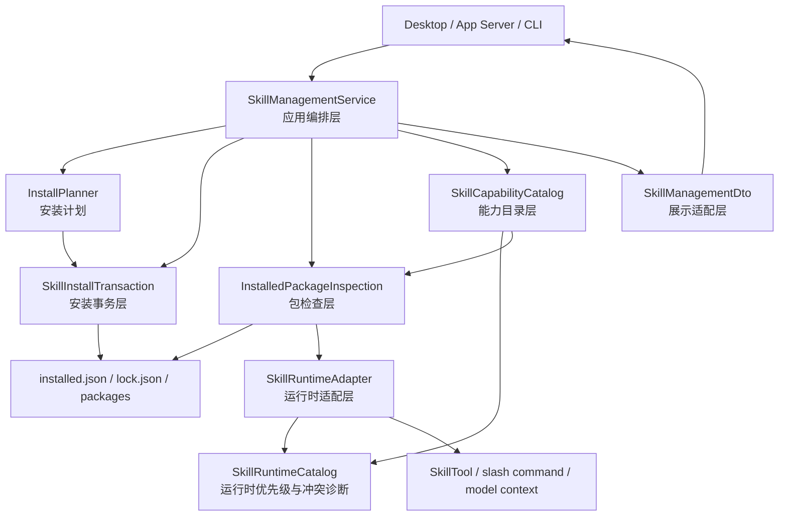
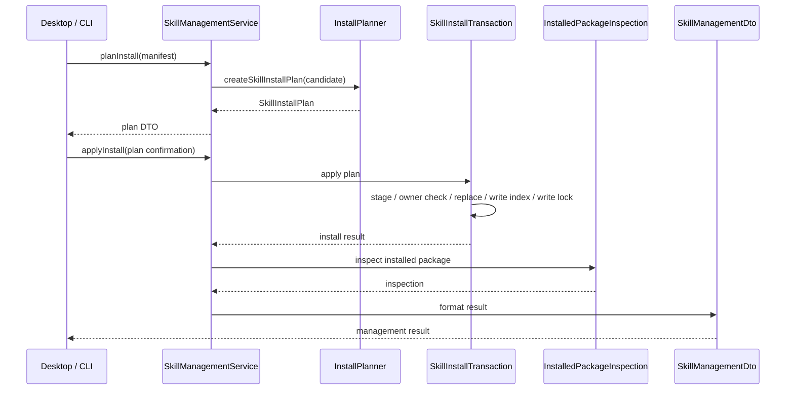

# CCR Skill 系统整体架构

本文定义 CCR Skill 系统的长期架构边界。它不是阶段 todo，也不记录单轮实现进度；后续 Skill 安装、管理、运行时、插件能力目录和代码重构都应优先对齐这里的分层。

## 1. 目标

Skill 系统需要同时服务三类入口：

- 模型运行时：模型上下文、SkillTool、MCP 生成 Skill。
- 用户入口：slash command、CLI、Desktop Skill 管理页。
- 安装管理：导入、安装、修复、卸载、启用、禁用、完整性检查。

整体架构目标是：

- 管理编排层变薄。
- 安装事务独立。
- installed package 状态判断唯一。
- 能力目录独立。
- 运行时适配独立。
- 管理 DTO 格式化独立。

## 2. 总体分层



## 2.1 Skill 状态术语

Skill 系统必须使用统一术语描述状态，避免管理页、SkillTool、slash command 和上下文注入各自解释。

| 中文主称呼 | 字段 / 对象 | 含义 | 唯一责任层 |
| --- | --- | --- | --- |
| 安装记录 | `InstalledSkillRecord` | 用户安装了某个 managed Skill，并保存 manifest、packageDir、enabled、invocation 默认值 | `managementStore.ts` / 安装事务 |
| 包检查状态 | `InstalledPackageInspection.status` | installed package 当前是否完整、漂移、缺失、无 owner marker 或无 lock | `installedPackageInspection.ts` |
| 启用状态 | `enabled` | 用户是否允许该 installed Skill 参与运行时候选 | 管理服务只写，activation policy 只读 |
| 模型调用面 | `modelInvocable` | 模型是否允许通过 SkillTool 主动调用 | `skillActivationPolicy.ts` / runtime adapter |
| 用户调用面 | `userInvocable` | 用户是否允许通过 slash command 或用户入口调用 | `skillActivationPolicy.ts` / command adapter |
| 运行时可见 | `runtimeVisible` | 该 Skill 是否能进入 runtime catalog 候选；由 enabled、检查状态、调用面共同决定 | `skillActivationPolicy.ts` + `skillRuntimeCatalog.ts` |
| 上下文注入 | `skill_listing` / `skill_discovery` | 本轮是否把 Skill 名称、描述或推荐候选放进模型上下文 | 后续 `SkillContextInjectionPolicy` |
| 动态发现命中 | discovery hit | 当前任务文本检索到了某个 Skill，不代表已调用 | 后续 `SkillDiscoveryIndex` |

不变式：

- `enabled=false` 表示 Skill 禁用；`modelInvocable=false` 只表示模型调用面关闭，不能在 UI 或诊断里显示成 Skill 禁用。
- installed record 存在不代表 runtime visible；package missing / drifted / invalid 必须让 runtime visible 为 false。
- runtime visible 不代表本轮上下文已经注入；上下文注入必须有独立策略和 hidden reason。
- `userInvocable=false` 的 Skill 不能出现在 slash command 入口，但仍可在 `modelInvocable=true` 时被 SkillTool 调用。
- `modelInvocable=false` 的 Skill 不能出现在模型静态列表或动态发现候选里，但可在 `userInvocable=true` 时作为用户入口存在。

## 2.2 安装目录、运行时目录与上下文路径

Skill 从“用户安装”到“模型能唤醒”会经过三层，不允许互相替代：

```text
安装目录
  -> installed.json / lock.json / packages
  -> 说明 CCR 管理了哪些 managed Skill package

运行时目录
  -> SkillRuntimeCatalog / prompt Command
  -> 说明当前 cwd / configHome / session 下哪些 Skill 能成为候选

上下文注入
  -> skill_listing / skill_discovery
  -> 说明本轮哪些 Skill 名称和描述已经进入模型上下文
```

当前不变式：

- 管理页和上下文注入都必须从当前 request 的 runtime catalog 读取，不再用 installed record 猜运行时能力。
- `skill_listing` 只放少量高置信 Skill；`skill_discovery` 按当前任务召回，并在返回前通过 `SkillVisibilityLedger` 过滤已 visible / loaded / discovered 的 Skill。
- catalog 查询仍保留完整清单语义，任务查询的自动 discovery 只提醒最相关的一个 Skill，避免弱相关命中污染后续发现。
- `DiscoverSkills` 和静态 listing 使用同一套 canonical Skill capability ID，能回到管理目录定位同一个能力。
- SkillTool 仍是最终调用入口；被 listing 或 discovery 提到不代表已经展开 `SKILL.md`。
- `SkillRuntimeRequestContext` 是模型上下文链路的当前请求事实来源；`skill_listing`、`skill_discovery`、`DiscoverSkills` 和 `SkillTool` 不应自行回默认 home。
- 有 canonical capability id 时，discovery 去重只按 capability id 判断；name fallback 只保留给没有 capability id 的 legacy entry。

## 3. 模块职责

当前代码落点：

| 架构层 | 主要模块 |
| --- | --- |
| 应用编排层 | `src/services/skills/managementService.ts` |
| 安装计划层 | `src/services/skills/installPlanner.ts` |
| 安装事务层 | `src/services/skills/installTransaction.ts` |
| 包检查层 | `src/services/skills/installedPackageInspection.ts` |
| 管理 DTO 层 | `src/services/skills/managementDtos.ts` |
| 管理持久化层 | `src/services/skills/managementStore.ts` |
| Skill 能力目录层 | `src/services/skills/capabilityProvider.ts` 和 `src/services/capabilities/skillCapabilityProvider.ts` |
| 运行时适配层 | `src/skills/skillRuntimeAdapter.ts` |
| 运行时排序层 | `src/skills/skillRuntimeCatalog.ts` |

### 3.1 SkillManagementService

应用编排层，对外承接 Desktop / App Server / CLI 请求。

它负责：

- 接收参数。
- 调用安装计划、安装事务、包检查、能力目录和 DTO 适配。
- 返回接口结果。
- 清理必要缓存。

它不负责：

- 不直接替换 package 目录。
- 不直接写 `installed.json` / `lock.json`。
- 不直接判断 `missing` / `drifted` / `invalid`。
- 不直接拼运行时能力目录。
- 不直接把 package 转成 runtime command。

### 3.2 InstallPlanner

安装计划层，负责判断一次安装是否可以执行。

它负责：

- 读取候选包。
- 计算安全策略结果。
- 判断 name conflict、package conflict、force 语义。
- 输出安装计划和确认 token。

它不负责：

- 不写文件。
- 不替换目录。
- 不更新 lock。
- 不做运行时激活判断。

### 3.3 SkillInstallTransaction

安装事务层，负责所有安装型写入。

它负责：

- staging 候选 package。
- 校验 owner marker。
- 替换 package 目录。
- 写 owner marker。
- 写 `installed.json`。
- 写 `lock.json`。
- 失败时快速暴露错误，并尽量恢复旧 package。

它不负责：

- 不决定 UI 怎么显示。
- 不决定 Skill 是否进入模型上下文。
- 不扫描 Desktop 管理页数据。

不变式：

- `installed.json` / `lock.json` 只能由安装事务层写。
- package 目录替换只能由安装事务层做。
- 非 installer-owned 目录不能覆盖、删除或静默接管。

### 3.4 InstalledPackageInspection

包检查层，负责判断 installed package 当前事实。

它负责输出统一状态：

```text
installed
disabled
missing-package
missing-skill-md
missing-owner-marker
missing-lock
drifted
invalid
```

它负责：

- 读取 installed record。
- 读取 lock record。
- 校验 owner marker。
- 校验 package / `SKILL.md` 是否存在。
- 校验 `SKILL.md` checksum。
- 校验 package tree checksum。
- 加载标准化 `CcrSkillPackage`。
- 输出 diagnostics。

它不负责：

- 不写文件。
- 不执行 repair。
- 不决定 UI 卡片文案。
- 不直接输出 runtime command。

不变式：

- installed package 状态只能在这里判断。
- 管理视图和运行时加载必须消费同一个检查结果。
- 其他模块不能重新发明 `missing` / `drifted` / `invalid` 判断。

### 3.5 SkillCapabilityCatalog

能力目录层，负责汇总“当前有哪些 Skill 能力”。

能力来源包括：

```text
managed installed skill
project skill
user skill
plugin skill
builtin plugin skill
bundled skill
dynamic skill
mcp skill
legacy command
```

每条能力至少表达：

```text
name
displayName
description
sourceKind
sourceLabel
installedRef
modelInvocable
userInvocable
enabled
runtimeVisible
hiddenReason
diagnostics
```

它负责：

- 合并 installed records 和 runtime commands。
- 标明来源。
- 标明运行时可见性。
- 标明同名冲突诊断。
- 给 Desktop / CLI / API 提供能力目录事实。

它不负责：

- 不写文件。
- 不替代 installed package inspection。
- 不输出 SkillTool prompt。
- 不做 UI 展示字段裁剪。

### 3.6 SkillRuntimeCatalog

运行时 catalog 层，负责模型和用户入口的运行时优先级。

它负责：

- 对 prompt command 做优先级排序。
- 按 name 去重。
- 输出 duplicate diagnostics。
- 保证 SkillTool 和 slash command 使用同一运行时事实。

它不负责：

- 不读写 installed index。
- 不做 package 完整性检查。
- 不承担 Desktop 管理 DTO。

### 3.7 SkillRuntimeAdapter

运行时适配层，负责把领域对象转成运行时命令。

它负责：

- 将 `InstalledPackageInspection + CcrSkillPackage` 转成 managed `Command`。
- 应用 `SkillActivationPolicy`。
- 分别适配 SkillTool 可见项和 slash command 可见项。

它不负责：

- 不判断 package 是否 drifted。
- 不写管理接口 DTO。
- 不做安装事务。

### 3.8 SkillManagementDto

展示适配层，负责把领域结果转成 Desktop / CLI / API 返回结构。

它负责：

- inspection digest。
- candidate digest。
- plan digest。
- capability digest。
- security digest。
- 字段裁剪和展示摘要。

它不负责：

- 不重新判断状态。
- 不重算 checksum。
- 不调用文件系统写入。

### 3.9 SkillManagementStore

管理持久化层，负责管理操作中的安装记录读写和受控卸载。

它负责：

- 启用 / 调用面更新时写回 installed record。
- installer-owned package 的卸载。
- 常用安装 manifest 保存。
- owner marker 归属校验。
- installed index 查找 helper。

它不负责：

- 不生成安装计划。
- 不替换 package 目录。
- 不计算 package tree checksum。
- 不生成 API 展示 DTO。

## 4. 核心数据对象

### 4.1 CcrSkillInstallManifest

安装配置。描述 Skill 从哪里来、安装到哪里、默认启用状态和信任声明。

### 4.2 CcrSkillInstalledRecord

安装记录。描述 CCR 已安装的 Skill package：

```text
name
scope
manifest
packageDir
skillFilePath
packageOwnerMarkerPath
enabled
modelInvocable
userInvocable
lockKey
```

### 4.3 CcrSkillLockRecord

锁定记录。描述安装时 package 的完整性：

```text
skillMd checksum
packageTree checksum
originVendor
updatedAt
```

### 4.4 InstalledSkillPackageInspection

包检查值对象。它是 installed package 当前状态的权威事实。

### 4.5 SkillRuntimeCapability

能力目录值对象。它是管理面和诊断面看到的 Skill 能力事实。

### 4.6 Command

运行时命令对象。它服务模型和用户调用，不等同于安装记录，也不等同于能力目录。

## 5. 关键流程

### 5.1 安装



### 5.2 修复

```text
ManagementService
  -> InstalledPackageInspection
  -> create candidate from manifest
  -> InstallPlanner(force)
  -> SkillInstallTransaction
  -> InstalledPackageInspection
  -> SkillManagementDto
```

修复不允许先删除旧 package。必须先构建候选包，再替换。

### 5.3 管理页列表

```text
ManagementService
  -> list InstalledPackageInspection
  -> build SkillRuntimeCatalog for current cwd
  -> build SkillCapabilityCatalog
  -> SkillManagementDto
```

管理页必须同时返回：

- 安装记录视图：`installed`
- 能力目录视图：`capabilities`

`installed` 不代表全部能力。

### 5.4 运行时加载

```text
InstalledPackageInspection
  -> SkillActivationPolicy
  -> SkillRuntimeAdapter
  -> SkillRuntimeCatalog
  -> SkillTool / slash command
```

运行时不直接读写管理 DTO。

## 6. 来源优先级

运行时同名 Skill 的建议优先级：

```text
policy
project
user
managed installed
plugin
bundled
dynamic
mcp
legacy command
```

同名冲突不能静默吞掉，必须进入 diagnostics。

## 7. 完整性规则

CCR installed package 的完整性由两层 checksum 组成：

- `skillMd`：`SKILL.md` 文件 checksum。
- `packageTree`：package 内资源树 checksum。

package tree checksum 应覆盖：

- `SKILL.md`
- `scripts/`
- `references/`
- `assets/`
- 其他 package 内普通文件

package tree checksum 不应覆盖：

- `.ccr-skill-package.json`
- `installed.json`
- `lock.json`
- 安装器临时 staging / backup 目录

资源漂移时，检查状态必须为 `drifted`。

## 8. 模块边界不变式

- 安装事务层是唯一写入层。
- 包检查层是 installed package 状态唯一权威。
- 能力目录层只合并事实，不写文件。
- 运行时适配层只服务模型和用户调用。
- DTO 层只格式化，不重新判断业务状态。
- 所有 fallback 必须显式命名、有诊断、有测试；禁止静默回到旧逻辑。
- 内部流转优先使用明确类型，不传半结构化 `Record<string, unknown>`。

## 9. 目录落点

建议长期目录形态：

```text
src/services/skills/
  managementService.ts
  installPlanner.ts
  installManager.ts
  installTransaction.ts
  installManifest.ts
  installCandidates.ts
  installedPackageInspection.ts
  packageTreeIntegrity.ts
  capabilityProvider.ts
  managementDtos.ts
  managementStore.ts
  securityScanner.ts
  securityPolicy.ts

src/skills/
  installedSkillLoader.ts
  skillActivationPolicy.ts
  skillRuntimeAdapter.ts
  skillRuntimeCatalog.ts
```

说明：

- `src/services/skills/` 偏管理、安装、持久化和领域服务。
- `src/skills/` 偏模型运行时、prompt command、SkillTool 和 slash command。
- 如果一个模块既写文件又返回 UI DTO，说明边界已经混乱，应拆开。

## 10. 后续重构判定标准

后续重构 Skill 代码时，先判断改动属于哪一层：

- 改安装写入：进入安装事务层。
- 改 installed package 状态：进入包检查层。
- 改管理页列什么能力：进入能力目录层。
- 改模型可见或 slash 可见：进入运行时适配层。
- 改接口返回字段：进入 DTO 层。

如果一次改动跨三层以上，应先写 goal 或方案，不直接开改。

## 11. 验证入口

Skill 内部分层重构固定 smoke：

```powershell
npm.cmd run smoke:skill-internal-refactor
```

发布前 Skill 全量回归：

```powershell
npm.cmd run smoke:skill-release
```
