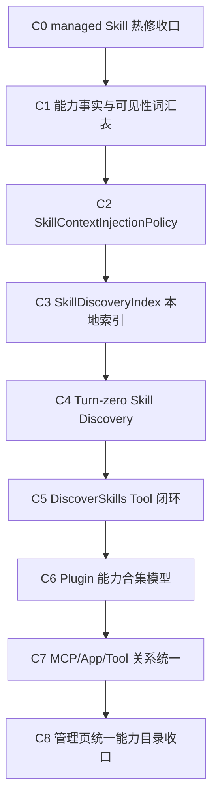

# Goal Series：Codex 对齐的扩展能力发现与注入重构序列

## 1. 目标

本序列以 [Codex 扩展能力体系学习笔记](../architecture/codex-extension-capability-study.md)、[CCR 扩展能力体系总览](../architecture/extension-capability-system.md) 和 [CCR Skill 系统整体架构](../architecture/skill-system-architecture.md) 为基线，把 Skill / Plugin / MCP / Tool 的“能力事实、运行时可见性、上下文注入、动态发现、管理页展示”拆成可验证的独立层。

最终目标：

```text
能力事实层
  -> 统一列出所有能力及来源

运行时可见性层
  -> 统一判断模型可调用 / 用户可调用 / 工具可调用 / hidden reason

上下文注入层
  -> 统一决定本轮哪些能力进入模型上下文

动态发现层
  -> 根据用户任务检索候选 Skill / 能力

管理页展示层
  -> 基于统一能力目录展示安装记录、运行能力和来源关系
```

一句话口径：

```text
管理页看到的是能力事实；模型看到的是上下文注入结果；动态发现是检索策略；三者共享同一能力目录，不再各自发明可见性。
```

## 2. 为什么拆成多迭代

当前问题不是单点 bug，而是几条链路互相借字段：

- Skill 管理页以 installed record 和 runtime activation 表达“启用 / 模型可调用 / 用户可调用”。
- SkillTool、slash command 和 `skill_listing` 各自有过滤逻辑。
- `EXPERIMENTAL_SKILL_SEARCH` 保留了动态发现入口和文案，但当前 local search / prefetch / DiscoverSkills Tool 不是完整闭环。
- Plugin 在 Codex 里是能力合集，但 CCR 当前只做了关系预留，没有完整表达 Plugin -> Skill / App / MCP / Tool 的关系。

如果一次性重构，容易把热修、模型上下文、插件模型、MCP 能力、管理页 UI 混在一起。拆成 C0-C8 后，每个迭代都能独立验证，并且可以在任意阶段暂停或发布。

## 3. 总体阶段图



## 4. 子 Goal

### C0 managed Skill 静态注入热修收口

目标：

- 先修当前用户可见问题：已安装、启用、模型可调用的 managed Skill 必须进入静态 `skill_listing`。
- 给当前 `EXPERIMENTAL_SKILL_SEARCH` 不完整动态发现链路补最小安全兜底。

范围：

- `skill_listing` 过滤策略保留 `bundled + managed + MCP`。
- 超预算时也不能丢 managed Skill。
- 补 smoke 固定 managed Skill 不被过滤。

非目标：

- 不实现动态发现。
- 不重构 Plugin。
- 不改 Desktop 管理页结构。

验收：

- `smoke:skill-static-listing-filter` 通过。
- `smoke:skill-internal-refactor` 通过。
- `build`、`typecheck`、`git diff --check` 通过。

状态：

- 已完成本地热修，尚未作为独立版本发布。
- 改动：`skill_listing` 静态过滤保留 `bundled + managed + MCP`，并新增 `smoke:skill-static-listing-filter`。
- 已验证：`build`、`smoke:skill-static-listing-filter`、`smoke:skill-internal-refactor`、`typecheck`、`git diff --check`。

### C1 能力事实与可见性词汇表统一

目标：

- 明确 CCR 内部统一词汇，避免继续混用 installed / enabled / disabled / runtimeVisible / modelInvocable / userInvocable。
- 把 Codex 学习结论中的 Plugin / Skill / App / MCP / Tool 边界写成 CCR 本地术语表。

范围：

- 更新 `extension-capability-system.md`。
- 更新 `skill-system-architecture.md`。
- 明确每个字段的中文主称呼、英文代码字段、来源、责任层。
- 明确 `management visibility`、`runtime visibility`、`context injection` 三者不同。

非目标：

- 不改运行时代码。
- 不改 UI。

验收：

- 文档里每个核心状态字段都有唯一解释。
- `Capability Catalog`、`SkillRuntimeCatalog`、`SkillContextInjectionPolicy` 的职责边界清楚。
- `git diff --check` 通过。

状态：

- 已完成本地文档更新。
- 改动：[CCR 扩展能力体系总览](../architecture/extension-capability-system.md) 新增统一术语与责任层。
- 改动：[CCR Skill 系统整体架构](../architecture/skill-system-architecture.md) 新增 Skill 状态术语。

### C2 SkillContextInjectionPolicy 抽出

目标：

- 把 `src/utils/attachments.ts` 里的 Skill 静态注入策略抽成独立策略模块。
- `attachments.ts` 不再直接判断哪些 Skill 来源应该进入上下文。

建议模块：

```text
src/skills/skillContextInjectionPolicy.ts
```

输入：

```text
SkillRuntimeCatalog / Command[]
context budget
feature flags
agent kind
MCP skill list
```

输出：

```text
included[]
hidden[]
diagnostics[]
reason
```

策略初始规则：

- `managed`：默认进入静态列表。
- `bundled`：默认进入静态列表。
- `mcp`：数量可控时进入静态列表，超限可裁剪。
- `project / user / plugin / dynamic`：默认保留给动态发现或后续预算策略，不在本迭代扩大注入面。
- disabled / modelInvocable=false：不进入模型静态列表。
- 同名冲突 loser：不进入模型静态列表，并输出 hidden reason。

非目标：

- 不实现检索。
- 不改 SkillTool 执行。
- 不重做 Capability Catalog provider。

验收：

- 新增 smoke 覆盖各来源和 hidden reason。
- `attachments.ts` 只消费 policy 输出。
- `smoke:skill-static-listing-filter` 迁移到 policy 测试。
- `smoke:skill-internal-refactor`、`typecheck` 通过。

状态：

- 已完成本地实现。
- 新增 `src/skills/skillContextInjectionPolicy.ts`，输出 included / hidden / diagnostics 和 reason。
- `attachments.ts` 已改为消费 `filterToStaticSkillListing()`，不再内联来源过滤逻辑。
- `smoke:skill-static-listing-filter` 已迁移到 policy 模块，并覆盖 hidden reason。
- 已验证：`build`、`smoke:skill-static-listing-filter`、`smoke:skill-internal-refactor`、`typecheck`。

### C3 SkillDiscoveryIndex 本地索引

目标：

- 把当前空实现的 `src/services/skillSearch/localSearch.ts` 做成最小可用本地索引。

输入来源：

- managed installed Skill。
- bundled Skill。
- user / project Skill。
- plugin Skill。
- MCP Skill prompt。

索引字段：

```text
name
displayName
description
whenToUse
sourceKind
parentPluginId
enabled
modelInvocable
userInvocable
runtimeVisible
```

搜索策略第一版：

- 先用 deterministic text match / token overlap。
- 支持中文和英文基础分词降级。
- 不引入大型向量依赖。
- 返回 score、matchedFields、reason。

非目标：

- 不做远程 Skill registry。
- 不做 embedding。
- 不做 LLM rerank。

验收：

- 新增 `smoke:skill-discovery-index`。
- 用 `bug-debug-helper`、`docs-update-helper`、`release-check-helper`、`frontend-design` fixture 验证中文任务可命中。
- 搜索结果只返回 runtime visible 且 modelInvocable 的候选。
- `typecheck` 通过。

状态：

- 已完成本地实现。
- `src/services/skillSearch/localSearch.ts` 已从空实现改为 deterministic 本地索引和搜索。
- 新增 `smoke:skill-discovery-index`，覆盖中文任务命中、model-off / disabled 过滤和无关查询。
- 已验证：`build`、`smoke:skill-discovery-index`、`smoke:skill-static-listing-filter`、`typecheck`。

### C4 Turn-zero Skill Discovery 注入闭环

目标：

- 让 `src/services/skillSearch/prefetch.ts` 从 unavailable 变成可用。
- 每轮用户输入进入模型前，能生成 `skill_discovery` 附件。

流程：

```text
用户输入
  -> startSkillDiscoveryPrefetch(input, messages, context)
  -> SkillDiscoveryIndex.search(input)
  -> skill_discovery attachment
  -> system-reminder: Skills relevant to your task
  -> 模型可见候选 Skill
```

策略：

- 明确用户问“有哪些 Skill”时，不做窄任务匹配，返回用户可见目录摘要。
- 普通任务只返回 top N 候选。
- 已经在静态列表注入的 Skill 不重复注入。
- 已经加载过的 Skill 不重复推荐。

非目标：

- 不实现 DiscoverSkills Tool。
- 不做 UI 改版。

验收：

- 新增 `smoke:skill-turn-zero-discovery`。
- 验证“排查 bug”命中 `bug-debug-helper`。
- 验证“更新文档”命中 `docs-update-helper`。
- 验证“发布版本”命中 `release-check-helper`。
- 验证“我现在有哪些 Skill”返回可见 Skill 目录而不是空泛解释。

状态：

- 已完成本地实现。
- `src/services/skillSearch/prefetch.ts` 已从 unavailable stub 改为基于本地索引生成 `skill_discovery` 附件。
- 新增 `smoke:skill-turn-zero-discovery`，覆盖中文任务匹配和“有哪些 Skill”目录查询。
- 已验证：`build`、`smoke:skill-turn-zero-discovery`、`smoke:skill-internal-refactor`。

### C5 DiscoverSkills Tool 闭环

目标：

- 判断并实现 `DiscoverSkills` 是否作为真实 Tool 暴露。
- 让模型在任务中途转向时可以主动搜索 Skill。

实现方式：

- 新增 `src/tools/DiscoverSkillsTool/DiscoverSkillsTool.ts`。
- 输入为自然语言任务描述。
- 调用 `SkillDiscoveryIndex.search()`。
- 返回候选 Skill、原因和是否已经可见。
- 不自动加载 Skill，只给模型候选；模型再用 SkillTool 调用。

非目标：

- 不做远程 Skill 下载。
- 不让 DiscoverSkills 执行 Skill。
- 不替代静态列表。

验收：

- `DiscoverSkills` 有真实 Tool schema、prompt 和 smoke。
- 系统提示中关于 DiscoverSkills 的文案只在 Tool 真可用时出现。
- SkillTool 对 remote / undiscovered 的保护仍然有效。
- `smoke:skill-discover-tool` 通过。

当前状态：

- 已新增 `src/tools/DiscoverSkillsTool/DiscoverSkillsTool.ts`，接入真实 Tool schema、prompt、只读调用和结果序列化。
- 已复用 `SkillDiscoveryIndex` 与 runtime discovery index，避免 turn-zero discovery 与 Tool discovery 两套索引漂移。
- 已在 `EXPERIMENTAL_SKILL_SEARCH` 特性下注册 `DiscoverSkills`，并补入 Skill release smoke group。
- 新增 `smoke:skill-discover-tool`，覆盖中文任务搜索、目录查询和 discoveredSkillNames 记录。
- 已验证：`build`、`typecheck`、`smoke:skill-discover-tool`、`smoke:skill-turn-zero-discovery`、`smoke:skill-discovery-index`、`smoke:skill-static-listing-filter`。

### C6 Plugin 能力合集模型

目标：

- 对齐 Codex：Plugin 是能力合集和分发单位。
- CCR 能表达 Plugin -> Skill / MCP / Tool / App 的关系。

建议模型：

```text
PluginCapability
  id
  name
  version
  source
  interface
  children[]

PluginChildCapability
  kind: skill | mcp-server | mcp-tool | tool | app | command
  capabilityId
  enabled
  available
  hiddenReason
```

范围：

- 扩展 `ExtensionCapabilityRelations`。
- `pluginCapabilityProvider` 不再只是预留空壳。
- 支持解析本地 plugin manifest 中的 `skills`、`apps`、MCP 配置预留。

非目标：

- 不实现插件安装器。
- 不实现 app connector 授权。
- 不重做 Plugin UI。

验收：

- 新增 smoke 覆盖一个 fixture plugin，包含多个 Skill 和 app 引用。
- `capabilities list` 能看到 Plugin 及子能力关系。
- Plugin 不被当成 Skill，也不被当成 Tool。

当前状态：

- 已扩展 `src/services/capabilities/pluginCapabilityProvider.ts`，支持从真实 `LoadedPlugin` 生成 `kind=plugin` 的能力合集条目。
- Plugin capability 保持 `runtimeVisible=false`、`modelInvocable=false`、`toolInvocable=false`，只作为分发/归属能力，不混成 Skill 或 Tool。
- metadata 已记录 repository、version、builtin 标记，以及 commands / agents / skills / hooks / MCP servers / LSP servers / output styles 组件计数。
- 保留 `plugins?: ExtensionCapability[]` 兼容入口，同时新增 `loadedPlugins?: LoadedPlugin[]` 入口。
- 已扩展 `smoke:capability-catalog-plugin-relations`，覆盖启用/禁用插件、pluginId、父关系、组件计数和 provider loadedPlugins 输入。
- 已验证：`build`、`typecheck`、`smoke:capability-catalog-plugin-relations`、`smoke:capability-catalog`、`smoke:capability-catalog-mcp-tool-provider`。

### C7 MCP / App / Tool 关系统一

目标：

- 把 MCP server、MCP tool、MCP prompt、App connector 和 Plugin 关系纳入统一目录。

范围：

- MCP server 作为连接能力。
- MCP tool 作为模型可调用工具能力。
- MCP prompt 如果被提升为 Skill，要表达为 `kind=skill source=mcp parentMcpServerName=...`。
- App connector 作为外部授权/数据连接能力；当前可先作为 metadata / relation，不必实现授权管理。

非目标：

- 不改 MCP transport。
- 不改 MCP 工具调用协议。
- 不做 connector OAuth。

验收：

- MCP 管理页和 Capability Catalog 对同一 MCP server 状态一致。
- MCP prompt 作为 Skill 时不会被 SkillTool 当普通 MCP prompt 误调。
- `smoke:mcp-tool-runtime`、`smoke:mcp-end-to-end`、新增关系 smoke 通过。

当前状态：

- 已扩展 `ExtensionCapabilityKind` 与 `ExtensionCapabilitySourceKind`，新增 `app`，并补齐 summary 计数。
- 已扩展 `ExtensionCapabilitySource` / `ExtensionCapabilityRelations`，新增 `appId`、`parentAppId`，为 App connector -> Tool / Plugin 关系预留稳定字段。
- 新增 `src/services/capabilities/appCapabilityProvider.ts`，支持把运行时传入的 app / connector 列表转成 `kind=app` 的统一能力条目。
- `listExtensionCapabilities()` 已接入 `createAppCapabilityProvider()`，默认空列表，不改变现有调用结果。
- 新增 `smoke:capability-catalog-app-provider`，覆盖 connected、needs-auth、disabled、pluginId 和 parentAppId 关系。
- 已验证：`build`、`typecheck`、`smoke:capability-catalog-app-provider`、`smoke:capability-catalog-mcp-tool-provider`、`smoke:capability-catalog-plugin-relations`、`smoke:capability-catalog`。

### C8 管理页统一能力目录收口

目标：

- Skill / MCP / Plugin 管理页逐步从“安装记录列表”升级成“能力目录视图”。
- 管理页能区分安装事实、运行事实、上下文注入事实。

范围：

- App Server 暴露统一能力目录 DTO。
- Desktop 显示来源关系和 hidden reason。
- Skill 页不只列 installed records，也能解释 plugin / bundled / dynamic / mcp Skill。
- MCP 页能显示 MCP server 下的 tool / prompt / skill 关系。

非目标：

- 不一次性重做所有视觉设计。
- 不引入复杂图谱 UI。

验收：

- 用户问“为什么管理页显示可用但模型不知道”时，有页面/诊断能解释。
- UI smoke 覆盖 Skill managed 可见、Plugin 子 Skill、MCP tool 关系。
- `fixtures:desktop-management-acceptance` 或等价 fixture 更新通过。

当前状态：

- App Server 已有 `capabilities/list` 统一 DTO 入口，当前已扩展参数支持 `apps`，可把宿主 App / connector 状态纳入统一能力目录。
- `listExtensionCapabilities()` 默认接入 Skill、MCP、Tool、Plugin、App providers；Plugin provider 未显式传入能力时会读取真实 `loadAllPlugins()` 结果，显式 fixture 则不会触发真实插件加载。
- Skill 管理服务现有 `listSkillManagementState()` 已返回 `capabilities` 与 `runtimeDiagnostics`，不再只是安装记录列表。
- 架构文档已更新 Plugin / Skill / MCP / Tool / App / Command 的总关系和管理页来源关系。
- 已扩展 `smoke:capability-api`，通过 App Server JSON-RPC 验证 app connector DTO、`parentAppId` 和 `parentPluginId`。
- 已验证：`build`、`typecheck`、`smoke:capability-api`、`smoke:capability-catalog`、`smoke:capability-catalog-app-provider`、`smoke:capability-catalog-plugin-relations`、`smoke:capability-catalog-skill-provider`。

## 5. 推荐执行顺序

短期：

1. C0：先修当前 managed Skill 看不到的问题，可作为 0.6.3 热修。
2. C1：统一术语，避免后续实现再次混。
3. C2：把上下文注入策略抽出来，停止在 `attachments.ts` 里写散逻辑。

中期：

4. C3：做本地 Skill 索引。
5. C4：接 turn-zero discovery。
6. C5：实现 DiscoverSkills Tool。

后期：

7. C6：Plugin 能力合集模型。
8. C7：MCP / App / Tool 关系统一。
9. C8：管理页统一能力目录收口。

## 6. 总体验收

本序列完成时，应满足：

- 用户安装并启用的 managed Skill 能稳定出现在模型可见上下文或动态发现结果中。
- 模型知道何时调用 Skill，不依赖泛化示例猜测。
- 动态发现是真实可用链路，不再是 unavailable stub。
- Plugin 可以作为能力合集展示，而不是被误解成单一 Skill。
- MCP / Tool / App / Skill 关系能在统一能力目录中解释。
- Desktop 管理页和模型运行时共享同一能力事实。

总体验证命令至少包含：

```powershell
npm.cmd run build
npm.cmd run typecheck -- --pretty false
npm.cmd run smoke:skill-release
npm.cmd run smoke:mcp-release
npm.cmd run smoke:skill-internal-refactor
npm.cmd run smoke:capability-catalog
git diff --check
```

涉及 Desktop 管理页时补：

```powershell
npm.cmd run typecheck:desktop
npm.cmd run fixtures:desktop-management-acceptance
```

## 7. 与既有序列关系

- A 系列已经完成 Capability Catalog 第一版横向统一。
- B 系列已经完成 Skill 内部结构第一轮瘦身。
- C 系列是在 A/B 基础上解决“能力事实如何进入模型上下文、如何被动态发现、如何和 Plugin/MCP/App 关系统一”的后续序列。

不要在 C 系列里回滚 A/B 已完成的模块边界；必要时通过小接口扩展承接。
