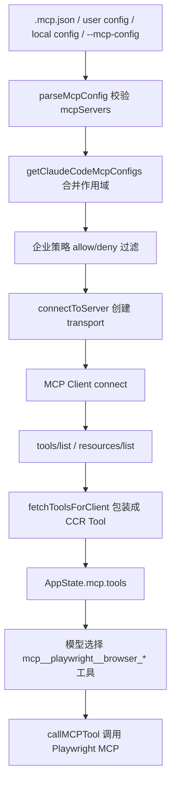

# Playwright MCP 接入设计文档

> 当前状态说明：本文是 Playwright MCP 第一轮接入的专项历史设计。MCP 安装候选、manifest 导入、手工配置接管和当前 Desktop 管理口径，以 [`README.md`](./README.md)、[`integration-standard.md`](./integration-standard.md) 和 [`install-manifest-and-import-design.md`](./install-manifest-and-import-design.md) 为准。文中关于 `~/.ccr/mcp/servers/playwright/` 的 managed 本地安装目录属于早期方案记录，不代表当前 Desktop 安装默认行为。

本文档记录 CCR 接入 Playwright MCP 的设计方案。目标不是重写一个浏览器自动化系统，而是先把官方 Playwright MCP 作为普通 MCP 服务接入 CCR 现有通用 MCP 链路；后续如果需要更深的浏览器能力，再在独立浏览器插件层扩展。

## 1. 背景和目标

CCR 现在已经恢复出一套通用 MCP 客户端链路，能够从配置读取 MCP 服务、建立连接、发现工具和资源，并把 MCP 工具注册进主循环。Playwright MCP 官方已经提供成熟的浏览器自动化 MCP 服务，支持通过 `npx @playwright/mcp@latest` 启动，并以结构化无障碍快照（accessibility snapshot）为主要交互方式。

本次接入的目标是：

- 让 CCR 能通过现有 `mcpServers` 配置接入 Playwright MCP。
- 不改 LLM provider、不改 Codex OAuth、不改主循环模型调用。
- 不恢复旧的 `claude-in-chrome` 作为主线浏览器方案。
- 第一阶段以通用 MCP 配置、运行链路、验证方法为主，后续再做 UI 化、预设化和浏览器状态管理。

非目标：

- 不在本轮重写 Playwright 协议。
- 不新增自研浏览器 MCP 服务。
- 不把 Playwright MCP 工具硬编码成 CCR 内置工具。
- 不把 `ccr mcp serve` 当成 Playwright 接入入口；它是 CCR 对外暴露自身工具的 MCP 服务入口。

## 2. 参考来源

### 2.1 CCR 当前源码

- `src/services/mcp/types.ts` 定义了 MCP 服务配置类型，支持 `stdio`、`sse`、`http`、`ws`、`sdk` 等 transport。
- `src/services/mcp/config.ts` 负责读取 `.mcp.json`、用户配置、本地配置、企业配置、插件 MCP 配置，并做策略过滤和去重。
- `src/services/mcp/client.ts` 负责创建 MCP transport、连接 MCP server、发现工具和资源、执行 MCP tool call。
- `src/services/mcp/useManageMCPConnections.ts` 负责把连接结果同步到 AppState。
- `src/tools/MCPTool/MCPTool.ts` 是 MCP 工具进入 CCR 工具系统的基础模板。
- `src/commands/mcp/addCommand.ts` 已有 `mcp add` 子命令，可以把 stdio/http/sse MCP 服务写入对应 scope。
- `src/main.tsx` 支持 `--mcp-config <configs...>` 动态加载 MCP 配置。

### 2.2 Playwright 官方 MCP

Playwright 官方文档说明 Playwright MCP 通过 Model Context Protocol 为 LLM 提供浏览器自动化能力，核心交互基于结构化无障碍快照，而不是依赖视觉模型。参考链接：

- [Playwright MCP Getting Started](https://playwright.dev/docs/getting-started-mcp)
- [Playwright MCP Installation](https://playwright.dev/mcp/installation)

官方标准配置是：

```json
{
  "mcpServers": {
    "playwright": {
      "command": "npx",
      "args": ["@playwright/mcp@latest"]
    }
  }
}
```

官方还说明默认是 headed 模式，可以看到浏览器；需要无头模式时增加 `--headless`；高级配置可以使用 `npx @playwright/mcp@latest --config path/to/config.json`。

本轮对 npm 包结构做了实测确认：

```text
包名：@playwright/mcp
当前实测版本：0.0.71
Node 要求：>=18
bin：playwright-mcp -> cli.js
包内关键文件：cli.js、index.js、config.d.ts、index.d.ts、package.json、README.md、LICENSE
```

这意味着 CCR 的 `.ccr` 管理式安装不应该写死“某个猜测入口”，而应该在安装后读取 `node_modules/@playwright/mcp/package.json` 的 `bin` 字段，确认真实入口后再写入 MCP 配置。

### 2.3 其他仓库经验

参考 `codex-main` 的方向，Playwright 不应该被硬编码到核心主循环，而应作为 MCP/app connector 进入工具系统。参考 `openclaw-main` 的方向，浏览器能力如果未来要做得更强，可以沉成独立浏览器插件，但第一阶段没有必要跳过 MCP 标准层。参考 `hermes-agent-main`，浏览器工具需要清楚地区分“通用 MCP 接入”和“专用浏览器会话管理”两个层次。

## 3. CCR 当前 MCP 架构

CCR 当前 MCP 链路可以拆成 8 个步骤：

1. 配置进入：来自 `.mcp.json`、用户配置、本地配置、企业配置、插件配置或 `--mcp-config`。
2. 配置解析：`parseMcpConfig` / `parseMcpConfigFromFilePath` 用 schema 校验 `mcpServers`。
3. 作用域合并：`getClaudeCodeMcpConfigs` 合并 enterprise、plugin、user、project、local 等来源。
4. 策略过滤：按 allowlist / denylist 过滤 server name、command、URL。
5. 连接建立：`connectToServer` 根据 transport 创建 `StdioClientTransport`、`SSEClientTransport`、`StreamableHTTPClientTransport` 等。
6. 能力发现：连接成功后拉取 `tools/list`、prompts、resources。
7. 工具注册：`fetchToolsForClient` 把 MCP tool 包装成 CCR `Tool`，名称变成 `mcp__<server>__<tool>`。
8. 工具调用：模型触发 MCP 工具时，`MCPTool.call` 经 `callMCPToolWithUrlElicitationRetry` 调用真实 MCP server。



## 4. 接入结论

Playwright MCP 第一阶段应接入 CCR 的通用 MCP，不需要新增专用浏览器模块。

理由：

- Playwright MCP 官方就是标准 MCP server，CCR 已支持 `stdio`。
- CCR 已经有工具发现、权限申请、工具调用、资源读取、连接失败状态和重连逻辑。
- 旧的 `claude-in-chrome` 属于特定内置服务，依赖 `@ant/claude-for-chrome-mcp`，不适合作为 CCR 新主线。
- Codex 的成熟方向也是“通过 MCP/app connector 暴露浏览器工具”，而不是把 Playwright 深度耦合到核心 agent runtime。

### 4.1 旧浏览器线处理状态

CCR 不再恢复旧 `WebBrowserTool` 和 `claude-in-chrome` 作为浏览器主线。

当前处理口径：

- `src/tools.ts` 中旧 `WebBrowserTool` 不再从内置工具注册表加载，避免 `WEB_BROWSER_TOOL` 打开后触发缺失源码。
- `src/screens/REPL.tsx` 中旧浏览器面板不再加载，避免 TUI 渲染旧 `WebBrowserPanel`。
- `--claude-in-chrome-mcp` 和 `--chrome-native-host` 入口改为明确退休提示，不再启动旧 Chrome MCP / native host。
- `src/services/mcp/client.ts` 中旧 `claude-in-chrome` 内置 MCP 分支改为显式报错，不再 `require('@ant/claude-for-chrome-mcp')`。
- 旧 Chrome 扩展通知、prompt 回流 hook、onboarding 组件改为 no-op。
- MCP instruction delta 不再注入旧 Chrome client-side instructions。

这样做的目的不是删除历史代码，而是先把旧浏览器线从运行路径和审计缺口里移走。后续浏览器能力只从通用 MCP 进入，第一优先级是 Playwright MCP。

## 5. 配置设计

### 5.1 推荐入口一：项目级 `.mcp.json`

适合当前仓库开发验证。文件位于当前 workspace 根目录：

```json
{
  "mcpServers": {
    "playwright": {
      "type": "stdio",
      "command": "npx.cmd",
      "args": ["-y", "@playwright/mcp@latest"]
    }
  }
}
```

说明：

- Windows 下不直接写 `command: "npx"`，而是写明确的 `npx.cmd`，避免命中 PowerShell 脚本入口。
- `-y` 用于减少 `npx` 首次执行时的交互确认。
- `type: "stdio"` 可以显式写出，虽然 schema 里 stdio 的 `type` 是可选的。

### 5.2 推荐入口二：命令行动态配置

适合临时验证，不污染项目配置：

```powershell
node --no-warnings --experimental-loader ./bun-bundle-loader.mjs ./cli.js --mcp-config .\docs\examples\mcp\playwright.json
```

如果使用非交互模式：

```powershell
node --no-warnings --experimental-loader ./bun-bundle-loader.mjs ./cli.js --mcp-config .\docs\examples\mcp\playwright.json -p "打开 https://example.com 并返回页面标题"
```

注意：`--mcp-config` 是主会话入口的可变参数，不适合直接写成 `ccr --mcp-config <file> mcp list`。那样后面的 `mcp list` 会被当成配置文件路径。要用 `mcp list` 验证连接时，优先使用项目级 `.mcp.json`，或在临时 smoke 目录里放一份 `.mcp.json` 后运行 `ccr mcp list`。

### 5.3 推荐入口三：用户级 `ccr mcp add-playwright`

适合正式安装版和日常使用。默认写入 `~/.ccr/mcp.json`：

```powershell
ccr mcp add-playwright
```

等价生成的核心配置是：

```json
{
  "mcpServers": {
    "playwright": {
      "type": "stdio",
      "command": "npx.cmd",
      "args": ["-y", "@playwright/mcp@latest"]
    }
  }
}
```

如果要覆盖已有同名配置：

```powershell
ccr mcp add-playwright --force
```

如果要无头模式：

```powershell
ccr mcp add-playwright --headless
```

如果要固定版本：

```powershell
ccr mcp add-playwright --version <tested-version>
```

如果要使用 `.ccr` 管理式安装：

```powershell
ccr mcp add-playwright --mode managed --version <tested-version>
```

这个入口不会写入 `.claude`，也不会写入旧的 CCR 全局 settings；新配置只进入 `~/.ccr/mcp.json`。旧 settings 里的 `mcpServers` 只作为迁移期只读兼容来源。

### 5.4 Playwright MCP 双安装模式

Playwright MCP 已支持两种安装方式：`npx` 快速模式和 `.ccr` 管理式安装模式。

#### 模式一：npx 快速模式

`npx` 快速模式是当前默认模式，适合快速接入、跟随官方包更新、减少 CCR 自身安装器复杂度。

命令入口：

```powershell
ccr mcp add-playwright
ccr mcp add-playwright --mode npx
```

配置形态：

```json
{
  "mcpServers": {
    "playwright": {
      "type": "stdio",
      "command": "npx.cmd",
      "args": ["-y", "@playwright/mcp@latest"]
    }
  }
}
```

适用场景：

- 开发者本机快速验证。
- 用户愿意让 npm/npx 自己管理下载和缓存。
- 暂时不需要离线安装、企业锁版本或 CCR 统一升级管理。

优点：

- 实现简单。
- 跟官方文档一致。
- 不需要 CCR 维护 npm 包安装生命周期。

代价：

- 首次启动可能慢。
- `@latest` 可能随上游变化。
- npx 缓存位置不归 CCR 完全管理。

#### 模式二：`.ccr` 管理式安装模式

`.ccr` 管理式安装模式是稳定发布模式。CCR 把指定版本的 Playwright MCP 安装到用户目录：

```text
~/.ccr/mcp/servers/playwright/
```

安装完成后会写入：

```text
~/.ccr/mcp/servers/playwright/package.json
~/.ccr/mcp/servers/playwright/package-lock.json
~/.ccr/mcp/servers/playwright/node_modules/@playwright/mcp/
~/.ccr/mcp/servers/playwright/manifest.json
```

其中 `manifest.json` 记录本次安装的关键事实：

```json
{
  "schemaVersion": 1,
  "packageName": "@playwright/mcp",
  "requestedVersion": "0.0.71",
  "installedVersion": "0.0.71",
  "entryPath": "C:/Users/<user>/.ccr/mcp/servers/playwright/node_modules/@playwright/mcp/cli.js",
  "binName": "playwright-mcp",
  "nodeCommand": "C:/Program Files/nodejs/node.exe"
}
```

然后 `~/.ccr/mcp.json` 指向本地入口，而不是每次通过 `npx` 解析：

```json
{
  "mcpServers": {
    "playwright": {
      "type": "stdio",
      "command": "C:/Program Files/nodejs/node.exe",
      "args": [
        "C:/Users/<user>/.ccr/mcp/servers/playwright/node_modules/@playwright/mcp/cli.js"
      ]
    }
  }
}
```

实际入口文件来自已安装包的 `package.json` `bin` 字段，不靠猜测路径。`nodeCommand` 使用当前运行 CCR 的 `process.execPath`，保证 MCP server 使用同一套 Node 运行时。

命令入口：

```powershell
ccr mcp add-playwright --mode managed
ccr mcp add-playwright --mode managed --version 0.0.71
ccr mcp add-playwright --mode managed --version 0.0.71 --force
```

适用场景：

- 发布版默认推荐。
- 希望固定版本、可回滚、可重装。
- 企业环境或弱网环境。
- 后续 App/Web 设置页需要展示“已安装版本、升级、卸载、修复”。

优点：

- 版本可控。
- 启动更稳定。
- 可以做健康检查、升级和卸载。
- 所有 CCR 管理的能力集中在 `~/.ccr`。

代价：

- 需要 npm 网络或本机 npm cache 支持安装。
- 要处理 npm 包结构变化、平台差异和失败恢复。
- 要维护版本元数据，例如 `~/.ccr/mcp/servers/playwright/manifest.json`。

#### 双模式不变式

- 两种模式都只改变 `mcpServers.playwright` 的启动命令，不改变 CCR MCP 运行时。
- 两种模式都通过 `~/.ccr/mcp.json` 进入 `user` scope。
- TUI、`mcp list/get`、主循环工具发现不关心安装来源，只关心 MCP server 是否能启动并握手。
- 默认继续用 `npx`，发布版和 UI 化管理可以推荐 `.ccr` 管理式安装。
- 如果 `.ccr` 管理式安装失败，用户可以退回 `npx` 模式，不应该导致浏览器 MCP 整体不可用。

当前 CLI 设计：

```powershell
ccr mcp add-playwright
ccr mcp add-playwright --mode npx
ccr mcp add-playwright --mode managed
ccr mcp add-playwright --mode managed --version <tested-version>
```

独立的 `ccr mcp playwright install/uninstall/repair/status` 可以作为后续体验增强；当前版本先保证 `add-playwright --mode managed` 这条完整链路可用。

### 5.5 推荐入口四：通用 `ccr mcp add`

适合后续安装版使用：

```powershell
ccr mcp add --scope user playwright -- npx.cmd -y @playwright/mcp@latest
```

注意：通用 `mcp add` 已把主要用户可见示例改成 `ccr`。少量历史兼容字段、旧环境变量名或旧导入命令不作为本轮重命名目标。

### 5.6 高级配置

如果后续需要浏览器模式、用户数据目录、网络规则等，优先把复杂参数放到 Playwright MCP 自己的配置文件里：

```json
{
  "mcpServers": {
    "playwright": {
      "type": "stdio",
      "command": "npx.cmd",
      "args": [
        "-y",
        "@playwright/mcp@latest",
        "--config",
        ".ccr/playwright-mcp.json"
      ]
    }
  }
}
```

这能保持 CCR 的 MCP 配置只负责“怎么启动服务”，浏览器细节由 Playwright MCP 自己管理。

## 6. 运行时设计

### 6.1 启动流程

1. 用户启动 CCR。
2. CCR 读取 MCP 配置，发现 `playwright` server。
3. `connectToServer` 进入 stdio 分支，启动 `npx.cmd -y @playwright/mcp@latest`。
4. MCP SDK 完成握手，Playwright MCP 返回 server capabilities。
5. CCR 调用 `tools/list`，拿到 `browser_navigate`、`browser_snapshot`、`browser_click` 等工具。
6. CCR 把这些工具包装成 `mcp__playwright__browser_navigate` 这类工具名。
7. 主循环把这些工具提供给模型。
8. 模型请求浏览器操作时，CCR 转发 tool call 给 Playwright MCP。

### 6.2 工具命名

CCR 对 MCP 工具使用统一前缀：

```text
mcp__<serverName>__<toolName>
```

所以 `playwright` 服务里的工具会表现为：

```text
mcp__playwright__browser_navigate
mcp__playwright__browser_snapshot
mcp__playwright__browser_click
mcp__playwright__browser_type
```

这样做的好处是：

- 不会和 CCR 内置工具重名。
- 权限规则可以按 server/tool 精确控制。
- 后续多个浏览器 MCP 服务并存时不会冲突，例如 `mcp__chrome_devtools__...`。

### 6.3 权限设计

Playwright MCP 的工具有明显的行动能力，不能因为它来自 MCP 就默认全放行。

第一阶段沿用 CCR 现有 MCP 权限机制：

- 所有 MCP 工具默认走 `MCPTool.checkPermissions` 的 passthrough 权限路径。
- 用户可以对具体工具添加 allow rule。
- 工具名使用完整 `mcp__playwright__browser_*`，避免误伤内置工具。
- 只读工具和写操作工具依赖 MCP tool annotations；如果 annotation 不可靠，CCR 侧后续可以补充浏览器工具分类表。

建议第一阶段默认人工确认以下操作：

- `browser_click`
- `browser_type`
- `browser_fill_form`
- `browser_file_upload`
- `browser_run_code`
- `browser_evaluate`
- `browser_press_key`

相对低风险但仍需记录的操作：

- `browser_navigate`
- `browser_snapshot`
- `browser_take_screenshot`
- `browser_console_messages`
- `browser_network_requests`

### 6.4 输出处理

CCR 当前 MCP 输出链路已经包含：

- 大输出截断。
- 图片内容处理。
- 二进制内容持久化。
- MCP 工具调用超时。
- URL elicitation retry。
- 资源列表和资源读取工具。

Playwright MCP 的截图、快照、控制台输出、网络请求输出，第一阶段都应走这条统一 MCP 输出链路，不单独开特殊通道。

## 7. 用户体验设计

### 7.1 第一阶段

第一阶段只做最小可用体验：

- 提供 Playwright MCP 配置示例。
- 支持通过 `--mcp-config` 或 `.mcp.json` 接入。
- 在 `/mcp` 或 MCP 状态界面中能看到 `playwright` 已连接。
- 模型能调用 `mcp__playwright__browser_*` 工具完成页面打开、快照和基础点击输入。

### 7.2 第二阶段

第二阶段已完成的 CCR 化体验：

- 增加 `ccr mcp add-playwright` 便捷命令。
- 提供 `docs/examples/mcp/playwright.json` 示例配置。
- 提供 `docs/examples/mcp/playwright-headless.json` 示例配置。
- 增加“浏览器 MCP 接入排查指南”。
- 用户级 MCP 主配置改为 `~/.ccr/mcp.json`。
- 补 `add-playwright --mode npx|managed` 的命令设计和实现。
- `managed` 模式会安装 `@playwright/mcp` 到 `~/.ccr/mcp/servers/playwright/`。
- `managed` 模式会写入 `manifest.json`，记录真实入口、版本和 Node 命令。

第二阶段仍可继续收尾：

- 增强 Playwright MCP 连接失败诊断。
- 增加独立 `install/uninstall/repair/status` 命令。

### 7.3 第三阶段

第三阶段做界面和长期配置：

- TUI 设置页增加 MCP 服务列表入口。
- App/Web 设置页增加“模型与工具”配置页。
- 用户可以在界面里启用/禁用 Playwright MCP。
- 用户可以选择 headed/headless、browser channel、user data dir、storage state。
- 配置仍落到 CCR 自己的配置目录，不使用 `.claude`。

## 8. 配置目录策略

CCR 后续不应继续使用 `.claude` 作为自己的默认配置目录。Playwright MCP 接入也要遵守这个边界。

推荐策略：

- CCR 自己的长期配置：`~/.ccr`。
- 项目级 MCP 配置：项目根目录 `.mcp.json`。
- 临时验证配置：`docs/examples/mcp/*.json` 或命令行 `--mcp-config`。
- Playwright MCP 自己的浏览器 profile：优先使用 Playwright MCP 默认策略；只有用户明确指定时，才写入 `.ccr/playwright/`。

后续如果新增 UI 配置，不要写入 `.claude`、不要读 `CLAUDE_CODE_*` 作为主入口。兼容旧变量也应该是迁移期的只读兼容，不应成为新设计依赖。

## 9. 安全和边界

### 9.1 安全边界

Playwright MCP 可以控制浏览器，因此风险比普通只读 MCP 高。

需要保留的安全边界：

- 不自动访问用户敏感站点。
- 不自动上传文件。
- 不自动提交表单或购买/支付。
- 不自动读取浏览器已有登录态，除非用户明确选择对应 profile。
- 不把 OAuth token、API key、cookie 打入 MCP server env。

### 9.2 依赖边界

第一阶段使用 `npx -y @playwright/mcp@latest` 可以最快验证，但发布版更建议：

- 文档保留 `@latest` 用于用户快速接入。
- 发布预设可以支持 pin 版本，例如 `@playwright/mcp@<tested-version>`。
- CI smoke 使用固定版本，避免上游 latest 变化导致测试不稳定。

### 9.3 平台边界

当前 CCR `package.json` 已要求 Node `>=24.0.0`，满足 Playwright MCP 当前 Node 要求。Windows 下启动命令应优先使用明确可执行的 `npx.cmd`，避免 `npx` 被 PowerShell/cmd 解析差异影响；只有确实需要 shell 语义时才使用 `cmd /c` 包装。

## 10. 验证方案

### 10.1 静态验证

1. 新建或指定 Playwright MCP JSON 配置。
2. 启动 CCR 时传入 `--mcp-config`。
3. 检查没有 MCP config schema fatal error。
4. 检查没有 Windows `npx` wrapper warning。

### 10.2 连接验证

1. 进入 CCR TUI。
2. 打开 `/mcp` 或相关 MCP 状态入口。
3. 确认 `playwright` 状态为 connected。
4. 确认工具列表中出现 `mcp__playwright__browser_*`。

命令行连接 smoke 可以用临时目录验证，不污染仓库根目录：

```powershell
$smokeDir = 'D:\agent_project\claude-code-reforged\tmp\playwright-mcp-smoke'
New-Item -ItemType Directory -Force -Path $smokeDir | Out-Null
Copy-Item -LiteralPath D:\agent_project\claude-code-reforged\docs\examples\mcp\playwright.json -Destination "$smokeDir\.mcp.json" -Force
node --no-warnings --experimental-loader file:///D:/agent_project/claude-code-reforged/bun-bundle-loader.mjs D:\agent_project\claude-code-reforged\cli.js mcp list
```

预期输出包含：

```text
playwright: npx.cmd -y @playwright/mcp@latest - ✓ Connected
```

进一步查看详情：

```powershell
node --no-warnings --experimental-loader file:///D:/agent_project/claude-code-reforged/bun-bundle-loader.mjs D:\agent_project\claude-code-reforged\cli.js mcp get playwright
```

### 10.3 只读 smoke

先只做只读动作：

```text
打开 https://example.com，读取页面快照，并告诉我页面标题。
```

预期调用：

```text
mcp__playwright__browser_navigate
mcp__playwright__browser_snapshot
```

如果暂时不想消耗模型调用，也可以直接用 MCP SDK 对同一份配置做 server 级 smoke：启动 Playwright MCP、调用 `browser_navigate`、再调用 `browser_snapshot`。本地已验证 `https://example.com` 能返回标题 `Example Domain` 和结构化快照。

### 10.4 交互 smoke

再做公开 demo 页面：

```text
打开 https://demo.playwright.dev/todomvc，新增一个 todo，截图确认。
```

预期调用：

```text
mcp__playwright__browser_navigate
mcp__playwright__browser_snapshot
mcp__playwright__browser_type
mcp__playwright__browser_take_screenshot
```

### 10.5 回归验证

接入 Playwright MCP 后必须确认：

- `npm.cmd run typecheck -- --pretty false` 仍通过。
- `npm.cmd run build -- --pretty false` 仍通过。
- 不影响 Codex OAuth 登录。
- 不影响 `-p` 非交互模式。
- 不影响没有 MCP 配置时的普通启动。

## 11. 后续实现任务

第一批建议任务：

- 新增 `docs/examples/mcp/playwright.json`。已完成。
- 新增 `docs/examples/mcp/playwright-headless.json`。已完成。
- 用 `--mcp-config` 做一次连接 smoke。已完成。
- 增加 `ccr mcp add-playwright`，默认写入 `~/.ccr/mcp.json`。已完成。
- 确认 `ccr mcp list/get` 能读取用户级 `~/.ccr/mcp.json`。已完成。
- 检查 `/mcp` 显示里是否能清楚展示 `playwright` 工具。

第二批建议任务：

- 增加 Playwright MCP 连接失败诊断，包括 `npx` 不存在、首次安装慢、浏览器下载失败、端口/权限问题。
- 增加浏览器工具风险分类，优先覆盖 `browser_run_code`、`browser_file_upload`、表单提交类操作。
- 继续清理 MCP 其他命令中的旧品牌文案，但保留确实用于迁移/兼容的历史命名。
- 增加 Playwright MCP 独立管理命令：`install`、`uninstall`、`repair`、`status`。

第三批建议任务：

- 在 App/Web 设置页设计“工具与 MCP”管理入口。
- 支持用户选择浏览器模式、profile、storage state。
- 如果通用 MCP 已不能满足需求，再参考 OpenClaw 的 browser plugin 方案，做 CCR 自己的专用浏览器插件。

## 12. 关键判断

当前最稳的路线是：

```text
Playwright MCP 官方服务
  -> CCR 通用 MCP stdio 配置
  -> CCR MCP 连接管理
  -> CCR MCP 工具包装
  -> 主循环按 mcp__playwright__browser_* 调用
```

这条路线符合“先用成熟方案、再做自有体验”的原则。它既能快速得到可用浏览器能力，又不会把 CCR 绑死在某个自研浏览器实现上。后续如果要做 App/Web 前台，也可以把 Playwright MCP 当成默认推荐工具，通过设置页管理，而不是重写底层协议。

## 13. 已知待确认点

- MCP 其他命令的旧品牌提示是否需要继续分批替换为 CCR。
- `@playwright/mcp@latest` 在 Windows Node 24 下首次启动的耗时和浏览器下载路径。
- Playwright MCP 返回的 tool annotations 是否足够支持 CCR 自动区分只读/写操作。
- `/mcp` UI 是否对大量 browser 工具展示友好。
- 如果用户选择连接现有浏览器 profile，cookie 和登录态边界需要单独设计确认。
- 是否要做 CCR 管理式本地安装器，把固定版本 MCP server 安装到 `~/.ccr/mcp/servers/playwright/`，而不是继续依赖 `npx`。
