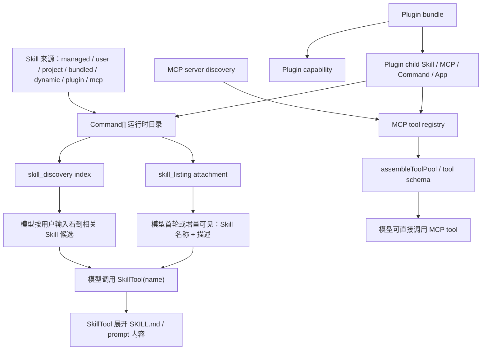

# 扩展能力运行时与上下文源码证据索引

> 日期：2026-06-06  
> 范围：Skill、MCP、Plugin、Tool、Command 从来源到模型上下文或工具 schema 的当前真实链路。

## 1. 当前流程总图



## 2. 源码入口表

| 路径 | 入口 | 当前职责 |
| --- | --- | --- |
| `src/commands.ts` | `getSkillToolCommands(cwd)` / `getMcpSkillCommands(...)` | Skill command 薄 adapter；消费统一 runtime eligibility 和 catalog。 |
| `src/skills/skillRuntimeCatalog.ts` | `createSkillRuntimeCatalog()` / `createSkillRuntimeCapabilityCatalog()` | 对 prompt command 按优先级去重，形成 Skill runtime catalog 和 capability 事实。 |
| `src/skills/skillCommandRuntimeVisibility.ts` | `resolveSkillCommandRuntimeEligibility()` / `getSkillCommandAdapterKind()` | 唯一 Skill command 可调用性判断，并显式区分 legacy、Plugin Skill、MCP Skill 与 MCP Prompt。 |
| `src/utils/attachments.ts` | `getSkillListingAttachments()` | 生成 `skill_listing` attachment，按 agent 维度记录已发送 Skill。 |
| `src/skills/skillContextInjectionPlanner.ts` | `planSkillContextInjection()` | 统一输出静态列表、发现候选、隐藏原因、诊断和预算统计。 |
| `src/skills/skillContextInjectionPolicy.ts` | `applyStaticSkillListingPolicy()` | 只负责静态注入来源与预算策略，不重复判断 enabled/modelInvocable。 |
| `src/services/skillSearch/prefetch.ts` | `discoverRuntimeSkills()` / `buildRuntimeSkillDiscoveryCatalog()` | turn-zero、inter-turn 和 DiscoverSkills 的运行时发现入口。 |
| `src/services/skillSearch/skillDiscoveryService.ts` | `discoverSkills()` / `searchSkillDiscoveryIndex()` | 单一轻量检索实现，输出 stable identity、score、matchedFields 和 reason。 |
| `src/services/skillSearch/localSearch.ts` | compatibility exports | 仅保留旧导入兼容，不再建立独立索引或执行可见性过滤。 |
| `src/tools/SkillTool/*` | `SkillTool` validate / call / prompt | 模型调用 `Skill(<name>)` 后展开完整 Skill 内容。 |
| `src/services/capabilities/*CapabilityProvider.ts` | `list*Capabilities()` | 将 Skill / MCP / Tool / Plugin / App 转成统一 capability 事实。 |
| `src/services/capabilities/capabilityCatalog.ts` | `buildExtensionCapabilityCatalog()` | 汇总 provider 输出、排序、冲突处理、summary。 |
| `src/services/capabilities/managementProjectionService.ts` | `createCapabilityManagementProjection()` | 为 Skill、MCP、Plugin 页面生成统一只读管理投影。 |
| `src/services/capabilities/managementActionService.ts` | `createCapabilityManagementActionPlan()` / `canApplyCapabilityManagementAction()` | 将 `allowedActions/actionRef` 收口为统一能力管理动作 plan / apply 预检契约。 |
| `src/services/capabilities/skillManagementViewProjection.ts` | `createSkillManagementViewItems()` | Desktop Skill 页从 `management.skills` 生成列表和详情 view item，installed inspection 只按 `installedRef/actionRef` enrichment。 |
| `src/services/capabilities/appCapabilityProvider.ts` | `AppConnectorSnapshot` / `createAppCapabilityProvider()` | App / Connector host-provided 预留 adapter；无真实来源输入时不生成用户可见 App capability。 |
| `src/services/tools/toolCapabilitySnapshot.ts` | `createCcrToolCapabilitySnapshot()` | ToolSearch 与 Capability Catalog 共享的工具 registry / availability / searchable 快照。 |
| `src/skills/mcpSkills.ts` | `fetchMcpSkillsForClient()` | 按 Draft SEP-2640 Skill resources 读取 MCP Skill，失败不回退成 MCP Prompt。 |
| `src/services/mcp/*` / `src/tools.ts` | MCP server / tool registry | MCP tool 作为 tool schema 暴露给模型，不走 SkillTool 展开。 |
| `scripts/smoke-desktop-skill-management-projection.mjs` | `smoke:desktop-skill-management-projection` | 验证 Desktop Skill 管理投影能展示 managed/user/plugin/MCP/dynamic/installed-only Skill，并按 `allowedActions/actionRef` 控制操作。 |
| `scripts/smoke-capability-management-actions.mjs` | `smoke:capability-management-actions` | 验证统一能力管理动作 plan / apply 覆盖非法动作、确认要求、Skill 刷新和 MCP 动作。 |
| `scripts/smoke-extension-capability-management-e2e.mjs` | `smoke:extension-capability-management-e2e` | 串联 R13-R16 关键 smoke，作为 release gate 的真实路径门禁。 |

## 3. `skill_listing` 当前链路

输入：

- `getProjectRoot()` 得到当前项目根目录。
- `getSkillToolCommands(cwd)` 返回本地 Skill command。
- `getMcpSkillCommands(appState.mcp.commands)` 返回 MCP 贡献的 Skill command。
- `toolUseContext.options.tools` 决定当前 agent 是否有 `Skill` tool。
- `sentSkillNames` 按 agent id 记录已发送 Skill 名称。
- `suppressNextSkillListing()` 用于 resume 后跳过重复注入。

输出：

- attachment：

```text
type: skill_listing
content: formatCommandsWithinBudget(...)
skillCount
isInitial
```

当前决策链：

- 当前 agent 没有 `Skill` tool 时，不注入 `skill_listing`。
- `NODE_ENV === 'test'` 时跳过。
- Skill search 开启时，静态列表策略只保留 bundled / managed / mcp；project / user / plugin / dynamic 进入 discovery-only。
- Skill search 未开启时，历史行为接近“所有可模型调用的 prompt Skill 都可进入静态列表”。
- 发送前按 agent id 去重；主线程和 subagent 不共享已发送集合。
- resume suppress 时，只标记当前静态列表为已发送，不再生成 attachment。

R0 结论：

- 能进 `skill_listing` 的不是“所有安装记录”，而是当前 runtime 可加载的 prompt Skill command，再经过静态列表策略、Skill tool 可用性、已发送集合和预算格式化。
- `skill_listing` 是名称和描述提示，不是完整 Skill 内容。

## 4. `skill_discovery` 当前链路

输入：

- turn-zero 用户输入文本。
- `getSkillToolCommands(cwd)`。
- `getMcpSkillCommands(appState.mcp.commands)`。
- 本地搜索索引 `createSkillDiscoveryIndex()`。

输出：

```text
type: skill_discovery
skills: [{ name, description }]
signal: { cli: [query] }
source: native
```

当前过滤条件：

- 用户输入为空时不生成。
- `ContextInjectionPlanner.discoveryCandidates` 已先消费统一 runtime eligibility。
- 候选携带 stable `capabilityId`、来源、Plugin/MCP parent relation。
- discovery service 只检索和排序，不重新判断安装、启用或模型调用状态。
- 普通 Tool、普通 MCP tool、Plugin bundle 自身不进入 Skill discovery。
- catalog 查询类输入，例如“有哪些 skill”，返回前 20 个候选。

当前结论：

- 能进 `skill_discovery` 的是可模型调用且启用的 Skill command。
- discovery 是“候选提示”，不是执行入口；真正展开仍要模型调用 `Skill(<name>)`。
- turn-zero、inter-turn 和 `DiscoverSkills` 共用同一发现服务。

## 5. Skill 被模型唤醒和展开的链路

1. 系统通过 `skill_listing` 或 `skill_discovery` 把 Skill 名称和描述放进模型上下文。
2. 模型根据用户任务判断是否需要某个 Skill。
3. 模型调用 `SkillTool`，参数是 Skill 名称。
4. `SkillTool` 在 runtime command registry 里找到对应 prompt command。
5. command 的 `getPromptForCommand()` 返回完整 prompt / `SKILL.md` 内容。
6. 展开后的内容作为 tool result 进入上下文，模型再按 Skill 指令继续执行。

不变式：

- Skill 不是 tool schema 本身。
- Skill 的静态列表和 discovery 只负责“让模型知道可能有这个能力”。
- Skill 的完整内容只在模型选择调用 Skill 后展开。
- `disableModelInvocation` 只表示模型不能主动调用，不等于 Skill 被用户禁用。

## 6. MCP tool 链路

MCP tool 的链路和 Skill 不同：

1. MCP server 从配置或插件中加载。
2. MCP client 发现 server 暴露的 tools / resources / prompts。
3. Tool registry 将 MCP tool 映射为 CCR tool capability。
4. `assembleToolPool()` 一类工具装配链路把可用 tool schema 交给模型。
5. 模型直接调用 MCP tool schema。

不变式：

- MCP tool 是模型直接可调用工具。
- MCP Skill 是 MCP 贡献的 Skill command，仍然需要 SkillTool 展开。
- MCP server 是连接与来源对象，不是 Skill。
- MCP resource attachment 是资源内容注入，不等同于 Skill listing 或 tool schema。

## 7. Plugin bundle 与 child capability

Plugin 更像能力合集，不是单一调用对象：

- Plugin bundle 自身应作为 `plugin` capability 展示安装、启用、来源和组件数量。
- Plugin child Skill 应保留 `parentPluginId`，仍按 Skill 语义进入 listing / discovery / SkillTool。
- Plugin child MCP server / tool 应保留 `parentPluginId`，但仍按 MCP / Tool 语义暴露。
- Plugin child Command / App 应保留 parent relation，不能被 Plugin bundle 自身替代。

R0 识别并已在 R1-R8 解决的问题：

- Plugin Skill、Plugin MCP 和其他 child 现在通过统一 `pluginId` 追溯来源。
- 同名冲突现在使用 `kind + name` runtime key，不会把 Skill、MCP Tool 和普通 Tool 混为一类。

## 8. 与上下文治理的边界

本序列不改：

- `currentContextMessages` 的消息语义。
- ThreadDisplay / display snapshot 的 UI history 合约。
- compact / snip / context budget 的主链路。
- MCP tool schema 的执行协议。
- SkillTool 的展开协议。

本序列只负责：

- 能力事实从哪里来。
- 能力当前是否运行时可见。
- 本轮哪些 Skill 名称和描述进入模型上下文。
- 哪些 Skill 只进入 discovery 候选。
- 未进入列表的原因如何诊断。

## 9. 后续 R1-R3 消费基线

R1 消费：

- Capability Catalog 必须覆盖 Skill / MCP / Tool / Plugin / App。
- 同名不同 kind 不得互相吞并。
- Plugin child capability 必须保留 parent relation。

R2 消费：

- `enabled`、`runtimeVisible`、`modelInvocable`、`userInvocable`、`toolInvocable`、`hiddenReasons` 要集中判定。
- 模型调用关闭不是 Skill 禁用。
- 缺包、漂移、缺 lock、缺 owner marker 等完整性问题要输出统一 hidden reason。

R3 消费：

- `attachments.ts` 只消费 planner 输出。
- `skill_listing` 和 `skill_discovery` 使用同一组 Skill 候选事实。
- project / user / plugin / dynamic Skill 默认进入 discoveryCandidates。
- managed / bundled / MCP Skill 可进入静态列表，但 MCP 必须受预算约束。

## 10. R4-R8 完成证据

| 阶段 | 关键落点 | 验证 |
| --- | --- | --- |
| R4 | `skillDiscoveryService.ts`、真实 inter-turn signal、session capability id | discovery index / turn-zero / inter-turn / DiscoverSkills smoke |
| R5 | `mcpSkills.ts` Draft SEP-2640 resource adapter、server cache invalidation | `smoke:mcp-skill-resource-adapter` |
| R6 | `pluginIdentityResolver.ts`、`pluginImpactProjection.ts`、parent state propagation | `smoke:capability-catalog-plugin-relations` |
| R7 | `managementProjectionService.ts`、`capabilities/management/list`、Desktop 三页 | `smoke:capability-management-projection`、`smoke:capability-api` |
| R8 | `resolveSkillCommandRuntimeEligibility()`、typed command adapter kinds | `smoke:skill-command-adapter-boundaries`、listing/planner/visibility smoke |
| R13 | `managementActionService.ts`、`capabilities/management/action/plan|apply`、Desktop Skill / MCP unified action | `smoke:capability-management-actions` |
| R14 | `AppConnectorSnapshot`、`createAppCapabilityProvider({ apps })` synthetic-only reserve | `smoke:capability-catalog-app-provider` |
| R15 | `toolCapabilitySnapshot.ts`、ToolSearch policy、Tool Capability Provider | `smoke:tool-registry` |
| R16 | release gate wrapper、R13-R15 smoke 串联 | `smoke:extension-capability-management-e2e` |

判断项的唯一 owner：

| 判断项 | 唯一 owner | 下游允许行为 |
| --- | --- | --- |
| enabled / modelInvocable / runtimeVisible | `skillCommandRuntimeVisibility.ts` | planner、policy、SkillTool 只消费结果 |
| 静态列表来源和预算 | `skillContextInjectionPolicy.ts` | attachment 只消费 plan |
| 动态匹配和排序 | `skillDiscoveryService.ts` | turn-zero/inter-turn/Tool 只投影结果 |
| Plugin/MCP 父子状态 | `capabilityCatalog.ts` | Desktop 只展示 hidden reasons |
| 管理归属和允许动作 | `managementProjectionService.ts` | 下游只消费 `allowedActions/actionRef` |
| 管理动作 plan / apply | `managementActionService.ts` + App Server handler | 写操作必须先经过统一预检，再分发到 Skill / MCP 领域服务 |
| App / Connector 来源 | host-provided `AppConnectorSnapshot` | 没有真实来源输入时不生成 App capability |
| ToolSearch 候选 | `toolCapabilitySnapshot.ts` | ToolSearch 和 Capability Catalog 共享 availability / exposure / searchable |
