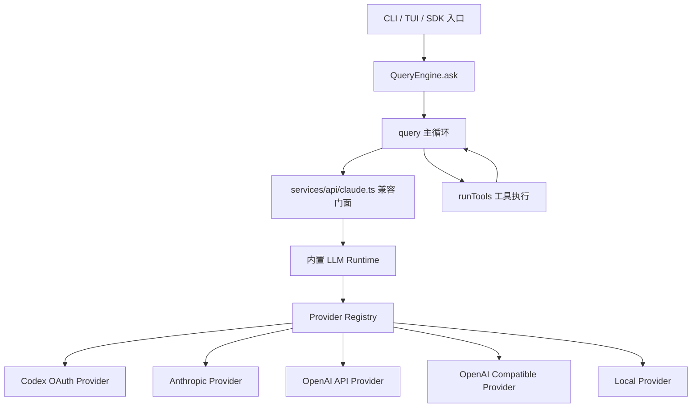
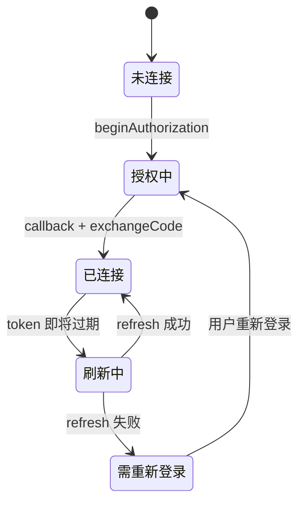

# 内置通用 LLM Runtime 设计方案

## 1. 目标

本方案用于把 `claude-code-reforged` 从“Anthropic 专用模型调用”改造成“内置通用 LLM Runtime”，并以 `Codex OAuth` 作为第一个非 Anthropic provider 接入。

核心目标：

- 不再采用长期外置网关方案。
- 不再让前台显示 `sonnet`、后台偷偷映射到 `gpt-5.4`。
- 前台、配置、日志、运行时都展示真实 provider 和真实 model。
- 保留现有 `QueryEngine`、`query.ts`、工具调用、权限审批、上下文管理主链路。
- 把模型调用、认证、模型列表、流式输出、错误处理收敛到新的 `src/services/llm/` 内置层。
- 为后续 `Anthropic / OpenAI API / Codex OAuth / OpenAI Compatible / Local` 多 provider 并存打基础。

非目标：

- 不在第一轮重写工具系统。
- 不在第一轮重写上下文压缩、权限审批、MCP、插件系统。
- 不把 ChatGPT/Codex OAuth token 塞进现有 Anthropic auth 逻辑。
- 不把 provider 逻辑散落到 CLI、UI、query loop 和工具执行层。

## 2. 当前源码链路

现有模型调用链路如下：

```text
main.tsx / cli/print.ts
  -> QueryEngine.ask()
  -> query()
  -> deps.callModel = queryModelWithStreaming()
  -> services/api/claude.ts
  -> getAnthropicClient()
  -> @anthropic-ai/sdk
```

关键源码位置：

| 位置 | 当前职责 | 设计处理 |
| --- | --- | --- |
| `src/QueryEngine.ts` | SDK/print 问答入口，调用 `query()` | 保留，不在第一轮改主结构 |
| `src/query.ts` | 主循环、工具调用、权限和多轮推进 | 保留，不把 provider 逻辑塞进这里 |
| `src/query/deps.ts` | 把 `queryModelWithStreaming` 注入为 `callModel` | 保留函数签名，底层换实现 |
| `src/services/api/claude.ts` | Anthropic 请求构造、流式/非流式、错误转换 | 改造成兼容门面，委托给 `LLM Runtime` |
| `src/services/api/client.ts` | 创建 Anthropic SDK client | 只保留给 `AnthropicProvider` 使用 |
| `src/utils/model/providers.ts` | `firstParty / bedrock / vertex / foundry` provider 识别 | 不再作为通用 provider 总线 |
| `src/utils/auth.ts` | Anthropic API Key / Claude OAuth 读取 | 只作为 Anthropic provider 的认证来源 |

现有结构的核心问题：

- provider 概念是 Anthropic 生态内的 provider，不是通用 LLM provider。
- 模型名、模型校验、默认模型、错误文案都偏 Claude 模型。
- `ANTHROPIC_BASE_URL` 可以做外部代理，但长期会把真实 provider/model 隐藏起来。
- Codex OAuth 不能安全地塞进 `ANTHROPIC_AUTH_TOKEN` 或 `CLAUDE_CODE_OAUTH_TOKEN`，否则边界会混乱。

## 3. 目标架构



新架构的关键点：

- `query.ts` 仍然只关心“模型返回了什么消息块”，不关心 provider。
- `services/api/claude.ts` 暂时保留文件名和导出函数，减少调用方改动。
- 新增 `src/services/llm/`，承接真正的 provider 选择、请求转换、认证和响应归一化。
- Anthropic 不再是唯一底座，而是 `ProviderRegistry` 中的一个 provider。
- Codex OAuth 作为独立 provider 接入，不伪装成 Anthropic auth。

## 4. 新增模块设计

建议新增目录：

```text
src/services/llm/
  index.ts
  llmRuntime.ts
  providerRegistry.ts
  types.ts
  errors.ts
  config/
    llmConfig.ts
    modelCatalog.ts
  adapters/
    anthropicBlocks.ts
    toolProtocol.ts
    streamingEvents.ts
  providers/
    codexOAuth/
      CodexOAuthProvider.ts
      CodexOAuthSession.ts
      codexConfig.ts
    anthropic/
      AnthropicProvider.ts
    openai/
      OpenAIResponsesProvider.ts
    openaiCompatible/
      OpenAICompatibleProvider.ts
```

### 4.1 `types.ts`

定义内部统一模型协议。

核心类型：

```ts
export type LlmProviderId =
  | 'codex-oauth'
  | 'anthropic'
  | 'openai-api'
  | 'openai-compatible'
  | 'local'

export interface LlmGenerateRequest {
  providerId: LlmProviderId
  model: string
  systemPrompt: string[]
  messages: LlmMessage[]
  tools: LlmToolDefinition[]
  toolChoice?: LlmToolChoice
  maxOutputTokens?: number
  temperature?: number
  reasoningEffort?: 'low' | 'medium' | 'high' | 'xhigh'
  stream: boolean
  abortSignal?: AbortSignal
  source: 'main-loop' | 'side-query' | 'model-validation' | 'sdk'
}

export interface LlmProvider {
  id: LlmProviderId
  displayName: string
  listModels(): Promise<LlmModelInfo[]>
  validateModel(model: string): Promise<LlmModelValidationResult>
  generate(request: LlmGenerateRequest): AsyncIterable<LlmGenerateEvent>
}
```

设计原则：

- 核心模块只依赖 `LlmProvider` 接口，不依赖某个 SDK。
- provider 内部可以使用官方 SDK、OAuth session、fetch 或第三方库。
- 外部不直接读取 token，不直接拼 provider 私有请求。

### 4.2 `llmRuntime.ts`

运行时入口，负责把上层请求路由到 provider。

职责：

- 读取当前 provider / model / reasoning 配置。
- 校验 provider 是否启用。
- 校验 model 是否属于当前 provider。
- 调用 provider 生成结果。
- 归一化错误、usage、流式事件和日志字段。
- 对外提供稳定 API 给 `services/api/claude.ts`。

伪接口：

```ts
export interface LlmRuntime {
  getActiveProvider(): LlmProviderDescriptor
  listAvailableModels(providerId?: string): Promise<LlmModelInfo[]>
  validateModel(input: LlmModelSelection): Promise<LlmModelValidationResult>
  generate(request: LlmGenerateRequest): AsyncIterable<LlmGenerateEvent>
}
```

### 4.3 `providerRegistry.ts`

provider 注册中心。

职责：

- 注册内置 provider。
- 按配置启用或禁用 provider。
- 提供 provider 查询、模型列表查询和默认 provider 解析。
- 防止业务代码直接 import 具体 provider。

示例：

```ts
registry.register(new CodexOAuthProvider(...))
registry.register(new AnthropicProvider(...))
registry.register(new OpenAIResponsesProvider(...))
```

### 4.4 `config/llmConfig.ts`

统一 LLM 配置读取。

建议支持两类配置：

- 仓库内示例配置：`config/llm.config.example.json`
- 本地用户配置：`data/llm.config.local.json`

本地用户配置不提交 Git。

示例：

```json
{
  "activeProvider": "codex-oauth",
  "activeModel": "gpt-5.4",
  "reasoningEffort": "high",
  "providers": {
    "codex-oauth": {
      "enabled": true,
      "baseUrl": "https://chatgpt.com/backend-api",
      "credentialFilePath": "./data/codex-oauth.json",
      "models": [
        {
          "id": "gpt-5.4",
          "displayName": "GPT-5.4",
          "reasoningEfforts": ["low", "medium", "high", "xhigh"]
        }
      ]
    },
    "anthropic": {
      "enabled": true,
      "auth": {
        "apiKeyEnv": "ANTHROPIC_API_KEY",
        "authTokenEnv": "ANTHROPIC_AUTH_TOKEN"
      },
      "models": [
        {
          "id": "claude-sonnet-4-5",
          "displayName": "Claude Sonnet"
        }
      ]
    }
  }
}
```

配置原则：

- `activeProvider` 和 `activeModel` 必须是真实值。
- 允许 `legacyAliases` 只用于迁移旧配置，不作为产品主展示。
- OAuth 凭据文件必须进入 `.gitignore`。
- provider 配置和凭据存储分离。

## 5. Codex OAuth Provider 设计

Codex OAuth provider 复用已有可行经验，但不直接把 `adaptive-memory-agent` 的应用层搬进来。

可复用能力：

- OAuth 授权地址生成。
- 本地 callback server。
- authorization code 交换 token。
- token 保存、过期判断、refresh。
- ChatGPT/Codex backend API 调用。
- reasoning effort / model / max output tokens 配置。

建议抽象成：

```text
CodexOAuthProvider
  -> CodexOAuthSession
      -> beginAuthorization()
      -> waitForCallback()
      -> exchangeCode()
      -> getValidAccessToken()
      -> refreshIfNeeded()
  -> CodexResponsesClient
      -> generate()
      -> stream()
```

职责边界：

- `CodexOAuthSession` 只负责认证和凭据生命周期。
- `CodexResponsesClient` 只负责 Codex 请求/响应协议。
- `CodexOAuthProvider` 负责把内部 `LlmGenerateRequest` 转为 Codex 请求。
- `toolProtocol.ts` 负责工具调用协议转换，不混进 provider 主类。

## 6. 前台模型展示

不再使用隐藏映射：

```text
错误方向：前台 sonnet，后台 gpt-5.4
正确方向：前台 Codex OAuth / GPT-5.4，后台也是 gpt-5.4
```

产品层展示建议：

```text
供应商：Codex OAuth
模型：GPT-5.4
推理强度：High
认证状态：已连接 ChatGPT / Codex Plan
```

CLI 配置建议：

```powershell
$env:CC_REFORGED_LLM_PROVIDER = "codex-oauth"
$env:CC_REFORGED_LLM_MODEL = "gpt-5.4"
$env:CC_REFORGED_REASONING_EFFORT = "high"
```

兼容旧配置：

- `ANTHROPIC_MODEL` 只影响 `anthropic` provider。
- `--model sonnet` 只在 `anthropic` provider 下按 Claude alias 解析。
- `codex-oauth` provider 下，`--model gpt-5.4` 应该直接合法。
- 若用户在 `codex-oauth` 下传入 `sonnet`，应提示切换为真实模型名，而不是静默映射。

## 7. 与现有代码的精确接入点

### 7.1 保留 `query.ts`

`query.ts` 的主循环、工具执行、权限审批不动。

原因：

- 当前工具系统已经围绕 `tool_use / tool_result` 跑通。
- 主循环承担上下文推进、重试、fallback、工具调度等职责。
- provider 改造不应该把这些领域逻辑重新拆散。

### 7.2 保留 `query/deps.ts` 的依赖形状

`query/deps.ts` 当前通过 `callModel` 注入模型调用函数。

处理方式：

- 保留 `callModel: queryModelWithStreaming`。
- 保留 `queryModelWithStreaming` 的对外导出。
- 只改 `queryModelWithStreaming` 内部实现，让它调用 `LlmRuntime.generate()`。

### 7.3 改造 `services/api/claude.ts` 为兼容门面

短期不改文件名，减少导入扩散。

改造前：

```text
claude.ts
  -> toSDKMessageStreamParams()
  -> getAnthropicClient()
  -> anthropic.beta.messages.create()
```

改造后：

```text
claude.ts
  -> toLlmGenerateRequest()
  -> llmRuntime.generate()
  -> fromLlmGenerateEvent()
```

这样调用方仍然 import：

```ts
import { queryModelWithStreaming } from '../services/api/claude.js'
```

但底层已经不是 Anthropic 专用实现。

### 7.4 `client.ts` 下沉为 AnthropicProvider 私有实现

`getAnthropicClient()` 不再是全局模型调用入口。

新位置建议：

```text
src/services/llm/providers/anthropic/AnthropicProvider.ts
  -> getAnthropicClient()
```

为了小步改造，第一轮可以先保留原文件，`AnthropicProvider` 调用它；等运行稳定后再移动。

### 7.5 `utils/auth.ts` 不承接 Codex OAuth

`utils/auth.ts` 继续服务 Anthropic 认证。

Codex OAuth 独立放到：

```text
src/services/llm/providers/codexOAuth/CodexOAuthSession.ts
```

这样不会出现：

```text
ChatGPT token -> ANTHROPIC_AUTH_TOKEN
Codex OAuth -> CLAUDE_CODE_OAUTH_TOKEN
```

这类语义污染。

### 7.6 `utils/model` 改成 provider-aware

当前 `validateModel()` 会先走可用模型白名单，再尝试 side query 校验。

新设计：

```text
validateModel(providerId, model)
  -> LlmRuntime.validateModel()
  -> provider.validateModel(model)
```

旧行为保留给 `anthropic` provider：

```text
provider=anthropic
  -> Claude alias
  -> Anthropic side query
```

新行为用于 `codex-oauth`：

```text
provider=codex-oauth
  -> gpt-5.4 catalog validation
  -> 必要时发起轻量真实请求
```

## 8. 工具调用协议设计

当前主循环期望模型返回类似 Anthropic 的消息块：

```text
assistant text
assistant tool_use
user tool_result
```

为了不改主循环，`LLM Runtime` 对内统一返回：

```ts
export type LlmContentBlock =
  | { type: 'text'; text: string }
  | { type: 'tool_use'; id: string; name: string; input: unknown }
  | { type: 'thinking'; text: string }
```

Provider 负责转换：

```text
Codex function_call
  -> LlmContentBlock.tool_use

LlmContentBlock.tool_result
  -> Codex function_call_output
```

工具协议转换必须单独放在 `adapters/toolProtocol.ts`，不要写死在 `CodexOAuthProvider` 主类里。

## 9. 流式输出设计

统一事件模型：

```ts
export type LlmGenerateEvent =
  | { type: 'message_start'; model: string; providerId: string; usage?: LlmUsage }
  | { type: 'content_delta'; index: number; delta: LlmContentDelta }
  | { type: 'content_block_stop'; index: number }
  | { type: 'message_stop'; stopReason: LlmStopReason; usage?: LlmUsage }
  | { type: 'error'; error: LlmError }
```

适配方向：

```text
Anthropic SSE
  -> LlmGenerateEvent
  -> query.ts 当前可消费事件

Codex streaming
  -> LlmGenerateEvent
  -> query.ts 当前可消费事件
```

如果 Codex OAuth 初期只能稳定非流式，provider 仍然应该通过统一事件模型输出完整消息，而不是让上层知道“这是非流式”。

## 10. 错误和用量设计

统一错误：

```ts
export interface LlmError {
  providerId: string
  model?: string
  code:
    | 'auth_required'
    | 'auth_expired'
    | 'rate_limited'
    | 'quota_exceeded'
    | 'model_not_found'
    | 'network_error'
    | 'provider_error'
    | 'protocol_error'
  message: string
  retryable: boolean
  raw?: unknown
}
```

统一 usage：

```ts
export interface LlmUsage {
  inputTokens?: number
  outputTokens?: number
  cacheReadTokens?: number
  cacheWriteTokens?: number
  reasoningTokens?: number
  providerRaw?: unknown
}
```

原则：

- UI 展示用统一字段。
- provider 原始 usage 保存在 `providerRaw`，方便排查。
- 成本估算不要第一轮硬算所有 provider，先做到 usage 不丢。

## 11. 认证生命周期

Codex OAuth 生命周期：



认证状态应该是 provider 层能力：

```ts
export interface AuthCapableProvider {
  getAuthStatus(): Promise<LlmAuthStatus>
  beginAuthFlow(): Promise<LlmAuthStartResult>
  completeAuthFlow(input: LlmAuthCallbackInput): Promise<LlmAuthStatus>
}
```

这样前台可以展示：

```text
Codex OAuth：未连接 / 授权中 / 已连接 / 需要重新登录
```

## 12. 配置与安全

必须加入 `.gitignore`：

```text
data/codex-oauth.json
data/llm.config.local.json
data/llm.state.json
```

安全原则：

- 凭据文件只存在本地，不进入仓库。
- 日志不能输出 access token、refresh token、authorization code。
- 错误对象里的 `raw` 进入调试日志前必须脱敏。
- Codex OAuth provider 不复用 Anthropic token 环境变量。
- provider 配置可以提交示例，真实 credential 不提交。

## 13. 实施顺序

推荐按以下顺序实现，避免一次性大爆炸：

1. 新增 `src/services/llm/types.ts`、`providerRegistry.ts`、`llmRuntime.ts` 空壳和单元测试。
2. 新增 `AnthropicProvider`，先包住现有 `getAnthropicClient()`，保证 Anthropic 路径行为不变。
3. 把 `services/api/claude.ts` 的底层调用切到 `LlmRuntime`，但保持导出函数不变。
4. 新增 `llmConfig.ts` 和 provider/model 配置读取。
5. 新增 `CodexOAuthSession`，复用 `adaptive-memory-agent` 已验证的 OAuth 思路。
6. 新增 `CodexOAuthProvider`，先跑通文本非工具调用。
7. 改造模型选择和校验，使 `codex-oauth / gpt-5.4` 成为真实可选项。
8. 接入前台显示，展示真实 provider、model、reasoning effort、认证状态。
9. 补齐流式输出。
10. 补齐工具调用协议转换。
11. 补齐 usage、错误分类、额度提示和诊断日志。

这不是外置过渡方案，而是内置架构的小步落地顺序。

## 14. 验证清单

基础验证：

- `npm.cmd run typecheck` 通过。
- 原 Anthropic provider 路径不回归。
- `codex-oauth` 未登录时给出清晰认证提示。
- OAuth 登录后凭据写入本地 `data/codex-oauth.json`。
- `--provider codex-oauth --model gpt-5.4` 或等价配置能被模型校验接受。
- `claude -p "Reply exactly: OK"` 能返回 Codex 模型结果。

工具验证：

- 模型发起工具调用。
- `query.ts` 能识别 `tool_use`。
- `runTools` 正常执行。
- 工具结果能回传 provider。
- 多轮工具调用不会破坏 message 顺序。

错误验证：

- token 过期触发 refresh。
- refresh 失败提示重新登录。
- 网络失败归类为 `network_error`。
- 额度不足归类为 `quota_exceeded`。
- 模型名错误归类为 `model_not_found`。

## 15. 风险与约束

主要风险：

- Codex OAuth 后端协议不是普通 OpenAI API，需要隔离在 provider 内部。
- 工具调用协议不一定和 Anthropic `tool_use` 一一对应，必须单独适配。
- 流式事件结构可能不同，不能直接复用 Anthropic SSE 假设。
- 当前模型校验和 UI 里有 Claude alias，需要 provider-aware 改造。
- 成本统计、usage 字段、prompt cache 语义无法完全等价。

控制方式：

- 先用 `AnthropicProvider` 包住旧逻辑，建立回归基线。
- `CodexOAuthProvider` 不碰 query/tool 主循环。
- 所有 provider 输出先归一化成 `LlmGenerateEvent`。
- 所有认证状态从 provider 暴露，不污染 Anthropic auth。
- 模型展示坚持真实 provider/model，不做隐藏映射。

## 16. 最终形态

最终用户看到的是：

```text
Provider: Codex OAuth
Model: GPT-5.4
Reasoning: High
Auth: Connected
```

而不是：

```text
Model: Sonnet
实际请求: GPT-5.4
```

最终代码形态是：

```text
QueryEngine / query / tools
  -> 稳定主循环

services/api/claude.ts
  -> 向后兼容门面

services/llm
  -> 真正的多 LLM Runtime
  -> Provider Registry
  -> Codex OAuth / Anthropic / OpenAI / Local providers
```

这个设计既能保持现有 Claude Code 主循环资产，又能让 `claude-code-reforged` 逐步脱离 Anthropic 单一底座，成为真正可切换模型和 provider 的产品。

## 17. 与 cc-haha-main 的关系

`D:\agent_project\cc-haha-main` 提供了很有价值的参考，但它不是本项目最终要照搬的架构。

它的核心做法是：

```text
Claude Code 主链路
  -> Anthropic SDK
  -> ANTHROPIC_BASE_URL / ANTHROPIC_AUTH_TOKEN / ANTHROPIC_MODEL
  -> 可选本地 /proxy/v1/messages
  -> Anthropic <-> OpenAI 协议转换
  -> 第三方模型
```

这条路线的优点：

- Provider 配置、激活、测试和本地 settings 隔离做得比较完整。
- `~/.claude/cc-haha/settings.json` 与原始 `~/.claude/settings.json` 分离，避免污染用户原有配置。
- 子进程启动时会清理继承来的旧 provider 环境变量，并用 `CC_HAHA_SKIP_DOTENV=1` 避免 `.env` 反向覆盖当前 provider。
- 内置了 Anthropic Messages 到 OpenAI Chat / Responses 的协议转换。
- 对流式、工具调用、reasoning、usage 做了可运行级别的转换。

这条路线的限制：

- 它仍然把 Anthropic SDK 当作主模型调用底座。
- Provider 最终仍然被翻译成 `ANTHROPIC_*` 环境变量。
- 模型仍然要塞进 `main / haiku / sonnet / opus` 这类 Claude 模型槽位。
- 前台 provider/model 语义和底层真实 provider/model 之间仍然存在一层兼容伪装。
- 它没有真正把 Codex OAuth、OpenAI API、Anthropic、OpenAI-compatible 等 provider 抽象成同级的一等 provider。
- 它更接近“让 Claude Code 兼容更多模型”，不是“把 Claude Code Reforged 改造成通用 LLM 产品”。

因此本项目的决策是：

```text
不采用 cc-haha-main 的 Anthropic 环境变量伪装作为最终架构。
不把 sonnet / opus / haiku 作为通用模型槽位。
不把 Codex OAuth 塞进 ANTHROPIC_AUTH_TOKEN。
不把本地 proxy 作为长期主路径。
```

但可以借鉴以下实现资产：

- Provider 管理界面和 CRUD API 的交互形态。
- provider 配置与真实凭据分离的存储方式。
- 子进程环境变量清理规则。
- provider 测试流程：直连测试 + 协议转换闭环测试。
- Anthropic Messages 与 OpenAI Chat / Responses 的转换器。
- 流式转换测试和工具调用转换测试。

本项目最终应采用的形态仍然是：

```text
QueryEngine / query / tools
  -> services/api/claude.ts 兼容门面
  -> services/llm/LlmRuntime
  -> ProviderRegistry
  -> CodexOAuthProvider / AnthropicProvider / OpenAIProvider / OpenAICompatibleProvider / LocalProvider
```

也就是说，`cc-haha-main` 是“参考实现库”，不是“目标架构蓝本”。它能帮我们少踩协议转换和 provider 配置的坑，但不能决定我们的核心分层。
