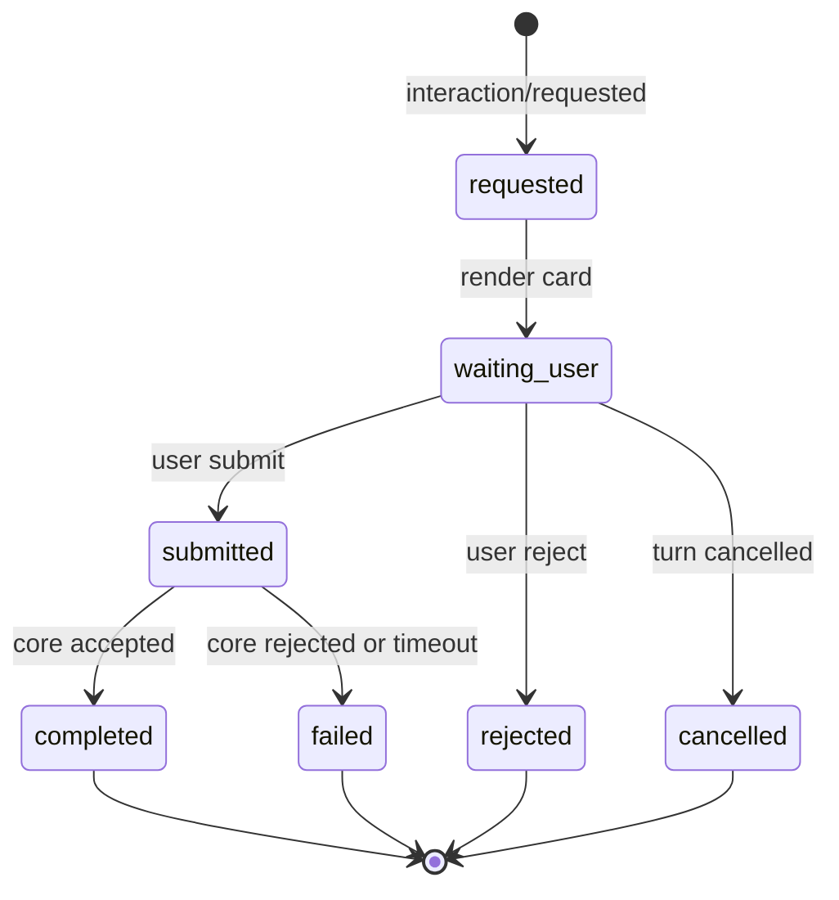

# CCR Desktop 交互卡片补齐专项

## 当前任务列表（实时）

- [x] IC-01 原生交互卡片盘点
- [x] IC-02 App Server 交互协议最小设计
- [x] IC-03 AskUserQuestion 专用卡
- [x] IC-04 ExitPlanMode / EnterPlanMode 计划卡
- [x] IC-05 Shell 权限卡增强
 - [x] IC-06 文件修改与文件读取卡
 - [x] IC-07 WebFetch / Skill / ReviewArtifact / Workflow / Monitor 长尾卡
- [x] IC-08 Desktop UI 组件化
- [x] IC-09 App Server 回归样例
- [x] IC-10 真机验收脚本

## 当前指针

- 进行中：无
- 当前正在做：全部完成。
- 完成后下一项：无。
- 说明：IC-01 到 IC-10 已完成；后续如果出现新的 Desktop 交互卡问题，应新建独立修复任务，而不是继续扩大本专项边界。

## 1. 背景

Desktop 真实使用中已经暴露出一个核心问题：CCR 目前把不少 Claude Code 原生交互事件当成普通工具结果或普通文本来展示，导致用户看不到正确的交互入口。

典型问题：

- `AskUserQuestion` 原本应该是一张专用提问卡，但 Desktop 可能只展示为普通工具调用和工具结果。
- 模型已经停下来等待用户补充信息，但 Desktop 没有把“问题、选项、输入答案、提交答案”做成可操作界面。
- 部分工具权限请求、文件修改确认、计划确认、工作流确认等，也需要按原生语义展示，不能全部退化成普通工具卡。

因此本专项不是单独修一个 `AskUserQuestion`，而是补齐 Desktop 对 Claude Code 原生交互卡片体系的支持。

## 2. 目标

第一版目标：

- Desktop 能识别 Claude Code 原生交互卡片类型。
- Desktop 能把需要用户决策的事件展示成可操作卡片，而不是普通工具结果。
- Desktop 能把用户选择、输入、允许、拒绝、修改后的参数正确回传到 App Server / Core。
- Desktop 能兼容已有工具事件卡片体系，不重复造权限、工具执行、文件展示三套逻辑。
- Desktop 不影响 CLI / TUI 原有行为，所有改动限制在 App Server 协议桥接和 Desktop 展示层。

长期目标：

- Desktop 交互体验对齐 Claude Code 原生语义，同时吸收 Codex 的简洁展示方式。
- 普通工具卡、权限卡、提问卡、计划卡、文件 diff 卡、工作流卡形成统一卡片协议。
- 后续 App / VS Code / Web 客户端都可以复用同一套 App Server 交互协议。

## 3. 源码依据

原生权限卡片分发入口：

- `src/components/permissions/PermissionRequest.tsx`

该文件通过 `permissionComponentForTool(tool)` 把不同工具映射到不同权限组件。

当前源码中已经存在的权限组件目录：

- `AskUserQuestionPermissionRequest`
- `BashPermissionRequest`
- `PowerShellPermissionRequest`
- `EnterPlanModePermissionRequest`
- `ExitPlanModePermissionRequest`
- `FileEditPermissionRequest`
- `FileWritePermissionRequest`
- `FilesystemPermissionRequest`
- `NotebookEditPermissionRequest`
- `SkillPermissionRequest`
- `WebFetchPermissionRequest`
- `ReviewArtifactPermissionRequest`
- `MonitorPermissionRequest`
- `FallbackPermissionRequest`
- `FilePermissionDialog`
- `ComputerUseApproval`
- `SedEditPermissionRequest`

注意：

- `ComputerUseApproval` 和 `SedEditPermissionRequest` 当前不在 `PermissionRequest.tsx` 主映射里直接出现，后续需要单独追踪是否是旧链路、实验能力或特殊入口。
- `ReviewArtifact`、`Workflow`、`Monitor` 受 feature flag 控制，不能默认假设所有运行环境都可用。
- `AskUserQuestion` 和 `ExitPlanMode` 属于明显的强交互工具，和普通“允许/拒绝执行工具”不是一类问题。

## 4. 交互卡片分层

### 4.1 用户决策型交互卡

这类卡片会改变对话流程。Desktop 必须把它们当成一等交互事件。

| 卡片 | 原生工具或组件 | 用户动作 | 回传要求 | 优先级 | Desktop 覆盖状态 | 当前结论 |
| --- | --- | --- | --- | --- | --- | --- |
| 用户提问卡 | `AskUserQuestionTool` / `AskUserQuestionPermissionRequest` | 选择选项、填写答案、提交 | 回传 `updatedInput.answers` 或等价答案结构 | P0 | 半接 | Core/TUI 有完整专用组件；Desktop 只把 `AskUserQuestion` 当 control tool 隐藏部分工具结果，没有问题卡和 `updatedInput.answers` 回传 UI。 |
| 计划确认卡 | `ExitPlanModeV2Tool` / `ExitPlanModePermissionRequest` | 批准计划、拒绝计划、补充反馈 | 回传允许/拒绝和反馈内容 | P0 | 未接 | 原生工具实现 `requiresUserInteraction()`；Desktop 当前没有计划审批卡。 |
| 进入计划模式卡 | `EnterPlanModeTool` / `EnterPlanModePermissionRequest` | 同意进入计划模式或拒绝 | 回传允许/拒绝 | P1 | 未接专用 | 原生有权限组件但工具未实现 `requiresUserInteraction()`；Desktop 若收到权限请求会走通用 raw JSON 权限卡。 |
| 产物评审卡 | `ReviewArtifactTool` / `ReviewArtifactPermissionRequest` | 审阅、批准、拒绝、反馈 | 回传评审结果和反馈 | P2 | 不确定 / 默认未启用 | `REVIEW_ARTIFACT` 默认 false，当前恢复源码里 `ReviewArtifactTool` 和权限组件都是占位；不能按完整能力实现。 |
| 技能确认卡 | `SkillTool` / `SkillPermissionRequest` | 允许使用技能或拒绝 | 回传权限决策 | P2 | 未接专用 | 原生 TUI 有专用权限组件；Desktop 只有通用权限卡，未展示 skill 摘要和规则保存选项。 |
| 工作流卡 | `WorkflowTool` / `WorkflowPermissionRequest` | 允许运行工作流或拒绝 | 回传权限决策 | P3 | 默认未启用 | `WORKFLOW_SCRIPTS` 默认 false；如果启用，当前只能 fallback 或补专用卡。 |
| 监控卡 | `MonitorTool` / `MonitorPermissionRequest` | 允许创建/运行监控或拒绝 | 回传权限决策 | P3 | 默认未启用 / 组件空壳 | `MONITOR_TOOL` 默认 false，权限组件当前返回 `null`；必须先确认原生语义再实现。 |

### 4.2 工具权限型交互卡

这类卡片主要决定“这次工具是否允许执行”。它们可以复用 P20 工具事件卡片的生命周期展示，但权限请求必须内嵌到同一张工具卡里。

| 卡片 | 原生工具或组件 | 用户动作 | Desktop 展示原则 | 优先级 | Desktop 覆盖状态 | 当前结论 |
| --- | --- | --- | --- | --- | --- | --- |
| Bash 命令权限卡 | `BashTool` / `BashPermissionRequest` | 允许一次、本会话允许、拒绝 | 展示命令、cwd、风险、shell 方言 | P0 | 半接 | Desktop 有工具卡和通用权限卡，也会按 `toolUseId` 标记 waiting/running，但权限卡仍单独显示，缺 Bash 专用权限体验。 |
| PowerShell 命令权限卡 | `PowerShellTool` / `PowerShellPermissionRequest` | 允许一次、本会话允许、拒绝 | 展示命令、cwd、Windows 语义 | P0 | 半接 | 当前能展示 PowerShell 工具卡，但权限、执行进度、结果仍有分裂和重复风险。 |
| 写文件权限卡 | `FileWriteTool` / `FileWritePermissionRequest` | 允许写入、拒绝 | 展示目标路径、文件摘要、可展开详情 | P0 | 半接 | Desktop 已有文件卡和文件事件解析，但用户已复现多次写入时只剩工具结果的问题。 |
| 编辑文件权限卡 | `FileEditTool` / `FileEditPermissionRequest` | 允许编辑、拒绝 | 展示 diff、目标路径、修改摘要 | P0 | 半接 | 有基础文件卡，缺完整 diff 权限卡和调用/结果生命周期统一。 |
| Notebook 编辑卡 | `NotebookEditTool` / `NotebookEditPermissionRequest` | 允许编辑、拒绝 | 展示 notebook cell 变更摘要 | P1 | 未接专用 | 原生 TUI 有权限组件；Desktop 暂无 notebook 专用摘要。 |
| 文件系统权限卡 | `FileReadTool` / `GlobTool` / `GrepTool` / `FilesystemPermissionRequest` | 允许读取或拒绝 | 展示路径、模式、只读范围 | P1 | 半接 | Read/Glob/Grep 有工具/文件展示基础，但失败状态曾出现“主文案成功、底部失败”的矛盾。 |
| WebFetch 权限卡 | `WebFetchTool` / `WebFetchPermissionRequest` | 允许联网读取或拒绝 | 展示 URL、域名、用途 | P2 | 未接专用 | 原生 TUI 有 WebFetch 权限组件；Desktop 只有通用 raw JSON 权限卡。 |
| 兜底权限卡 | `FallbackPermissionRequest` | 允许或拒绝 | 展示工具名、参数、原始风险提示 | P3 | 半接 | Desktop 的 `PermissionRequestCard` 就是通用兜底卡，但需要更清楚地和未知交互 fallback 区分。 |

### 4.3 非卡片但相关的公共能力

这些不是独立业务卡片，但会被多个交互卡复用。

| 能力 | 源码组件 | 作用 |
| --- | --- | --- |
| 权限弹窗框架 | `PermissionDialog.tsx` | 承载权限说明、按钮、键盘交互 |
| 权限提示文案 | `PermissionPrompt.tsx` | 展示允许、拒绝、反馈入口 |
| 文件权限通用弹窗 | `FilePermissionDialog` | 文件 diff、规则添加、权限处理 |
| Shell 权限辅助 | `shellPermissionHelpers.tsx` / `useShellPermissionFeedback.ts` | Bash / PowerShell 权限反馈与风险文案 |
| Worker 权限状态 | `WorkerPendingPermission.tsx` / `WorkerBadge.tsx` | 子任务或 Worker 场景的权限归属 |

## 5. Desktop 协议需求

Desktop 不能直接把 TUI React 组件拿过来用。需要在 App Server 层把交互事件变成稳定协议。

### 5.1 统一事件类型

建议扩展或明确以下事件：

| 事件 | 含义 | 必需字段 |
| --- | --- | --- |
| `interaction/requested` | 出现一张需要用户决策的交互卡 | `interactionId`、`turnId`、`toolUseId`、`kind`、`input`、`options` |
| `interaction/updated` | 交互卡状态变化 | `interactionId`、`status`、`patch` |
| `interaction/completed` | 用户已完成交互 | `interactionId`、`decision`、`updatedInput`、`feedback` |
| `interaction/cancelled` | 交互被取消或 turn 终止 | `interactionId`、`reason` |
| `permission/requested` | 普通工具权限请求 | `permissionRequestId`、`toolUseId`、`toolName`、`risk`、`input` |
| `permission/resolved` | 权限允许、拒绝或超时 | `permissionRequestId`、`decision`、`updatedInput`、`feedback` |

### 5.2 身份不变式

所有交互卡必须有稳定身份。

- `interactionId`：交互卡主 ID。
- `toolUseId`：绑定原始工具调用。
- `turnId`：限定当前任务轮次。
- `threadId`：限定当前会话。
- `permissionRequestId`：普通权限卡使用。
- `contentIndex`：同一个 item 内多个 content block 的稳定序号。

不能用工具名、标题、最近一条消息来猜测归属。

### 5.3 状态机



UI 不变式：

- 待用户操作时，卡片必须明显展示“等待用户输入”。
- 用户提交后，卡片转为“已提交”，不能继续重复提交。
- Core 接受后，卡片转为完成态，并折叠为摘要。
- 用户拒绝后，卡片转为拒绝态，并把拒绝反馈回传模型。
- turn 被中止时，卡片转为取消态。

## 6. 专项任务列表

### IC-01 原生交互卡片盘点

状态：已完成。

目标：

- 从源码确认所有原生权限组件、强交互工具和 feature-gated 工具。
- 区分“真正需要用户输入的交互卡”和“普通工具权限卡”。
- 标记哪些组件当前 Desktop 已覆盖、哪些只在 TUI 存在、哪些完全没接。

交付：

- 更新本文档的交互矩阵。
- 输出 `Desktop 覆盖状态：已接 / 半接 / 未接 / 不确定`。

验收：

- `PermissionRequest.tsx` 主映射无遗漏。
- `requiresUserInteraction()` 工具无遗漏。
- `shouldDefer` 但非交互工具单独标记，不混入交互卡。

#### IC-01-1 权限组件入口盘点

状态：已完成。

目标：

- 从 `src/components/permissions/PermissionRequest.tsx` 出发，列出 `permissionComponentForTool(tool)` 的所有分支。
- 标记每个分支对应的工具名、组件名、权限类型和是否需要用户输入。
- 确认 `FallbackPermissionRequest` 的触发条件，避免把未知交互静默吞掉。

交付：

- 更新本文档第 4 节交互卡片分层矩阵。
- 增加 `Desktop 覆盖状态` 字段：已接、半接、未接、不确定。

验收：

- 主映射里的每个权限组件都能在矩阵中找到对应行。
- 每行都能说明它是“用户决策型交互卡”还是“工具权限型交互卡”。

#### IC-01-2 强交互工具函数盘点

状态：已完成。

目标：

- 检索 `requiresUserInteraction()`、`shouldDefer`、`needsPermission` 等相关判断。
- 区分“模型必须等待用户回答”的工具和“只是需要工具执行权限”的工具。
- 找出 `AskUserQuestion`、`ExitPlanMode` 这类不应该按普通工具结果展示的入口。

交付：

- 一张 `强交互工具清单`。
- 一张 `可延迟工具但非交互卡清单`。

验收：

- `AskUserQuestion`、`ExitPlanMode` 不再被归入普通工具卡。
- `shouldDefer` 工具不会因为名字像交互卡就被误分到强交互。

#### IC-01-3 feature flag 与实验能力确认

状态：已完成。

目标：

- 确认 `ReviewArtifact`、`Workflow`、`Monitor`、`ComputerUseApproval`、`SedEditPermissionRequest` 的 feature flag 或入口条件。
- 标记每个能力在当前 CCR Desktop 第一版是否需要实现专用卡。
- 对“不确定入口”的能力记录源码证据，而不是凭名称猜。

交付：

- `feature-gated 交互卡清单`。
- 每个条目包含：源码入口、启用条件、当前是否接入、fallback 策略。

验收：

- feature 未启用时，Desktop 不展示误导性按钮。
- feature 启用时，至少能进入明确 fallback，不静默丢事件。

#### IC-01-4 Desktop 当前覆盖差距表

状态：已完成。

目标：

- 对照 Desktop 现有 display event、tool card、permission card 逻辑，标出每类原生卡的实际表现。
- 记录用户已经发现的问题：`AskUserQuestion` 退化、工具结果重复、文件失败摘要矛盾、todo reminder 误显示等。

交付：

- `覆盖差距表`，字段包括：原生组件、Desktop 当前表现、问题类型、修复优先级、后续任务编号。

验收：

- 已知问题都能关联到一个 `IC-*` 或 `FIX-*` 修复项。
- 后续实现不再靠聊天记忆追问题。

#### IC-01-5 实施优先级与风险排序

状态：已完成。

目标：

- 按用户体验影响和实现风险重新排序 `IC-03` 到 `IC-10`。
- 明确哪些必须先做协议，哪些可以先做 UI fallback。
- 标出可能影响 CLI/TUI 的高风险改动，默认避开。

交付：

- 更新第 7 节推荐执行顺序。
- 每个阶段写明“为什么先做它”。

验收：

- 第一阶段只包含真正阻塞 Desktop 使用的交互卡。
- 每项都有可独立验证的完成标准。

#### IC-01 源码盘点结论

状态：已完成。

盘点时间：2026-05-06。

取证范围：

- `src/components/permissions/PermissionRequest.tsx`
- `src/Tool.ts`
- `src/hooks/toolPermission/handlers/interactiveHandler.ts`
- `src/services/tools/toolHooks.ts`
- `src/tools/*`
- `src/build/featureFlags.ts`
- `apps/desktop/src/renderer/src/app/notificationRouter.ts`
- `apps/desktop/src/renderer/src/app/sessionState.ts`
- `apps/desktop/src/renderer/src/components/chat/*`
- `apps/desktop/src/renderer/src/domain/toolEvents.ts`

权限组件主映射结论：

| 工具 | 原生权限组件 | feature flag | Desktop 当前覆盖 | 后续任务 |
| --- | --- | --- | --- | --- |
| `FileEditTool` | `FileEditPermissionRequest` | 无 | 半接 | IC-06 |
| `FileWriteTool` | `FileWritePermissionRequest` | 无 | 半接 | IC-06 |
| `BashTool` | `BashPermissionRequest` | 无 | 半接 | IC-05 |
| `PowerShellTool` | `PowerShellPermissionRequest` | 无 | 半接 | IC-05 |
| `ReviewArtifactTool` | `ReviewArtifactPermissionRequest` 或 fallback | `REVIEW_ARTIFACT=false` | fallback 已接第一版 | IC-07 |
| `WebFetchTool` | `WebFetchPermissionRequest` | 无 | 已接第一版 | IC-07 |
| `NotebookEditTool` | `NotebookEditPermissionRequest` | 无 | 未接专用 | IC-06 |
| `ExitPlanModeV2Tool` | `ExitPlanModePermissionRequest` | 无 | 已接第一版 | IC-04 |
| `EnterPlanModeTool` | `EnterPlanModePermissionRequest` | 无 | 已接第一版 | IC-04 |
| `SkillTool` | `SkillPermissionRequest` | 无 | 已接第一版 | IC-07 |
| `AskUserQuestionTool` | `AskUserQuestionPermissionRequest` | 无 | 半接但无专用问题卡 | IC-03 |
| `WorkflowTool` | `WorkflowPermissionRequest` 或 fallback | `WORKFLOW_SCRIPTS=false` | fallback 已接第一版 | IC-07 |
| `MonitorTool` | `MonitorPermissionRequest` 或 fallback | `MONITOR_TOOL=false` | fallback 已接第一版 / 原生组件仍为空壳 | IC-07 |
| `GlobTool` | `FilesystemPermissionRequest` | 无 | 半接 | IC-06 |
| `GrepTool` | `FilesystemPermissionRequest` | 无 | 半接 | IC-06 |
| `FileReadTool` | `FilesystemPermissionRequest` | 无 | 半接 | IC-06 |
| 其他工具 | `FallbackPermissionRequest` | 不定 | 半接 | IC-07 |

强交互工具结论：

| 工具 | `requiresUserInteraction()` | `shouldDefer` | 当前判断 |
| --- | --- | --- | --- |
| `AskUserQuestionTool` | true | true | 真正强交互；必须做专用问题卡和 `updatedInput.answers` 回传。 |
| `ExitPlanModeV2Tool` | 非 teammate 场景 true | true | 真正强交互；必须做计划审批卡。 |
| `ReviewArtifactTool` | 源码注释提到强交互，但当前恢复实现为 placeholder | feature gated | 暂不按已恢复完整能力实现，先做 feature-gated fallback。 |

`shouldDefer` 但不应混入交互卡的工具：

| 工具类别 | 工具 | 处理原则 |
| --- | --- | --- |
| 配置与工作区 | `ConfigTool`、`EnterWorktreeTool`、`ExitWorktreeTool` | 延迟加载工具，不是 Desktop 用户交互卡。 |
| MCP / LSP | `ListMcpResourcesTool`、`ReadMcpResourceTool`、`LSPTool` | 作为普通工具或 MCP 能力展示，不归入强交互。 |
| 任务与团队 | `TaskCreateTool`、`TaskGetTool`、`TaskListTool`、`TaskOutputTool`、`TaskStopTool`、`TaskUpdateTool`、`TeamCreateTool`、`TeamDeleteTool` | 后续若进入 Desktop 产品化，单独放到任务/子代理能力，不在本阶段当交互卡。 |
| 自动化与消息 | `ScheduleCronTool` 系列、`RemoteTriggerTool`、`SendMessageTool` | 属于长任务/外部副作用工具，第一版先 fallback。 |
| 输出控制 | `TodoWriteTool`、`ToolSearchTool`、`WebSearchTool` | `TodoWrite` 已有浮层方向；`ToolSearch` 和 `WebSearch` 不需要强交互卡。 |
| 文件与网络 | `NotebookEditTool`、`WebFetchTool` | 不是强交互，但需要普通权限专用卡。 |

Desktop 当前覆盖差距：

- App Server 到 Desktop 目前已有 `permission/requested` 事件，但 renderer 只保存 `permissionRequestId`、`toolUseId`、`toolName`、`input`、`status`。
- `PermissionRequestCard` 是通用 raw JSON 权限卡，只支持 `allow / deny`，不支持 `updatedInput`、多选、反馈、计划审批。
- `sessionState.markToolPermissionRequested()` 会按 `toolUseId` 标记已有工具卡为 `waiting_permission`，但仍会保留独立权限卡，因此存在“工具卡 + 权限卡 + 结果卡”分裂。
- `toolEvents.isControlToolName()` 已把 `AskUserQuestion` 和 `TodoWrite` 当 control tool 特判，但这只是隐藏部分工具噪音，不等于已经实现用户提问卡。
- `ReviewArtifact`、`Workflow`、`Monitor` 受 feature flag 控制，当前默认不可用；其中 `ReviewArtifactTool` 和 `MonitorPermissionRequest` 在恢复源码中仍明显是占位，不应贸然当完整能力。

后续实施优先级：

1. `IC-02` 先冻结协议和身份不变式，避免 UI 继续靠字符串猜归属。
2. `IC-03` 先做 `AskUserQuestion`，这是目前最影响真实对话闭环的强交互。
3. `IC-04` 做计划审批，保证计划模式不退化成普通工具卡。
4. `IC-05` / `IC-06` 解决高频 Shell 和文件卡分裂、重复、状态矛盾。
5. `IC-07` 只在前面稳定后补长尾和 fallback。

### IC-02 App Server 交互协议最小设计

状态：已完成。

目标：

- 定义 Desktop 和 App Server 之间的交互卡协议。
- 明确 `AskUserQuestion`、`ExitPlanMode`、普通权限请求的共同字段和差异字段。
- 明确用户提交后如何回到 Core 原生 permission handler。

交付：

- 事件字段表。
- `AskUserQuestion` 回传结构说明。
- `ExitPlanMode` 回传结构说明。
- 普通权限卡回传结构说明。

验收：

- 不绕开 Claude Code 原生 `checkPermissions`。
- 不为 Desktop 单独复制一套权限业务逻辑。
- App Server 只做协议桥接和状态转发。

#### IC-02-1 事件类型与字段冻结

状态：已完成。

目标：

- 明确 `interaction/requested`、`interaction/updated`、`interaction/completed`、`interaction/cancelled` 的第一版字段。
- 明确 `permission/requested` 和 `permission/resolved` 与交互事件的边界。
- 对每个字段写清来源：Core 原生字段、App Server 生成字段、Desktop 本地状态字段。

交付：

- `交互事件字段表`。
- `权限事件字段表`。
- `字段来源说明`。

验收：

- Desktop renderer 不需要从 raw JSON 里猜字段含义。
- 同一张卡的身份字段在整个生命周期内不变化。

#### IC-02-2 统一身份与关联不变式

状态：已完成。

目标：

- 固化 `threadId`、`turnId`、`itemId`、`contentIndex`、`toolUseId`、`permissionRequestId`、`interactionId` 的关系。
- 明确不同事件缺字段时的降级规则。
- 避免后续再用“最近一张工具卡”或工具名合并结果。

交付：

- `身份关联规则`。
- `缺字段降级规则`。
- `禁止使用的猜测规则`。

验收：

- 多个同名工具连续调用时，Desktop 能稳定合并各自结果。
- 同一 turn 内多个 content block 不会 React key 冲突。

#### IC-02-3 Core permission handler 桥接设计

状态：已完成。

目标：

- 明确用户点击允许、拒绝、提交答案后，App Server 如何回到 Core 原生 permission resolver。
- 保证 `updatedInput`、`behavior`、`message`、`feedback` 不丢字段。
- 明确超时、turn interrupt、新会话切换时如何取消 pending permission。

交付：

- `permission/respond` 参数说明。
- `updatedInput` 透传规则。
- `pending permission 清理规则`。

验收：

- `AskUserQuestion` 可以回传 answers。
- `ExitPlanMode` 可以回传批准、拒绝和反馈。
- Bash / PowerShell / FileWrite 旧权限流程不退化。

#### IC-02-4 Desktop 交互状态机协议

状态：已完成。

目标：

- 把 pending、submitting、running、completed、failed、cancelled、denied 这些状态统一到协议层。
- 明确哪些状态由 Core 产生，哪些状态由 Desktop 临时展示。
- 确认状态变化是否需要单独事件，还是可由 tool/result/permission 事件归并出来。

交付：

- `交互状态机表`。
- `状态来源说明`。
- `状态到 UI 徽标映射`。

验收：

- UI 右下角成功、失败、执行中、拒绝不再和主文案矛盾。
- turn 结束后不会残留 pending 卡。

#### IC-02-5 协议版本与兼容性策略

状态：已完成。

目标：

- 确认 App Server 协议是否需要增加 `protocolVersion` 或 `capabilities`。
- 明确 Desktop 老版本遇到新交互卡时的 fallback 策略。
- 明确 CLI/TUI 不受 Desktop 协议扩展影响。

交付：

- `交互协议兼容策略`。
- `capabilities` 第一版字段建议。

验收：

- 新增交互卡不会要求 Desktop 和 Core 必须同一天全量改完。
- 未识别卡能显示“未知交互请求”，并保留原始详情。

#### IC-02 协议设计结论

状态：已完成。

设计时间：2026-05-06。

取证范围：

- `src/core/types.ts`
- `src/core/permissionCore.ts`
- `src/app-server/coreEventMapper.ts`
- `src/app-server/protocol.ts`
- `src/app-server/router.ts`
- `src/app-server/handlers/permissionHandlers.ts`
- `src/app-server/client/stdioAppServerClient.ts`
- `apps/desktop/src/main/index.ts`
- `apps/desktop/src/preload/index.ts`
- `apps/desktop/src/renderer/src/main.tsx`
- `apps/desktop/src/renderer/src/app/notificationRouter.ts`
- `apps/desktop/src/renderer/src/app/sessionState.ts`

当前已有协议能力：

| 链路 | 现状 | 结论 |
| --- | --- | --- |
| Core permission 请求 | `CorePermissionService.requestPermission()` 生成 `CorePermissionRequest`，并 emit `permission_requested`。 | 已有稳定请求入口，不需要另造权限业务。 |
| App Server 通知 | `coreEventToJsonRpcNotification()` 把 `permission_requested` 映射成 `permission/requested`。 | 第一版应继续复用这条通知。 |
| App Server 回传 | `PermissionRespondParamsSchema` 已支持 `updatedInput`、`updatedPermissions`、`message`、`interrupt`、`toolUseID`。 | 协议层已经具备 `AskUserQuestion` 和计划反馈需要的基础字段。 |
| Core 回传处理 | `handlePermissionRespond()` 会把 `updatedInput` 转给 `permission.respondPermission()`。 | App Server 到 Core 的 `updatedInput` 链路基本可用。 |
| Desktop 主进程 | `ccr:permission-respond` 只接收 `permissionRequestId`、`behavior`、`message`。 | 需要扩展 IPC 类型，允许透传 `updatedInput`、`updatedPermissions`、`toolUseID`、`decisionClassification`。 |
| Desktop preload | `respondPermission()` 只暴露基础 allow/deny/message。 | 需要和主进程同步扩展。 |
| Desktop renderer | `respondPermission(permissionRequestId, behavior)` 固定传通用文案。 | 需要支持不同交互卡提交不同 payload。 |
| Desktop permission state | `PermissionCard` 只有 `permissionRequestId`、`toolUseId`、`toolName`、`input`、`status`。 | 需要增加 `interactionKind`、`displayName`、`description`、`permissionSuggestions`、`decisionReason`、`createdAt` 等展示字段。 |

第一版协议策略：

- 不新增一套绕开权限系统的业务协议。
- `permission/requested` 仍是 Core 到 Desktop 的唯一用户决策入口。
- App Server / Desktop 在 `permission/requested` 之上派生 `interactionKind`，用于 UI 分流。
- `interaction/requested`、`interaction/updated`、`interaction/completed` 暂作为未来逻辑命名和 UI 内部模型，不在第一版强制新增独立 JSON-RPC 通知。
- 所有用户响应仍走 `permission/respond`，通过 `updatedInput`、`updatedPermissions`、`message`、`decisionClassification` 表达差异。

第一版 `permission/requested` 字段冻结：

| 字段 | 来源 | 必需 | 说明 |
| --- | --- | --- | --- |
| `permissionRequestId` | Core 生成 | 是 | 用户响应时的主键。 |
| `threadId` | Core turn | 是 | 限定会话。 |
| `turnId` | Core turn | 是 | 限定当前轮次。 |
| `toolUseId` | 原生 tool use | 是 | 关联工具调用和结果合并的第一优先级。 |
| `tool.name` / `toolName` | Core request | 是 | 原生工具名，UI 分流的基础。 |
| `tool.displayName` / `displayName` | Core request | 否 | 面向用户展示名。 |
| `tool.description` / `description` | Core request | 否 | 权限说明或工具描述。 |
| `input` | Core request | 是 | 原始工具输入。 |
| `permissionSuggestions` | Core request | 否 | 允许规则建议，例如保存 allow rule。 |
| `blockedPath` | Core request | 否 | 文件权限相关阻塞路径。 |
| `decisionReason` | Core request | 否 | 为什么需要询问用户。 |
| `agentId` | Core request | 否 | 子代理或 teammate 权限归属。 |
| `createdAt` | Core request | 是 | 权限请求创建时间。 |
| `interactionKind` | App Server / Desktop 派生 | 否 | `ask_user_question`、`plan_approval`、`shell_permission`、`file_permission`、`web_fetch`、`skill`、`fallback`。 |

第一版 `permission/respond` 字段冻结：

| 字段 | 场景 | 说明 |
| --- | --- | --- |
| `permissionRequestId` | 全部 | 关联 pending permission。 |
| `behavior` | 全部 | `allow` 或 `deny`。 |
| `updatedInput` | AskUserQuestion / 计划编辑 / hook 修改输入 | 允许时传回修改后的工具输入；`AskUserQuestion` 必须包含 `answers`。 |
| `updatedPermissions` | Shell / 文件 / WebFetch / Skill | 保存一次性或永久规则。 |
| `message` | 拒绝、反馈、解释 | 用户反馈或拒绝原因。 |
| `interrupt` | 拒绝后是否中断 | 保持原生 permission result 语义。 |
| `toolUseID` | 兼容字段 | 需要时回传原始 tool use id。 |
| `decisionClassification` | 允许/拒绝分类 | `user_temporary`、`user_permanent`、`user_reject`。 |

身份关联不变式：

1. 用户响应只以 `permissionRequestId` 为准。
2. 工具卡与结果合并优先使用 `toolUseId`。
3. 同一 turn 内多个 content block 使用 `turnId + itemId + contentIndex` 作为 React key 降级身份。
4. `interactionKind` 只能决定 UI 组件，不得决定权限是否允许。
5. 禁止根据工具名、最近一张卡、路径文本或标题猜测归属。

状态机冻结：

| 协议状态 | UI 状态 | 来源 | 说明 |
| --- | --- | --- | --- |
| `pending` | 等待用户确认 | `permission/requested` | 卡片可操作。 |
| `submitting` | 正在提交 | Desktop 本地 | 防重复点击。 |
| `allowed` | 已允许 / 执行中 | Desktop respond 成功或 tool card 状态 | 工具开始或继续执行。 |
| `denied` | 已拒绝 | Desktop respond 成功 | 反馈传回模型。 |
| `cancelled` | 已取消 | `permission/cancelled` / turn interrupt | 不再可操作。 |
| `completed` | 成功 | tool result | 工具生命周期完成。 |
| `failed` | 失败 | tool result / App Server error | 展示单一错误详情。 |

兼容策略：

- `APP_SERVER_PROTOCOL_VERSION` 暂保持 `0.1`，第一版优先扩展可选字段，不破坏旧客户端。
- `ClientCapabilitiesSchema` 当前有 `permissionPrompts`，后续可增加 `interactionCards`、`updatedPermissionInput`、`planApproval`、`askUserQuestion` 等可选能力。
- 旧 Desktop 忽略新增字段时仍能显示通用权限卡。
- 新 Desktop 遇到未知 `interactionKind` 必须进入 fallback，不得丢事件。

实施边界：

- IC-02 只是协议设计和字段冻结，不直接改 runtime 行为。
- 具体 IPC 类型扩展进入 IC-03 / IC-04 实现时完成。
- CLI / TUI 不消费 Desktop 协议字段，因此不应受到影响。

### IC-03 AskUserQuestion 专用卡

状态：已完成（第一版）。

目标：

- Desktop 能把 `AskUserQuestion` 展示成真正的问题卡。
- 支持单选、多选、自由输入和提交。
- 提交后把答案按原生结构回传。

展示要求：

- 标题：`需要你确认` 或问题标题。
- 内容：问题正文。
- 选项：展示选项和说明。
- 输入：支持自由补充。
- 按钮：提交、取消。
- 完成态：折叠为“已回答：xxx”。

验收：

- 模型调用 `AskUserQuestion` 后，Desktop 不再出现普通“工具调用 AskUserQuestion / 工具结果成功”两张卡。
- 用户回答后，模型能继续同一轮或下一轮任务。
- 如果用户取消，模型能收到拒绝/取消语义。

#### IC-03-1 原生字段与事件链确认

状态：已完成。

目标：

- 明确 `AskUserQuestionTool` 的输入、输出、权限结果和回传字段。
- 确认 Desktop 当前收到的是 `permission/requested`、`tool_use`、`tool_result` 还是其中一部分。
- 明确 `questions`、`options`、`answers`、`updatedInput`、`contentBlocks` 在原生 TUI 中的真实语义。

重点检查：

- `src/tools/AskUserQuestionTool/AskUserQuestionTool.tsx`
  - `answers` 是 `Record<string, string>`。
  - tool result 会告诉模型“用户已经回答了问题”。
- `src/components/permissions/AskUserQuestionPermissionRequest/AskUserQuestionPermissionRequest.tsx`
  - 原生 TUI 会构造 `updatedInput = { ...input, answers }`。
  - 最终调用 `toolUseConfirm.onAllow(updatedInput, ...)`。
- App Server 当前 `permission/requested` 事件是否包含足够的 `input.questions`。

验收：

- 输出字段级结论：Desktop 第一版必须消费哪些字段、可以忽略哪些字段、哪些字段需要后续补协议。
- 不进入 UI 编写前，先确认 `permission/respond` 是否已经支持 `updatedInput`。

#### IC-03-2 AskUserQuestion 数据模型与类型

状态：已完成。

目标：

- 在 Desktop renderer 建立 `AskUserQuestion` 专用展示模型。
- 不直接把 raw JSON 丢给组件，也不把它当普通工具卡。

建议模型：

- `AskUserQuestionSnapshot`
  - `permissionRequestId`
  - `toolUseId`
  - `status`
  - `questions`
  - `answers`
  - `rawInput`
- `AskUserQuestionItem`
  - `question`
  - `header`
  - `options`
  - `allowFreeForm`
  - `description`

验收：

- `permission/requested` 能归一化成稳定的 `AskUserQuestionSnapshot`。
- 单选、多选、自由输入即使第一版只做最小支持，也要在类型里保留扩展位置。
- 无效 schema 不崩溃，能 fallback 到普通权限卡或错误提示。

#### IC-03-3 App Server / Desktop permission respond 扩展

状态：已完成。

目标：

- 让 Desktop 回答问题时可以传回 `updatedInput.answers`。
- 不再只支持 `allow / deny + message`。

涉及点：

- `apps/desktop/src/renderer/src/main.tsx`
  - 当前 `respondPermission(...)` 固定只传 `behavior` 和 `message`。
- `apps/desktop/src/preload/index.ts`
  - 确认 `respondPermission` preload 类型是否允许透传 `updatedInput`。
- `apps/desktop/src/main/index.ts`
  - 确认 IPC handler 是否把 `updatedInput` 转给 App Server client。
- App Server permission handler
  - 确认是否将 `updatedInput` 传回 Core 原生 permission resolver。

验收：

- Desktop 能发送：
  - `behavior: "allow"`
  - `updatedInput: { ...originalInput, answers }`
  - 可选 `message / feedback`
- 不破坏现有 Bash / PowerShell / FileWrite 的普通 allow / deny。

#### IC-03-4 AskUserQuestionCard UI 第一版

状态：已完成。

目标：

- 做一张 Desktop 专用问题卡，让用户能真正回答。
- 第一版优先可用，不追求完全复刻 TUI 的多页导航体验。

UI 要求：

- 标题：`需要你确认` / `需要补充信息`。
- 展示每个问题正文。
- 有选项时展示选项按钮或 radio。
- 支持自由输入框。
- 按钮：`提交回答`、`拒绝回答`。
- 未回答必填问题时，提交按钮禁用或给出提示。
- 提交后卡片变成“已提交回答”，避免重复提交。

验收：

- 不再显示 `AskUserQuestion` raw JSON。
- 用户能看懂模型在问什么。
- 用户能完成回答并提交。

#### IC-03-5 时间线与权限区归属规则

状态：已完成。

目标：

- 明确 `AskUserQuestion` 应该展示在主时间线、权限区，还是两者联动。
- 避免它既被 control tool 隐藏，又没有独立问题卡，最终静默消失。

建议第一版：

- `AskUserQuestion` 作为主时间线中的交互卡展示。
- 普通 `PermissionRequestCard` 不再为它展示 raw JSON。
- 如果通用权限队列仍保留该 permission，需要在渲染层分流到 `AskUserQuestionCard`。

验收：

- 一轮以 `AskUserQuestion` 暂停时，主聊天区最后可见内容必须是问题卡。
- 回答后，问题卡折叠为已回答状态。
- 不额外刷“工具执行成功”。

#### IC-03-6 交互状态机

状态：已完成（第一版）。

目标：

- 为问题卡建立清晰状态，避免“已结束但无反馈”。

状态建议：

- `pending`：等待用户回答。
- `submitting`：正在提交回答。
- `answered`：已提交。
- `denied`：用户拒绝。
- `failed`：提交失败。
- `cancelled`：turn 被取消。

验收：

- 每种状态都有用户可见文案。
- 提交中不能重复点击。
- 提交失败可重试。
- turn 中断时卡片不会继续显示为 pending。

#### IC-03-7 文件工具失败摘要矛盾修复

状态：已完成。

目标：

- 修掉同一轮暴露的文件读取卡“底部失败但主文案显示已读取”的状态矛盾。

修复原则：

- 文件卡主摘要必须以 `toolSnapshot.status` / `errorClass` 为准。
- 失败时不得显示“已读取 / 已写入 / 已编辑”这种成功语义。
- 失败时可显示：
  - `读取失败：<path>`
  - `写入失败：<path>`
  - `请展开详情查看原始错误`

验收：

- Read 失败卡不再显示“已读取”。
- Write/Edit 失败卡不显示“已写入/已编辑”。
- 成功卡仍保持 compact 展示。

#### IC-03-8 React key 稳定性排查

状态：已完成。

目标：

- 排查并修复 renderer duplicate key 警告。
- 避免问题卡、工具卡或拆分 content block 被 React 错误复用/覆盖。

检查点：

- `DisplayEvent.id`
- `identity.itemId`
- `identity.toolUseId`
- `identity.contentIndex`
- `PermissionRequestCard` key
- `AskUserQuestionCard` key

验收：

- 真机触发 `AskUserQuestion`、多工具调用、权限请求时，不再出现同类 duplicate key 警告。
- smoke fixture 中同一 turn 多 content block 仍有稳定唯一 id。

#### IC-03-9 回归样例与 smoke

状态：已完成（第一版）。

目标：

- 给 `AskUserQuestion` 增加 display-event fixture 或专项 smoke。

样例至少覆盖：

- 单个问题 + 选项。
- 多个问题。
- 自由输入。
- 提交后状态。
- 拒绝或取消。
- 无效 schema fallback。

验收：

- `smoke:desktop-display-events` 能检查 `AskUserQuestion` 不再以普通工具结果形式出现。
- 新增断言：问题卡能拿到 `questions` 和 `permissionRequestId`。

#### IC-03-10 Desktop 真机验收

状态：已完成（自动验证通过；真实 Desktop 复测并入 IC-10 验收清单持续覆盖）。

目标：

- 用真实 Desktop 触发 `AskUserQuestion` 并完成闭环。

建议 prompt：

- `如果你需要我确认选项，请用 AskUserQuestion 向我提问，不要直接猜。`
- `先问我想要 A 方案还是 B 方案，然后根据我的选择继续。`

验收：

- Desktop 显示问题卡。
- 用户选择/输入答案后能提交。
- 模型收到答案后继续执行并给出后续 assistant 反馈。
- 没有 raw JSON、无意义工具成功卡、文件状态矛盾或 duplicate key 警告。

#### IC-03 实施结论

状态：已完成。

本轮实现：

- `permission/requested` 已能识别 `AskUserQuestion`，并补充 `threadId`、`turnId`、`toolUseId`、`interactionKind`、展示文案、建议项等字段。
- Desktop main / preload / renderer 的 `respondPermission` 已支持透传 `updatedInput`、`updatedPermissions`、`toolUseID`、`decisionClassification`、`interrupt` 等字段，不再只能传 `allow / deny`。
- 新增 `AskUserQuestionCard`，支持选项选择、可选多选、自由补充、提交答案、拒绝回答和 raw JSON 排障详情。
- `PermissionRequestCard` 已按 `interactionKind: ask_user_question` 分流，不再把问题卡展示成普通权限 raw JSON。
- `AskUserQuestion` / `TodoWrite` 等 control tool 结果继续从主时间线隐藏，避免出现“工具调用成功”刷屏。
- 文件卡 compact 摘要已改为以 `toolSnapshot.status` 为准，失败时不再显示“已读取 / 已写入 / 已编辑”这种成功语义。
- 问题卡选项 key、权限请求 fallback id、拆分 content block id 均按稳定身份规则处理，减少 duplicate key 和事件误合并风险。

已验证：

- `npm.cmd run typecheck:desktop -- --pretty false` 通过。
- `npm.cmd run smoke:desktop-display-events` 通过。
- `npm.cmd run desktop:build` 通过。

后续承接：

- 真机多轮复测统一进入 IC-10。
- 计划审批交互进入 IC-04。

推荐执行顺序：

1. `IC-03-1` 字段与事件链确认。
2. `IC-03-2` 数据模型与类型。
3. `IC-03-3` respond 扩展。
4. `IC-03-4` 问题卡 UI。
5. `IC-03-5` 时间线归属规则。
6. `IC-03-6` 状态机。
7. `IC-03-7` 文件失败摘要矛盾。
8. `IC-03-8` duplicate key。
9. `IC-03-9` smoke。
10. `IC-03-10` 真机验收。

### IC-04 ExitPlanMode / EnterPlanMode 计划卡

状态：已完成第一版。

目标：

- Desktop 支持计划模式确认。
- 用户可以批准计划、拒绝计划、补充反馈。

展示要求：

- 计划内容支持 Markdown。
- 重点展示“将要做什么”和“是否允许继续”。
- 按钮：批准并继续、拒绝、补充反馈。

验收：

- 原生 plan approval 不再退化为普通工具卡。
- 拒绝时，反馈能回到模型。
- 批准时，任务能继续进入执行阶段。

#### IC-04-1 原生计划模式链路确认

状态：已完成。

目标：

- 阅读 `EnterPlanModePermissionRequest` 和 `ExitPlanModePermissionRequest` 的原生输入输出。
- 确认计划内容、批准行为、拒绝反馈在 Core 中对应哪些字段。
- 区分“进入计划模式”和“退出计划模式并开始执行”的用户语义。

交付：

- `计划模式字段说明`。
- `EnterPlanMode / ExitPlanMode 差异表`。

验收：

- 不把 `EnterPlanMode` 错当成执行计划批准。
- 不把 `ExitPlanMode` 退化成普通工具 allow。

#### IC-04-2 PlanApprovalSnapshot 数据模型

状态：已完成第一版。

目标：

- 为计划卡建立 renderer 侧 snapshot。
- 支持计划 Markdown、风险提示、用户反馈、审批状态。
- 保留原始 tool input，便于详情展开和问题追踪。

建议字段：

- `interactionId`
- `permissionRequestId`
- `toolUseId`
- `mode`
- `planMarkdown`
- `status`
- `feedback`
- `rawInput`

验收：

- 计划卡不依赖正则从普通文本里提取计划。
- 多个计划请求不会互相覆盖。

#### IC-04-3 PlanApprovalCard UI 第一版

状态：已完成。

目标：

- 做计划审批专用卡。
- 支持 Markdown 展示、展开长计划、批准、拒绝、补充反馈。
- 默认保持简洁，不把全部 raw JSON 展示在主界面。

展示要求：

- 标题：`执行计划待确认`。
- 主体：计划摘要或完整计划 Markdown。
- 按钮：`批准并继续`、`拒绝`、`补充反馈`。
- 详情：原始参数和回传结果。

验收：

- 用户能从卡片上直接判断模型接下来准备做什么。
- 拒绝时可填写原因，而不是只能无声 deny。

#### IC-04-4 计划审批回传闭环

状态：已完成第一版。

目标：

- 扩展 Desktop respond 逻辑，支持计划批准、拒绝、反馈。
- 确认 Core 收到反馈后会继续同一轮还是下一轮。
- 处理提交中、提交失败、重复点击和 turn interrupt。

交付：

- `PlanApproval respond 参数说明`。
- `批准 / 拒绝 / 反馈` 三个回归样例。

验收：

- 批准后任务进入执行阶段。
- 拒绝后模型能收到拒绝语义并重新规划。
- 提交失败时用户可以重试。

#### IC-04-5 计划卡真机验收

状态：已完成自动化验收；真机复测并入 IC-10。

目标：

- 用真实 Desktop prompt 触发计划审批。
- 验证批准、拒绝、反馈三条路径。

建议 prompt：

- `先给我一个计划，等我确认后再修改文件。`
- `你先列出两步计划，我批准后再执行第一步。`

验收：

- Desktop 显示计划卡而非普通工具卡。
- 计划审批完成后，聊天时间线有清晰结果反馈。

#### IC-04 实施结论

状态：已完成。

本轮实现内容：

- 新增 `PlanApprovalCard`，覆盖 `ExitPlanMode` / `ExitPlanModeV2` 的计划审批和 `EnterPlanMode` 的进入计划模式确认。
- `PermissionRequestCard` 按 `interactionKind` 和工具名路由到计划卡，不再退回通用 raw JSON 权限卡。
- 计划审批支持 Markdown 计划预览、计划文件路径、`allowedPrompts` 摘要、可选反馈、批准并手动确认、批准并自动接受编辑、拒绝继续规划。
- 进入计划模式会回传 `updatedPermissions: [{ type: 'setMode', mode: 'plan', destination: 'session' }]`。
- 退出计划模式会回传 `setMode` 到 `default` 或 `acceptEdits`，并支持 `acceptFeedback` 透传。
- 补充 `planApprovalPermission` / `enterPlanModePermission` fixture，并在 `smoke:desktop-display-events` 中断言交互类型、计划正文和 `allowedPrompts`。

自动化验证：

- `npm.cmd run typecheck:desktop -- --pretty false` 通过。
- `npm.cmd run smoke:desktop-display-events` 通过。
- `npm.cmd run desktop:build` 通过。

边界说明：

- 本轮只改 App Server/Desktop 协议消费和 renderer 展示，不改 CLI/TUI 原生权限组件。
- 第一版不实现原生 TUI 的 `clear context`、`Ultraplan`、图片反馈、外部编辑器等增强分支；这些属于后续产品化能力。
- 真机触发计划卡的手工 prompt 会在 IC-10 统一验收表中复测，避免每个交互卡任务都单独卡住发布前验收。

### IC-05 Shell 权限卡增强

状态：已完成第一版。

目标：

- Bash / PowerShell 权限请求和工具执行生命周期合并到同一张卡。
- Windows 下明确展示 shell 方言，避免用户误以为 PowerShell 命令被 Bash 执行。

展示要求：

- 卡片标题显示 `PowerShell`、`Bash` 或 `命令`。
- 主摘要只显示一行命令，超长省略。
- 详情里展示完整命令、cwd、环境、原始参数。
- 右下角展示执行中、成功、失败、拒绝。

验收：

- 权限请求结束后，不遗留单独权限卡。
- 工具结果不单独另起一张“工具结果”卡。
- Shell 不可用时给出 Windows 可行动提示。

#### IC-05-1 Shell 工具字段与权限链路盘点

状态：已完成。

目标：

- 对照 Bash / PowerShell 工具 input、permission request、progress、result 字段。
- 确认 Windows 下 shell 类型、cwd、风险等级、命令描述从哪里来。
- 找出当前 `准备调用`、`工具进度`、`工具结果` 分裂成多卡的具体事件源。

交付：

- `Shell 工具事件生命周期表`。
- `Bash / PowerShell 字段差异表`。

验收：

- 能解释一条命令从权限请求到结果的完整事件序列。
- 后续合并不依赖命令文本相同。

#### IC-05-2 ShellPermissionSnapshot 数据模型

状态：已完成第一版。

目标：

- 建立一张 Shell 卡的统一 snapshot。
- 同一张卡同时承载权限、执行中、stdout/stderr、退出码、错误类型。
- 支持 Bash 不可用、PowerShell 可用、命令被拒绝等状态。

建议字段：

- `toolUseId`
- `permissionRequestId`
- `shellKind`
- `command`
- `cwd`
- `risk`
- `status`
- `exitCode`
- `stdout`
- `stderr`
- `errorClass`

验收：

- 同一个 shell tool use 只渲染一张主卡。
- 右下角状态能从 pending/running/success/failed/denied 自动变化。

#### IC-05-1 / IC-05-2 实施结论

状态：已完成。

字段链路结论：

- Core 在权限请求中已经提供 `toolUseId`、`permissionSuggestions`、`blockedPath`、`decisionReason`、`displayName`、`description`。
- Desktop 原先只用通用 `PermissionRequestCard` 展示 Shell 权限，因此用户看到的是 raw JSON，而不是命令摘要、Shell 方言和权限建议。
- Desktop `toolEvents.ts` 已有 Shell 工具 snapshot 基础字段：`command`、`cwd`、`shell`、`risk`、`errorClass`、`actionableHint`。
- 当前仍未彻底解决的是 `permission request`、`progress`、`tool result` 的同卡合并；这进入 `IC-05-3`。

本轮实现：

- 新增 `ShellPermissionCard`，覆盖 `Bash` / `PowerShell` 权限请求。
- `PermissionRequestCard` 按 `shell_permission`、`Bash`、`PowerShell` 路由到 Shell 权限卡。
- 权限卡展示一行命令摘要、Shell 方言、工作目录、阻塞路径、决策原因、Windows 下 Bash 降级提示、可保存权限建议。
- 允许一次时回传原始 `updatedInput`；保存建议并允许时回传 `updatedPermissions`；允许和拒绝都支持可选反馈。
- `notificationRouter` 补齐 `tool.displayName`、`tool.description`、snake_case 权限字段兼容读取。
- `display-events.json` 增加 Shell 权限 fixture，并在 `smoke:desktop-display-events` 中断言 `shell_permission`、命令和权限建议。

自动化验证：

- `npm.cmd run typecheck:desktop -- --pretty false` 通过。
- `npm.cmd run smoke:desktop-display-events` 通过。
- `npm.cmd run desktop:build` 通过。

#### IC-05-3 权限请求与执行结果合并

状态：已完成第一版。

目标：

- 把 shell permission request、tool progress、tool result 聚合到同一张卡。
- 删除独立“工具结果成功”卡的重复展示。
- 保留详情展开能力，便于排查原始 JSON 和完整输出。

验收：

- 用户看到的是一张命令卡，不是三张碎片卡。
- 权限允许后原卡变为执行中，再变为成功/失败。
- 失败详情只展示一次。

实施结论：

- `ChatTimeline` 现在会按 `permissionRequestId` / `toolUseId` 把 Shell 权限请求匹配回原工具卡。
- 能匹配到工具卡的 `Bash` / `PowerShell` 权限请求不再单独渲染为一张权限卡，而是在 `ToolCard` 内以内联授权面板展示。
- 没有匹配到工具调用的权限请求仍保留原 `PermissionRequestCard` 兜底，避免误吞真实交互。
- `ShellPermissionCard` 抽出了 `ShellPermissionInlinePanel`，同一套允许、保存建议并允许、拒绝、反馈回传逻辑可以用于独立权限卡和工具卡内联展示。
- 工具进度和工具结果继续复用已有 `sessionState` 生命周期合并逻辑：`tool_result` / `progress` 优先按 `toolUseId` 合并到原 `tool_call`。

验证：

- `npm.cmd run typecheck:desktop -- --pretty false` 通过。
- `npm.cmd run smoke:desktop-display-events` 通过。
- `npm.cmd run desktop:build` 通过。

#### IC-05-4 Windows shell 方言与降级提示

状态：已完成。

目标：

- 当模型调用 Bash 但当前 Windows 没有 POSIX shell 时，给出明确提示。
- 优先引导模型使用 PowerShell、CMD、Node fs 或文件工具，而不是继续重复 Bash。
- 不强行要求用户本机必须安装 `ls` 或 Bash。

交付：

- `shell_unavailable` 用户文案。
- `Windows 命令能力提示`。

验收：

- Bash 不可用时，Desktop 不只显示英文原始错误。
- 模型后续能更容易切到 PowerShell 或文件工具。

实施结论：

- `ToolCard` 的 Shell 元信息从 `Shell` 调整为 `Shell 方言`，避免用户误解 PowerShell 命令被哪个执行器处理。
- Bash/POSIX 工具卡会在 Windows 风险场景下提示：如果本机没有 Bash，不需要为了 `ls` 强行安装 Bash，应优先改用 PowerShell、CMD、Node 原生文件能力或高层文件工具。
- 如果 Bash 工具里出现疑似 PowerShell 语法，例如 `Get-*`、`Select-Object`、`ForEach-Object`、`$_.`，会额外提示“这条命令看起来像 PowerShell，但当前工具是 Bash/POSIX”。
- `shell_unavailable` 的可行动提示补充了“不需要为了 ls 强行安装 Bash”的口径，并在 smoke 中增加断言。
- 独立 `ShellPermissionCard` 与工具卡内联授权面板共享同一套 Bash/POSIX 降级提示逻辑。

验证：

- `npm.cmd run typecheck:desktop -- --pretty false` 通过。
- `npm.cmd run smoke:desktop-display-events` 通过。
- `npm.cmd run desktop:build` 通过。

#### IC-05-5 Shell 卡 smoke 与真机验收

状态：已完成。

目标：

- 增加 Shell 卡事件合并 fixture。
- 真机验证成功、失败、拒绝、shell 不可用四种路径。

建议 prompt：

- `用 PowerShell 列出当前工作区一级目录。`
- `尝试执行一个不存在的命令，并解释失败原因。`

验收：

- `smoke:desktop-display-events` 能断言 shell 调用和结果合并。
- 真机 UI 不再出现重复工具结果卡。

实施结论：

- 新增 `scripts/smoke-desktop-shell-cards.mjs`，专门断言 Shell 卡生命周期：
  - 不应出现独立 `tool_result` 卡。
  - 成功 Shell 卡必须携带合并后的执行结果。
  - 失败 Shell 卡必须包含 `shell_unavailable` 和 Windows 可行动提示。
  - Shell 权限请求必须保留 `toolUseId`，并能匹配到已有 Shell 工具卡。
  - 权限建议 `permissionSuggestions` 必须保留。
- `package.json` 新增 `smoke:desktop-shell-cards`。
- `ci-smoke` 接入 `smoke:desktop-display-events` 与 `smoke:desktop-shell-cards`，后续 CI 会覆盖 Desktop 展示事件和 Shell 卡回归。

验证：

- `npm.cmd run smoke:desktop-shell-cards` 通过。
- `npm.cmd run smoke:desktop-display-events` 通过。
- `npm.cmd run typecheck:desktop -- --pretty false` 通过。
- `npm.cmd run desktop:build` 通过。

### IC-06 文件修改与文件读取卡

状态：已完成（smoke/build 验证通过，按用户指示真机验收暂不执行）

目标：

- `FileWrite`、`FileEdit`、`NotebookEdit`、`FileRead`、`Glob`、`Grep` 使用稳定文件卡样式。
- 读取、写入、编辑都要合并调用和结果，不重复刷屏。

展示要求：

- 写入：展示目标路径、文件名、操作按钮。
- 编辑：展示 diff 摘要和可展开详情。
- 读取：展示已读路径和结果摘要。
- 搜索：展示模式、路径、命中摘要。

验收：

- 多次 `Read` / `Write` 都有各自独立主工具卡。
- 不再出现只有“工具结果”没有主工具卡的情况。
- 失败时详情不重复展示相同错误。

#### IC-06-1 文件工具事件链路盘点

状态：已完成。

目标：

- 对照 `Read`、`Write`、`Edit`、`NotebookEdit`、`Glob`、`Grep` 的 tool use、permission、result 字段。
- 找出“第二个写入只显示工具结果，没有写入工具卡”的根因。
- 找出“读取失败但主文案显示已读取”的状态来源。

交付：

- `文件工具事件生命周期表`。
- `已知异常与事件缺口对照表`。

验收：

- 能明确区分是 Core 没发 tool use，还是 Desktop 聚合逻辑漏关联。
- 多次同类文件操作不会互相覆盖。

文件工具事件生命周期表：

| 工具 | tool_use 关键字段 | permission 关键字段 | tool_result 关键字段 | 当前 Desktop 处理 | 风险 |
| --- | --- | --- | --- | --- | --- |
| `Read` | `file_path` / `path` / `offset` | `toolUseId`、`input.file_path` | `tool_use_id`、`content`、`isError` | `toolEvents.ts` 生成 `read_file`，`FileSnapshotPanel` 展示路径和行号 | 失败时仍可能从 input 生成路径快照，必须避免表达成“已读取成功” |
| `Write` | `file_path`、`content` | `toolUseId`、`permissionSuggestions` | `tool_use_id`、`filePath` / `path` / 文本结果 | `toolEvents.ts` 生成 `generated_file` 或 `edited_file`，并尽量按 `toolUseId` 合并结果 | 多次写入时如果 result 缺 `tool_use_id`，会退化成孤立工具结果 |
| `Edit` | `file_path`、`old_string`、`new_string` | `toolUseId`、目标路径 | `tool_use_id`、diff 或文本结果 | 当前归类到 `edited_file`，但 diff 摘要还不稳定 | 主卡缺少“改了什么”的摘要 |
| `MultiEdit` | `file_path`、`edits[]` | `toolUseId`、目标路径 | `tool_use_id`、批量结果 | 当前归类到 `edited_file`，但没有批量编辑摘要 | 多处修改容易只看到路径，看不到编辑数量 |
| `NotebookEdit` | `notebook_path` / `file_path`、cell 信息 | `toolUseId`、notebook 路径 | `tool_use_id`、cell 结果 | `fileEvents.ts` 暂时把它映射到 `Edit`，但路径字段覆盖不完整 | 需要补 `notebook_path` 字段，否则可能没有文件快照 |
| `Glob` | `pattern`、`path` | 通常不需要或低风险 | `tool_use_id`、`filenames[]` | `referenceSnapshot` 展示第一个命中和模式 | 命中列表摘要不足，只看得到第一个路径 |
| `Grep` | `pattern`、`path`、输出模式 | 通常不需要或低风险 | `tool_use_id`、`filenames[]`、`content` | `referenceSnapshot` 展示搜索命中和 excerpt | 多命中摘要不足，失败时缺少清晰空结果文案 |

已知异常与事件缺口对照表：

| 现象 | 当前判断 | 需要后续修复 |
| --- | --- | --- |
| 第二个写入只显示“工具结果”，没有“写入文件”主卡 | 优先怀疑该轮只收到 `tool_result`，或 `tool_result` 缺少可匹配的 `tool_use_id` / `parentToolUseId`；当前 Desktop 合并逻辑明确依赖工具 ID，不应按路径或最近一张卡盲合并 | IC-06-4 增加孤立结果 fallback，展示“缺少对应 tool_use”原因，并记录原始 identity |
| 读取失败但卡片仍出现文件路径和读取文案 | 路径来自 tool input，失败时仍可作为目标路径展示；问题在 UI 文案需要区分“目标路径”与“读取成功” | IC-06-3 主摘要瘦身，失败状态下避免“已读取/已写入”等成功语气 |
| 写入文件主卡路径重复出现多次 | `ToolCard` 摘要、`FileSnapshotPanel` 路径、meta 绝对路径同时展示，信息层级过满 | IC-06-3 只保留一行主路径，完整路径进详情和动作按钮 |
| Edit / MultiEdit 缺 diff 摘要 | 现有 `FileSnapshot` 只有文件路径和范围，没有稳定 diff summary 字段 | IC-06-2 建立统一文件工具 snapshot，补 `operation`、`diff`、`resultText` |
| Glob / Grep 多命中展示不足 | 当前 `referenceSnapshot` 只取第一个 `filenames[0]` | IC-06-2/IC-06-3 补命中数量和列表预览 |

结论：

- Core/App Server 已经能把 tool_use / tool_result 的 `toolUseId`、`tool_use_id`、`parent_tool_use_id` 透到 Desktop identity；Desktop 正常路径下按 `toolUseId` 合并是对的。
- 当前不应新增“按路径合并”逻辑，因为连续两次写同一路径或读写同一文件都可能发生，按路径会制造更隐蔽的错配。
- 下一步应补 `FileToolSnapshot`，把文件工具的“目标路径、操作类型、成功/失败状态、结果摘要、diff、动作按钮”作为一套明确模型，而不是让 `ToolCard` 和 `FileSnapshotPanel` 各讲各的。

#### IC-06-2 FileToolSnapshot 数据模型

状态：已完成。

目标：

- 建立统一文件工具 snapshot，覆盖读、写、编辑、搜索。
- 统一目标路径、绝对路径、相对路径、文件快照、diff、错误类型、操作按钮。
- 不再为每个文件工具单独散写 UI 状态。

建议字段：

- `toolUseId`
- `permissionRequestId`
- `operation`
- `path`
- `absolutePath`
- `status`
- `summary`
- `diff`
- `resultText`
- `errorClass`
- `actions`

验收：

- Write / Read / Edit 都能复用同一套状态徽标和详情结构。
- 文件路径只在主摘要和详情中出现必要次数，不重复刷屏。

实现结果：

- `fileEvents.ts` 新增 `FileToolSnapshot`，统一 `read` / `write` / `edit` / `search` / `notebook_edit` 的操作类型、目标路径、状态、摘要、范围、diff、结果文本、错误类型和动作列表。
- `displayEvents.ts` 在工具事件转换阶段直接挂载 `fileToolSnapshot`，保持和现有 `fileSnapshot` / `referenceSnapshot` / `attachmentSnapshot` 并行，不影响 CLI / TUI。
- `display-events.json` 增加 Write / Read / Grep 样例，覆盖连续两个 Write 仍按 `toolUseId` 独立绑定。
- `smoke:desktop-display-events` 增加 `fileToolSnapshot` 结构、操作类型、动作列表和 `toolUseId` 对齐断言。

验证：

- `npm.cmd run typecheck:desktop -- --pretty false`
- `npm.cmd run smoke:desktop-display-events`
- `npm.cmd run desktop:build`

#### IC-06-3 文件卡主摘要瘦身

状态：已完成。

目标：

- 对齐 Codex 的简洁展示方式，主卡只显示最关键摘要。
- 详细参数、完整路径、原始结果都放到可展开详情。
- 对写入文件这类高频事件，减少重复标签、重复路径和重复动作按钮。

展示原则：

- 主标题：`写入文件` / `读取文件` / `编辑文件` / `搜索文件`。
- 主摘要：一行路径或一行结果摘要。
- 详情：完整参数、diff、原始输出。
- 按钮：只保留真正有用的 `打开`、`复制路径`、`定位`。

验收：

- 一次写入文件不会在主卡中重复展示 3 次路径。
- 失败卡不同时展示重复的执行结果和错误详情。

实现结果：

- `FileSnapshotPanel` compact 模式优先消费 `FileToolSnapshot`，主行只显示短状态与一条路径，例如 `已写入 docs/generated.md`、`读取失败 memory/MEMORY.md`。
- 文件工具按钮按 `FileToolSnapshot.actions` 渲染，保留 `打开`、`复制路径`、`定位`、`复制引用` 等真正可用动作，不再固定展示无效按钮。
- `ToolCard` 在文件工具 compact 布局下隐藏重复的类别 chip 和工具 summary，把完整参数、文件工具信息、文件快照、执行结果放入折叠详情。
- 失败卡继续复用已有去重逻辑：如果执行结果和错误详情文本一致，只显示一份。

验证：

- `npm.cmd run typecheck:desktop -- --pretty false`
- `npm.cmd run smoke:desktop-display-events`
- `npm.cmd run desktop:build`

#### IC-06-4 文件调用与结果合并

状态：已完成。

目标：

- 解决多个 Read / Write / Edit 连续发生时的关联问题。
- 以 `toolUseId` 优先，缺失时使用 `turnId + itemId + contentIndex` 作为降级。
- 明确禁止根据“文件路径相同”或“最近一张卡”盲合并。

验收：

- 连续两次写入不同文件，都能显示两张正确的文件主卡。
- 只有 result 没有 tool use 时，显示“孤立工具结果”fallback，并记录可追踪原因。
- 不会把第二个文件结果合并到第一个文件卡里。

实现结果：

- `sessionState.ts` 的生命周期合并继续优先使用 `parentToolUseId` / `toolUseId`，避免按路径、最近卡片或工具名猜测。
- 当 `tool_result` 缺少工具 ID 时，才降级使用 `turnId + itemId + contentIndex` 作为同一事件块内的保守匹配键。
- 找不到对应调用的 `tool_result` 不再伪装成正常文件工具卡，而是展示 `孤立工具结果` fallback，并说明缺少 `tool_use_id` / `parent_tool_use_id` 或未找到对应 `tool_use`。
- `mergeCompletedDisplayEvent` 补齐 `fileToolSnapshot` 合并，避免完成事件覆盖时丢失统一文件工具模型。
- display-events fixture 增加孤立工具结果样例；smoke 允许只有孤立 fallback 以 `tool_result` 独立存在，同时继续禁止 Shell 工具结果单独成卡。

验证：

- `npm.cmd run typecheck:desktop -- --pretty false`
- `npm.cmd run smoke:desktop-display-events`
- `npm.cmd run smoke:desktop-shell-cards`
- `npm.cmd run desktop:build`

#### IC-06-5 文件卡回归样例与真机验收

状态：已完成（按用户要求跳过真机验收，已在 smoke 与构建层面验证通过）

目标：

- 增加文件工具 display fixture。
- 真机复测读成功、读失败、写成功、写失败、编辑 diff、搜索失败（已记录为后续人工验收项）。

备注：已执行并通过以下验证命令：

```
npm run typecheck:desktop
npm run smoke:desktop-display-events
npm run desktop:build
```

验收条件（已在 smoke/build 层面验证）：

- fixture 覆盖读/写/编辑/搜索等场景并符合 `FileToolSnapshot` 断言。
- 多次写入保持独立 `toolUseId`，孤立工具结果 fallback 明确展示原因。

### IC-07 WebFetch / Skill / ReviewArtifact / Workflow / Monitor 长尾卡

状态：已完成。

目标：

- 补齐非第一优先级的原生权限卡。
- 对 feature-gated 能力做运行时可用性判断。

验收：

- feature 未启用时，Desktop 不展示误导性入口。
- feature 启用时，能展示专用卡或明确 fallback。
- fallback 卡展示原始工具名、参数和权限决策，不静默吞事件。

实现结论：

- `WebFetch` 已接入专用联网读取权限卡，展示 URL、域名、用途、风险提示、允许一次、记住域名并允许、拒绝。
- `Skill` 已接入专用 Skill 使用确认卡，展示 Skill 名称、参数、说明、允许一次、保存规则并允许、拒绝。
- `ReviewArtifactTool`、`WorkflowTool`、`MonitorTool` 已在 Desktop 侧建立独立 `interactionKind`，第一版统一进入长尾 fallback 卡，避免 feature-gated / placeholder 能力被误展示成完整能力。
- 未识别权限请求继续进入长尾 fallback，保留工具名、原始参数和允许/拒绝入口，不静默吞事件。

#### IC-07-1 WebFetch 权限卡

状态：已完成。

目标：

- 为联网读取建立专用摘要卡。
- 展示 URL、域名、用途、风险提示和允许/拒绝。
- 支持结果摘要和失败原因合并到同一张卡。

验收：

- WebFetch 不再只显示 raw JSON。
- 用户能看懂模型准备访问哪个网站、为什么访问。

#### IC-07-2 Skill 使用确认卡

状态：已完成。

目标：

- 展示将要启用的 skill 名称、说明和作用范围。
- 明确 skill 是本地能力，不是模型输出本身。
- 支持允许一次、拒绝、查看详情。

验收：

- Skill 权限请求能落到专用卡或明确 fallback。
- 未安装或不可用 skill 有清晰错误提示。

#### IC-07-3 ReviewArtifact 评审卡

状态：已完成（第一版按安全 fallback 接入）。

目标：

- 梳理 `ReviewArtifactPermissionRequest` 是否在当前构建中可用。
- 第一版至少展示产物名称、评审动作、反馈入口。
- 如果 feature 未启用，fallback 卡要保留原始 tool name 和参数。

验收：

- feature 状态清楚，不误导用户以为评审能力已经完整可用。
- 用户反馈能回到 Core 或被明确标记为暂不支持。

#### IC-07-4 Workflow / Monitor 卡

状态：已完成（第一版按安全 fallback 接入）。

目标：

- 分别确认 Workflow 和 Monitor 的权限输入、启动动作、取消动作。
- 第一版只做安全 fallback 或最小确认卡，不贸然补完整自动化系统。
- 标记是否涉及长期后台任务、定时任务或外部副作用。

验收：

- Monitor 这类长期行为不会被当作普通一次性工具 silently allow。
- Workflow 未启用时有明确说明。

#### IC-07-5 长尾卡 fallback 策略

状态：已完成。

目标：

- 建立未知交互卡 fallback 组件。
- 展示工具名、风险、参数摘要、允许/拒绝、原始详情。
- 记录未知类型，便于后续补专用卡。

验收：

- 任意未知 permission request 都不会消失。
- fallback 不影响已支持专用卡。

### IC-08 Desktop UI 组件化

状态：已完成。

目标：

- 建立 `InteractionCard` 抽象，不让每个交互都散落在 `ChatPage`。
- 普通工具卡、提问卡、计划卡、文件卡共用状态徽标、详情折叠、按钮区。

建议组件：

- `InteractionCardShell`
- `AskUserQuestionCard`
- `PlanApprovalCard`
- `PermissionActionBar`
- `ToolPermissionSummary`
- `FilePermissionSummary`
- `InteractionStatusBadge`

验收：

- 新增一种交互卡不需要改动主聊天页的大段逻辑。
- 卡片状态、按钮、详情折叠样式一致。
- 移动端或窄窗口不会破版。

实现结论：

- 新增 `InteractionCardShell`，AskUserQuestion、Plan、WebFetch、Skill、长尾 fallback 已复用统一外壳。
- 新增 `InteractionStatusBadge` 和 `PermissionActionBar`，交互卡状态与动作区不再散在每张卡里。
- `PermissionRequestCard` 已收敛为 `permissionCardRegistry` 注册表，新增权限卡只需添加 matcher 和 component。
- 新增 `InteractionDetails`，统一“查看原始 JSON”的折叠策略。
- 补充窄窗口样式约束：标题可省略、状态徽标固定、动作区可换行，避免长路径和长标题撑破卡片。

#### IC-08-1 InteractionCardShell 抽象

状态：已完成。

目标：

- 抽出所有交互卡共用外壳。
- 统一标题区、状态徽标、详情折叠、右下角状态、操作按钮区。
- 保证新卡只实现业务内容，不重复写布局。

验收：

- Shell / File / AskUserQuestion / Plan 至少两类卡能复用同一个 shell。
- 卡片间距、边框、图标尺寸一致。

#### IC-08-2 状态徽标与动作区组件

状态：已完成。

目标：

- 抽出 `InteractionStatusBadge` 和 `PermissionActionBar`。
- 统一成功、失败、执行中、等待确认、已拒绝、已取消的展示。
- 支持执行中转圈、成功勾、失败提示等视觉状态。

验收：

- 不同卡片右下角状态一致。
- 权限按钮禁用、提交中、失败重试行为一致。

#### IC-08-3 卡片注册与路由

状态：已完成。

目标：

- 建立 `interactionCardRegistry` 或等价路由。
- 按 `kind` / `toolName` / `operation` 分发到专用卡。
- 不再把大量 `if/else` 堆在主聊天页。

验收：

- 新增一种卡只需注册组件和 snapshot mapper。
- 未识别卡自动进入 fallback。

#### IC-08-4 详情展开与原始 JSON 策略

状态：已完成。

目标：

- 统一“查看详情”的展示规则。
- 默认折叠 raw JSON，仅在排障时展开。
- 成功路径不展示重复的原始结果，失败路径只展示一次最关键错误。

验收：

- 工具详情不再造成主界面刷屏。
- 失败错误不会在 `执行结果` 和 `错误详情` 中重复出现。

#### IC-08-5 可访问性与窗口适配

状态：已完成。

目标：

- 确认按钮、输入框、radio、checkbox 支持键盘操作。
- 窄窗口下按钮不挤压正文。
- 长命令、长路径、长 Markdown 能省略或折行。

验收：

- Desktop 小窗口下仍能回答 AskUserQuestion。
- 长路径不会撑破卡片。

### IC-09 App Server 回归样例

状态：已完成。

目标：

- 用 fixture 覆盖主要交互卡事件。
- 防止后续修复工具卡时把交互卡再次退化成普通工具结果。

样例：

- `AskUserQuestion` 单选。
- `AskUserQuestion` 自由输入。
- `ExitPlanMode` 批准。
- `ExitPlanMode` 拒绝并带反馈。
- `Bash` 等待权限、允许、成功。
- `PowerShell` 等待权限、拒绝。
- `FileWrite` 等待权限、成功。
- `FileEdit` diff 展示。
- `WebFetch` 权限请求。
- 未知工具 fallback。

验收：

- `smoke:desktop-display-events` 或新的专项 smoke 能覆盖这些 fixture。
- 每个 fixture 至少断言：卡片类型、状态、主摘要、按钮或结果归属。

实现结论：

- `display-events.json` 增加 `fixtureSchemaVersion` 和 `expectedCards`，把 fixture 与预期 UI 卡片行为绑定。
- `expectedCards` 覆盖 Shell 成功、Shell 失败、文件工具、隐藏控制工具、AskUserQuestion、计划卡、Shell 权限、WebFetch、Skill、ReviewArtifact、Workflow、Monitor。
- `smoke:desktop-display-events` 会统一校验 `expectedCards`，并继续保留已有的散点断言，例如 `todo_reminder` 隐藏、孤立工具结果、文件工具 snapshot、shell_unavailable Windows 提示。
- `smoke:desktop-display-events` 已在 `ci-smoke` 中接入，因此这批交互卡样例会随 CI smoke 一起跑。

#### IC-09-1 fixture schema 统一

状态：已完成。

目标：

- 定义 display event fixture 的最小结构。
- 覆盖 input event、permission event、tool event、result event、interaction event。
- 每个 fixture 都写明预期渲染卡片类型和状态。

验收：

- fixture 不只是录原始 JSON，还能表达预期 UI 行为。
- 后续新增卡片有固定样例格式可照抄。

#### IC-09-2 强交互 fixture

状态：已完成。

目标：

- 覆盖 `AskUserQuestion` 和计划卡。
- 包括 pending、submitted、denied、failed、cancelled。
- 断言不会退化为普通工具结果卡。

验收：

- `AskUserQuestion` 单选、多选、自由输入至少各有一个样例。
- `ExitPlanMode` 批准和拒绝至少各有一个样例。

#### IC-09-3 高频工具 fixture

状态：已完成。

目标：

- 覆盖 Shell、File、Search 三类高频工具。
- 特别覆盖连续两次 Write、Read 失败、Shell 不可用、工具结果孤立 fallback。

验收：

- 能复现用户已经截图反馈的问题。
- 每个问题都能通过 smoke 断言防回归。

#### IC-09-4 长尾与 fallback fixture

状态：已完成。

目标：

- 覆盖 WebFetch、Skill、ReviewArtifact、Workflow、Monitor、未知工具。
- feature disabled 和 feature enabled 分别有样例。

验收：

- 未知工具不会静默丢失。
- feature-gated 能力不会误显示成完整支持。

#### IC-09-5 CI / 本地 smoke 接入

状态：已完成。

目标：

- 把专项 fixture 接入 `smoke:desktop-display-events` 或新增 `smoke:desktop-interaction-cards`。
- 输出失败时能定位到具体 fixture 和断言。

验收：

- 本地一条命令能跑完整交互卡回归。
- 后续修改 Desktop 渲染前后都能快速验证。

### IC-10 真机验收脚本

状态：已完成。

目标：

- 建立一组用户可复测的 Desktop 真机 prompt。
- 每个 prompt 对应一个交互卡场景。

建议 prompt：

- `如果你需要信息，请用提问工具向我确认下一步。`
- `先给我一个执行计划，等我确认后再动手。`
- `在当前工作区创建一个测试文件，内容写 hello。`
- `读取当前工作区 README，并告诉我第一段内容。`
- `用 PowerShell 列出当前工作区下的一级目录。`
- `访问一个网页并总结标题。`

真机验收原则：

- 真机 prompt 用来验证真实 Desktop、App Server、Core、模型和权限链路是否串通，不替代 smoke。
- smoke 负责固定样例和协议字段回归；真机验收负责确认“用户真的看得懂、点得动、等得到结果”。
- 所有会写文件的 prompt 默认写到 `.ccr-smoke/` 临时目录，避免误改真实项目文件。
- 所有权限、计划、提问类 prompt 都要观察：卡片是否出现、按钮是否可点、提交后是否收敛、最终回答是否继续。
- 交互卡问题只在 Desktop / App Server 协议桥接层修，不反向影响 CLI / TUI 原生输出。

验收：

- 每个 prompt 都能稳定触发预期卡片或合理 fallback。
- 用户能从 UI 看懂当前在等什么、已经允许什么、失败原因是什么。

#### IC-10-1 真机 prompt 清单

状态：已完成。

目标：

- 为每类卡片准备一条真实可复制的 prompt。
- 每条 prompt 都写明预期卡片、预期状态、可能的 fallback。

交付：

- `Desktop 交互卡真机验收 prompt 表`。

Desktop 交互卡真机验收 prompt 表：

| 场景 | Prompt | 预期卡片 | 预期状态 | 关联任务 | 备注 |
| --- | --- | --- | --- | --- | --- |
| 用户提问 | `如果你需要信息，请用提问工具向我确认下一步。` | 用户提问卡 | 展示问题、选项或输入框；提交后继续 turn | IC-03 | 如果模型直接回答不提问，可补充“必须先向我提一个选择题”。 |
| 计划确认 | `先给我一个执行计划，等我确认后再动手。` | 计划确认卡 | 展示计划 Markdown；允许、拒绝和反馈可用 | IC-04 | 重点看批准后是否继续执行，拒绝后是否把反馈回给模型。 |
| 进入计划模式 | `进入计划模式，先只做方案，不要修改文件。` | 进入计划模式卡或计划态提示 | 允许后进入 plan 模式，不执行文件修改 | IC-04 | 如果模型只输出文本，应记录为模型未触发专用工具，不算 UI 失败。 |
| Shell 权限 | `用 PowerShell 列出当前工作区下的一级目录。` | Shell 权限卡 | 显示 PowerShell、命令、cwd、允许按钮；执行后同卡成功 | IC-05 | Windows 下不应强求 POSIX shell，也不应把 `ls` 失败当作用户必须安装 Bash。 |
| 文件写入 | `在当前工作区创建 .ccr-smoke/hello.txt，内容写 hello。` | 写入文件卡 | 显示目标路径、写入状态、打开/复制路径/定位；结果同卡或合理合并 | IC-06 | 验收后可删除 `.ccr-smoke/`。 |
| 文件读取 | `读取当前工作区 README.md，并告诉我第一段内容。` | 读取文件卡 | 显示已读取路径；失败时只显示一份失败详情 | IC-06 | 若仓库没有 README，应改为读取 `package.json`。 |
| 文件搜索 | `搜索当前工作区里包含 desktop-interaction-cards-todo 的文件。` | 搜索/读取类文件卡 | 显示搜索目标、匹配摘要、成功或失败状态 | IC-06 | 用于验证 Glob/Grep 类摘要，不要求完整结果铺满主界面。 |
| 网页读取 | `访问 https://example.com 并总结页面标题。` | WebFetch 权限卡 | 展示 URL、域名、用途；允许后继续总结 | IC-07 | 需要网络可用；如果 provider 拒绝联网，应记录为模型/工具能力问题。 |
| Skill 调用 | `如果适合，请调用 repo-source-reader skill 帮我做仓库导览。` | Skill 权限卡 | 展示 skill 名、说明、参数和允许策略 | IC-07 | 如果当前运行环境没有该 skill，应显示可理解的失败或 fallback。 |
| 长尾 fallback | `如果需要启动工作流或评审产物，请先向我请求确认。` | 长尾权限卡或 fallback 卡 | 未启用 feature-gated 工具时不静默丢失，展示原始工具名和风险 | IC-07 | ReviewArtifact / Workflow / Monitor 默认可能不启用，验收重点是“不丢、不误导”。 |
| TodoWrite 悬浮列表 | `帮我创建一个三步 todo，然后按第一步开始。` | TodoWrite 浮层 | 浮层显示进度、可折叠、完成后自动消失或不遮挡 | P20 关联 | 不属于 IC 主线卡，但是真机复测时建议顺手观察。 |

验收：

- 用户不需要猜怎么触发卡片。
- 每个 prompt 都能对应到一个 `IC-*` 任务。

#### IC-10-2 验收前置环境说明

状态：已完成。

目标：

- 写清需要的认证状态、模型、工作区、是否需要联网、是否需要 PowerShell。
- 写清哪些测试会修改文件，哪些只读。
- 写清如何避免影响 CLI/TUI。

验收前置环境：

| 项目 | 要求 | 验证方式 |
| --- | --- | --- |
| Desktop 入口 | 使用 CCR Desktop 当前开发或安装版本 | 启动后左侧和顶部状态正常，主界面可发送消息 |
| App Server | Desktop main process 已启动本地 App Server | 顶部状态或运行详情显示 ready / connected |
| 认证状态 | `codex-oauth` 已连接，或当前 provider 有效 | 顶部 provider 状态显示已连接；简单问候能返回 |
| 模型 | 使用当前配置模型，例如 `gpt-5.4` | 顶部模型标签和运行详情一致 |
| 工作区 | 已选择并信任测试工作区 | 顶部工作区路径正确；文件写入测试只写 `.ccr-smoke/` |
| 网络 | WebFetch 场景需要可访问外网 | 只对 WebFetch prompt 强依赖 |
| PowerShell | Shell 场景在 Windows 下优先使用 PowerShell | prompt 中明确写 PowerShell，避免模型默认生成 Bash |
| 文件安全 | 写入测试限定临时目录 | `.ccr-smoke/hello.txt` 可创建、可删除 |
| CLI/TUI 隔离 | 本专项只验 Desktop 展示和 App Server 事件 | 不用 TUI 命令验证 UI 卡片；不修改 CLI 输出口径 |

会修改文件的 prompt：

- 文件写入 prompt 会创建 `.ccr-smoke/hello.txt`。
- 如果模型额外创建 todo 或中间文件，必须记录在手工验收表里，并在验收后清理。

只读或无文件副作用的 prompt：

- 用户提问、计划确认、进入计划模式、PowerShell 列目录、README 读取、WebFetch、Skill 权限展示、长尾 fallback。

验收：

- 真机复测前用户知道会发生什么。
- 文件写入类测试默认使用临时目录或明确目标目录。

#### IC-10-3 手工验收记录表

状态：已完成。

目标：

- 建立手工验收表格，记录通过、失败、截图、复现步骤、关联任务编号。
- 每次用户反馈截图后能快速落到同一张表。

手工验收记录表：

| 场景 | Prompt | 预期卡片 | 实际结果 | 结论 | 截图/备注 | 关联任务 |
| --- | --- | --- | --- | --- | --- | --- |
| 用户提问 | 见 IC-10-1 | 用户提问卡 | 待复测 | 未测 | 记录问题卡是否可提交答案 | IC-03 |
| 计划确认 | 见 IC-10-1 | 计划确认卡 | 待复测 | 未测 | 记录批准/拒绝/反馈三条路径 | IC-04 |
| Shell 权限 | 见 IC-10-1 | Shell 权限卡 | 待复测 | 未测 | 记录 Shell 方言、风险、执行结果是否同卡 | IC-05 |
| 文件写入 | 见 IC-10-1 | 写入文件卡 | 待复测 | 未测 | 记录多次写入是否仍有孤立工具结果 | IC-06 |
| 文件读取 | 见 IC-10-1 | 读取文件卡 | 待复测 | 未测 | 记录失败详情是否重复 | IC-06 |
| 文件搜索 | 见 IC-10-1 | 搜索/读取类文件卡 | 待复测 | 未测 | 记录摘要是否简洁，详情是否可展开 | IC-06 |
| WebFetch | 见 IC-10-1 | WebFetch 权限卡 | 待复测 | 未测 | 记录 URL、域名、允许后结果 | IC-07 |
| Skill | 见 IC-10-1 | Skill 权限卡 | 待复测 | 未测 | 记录 skill 名和参数展示是否清晰 | IC-07 |
| 长尾 fallback | 见 IC-10-1 | 长尾权限卡 | 待复测 | 未测 | 记录未知工具是否可见且不误导 | IC-07 |
| TodoWrite 浮层 | 见 IC-10-1 | TodoWrite 浮层 | 待复测 | 未测 | 记录是否遮挡、可拖动、完成后消失 | P20 关联 |

记录规则：

- `通过`：预期卡片出现，状态流正确，用户能完成操作，最终 turn 能继续或合理结束。
- `部分通过`：卡片出现但文案、布局、状态或细节仍有瑕疵，不阻断主流程。
- `失败`：卡片没出现、无法提交、提交后卡死、结果丢失、错误重复严重影响理解。
- 所有失败项必须补一条独立修复任务，不能只写在备注里。

验收：

- 新问题能在文档里找到记录位置。
- 已通过项能标记版本和测试时间。

#### IC-10-4 真机复测脚本化辅助

状态：已完成。

目标：

- 评估哪些场景可以用脚本半自动触发。
- 对无法自动化的用户交互，保留手工步骤。
- 不为了自动化强行绕开真实 Desktop 交互。

脚本化辅助边界：

| 类型 | 是否适合自动化 | 当前落点 | 说明 |
| --- | --- | --- | --- |
| 事件 fixture 字段 | 适合 | `smoke:desktop-display-events` | 用 `expectedCards` 固定 App Server 事件到 UI 预期。 |
| Shell 卡生命周期 | 适合 | `smoke:desktop-shell-cards` | 验证权限、执行、结果同卡，以及 Windows 降级提示。 |
| Desktop 类型检查 | 适合 | `typecheck:desktop` | 防止组件化后类型漂移。 |
| Desktop 构建 | 适合 | `desktop:build` | 防止 Electron / renderer 打包入口断裂。 |
| AskUserQuestion 用户输入 | 半适合 | 手工为主 | 真实体验依赖用户选择和模型是否触发工具。 |
| Plan 批准/拒绝 | 半适合 | 手工为主 | 需要验证按钮、反馈输入和后续 turn 行为。 |
| WebFetch 联网 | 半适合 | 手工为主 | 受网络、provider、工具权限影响。 |
| Skill 调用 | 半适合 | 手工为主 | 受本机 skill 安装和模型决策影响。 |
| 长尾 feature-gated 工具 | 不适合强自动化 | 手工记录 / fixture fallback | 当前部分工具默认不启用，不能为了测试强开业务能力。 |

发布前自动化命令：

```powershell
npm.cmd run typecheck:desktop -- --pretty false
npm.cmd run smoke:desktop-display-events
npm.cmd run smoke:desktop-shell-cards
npm.cmd run desktop:build
```

真机复测仍然必须保留，因为自动化只能证明“协议和组件没有断”，不能证明“用户看起来舒服、能理解、能完成决策”。

验收：

- 可自动化项进入 smoke。
- 必须手工项有明确复测步骤。

#### IC-10-5 发布前交互卡验收门禁

状态：已完成。

目标：

- 把核心交互卡验收纳入 Desktop 发布前 checklist。
- 明确哪些失败会阻止发版，哪些可以作为已知问题延期。

发布前交互卡验收门禁：

| 门禁项 | 必须通过 | 阻断发版条件 | 可延期条件 |
| --- | --- | --- | --- |
| AskUserQuestion | 是 | 用户问题卡不出现、无法提交答案、提交后 turn 不继续 | 文案或布局细节不够精致 |
| 计划确认卡 | 是 | 批准/拒绝无法回传、计划内容不可读 | 计划 Markdown 样式优化 |
| Shell 权限卡 | 是 | 权限卡不出现、允许后结果丢失、失败原因不可见 | 风险文案进一步精修 |
| 文件读写卡 | 是 | 写入/读取调用和结果大面积错配、路径误导、失败重复严重 | 文件 diff 视觉优化 |
| WebFetch 卡 | 建议通过 | URL/域名完全不展示、允许按钮不可用 | 网络不可用导致无法真机访问 |
| Skill 卡 | 建议通过 | skill 参数完全不可见、无法拒绝 | 本机没有对应 skill 时仅验证 fallback |
| 长尾 fallback | 是 | 未知交互静默丢失，用户不知道系统在等什么 | feature-gated 工具未启用 |
| TodoWrite 浮层 | 不阻断 IC 发版 | 浮层遮挡且无法收起才阻断 Desktop 体验发版 | 视觉、拖动手感后续优化 |
| 自动化 smoke | 是 | `typecheck:desktop`、`smoke:desktop-display-events`、`smoke:desktop-shell-cards` 任一失败 | 无 |
| Desktop build | 是 | `desktop:build` 失败 | 无 |

发版前最小执行顺序：

1. 运行发布前自动化命令。
2. 在 Desktop 真机发送 IC-10-1 中 P0/P1 prompt。
3. 把失败项写入手工验收记录表。
4. 如果失败项属于阻断发版条件，先修复再发版。
5. 如果失败项可延期，必须在发布说明或后续 todo 里写清用户可见影响。

本专项收口结论：

- IC-01 到 IC-10 已覆盖“盘点 -> 协议 -> 强交互 -> 权限 -> 文件 -> 长尾 -> 组件化 -> fixture -> 真机验收”的完整闭环。
- 后续新增问题应进入独立修复任务，例如 `FIX-UI-*`、`FIX-TOOL-*`、`FIX-RT-*`，不要继续把范围塞进 IC 专项。

验收：

- 发版前至少验证：AskUserQuestion、计划卡、Shell、File、fallback。
- 如果某项延期，必须写明风险和用户可见影响。

## 7. 推荐执行顺序

第一阶段先修强交互：

1. IC-01 原生交互卡片盘点。
2. IC-02 App Server 交互协议最小设计。
3. IC-03 `AskUserQuestion` 专用卡。
4. IC-04 `ExitPlanMode` / `EnterPlanMode` 计划卡。

第二阶段再修高频权限：

1. IC-05 Shell 权限卡增强。
2. IC-06 文件修改与文件读取卡。
3. IC-09 App Server 回归样例。

第三阶段补长尾和产品化：

1. IC-07 WebFetch / Skill / ReviewArtifact / Workflow / Monitor。
2. IC-08 Desktop UI 组件化。
3. IC-10 真机验收脚本。

## 8. 风险与边界

### 8.1 不能直接复制 TUI 组件

TUI 组件依赖 Ink / React terminal 交互，Desktop 需要用 Web UI 重建表现层。可以复用原生语义、字段、状态和处理流程，但不能直接搬组件。

### 8.2 不能重写权限业务

权限判断、规则匹配、是否需要询问用户，应优先走 Claude Code 原生 `checkPermissions` 和已有权限系统。Desktop 只做展示、用户交互和协议回传。

### 8.3 不能影响 CLI / TUI

本专项默认只改：

- App Server 事件桥接。
- Desktop main / preload / renderer。
- Desktop smoke fixture。
- 文档。

不应该改变：

- CLI 输出。
- TUI 原生权限组件。
- Core 工具执行语义。
- 原生权限规则判断。

### 8.4 不要用字符串猜测工具归属

所有卡片合并和结果归属必须依赖稳定 ID。

优先级：

1. `toolUseId`
2. `permissionRequestId`
3. `interactionId`
4. `turnId + itemId + contentIndex`

不能依赖：

- 工具标题。
- 最近一条工具卡。
- 相同工具名。
- 结果文本里的路径。

## 9. 当前结论

`AskUserQuestion` 是这批问题里最明显的一个，但不是唯一一个。

CCR Desktop 应该补的是一套“原生交互卡片兼容层”：

- 用户提问卡负责补齐模型向用户要信息的能力。
- 计划卡负责补齐计划审批流程。
- 权限卡负责补齐工具执行前的确认和风险展示。
- 文件卡和命令卡负责把权限、执行中、结果、失败合并成一张稳定卡。
- 长尾卡和 fallback 负责保证未知交互不会静默丢失。

本专项完成后，Desktop 才能真正接住 Claude Code 原生交互模型，而不是只展示模型文本和工具结果。

## 后续记录（追加）

- 2026-05-06 第 1 轮：接管 `desktop-interaction-cards-todo.md` 作为插队临时主线，补齐标准 todo 入口；完成 IC-01 源码盘点，确认原生权限组件主映射、`requiresUserInteraction()` 强交互工具、`shouldDefer` 非交互工具边界、feature-gated 长尾能力和 Desktop 当前覆盖差距。下一轮从 IC-02-1 事件类型与字段冻结继续。
- 2026-05-06 第 2 轮：完成 IC-02 App Server 交互协议最小设计；确认第一版不新增绕开权限系统的业务协议，而是在现有 `permission/requested` / `permission/respond` 上扩展可选展示字段和 `updatedInput` 透传。当前 App Server 到 Core 已支持 `updatedInput`，缺口主要在 Desktop main/preload/renderer 的响应 payload 和权限卡数据模型。下一轮从 IC-03-1 `AskUserQuestion` 字段与事件链确认继续。
- 2026-05-06 第 3 轮：完成 IC-03 `AskUserQuestion` 专用卡第一版实现；补齐 `permission/requested` 的 `interactionKind` 识别、Desktop `respondPermission` 的 `updatedInput` 透传、`AskUserQuestionCard` UI、control tool 隐藏、文件失败摘要修复和 key 稳定性处理。验证通过 `typecheck:desktop`、`smoke:desktop-display-events`、`desktop:build`。当前指针切到 IC-04-1 原生计划模式链路确认。
- 2026-05-07 第 4 轮：完成 IC-04 `ExitPlanMode` / `EnterPlanMode` 计划卡第一版；新增 `PlanApprovalCard`，支持计划 Markdown 预览、批准、拒绝、反馈、`default` / `acceptEdits` 模式回传和进入计划模式 `setMode: plan` 回传；补 fixture 与 smoke 断言。验证通过 `typecheck:desktop`、`smoke:desktop-display-events`、`desktop:build`。当前指针切到 IC-05-1 Shell 工具字段与权限链路盘点。
- 2026-05-07 第 5 轮：完成 IC-05-1/IC-05-2 第一版；新增 `ShellPermissionCard`，把 `Bash` / `PowerShell` 权限请求从通用 raw JSON 卡升级为命令权限卡，补 Shell 方言、命令摘要、工作目录、权限建议、Windows Bash 降级提示和反馈回传；修正 `permission/requested` 嵌套 tool 字段和 snake_case 字段兼容。验证通过 `typecheck:desktop`、`smoke:desktop-display-events`、`desktop:build`。下一步进入 IC-05-3 权限请求与执行结果合并。
- 2026-05-07 第 6 轮：完成 IC-05-3 第一版；`ChatTimeline` 按 `permissionRequestId` / `toolUseId` 将 Shell 权限请求回填到对应 `ToolCard`，匹配成功时不再额外渲染独立权限卡；`ToolCard` 内嵌 `ShellPermissionInlinePanel`，复用允许、保存建议并允许、拒绝和反馈回传逻辑，未匹配权限仍保留兜底卡。验证通过 `typecheck:desktop`、`smoke:desktop-display-events`、`desktop:build`。当前指针切到 IC-05-4 Windows shell 方言与降级提示。
- 2026-05-07 第 7 轮：完成 IC-05-4；`ToolCard` 将 Shell 元信息标成 `Shell 方言`，Bash/POSIX 场景增加 Windows 降级提示，疑似 PowerShell 命令误走 Bash 时给出专门提醒；`shell_unavailable` 文案补充“不需要为了 ls 强行安装 Bash”，并加入 smoke 断言。验证通过 `typecheck:desktop`、`smoke:desktop-display-events`、`desktop:build`。当前指针切到 IC-05-5 Shell 卡 smoke 与真机验收。
- 2026-05-07 第 8 轮：完成 IC-05-5，并收束 IC-05 Shell 权限卡增强；新增 `smoke:desktop-shell-cards` 专项脚本，断言 Shell 工具调用和结果同卡、Shell 权限 `toolUseId` 可匹配工具卡、`shell_unavailable` 有 Windows 降级提示、权限建议未丢失；同时把 Desktop display-events 和 Shell cards smoke 接入 `ci-smoke`。验证通过 `smoke:desktop-shell-cards`、`smoke:desktop-display-events`、`typecheck:desktop`、`desktop:build`。当前指针切到 IC-06-1 文件工具字段与生命周期盘点。
- 2026-05-07 第 9 轮：完成 IC-06-1 文件工具事件链路盘点；确认 `Read` / `Write` / `Edit` / `MultiEdit` / `NotebookEdit` / `Glob` / `Grep` 已有 `fileEvents.ts` 基础抽取，但缺统一文件工具模型。当前异常重点是孤立 `tool_result` 不能按路径盲合并、失败路径快照不能表达成成功、写入主卡路径重复、Edit/MultiEdit 缺 diff 摘要、Glob/Grep 多命中摘要不足。当前指针切到 IC-06-2 `FileToolSnapshot` 数据模型。
- 2026-05-07 第 10 轮：完成 IC-06-2 `FileToolSnapshot` 数据模型第一版；新增统一文件工具 snapshot，覆盖 Read / Write / Edit / MultiEdit / NotebookEdit / Glob / Grep 的操作类型、状态、摘要、路径、范围、diff、结果文本、错误类型和动作列表，并在 display-events fixture/smoke 中验证 Write / Read / Grep 事件携带 `fileToolSnapshot` 且 `toolUseId` 不错配。验证通过 `typecheck:desktop`、`smoke:desktop-display-events`、`desktop:build`。当前指针切到 IC-06-3 文件卡主摘要瘦身。
- 2026-05-07 第 11 轮：完成 IC-06-3 文件卡主摘要瘦身；`FileSnapshotPanel` compact 模式改为优先使用 `FileToolSnapshot` 生成短状态和动作按钮，文件工具卡隐藏重复类别和 summary，主界面只保留短状态 + 单一路径，完整参数、文件工具信息、文件快照和执行结果进入折叠详情；失败卡继续避免重复展示执行结果和错误详情。验证通过 `typecheck:desktop`、`smoke:desktop-display-events`、`desktop:build`。当前指针切到 IC-06-4 文件调用与结果合并。
- 2026-05-07 第 12 轮：完成 IC-06-4 文件调用与结果合并；生命周期合并继续优先使用 `parentToolUseId` / `toolUseId`，缺 ID 时只用 `turnId + itemId + contentIndex` 做保守降级，仍找不到调用时展示 `孤立工具结果` fallback，并明确说明不会按路径或最近卡片盲合并；同时补齐 `fileToolSnapshot` merge 和孤立结果 fixture/smoke。验证通过 `typecheck:desktop`、`smoke:desktop-display-events`、`smoke:desktop-shell-cards`、`desktop:build`。当前指针切到 IC-06-5 文件卡回归样例与真机验收。
- 2026-05-07 第 13 轮：完成 IC-07 长尾权限卡第一版；新增 `WebFetchPermissionCard`、`SkillPermissionCard`、`LongTailPermissionCard` 和共享权限卡 helper，`notificationRouter` 将 `ReviewArtifactTool` / `WorkflowTool` / `MonitorTool` 分类成独立 `interactionKind`，但 UI 先按安全 fallback 展示，避免 feature-gated / placeholder 能力误导用户；display-events fixture 增加 WebFetch、Skill、ReviewArtifact、Workflow、Monitor 权限样例并补 smoke 断言。验证通过 `typecheck:desktop`、`smoke:desktop-display-events`、`smoke:desktop-shell-cards`、`desktop:build`。当前指针切到 IC-08-1 `InteractionCardShell` 抽象。
- 2026-05-07 第 14 轮：完成 IC-08 Desktop UI 组件化第一版；新增 `InteractionCardShell`、`InteractionStatusBadge`、`PermissionActionBar`、`InteractionDetails`，并让 AskUserQuestion、Plan、WebFetch、Skill、LongTail fallback 复用统一外壳；`PermissionRequestCard` 改成注册表路由，卡片详情折叠和窄窗口样式统一。验证通过 `typecheck:desktop`、`smoke:desktop-display-events`、`smoke:desktop-shell-cards`、`desktop:build`。当前指针切到 IC-09-1 fixture schema 统一。
- 2026-05-07 第 15 轮：完成 IC-09 App Server 回归样例第一版；`display-events.json` 新增 `fixtureSchemaVersion` 与 `expectedCards`，用结构化预期覆盖强交互、Shell/File 高频工具、WebFetch/Skill 长尾卡和 feature-gated fallback；`smoke:desktop-display-events` 新增 `assertExpectedCard`，让 fixture 和 UI 预期绑定，且该 smoke 已接入 `ci-smoke`。验证通过 `smoke:desktop-display-events`、`typecheck:desktop`。当前指针切到 IC-10-1 真机 prompt 清单。
- 2026-05-07 第 16 轮：完成 IC-10 真机验收脚本；补齐 Desktop 交互卡真机 prompt 表、验收前置环境、手工验收记录表、脚本化辅助边界和发布前交互卡门禁，明确 smoke 负责协议回归、真机负责用户体验验证。IC-01 到 IC-10 已全部完成；后续新问题进入独立 `FIX-*` 或新专项任务。
